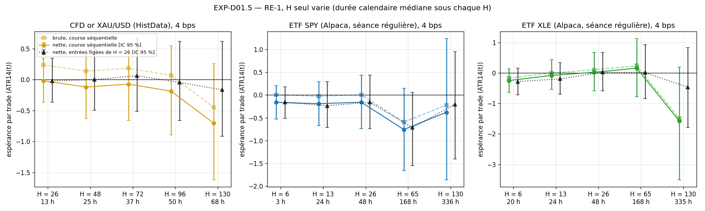
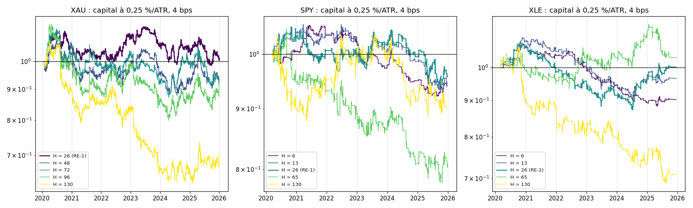

# EXP-D01.5 — Sensibilité de RE-1 à l'horizon H seul : or, SPY, XLE

- **Date :** 2026-09-30. **Étape :** D, étape intermédiaire entre D01 et D02 (décision du porteur). **Descriptive** : RE-1 inchangée, aucun H retenu ni figé.
- **Facteur unique (OFAT) :** H, compté en barres de 30 min de la série. Tout le reste est celui de RE-1 : moteur v2.1 par défaut (R0 = 100), seuils BTC gelés (`leg_atr` P50 = 2,8233 ; `nis_z_100` P75 = 1,2245), F2b sans stop, F3 SL-B à l'extremum (δ = 0, plancher 0,25 ATR), entrée à open[t + 1], une position à la fois, cooldown.
- **Grilles du porteur :** XAU H ∈ {26, 48, 72, 96, 130} ; SPY et XLE H ∈ {6, 13, 26, 65, 130}.
- **Données :** celles de D01, inchangées (empreintes vérifiées) : CFD or HistData 2020-2025, ETF SPY et XLE Alpaca en séance régulière 2020-2025. **Frais :** 4 bps aller-retour.
- **Code :** `experiments/D01_5/run_D01_5.py`. Il réutilise `strategy.run_re1(horizon=H)` et, depuis D01, `prepare` et `gap_trades` (définitions de gaps de D01 bis). Aucun module de `src/` modifié. Test ajouté : RE-1 à H = 6 et H = 130 (structure des trades, causalité par troncature).

## 0. Cadrage

- **QUESTION :** une translation de H seul corrige-t-elle les faiblesses de D01 ?
  - Or : brut +0,24 ATR, frais 0,26 ATR à H = 26. Hypothèse du porteur : un H plus long fait croître le brut et dilue ce coût fixe.
  - SPY, XLE : H = 26 traverse deux nuits. Hypothèses du porteur : H ≤ 13 limite l'exposition aux nuits ; H ≥ 65 dilue le bruit des gaps dans la tendance.
- **PERTINENCE POUR LE FILTRE AKF :** H est le seul paramètre de RE-1 lié au temps. Le déclencheur juge la cinématique à t ; H décide quand ce jugement est encaissé, donc combien de frais, de dérive de l'actif et de nuits entrent dans chaque trade.
- **CE QUE LE PROTOCOLE MESURE RÉELLEMENT :**
  - la course séquentielle de RE-1 à chaque H (la population de trades change avec H) : les 8 métriques, l'espérance nette et brute avec IC par grappes mensuelles, le capital, le MDD et le Calmar à 0,25 %/ATR et à 1x, Long/Short, timing et dérive ;
  - l'effet apparié de H sur les entrées figées de RE-1 à H = 26 : mêmes trades, seule la sortie change ;
  - les gaps : exposition, décomposition du brut, stops percés.
- **CE QU'IL NE PERMET PAS DE CONCLURE :**
  - aucun H n'est validé : le meilleur des cinq, choisi après coup, surestime l'espérance (c'est l'objet du WFO de D02) ;
  - pas de hold-out ;
  - pas de coûts de portage (swap du CFD, emprunt des titres vendus à découvert).

## 1. Règle de lecture (fixée avant le calcul)

- Un avantage se lit sur l'IC 95 % par grappes mensuelles, en ATR et en bps : borne basse > 0. Une espérance ponctuelle > 0 dont l'IC contient 0 n'est pas un avantage établi.
- La réponse à H se lit sur la courbe entière (croissante, plateau, pic isolé), pas sur la meilleure valeur.
- Chaque variation est lue avec son effet apparié et sa décomposition timing/dérive (timing = moyenne de Long et de Short, dérive = leur demi-écart, en net).

## 2. Contrôles

Tous passés (annexe A) :
- empreintes des séries identiques à l'audit de D01 ;
- à H = 26, la chaîne redonne D01 : 23 métriques par actif, écart relatif ≤ 5·10⁻⁶ ; 4 mesures de gaps ;
- entrées figées à H = 26 identiques, trade par trade, à RE-1 ;
- à chaque H, une position à la fois, entrée à open[t + 1] et sortie à H barres hors stop.

## 3. Résultats [OBS]

**Vue d'ensemble : aucune des 15 configurations n'a un IC à borne basse > 0, ni en ATR ni en bps.** Seul XLE a des espérances ponctuelles > 0 en ATR : +0,020 à H = 26 et +0,155 à H = 65. Le seul IC d'espérance qui exclut 0 est négatif : SPY à H = 65, −38,3 bps [−76,2 ; −2,8].

### 3.1 Or (XAU) : le brut ne croît pas avec H

| H (durée médiane) | 26 (13 h) | 48 (25 h) | 72 (37 h) | 96 (50 h) | 130 (68 h) |
|---|---|---|---|---|---|
| Espérance nette ATR [IC] | −0,019 [−0,36 ; +0,35] | −0,120 [−0,62 ; +0,40] | −0,071 [−0,66 ; +0,55] | −0,185 [−0,89 ; +0,55] | −0,702 [−1,62 ; +0,26] |
| Brut ; frais (ATR) | +0,239 ; 0,257 | +0,138 ; 0,257 | +0,184 ; 0,255 | +0,071 ; 0,256 | −0,446 ; 0,255 |
| Long ; Short (ATR) | +0,33 ; −0,43 | +0,52 ; −0,86 | +0,62 ; −0,84 | +0,52 ; −0,92 | +0,08 ; −1,54 |
| Dérive (ATR) | +0,38 | +0,69 | +0,73 | +0,72 | +0,81 |
| Entrées figées : effet contre H = 26 [IC] | — | +0,02 [−0,26 ; +0,28] | +0,08 [−0,32 ; +0,49] | −0,03 [−0,48 ; +0,45] | −0,15 [−0,70 ; +0,48] |
| MDD 0,25 %/ATR ; 1x | −13,6 % ; −13,3 % | −18,8 % ; −19,8 % | −22,9 % ; −24,8 % | −30,6 % ; −31,6 % | −41,6 % ; −42,8 % |

- **Les frais restent à 0,26 ATR par trade à chaque H.** Ce sont 4 bps rapportés à l'ATR14(t) de l'entrée : H n'y entre pas.
- **Le brut par trade ne croît pas.**
  - Course séquentielle : +0,24 → +0,14 → +0,18 → +0,07 → −0,45 ATR.
  - Entrées figées (mêmes trades) : brut +0,24 → +0,26 → +0,32 → +0,21 → +0,09. Plat aux erreurs près, IC de l'effet ∋ 0.
- **Ce qui croît avec H, c'est l'exposition à la dérive de l'or** (+184 % sur l'échantillon) : +0,38 → +0,81 ATR. Elle joue des deux côtés : les Long gagnent (+0,33 → +0,62 à H = 72), les Short perdent davantage (−0,43 → −1,54). Le timing net passe de −0,05 à −0,73.
- **Le risque croît avec H** à dimensionnement égal : MDD −13,6 % → −41,6 % à 0,25 %/ATR ; IC de l'espérance 2,6 fois plus large à H = 130 qu'à H = 26.
- **Les gaps de l'or ne pèsent pas.** Les trades traversent la pause quotidienne et les week-ends (38 % à H = 26, 78 % au-delà), mais les 2 mêmes stops seulement sont percés à chaque H : coût ≤ 0,005 ATR par trade.
- **Forme de la réponse :** H = 26, celui de RE-1, est le meilleur point de la grille, à ≈ 0. Au-delà, la courbe décroît.

### 3.2 SPY : raccourcir H réduit les nuits, sans brut à protéger

| H (durée médiane) | 6 (3 h) | 13 (24 h) | 26 (48 h) | 65 (168 h) | 130 (336 h) |
|---|---|---|---|---|---|
| Espérance nette ATR [IC] | −0,161 [−0,53 ; +0,20] | −0,189 [−0,67 ; +0,29] | −0,158 [−0,74 ; +0,43] | −0,756 [−1,66 ; +0,15] | −0,378 [−1,86 ; +1,24] |
| Brut ATR | +0,004 | −0,026 | +0,004 | −0,594 | −0,218 |
| Trades exposés à une nuit | 50 % | 91 % | 92 % | 92 % | 92 % |
| Brut = gaps + séance (ATR, log) | −0,005 + 0,007 | +0,014 − 0,042 | +0,027 − 0,026 | +0,027 − 0,632 | +0,380 − 0,591 |
| Stops percés / stops ; dépassement moyen | 5/30 ; +1,78 | 6/35 ; +2,78 | 8/46 ; +2,57 | 8/47 ; +2,51 | 10/40 ; +1,95 |
| Coût des dépassements (ATR par trade) | 0,047 | 0,099 | 0,133 | 0,175 | 0,221 |
| Long ; Short (ATR) | −0,229 ; −0,055 | −0,205 ; −0,163 | +0,107 ; −0,601 | −0,039 ; −2,004 | +1,100 ; −2,617 |

- **H = 13 ne limite pas l'exposition aux nuits : 91 % des trades en traversent une, contre 92 % à H = 26.** 13 barres font exactement une séance, donc tout trade non stoppé en séance traverse une nuit.
- **Seul H = 6 réduit l'exposition** : 50 % des trades, et le coût des stops percés passe de 0,133 à 0,047 ATR par trade. **Le brut reste nul (+0,004 ATR)** : il n'y a pas d'espérance en séance que les gaps masqueraient. La composante en séance vaut ≈ 0 à tout H ≤ 26.
- **H ≥ 65 ne dilue pas les gaps.**
  - Les stops percés restent (8 à 10) et leur coût par trade augmente (0,175 et 0,221 ATR).
  - La dérive de SPY domine (+0,98 puis +1,86 ATR) et écrase les Short (−2,00 et −2,62).
  - H = 65 : −0,756 ATR, IC en bps entièrement négatif ; timing −1,02 [−2,01 ; −0,01].
- **Entrées figées :** l'effet de H va de −0,555 à −0,001 ATR, tous les IC ∋ 0.

### 3.3 XLE : un pic isolé à H = 65, porté par la population

| H (durée médiane) | 6 (20 h) | 13 (24 h) | 26 (48 h) | 65 (168 h) | 130 (335 h) |
|---|---|---|---|---|---|
| Espérance nette ATR [IC] | −0,252 [−0,64 ; +0,13] | −0,083 [−0,55 ; +0,43] | +0,020 [−0,59 ; +0,67] | +0,155 [−0,79 ; +1,13] | −1,573 [−3,51 ; +0,20] |
| Brut ATR | −0,172 | −0,003 | +0,100 | +0,235 | −1,493 |
| Trades exposés à une nuit | 57 % | 91 % | 90 % | 90 % | 92 % |
| Brut = gaps + séance (ATR, log) | −0,084 − 0,090 | +0,119 − 0,128 | +0,192 − 0,101 | +0,365 − 0,111 | −0,626 − 0,802 |
| Entrées figées : effet contre H = 26 [IC] | −0,30 [−0,87 ; +0,20] | −0,22 [−0,59 ; +0,15] | — | −0,01 [−0,71 ; +0,75] | −0,49 [−1,81 ; +0,73] |
| PnL 0,25 %/ATR ; 1x | −10 % ; −9 % | −3 % ; +11 % | +0 % ; +7 % | +3 % ; +20 % | −29 % ; −50 % |
| MDD 0,25 %/ATR ; 1x | −18,2 % ; −32,6 % | −18,1 % ; −31,4 % | −19,5 % ; −36,4 % | −10,9 % ; −26,3 % | −35,6 % ; −64,0 % |

- **Forme de la réponse : un pic isolé.** L'espérance monte de −0,25 (H = 6) à +0,16 (H = 65), puis tombe à −1,57 à H = 130.
  - À H = 130, les Short perdent −3,68 ATR (rallye de 2021-2022) et F2b, sans stop, −4,44 ATR sur 30 trades.
  - À H = 65 : 3 années positives sur 6, 2025 à −2,47 ATR.
- **Le gain de H = 65 ne vient pas de la sortie.**
  - Sur les mêmes 136 entrées que H = 26, sortir à 65 barres donne +0,009 ATR (effet −0,010 [−0,71 ; +0,75]).
  - La course à H = 65 garde 105 de ces 136 trades. Les 31 qu'elle saute, parce qu'une position de 65 barres est encore ouverte, valaient −0,48 ATR en moyenne à H = 65.
  - Le « gain » est donc un effet de calendrier : la sélection des trades, pas la sortie.
- **Le brut de XLE vient des nuits :** +0,12 à +0,37 ATR de gaps à H = 13-65, IC ∋ 0. La composante en séance est négative à chaque H, de −0,09 à −0,80 ATR.

## 4. Lecture physique [HYP]

1. **H déplace l'exposition, pas l'avantage.** Sur les mêmes entrées, déplacer la sortie de 6 à 130 barres change l'espérance de −0,55 à +0,08 ATR, avec des IC qui contiennent 0. Ce qui change nettement avec H, c'est la part de dérive de l'actif, le nombre de nuits et le risque par trade.
2. **L'hypothèse de dilution des frais sur l'or ne tient pas.**
   - Elle suppose un brut croissant avec H. Sur les mêmes entrées, le brut reste plat de 13 à 50 h (+0,21 à +0,32 ATR, écarts dans le bruit) puis baisse, et la dérive se compense entre Long et Short.
   - Le point mort des frais de l'or à H = 26 est d'environ 3,7 bps aller-retour (brut = 0,93 fois les frais de 4 bps). Mais l'IC du brut contient 0.
3. **Une sortie en fin de séance sur les ETF supprimerait les gaps sans créer d'avantage.** Mesure à l'appui : la composante en séance est ≈ 0 sur SPY et négative sur XLE à chaque H. Sur XLE, les gaps portent la seule part positive du brut.
4. **Pour le cadrage de D02 :**
   - la course séquentielle mêle l'effet de la sortie et un effet de calendrier (quels trades sont sautés) : sur XLE à H = 65, +0,155 contre +0,009 sur entrées figées. Un optimiseur de H sur la course séquentielle ajustera aussi ce calendrier ;
   - à dimensionnement égal (0,25 %/ATR14 de 30 min), le risque par trade croît avec H (MDD de l'or ×3 entre 26 et 130). Comparer des H sur le Calmar suppose de fixer cette convention ;
   - sur XAU, SPY et XLE, aucun H de la grille n'a d'avantage établi. Un WFO y mesurerait d'abord le biais de sélection de l'optimiseur, ce qui peut servir de témoin pour D02.

## 5. Écarts au prompt

- « Slippage de +2,6 ATR » : c'est le dépassement moyen de 8 stops percés sur 46 sur SPY. Leur coût rapporté à tous les trades est de 0,133 ATR par trade. Sur XLE, le dépassement moyen est de +1,0 ATR.
- « Rendement brut positif » de l'or à H = 26 : +0,239 ATR, mais IC [−0,105 ; +0,605].

## Annexes générées (run_D01_5.py)

### A. Contrôles bloquants

- Empreinte SHA-256 de chaque série identique à celle de l'audit de D01 (données inchangées, réserve 2026 tronquée au chargement).
- Entrées figées à H = 26 identiques, trade par trade, aux trades de RE-1 (même enveloppe, même sortie).
- Chaque course : une position à la fois (signal suivant ≥ signal + H), entrée à open[t + 1], sortie à H barres hors stop (troncature à la dernière barre de 2025 seulement).
- XAU : H = 26 redonne D01 (23 métriques, écart relatif max 4.5e-06 ; 4 mesures de gaps) ; 849 signaux candidats ; annualisation sur 5,997 ans ; rendement de l'actif sur l'échantillon +184 %.
- SPY : H = 26 redonne D01 (23 métriques, écart relatif max 3.9e-06 ; 4 mesures de gaps) ; 191 signaux candidats ; annualisation sur 5,996 ans ; rendement de l'actif sur l'échantillon +130 %.
- XLE : H = 26 redonne D01 (23 métriques, écart relatif max 3.1e-06 ; 4 mesures de gaps) ; 159 signaux candidats ; annualisation sur 5,996 ans ; rendement de l'actif sur l'échantillon +90 %.
- Durée du calcul : 16 s.

### B. CFD or XAU/USD (HistData) : H ∈ {26, 48, 72, 96, 130}

| Métrique (4 bps) | H = 26 (RE-1) | H = 48 | H = 72 | H = 96 | H = 130 |
|---|---|---|---|---|---|
| Durée médiane : barres ; calendaire (P90) | 26 ; 13 h (20 h) | 48 ; 25 h (73 h) | 72 ; 37 h (86 h) | 96 ; 50 h (98 h) | 130 ; 68 h (116 h) |
| Trades (par mois) ; stoppés ; communs avec H = 26 | 651 (9,0) ; 26 % ; 100 % | 515 (7,2) ; 29 % ; 95 % | 441 (6,1) ; 34 % ; 98 % | 386 (5,4) ; 34 % ; 98 % | 327 (4,5) ; 39 % ; 98 % |
| PnL net : 0,25 %/ATR ; 1x | +1 % ; +5 % | −7 % ; −3 % | −7 % ; −4 % | −9 % ; −4 % | −30 % ; −31 % |
| PF : 1x ; pondéré | 1,04 ; 1,01 | 0,99 ; 0,97 | 0,99 ; 0,97 | 0,99 ; 0,96 | 0,81 ; 0,81 |
| WR | 42,5 % | 42,3 % | 37,2 % | 38,3 % | 34,3 % |
| **Espérance nette ATR [IC 95 %]** | **−0,019 [−0,362 ; +0,349]** | **−0,120 [−0,623 ; +0,400]** | **−0,071 [−0,661 ; +0,552]** | **−0,185 [−0,890 ; +0,548]** | **−0,702 [−1,620 ; +0,255]** |
| Espérance nette bps [IC 95 %] | +1,1 [−4,9 ; +7,5] | −0,2 [−9,3 ; +9,3] | −0,3 [−10,5 ; +11,4] | −0,3 [−14,1 ; +14,5] | −10,5 [−28,3 ; +7,5] |
| Espérance brute ATR [IC 95 %] ; frais ATR | +0,239 [−0,105 ; +0,605] ; 0,257 | +0,138 [−0,367 ; +0,655] ; 0,257 | +0,184 [−0,407 ; +0,808] ; 0,255 | +0,071 [−0,632 ; +0,802] ; 0,256 | −0,446 [−1,361 ; +0,514] ; 0,255 |
| Part des frais : 1x ; pondérée | 79 % ; 92 % | 106 % ; 140 % | 107 % ; 137 % | 108 % ; 170 % | brut ≤ 0 ; brut ≤ 0 |
| MDD : 0,25 %/ATR ; 1x | −13,6 % ; −13,3 % | −18,8 % ; −19,8 % | −22,9 % ; −24,8 % | −30,6 % ; −31,6 % | −41,6 % ; −42,8 % |
| Calmar : 0,25 %/ATR ; 1x | 0,01 ; 0,07 | −0,07 ; −0,03 | −0,05 ; −0,03 | −0,05 ; −0,02 | −0,14 ; −0,14 |
| Long ; Short (ATR) | +0,329 ; −0,431 | +0,524 ; −0,863 | +0,615 ; −0,840 | +0,520 ; −0,921 | +0,075 ; −1,543 |
| Timing ATR [IC 95 %] ; dérive | −0,051 [−0,399 ; +0,306] ; +0,380 | −0,169 [−0,677 ; +0,354] ; +0,693 | −0,113 [−0,700 ; +0,503] ; +0,728 | −0,200 [−0,907 ; +0,530] ; +0,720 | −0,734 [−1,657 ; +0,227] ; +0,809 |
| F2b : n ; ATR · F3 : n ; ATR | 350 ; −0,304 · 301 ; +0,313 | 274 ; −0,438 · 241 ; +0,243 | 233 ; −0,062 · 208 ; −0,082 | 210 ; −0,534 · 176 ; +0,230 | 171 ; −1,142 · 156 ; −0,219 |
| Années à espérance > 0 (ATR) | 2/6 | 3/6 | 3/6 | 3/6 | 1/6 |
| Entrées figées de H = 26 : nette ATR [IC] | −0,019 [−0,362 ; +0,349] | +0,001 [−0,497 ; +0,507] | +0,064 [−0,510 ; +0,667] | −0,044 [−0,660 ; +0,620] | −0,165 [−0,913 ; +0,617] |
| Entrées figées : effet de H contre H = 26, ATR [IC] | — | +0,020 [−0,264 ; +0,278] | +0,083 [−0,321 ; +0,490] | −0,025 [−0,475 ; +0,453] | −0,146 [−0,699 ; +0,479] |
| Gaps (pause quotidienne et week-ends) : trades exposés à un gap ; gaps traversés par trade (moyenne) | 38 % ; 0,5 | 78 % ; 1,1 | 79 % ; 1,5 | 78 % ; 2,0 | 78 % ; 2,7 |
| Gaps (pause quotidienne et week-ends) : brut log ATR = gaps [IC] + séance [IC] | +0,237 = +0,027 [−0,026 ; +0,092] + +0,210 [−0,116 ; +0,555] | +0,135 = +0,030 [−0,065 ; +0,138] + +0,104 [−0,370 ; +0,581] | +0,182 = +0,020 [−0,063 ; +0,113] + +0,161 [−0,403 ; +0,772] | +0,070 = +0,038 [−0,079 ; +0,177] + +0,032 [−0,678 ; +0,746] | −0,446 = +0,005 [−0,137 ; +0,162] + −0,451 [−1,389 ; +0,531] |
| Gaps (pause quotidienne et week-ends) : stops en gap / stops ; dépassement moyen (P90), ATR | 2/169 ; +0,76 (+1,29) | 2/150 ; +0,76 (+1,29) | 2/148 ; +0,76 (+1,29) | 2/133 ; +0,76 (+1,29) | 2/127 ; +0,76 (+1,29) |
| Gaps (pause quotidienne et week-ends) : coût des dépassements (ATR par trade) | 0,002 | 0,003 | 0,003 | 0,004 | 0,005 |

### C. ETF SPY (Alpaca, séance régulière) : H ∈ {6, 13, 26, 65, 130}

| Métrique (4 bps) | H = 6 | H = 13 | H = 26 (RE-1) | H = 65 | H = 130 |
|---|---|---|---|---|---|
| Durée médiane : barres ; calendaire (P90) | 6 ; 3 h (20 h) | 13 ; 24 h (72 h) | 26 ; 48 h (96 h) | 65 ; 168 h (192 h) | 130 ; 336 h (360 h) |
| Trades (par mois) ; stoppés ; communs avec H = 26 | 191 (2,7) ; 16 % ; 81 % | 169 (2,3) ; 21 % ; 91 % | 155 (2,2) ; 30 % ; 100 % | 115 (1,6) ; 41 % ; 98 % | 88 (1,2) ; 45 % ; 100 % |
| PnL net : 0,25 %/ATR ; 1x | −6 % ; −5 % | −6 % ; −3 % | −4 % ; −8 % | −19 % ; −37 % | −10 % ; −22 % |
| PF : 1x ; pondéré | 0,91 ; 0,85 | 0,96 ; 0,88 | 0,91 ; 0,93 | 0,57 ; 0,69 | 0,73 ; 0,83 |
| WR | 46,6 % | 47,9 % | 45,2 % | 29,6 % | 28,4 % |
| **Espérance nette ATR [IC 95 %]** | **−0,161 [−0,526 ; +0,202]** | **−0,189 [−0,667 ; +0,292]** | **−0,158 [−0,736 ; +0,434]** | **−0,756 [−1,663 ; +0,148]** | **−0,378 [−1,858 ; +1,241]** |
| Espérance nette bps [IC 95 %] | −2,5 [−12,4 ; +7,4] | −1,4 [−17,2 ; +15,6] | −4,5 [−23,7 ; +14,9] | −38,3 [−76,2 ; −2,8] | −25,0 [−75,3 ; +24,7] |
| Espérance brute ATR [IC 95 %] ; frais ATR | +0,004 [−0,363 ; +0,364] ; 0,165 | −0,026 [−0,510 ; +0,453] ; 0,163 | +0,004 [−0,570 ; +0,594] ; 0,162 | −0,594 [−1,493 ; +0,308] ; 0,162 | −0,218 [−1,694 ; +1,408] ; 0,160 |
| Part des frais : 1x ; pondérée | 260 % ; 1658 % | 154 % ; 7115 % | brut ≤ 0 ; 386 % | brut ≤ 0 ; brut ≤ 0 | brut ≤ 0 ; brut ≤ 0 |
| MDD : 0,25 %/ATR ; 1x | −12,9 % ; −15,1 % | −12,5 % ; −18,9 % | −10,9 % ; −19,2 % | −25,9 % ; −43,9 % | −15,3 % ; −29,0 % |
| Calmar : 0,25 %/ATR ; 1x | −0,08 ; −0,06 | −0,08 ; −0,03 | −0,07 ; −0,07 | −0,14 ; −0,17 | −0,11 ; −0,14 |
| Long ; Short (ATR) | −0,229 ; −0,055 | −0,205 ; −0,163 | +0,107 ; −0,601 | −0,039 ; −2,004 | +1,100 ; −2,617 |
| Timing ATR [IC 95 %] ; dérive | −0,142 [−0,499 ; +0,213] ; −0,087 | −0,184 [−0,691 ; +0,319] ; −0,021 | −0,247 [−0,825 ; +0,360] ; +0,354 | −1,021 [−2,009 ; −0,010] ; +0,982 | −0,758 [−2,311 ; +0,917] ; +1,859 |
| F2b : n ; ATR · F3 : n ; ATR | 93 ; −0,251 · 98 ; −0,075 | 83 ; −0,246 · 86 ; −0,134 | 76 ; +0,059 · 79 ; −0,367 | 55 ; −0,675 · 60 ; −0,831 | 41 ; +0,514 · 47 ; −1,156 |
| Années à espérance > 0 (ATR) | 2/6 | 1/6 | 2/6 | 0/6 | 2/6 |
| Entrées figées de H = 26 : nette ATR [IC] | −0,159 [−0,510 ; +0,180] | −0,235 [−0,715 ; +0,291] | −0,158 [−0,736 ; +0,434] | −0,713 [−1,546 ; +0,061] | −0,206 [−1,403 ; +0,953] |
| Entrées figées : effet de H contre H = 26, ATR [IC] | −0,001 [−0,569 ; +0,575] | −0,076 [−0,531 ; +0,370] | — | −0,555 [−1,260 ; +0,093] | −0,048 [−1,111 ; +0,994] |
| Gaps (nuits et week-ends) : trades exposés à un gap ; gaps traversés par trade (moyenne) | 50 % ; 0,5 | 91 % ; 0,9 | 92 % ; 1,7 | 92 % ; 3,6 | 92 % ; 6,5 |
| Gaps (nuits et week-ends) : brut log ATR = gaps [IC] + séance [IC] | +0,002 = −0,005 [−0,225 ; +0,235] + +0,007 [−0,240 ; +0,257] | −0,028 = +0,014 [−0,268 ; +0,305] + −0,042 [−0,427 ; +0,349] | +0,000 = +0,027 [−0,332 ; +0,374] + −0,026 [−0,533 ; +0,475] | −0,605 = +0,027 [−0,545 ; +0,614] + −0,632 [−1,377 ; +0,131] | −0,211 = +0,380 [−0,594 ; +1,349] + −0,591 [−1,704 ; +0,613] |
| Gaps (nuits et week-ends) : stops en gap / stops ; dépassement moyen (P90), ATR | 5/30 ; +1,78 (+4,38) | 6/35 ; +2,78 (+6,10) | 8/46 ; +2,57 (+5,76) | 8/47 ; +2,51 (+5,76) | 10/40 ; +1,95 (+3,99) |
| Gaps (nuits et week-ends) : coût des dépassements (ATR par trade) | 0,047 | 0,099 | 0,133 | 0,175 | 0,221 |

### D. ETF XLE (Alpaca, séance régulière) : H ∈ {6, 13, 26, 65, 130}

| Métrique (4 bps) | H = 6 | H = 13 | H = 26 (RE-1) | H = 65 | H = 130 |
|---|---|---|---|---|---|
| Durée médiane : barres ; calendaire (P90) | 6 ; 20 h (68 h) | 13 ; 24 h (72 h) | 26 ; 48 h (96 h) | 65 ; 168 h (168 h) | 126 ; 335 h (360 h) |
| Trades (par mois) ; stoppés ; communs avec H = 26 | 159 (2,2) ; 21 % ; 86 % | 148 (2,1) ; 28 % ; 91 % | 136 (1,9) ; 35 % ; 100 % | 105 (1,5) ; 46 % ; 100 % | 83 (1,2) ; 51 % ; 100 % |
| PnL net : 0,25 %/ATR ; 1x | −10 % ; −9 % | −3 % ; +11 % | +0 % ; +7 % | +3 % ; +20 % | −29 % ; −50 % |
| PF : 1x ; pondéré | 0,91 ; 0,76 | 1,13 ; 0,94 | 1,09 ; 1,01 | 1,22 ; 1,08 | 0,64 ; 0,57 |
| WR | 44,0 % | 46,6 % | 44,9 % | 35,2 % | 25,3 % |
| **Espérance nette ATR [IC 95 %]** | **−0,252 [−0,638 ; +0,133]** | **−0,083 [−0,548 ; +0,430]** | **+0,020 [−0,588 ; +0,674]** | **+0,155 [−0,788 ; +1,130]** | **−1,573 [−3,508 ; +0,197]** |
| Espérance nette bps [IC 95 %] | −4,8 [−27,8 ; +19,0] | +8,8 [−20,7 ; +44,3] | +7,4 [−28,7 ; +43,9] | +24,9 [−38,9 ; +99,9] | −71,2 [−185,6 ; +43,2] |
| Espérance brute ATR [IC 95 %] ; frais ATR | −0,172 [−0,558 ; +0,210] ; 0,080 | −0,003 [−0,469 ; +0,509] ; 0,081 | +0,100 [−0,508 ; +0,754] ; 0,081 | +0,235 [−0,703 ; +1,212] ; 0,080 | −1,493 [−3,426 ; +0,281] ; 0,081 |
| Part des frais : 1x ; pondérée | brut ≤ 0 ; brut ≤ 0 | 31 % ; brut ≤ 0 | 35 % ; 80 % | 14 % ; 34 % | brut ≤ 0 ; brut ≤ 0 |
| MDD : 0,25 %/ATR ; 1x | −18,2 % ; −32,6 % | −18,1 % ; −31,4 % | −19,5 % ; −36,4 % | −10,9 % ; −26,3 % | −35,6 % ; −64,0 % |
| Calmar : 0,25 %/ATR ; 1x | −0,09 ; −0,05 | −0,03 ; 0,06 | 0,00 ; 0,03 | 0,05 ; 0,12 | −0,16 ; −0,17 |
| Long ; Short (ATR) | −0,245 ; −0,265 | +0,032 ; −0,310 | +0,197 ; −0,339 | +0,181 ; +0,109 | −0,316 ; −3,682 |
| Timing ATR [IC 95 %] ; dérive | −0,255 [−0,673 ; +0,175] ; +0,010 | −0,139 [−0,673 ; +0,464] ; +0,171 | −0,071 [−0,739 ; +0,650] ; +0,268 | +0,145 [−0,946 ; +1,357] ; +0,036 | −1,999 [−4,185 ; +0,018] ; +1,683 |
| F2b : n ; ATR · F3 : n ; ATR | 61 ; −0,918 · 98 ; +0,163 | 55 ; −0,775 · 93 ; +0,325 | 50 ; −0,186 · 86 ; +0,139 | 37 ; +0,682 · 68 ; −0,132 | 30 ; −4,444 · 53 ; +0,052 |
| Années à espérance > 0 (ATR) | 2/6 | 3/6 | 3/6 | 3/6 | 1/6 |
| Entrées figées de H = 26 : nette ATR [IC] | −0,285 [−0,727 ; +0,157] | −0,198 [−0,701 ; +0,334] | +0,020 [−0,588 ; +0,674] | +0,009 [−0,838 ; +0,922] | −0,469 [−1,791 ; +0,827] |
| Entrées figées : effet de H contre H = 26, ATR [IC] | −0,304 [−0,866 ; +0,197] | −0,218 [−0,591 ; +0,147] | — | −0,010 [−0,713 ; +0,752] | −0,489 [−1,806 ; +0,725] |
| Gaps (nuits et week-ends) : trades exposés à un gap ; gaps traversés par trade (moyenne) | 57 % ; 0,6 | 91 % ; 0,9 | 90 % ; 1,6 | 90 % ; 3,4 | 92 % ; 6,2 |
| Gaps (nuits et week-ends) : brut log ATR = gaps [IC] + séance [IC] | −0,174 = −0,084 [−0,310 ; +0,130] + −0,090 [−0,350 ; +0,169] | −0,009 = +0,119 [−0,172 ; +0,432] + −0,128 [−0,484 ; +0,251] | +0,091 = +0,192 [−0,254 ; +0,642] + −0,101 [−0,588 ; +0,426] | +0,255 = +0,365 [−0,320 ; +1,082] + −0,111 [−0,879 ; +0,668] | −1,427 = −0,626 [−1,679 ; +0,412] + −0,802 [−2,018 ; +0,402] |
| Gaps (nuits et week-ends) : stops en gap / stops ; dépassement moyen (P90), ATR | 10/33 ; +0,78 (+1,85) | 10/41 ; +0,78 (+1,85) | 11/48 ; +1,01 (+3,25) | 7/48 ; +0,77 (+1,78) | 8/42 ; +0,85 (+1,94) |
| Gaps (nuits et week-ends) : coût des dépassements (ATR par trade) | 0,049 | 0,053 | 0,081 | 0,052 | 0,082 |

### E. Figures

