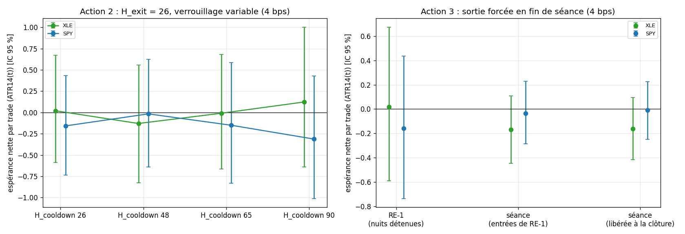

# EXP-D01.6 — Verrouillage et séance : les deux mécaniques de D01.5 sur SPY et XLE

- **Date :** 2026-09-30. **Étape :** D, exploration avant D02 (décision du porteur). **Descriptive** : RE-1 inchangée, aucun filtre ni paramètre retenu, D02 non lancé.
- **Données :** celles de D01 (ETF SPY et XLE, Alpaca, séance régulière 2020-2025), empreintes inchangées. **Frais :** 4 bps.
- **Code :**
  - `src/envelope/decouple.py` (nouveau, 9 tests) : `lock_trades` (verrouillage distinct de l'horizon de sortie) et `session_close_trades` (sortie forcée au close de la dernière barre de séance) ;
  - `experiments/D01_6/run_D01_6.py`.
  - Aucun fichier de RE-1 modifié. Contrôles : verrouillage 26 = RE-1 trade par trade ; verrouillage 65 = population de la course à H = 65 de D01.5 ; aucune position de séance ne traverse une nuit.

## 0. Cadrage

- **QUESTION :**
  1. Les 31 trades de RE-1 sur XLE que la course à H = 65 saute ont-ils une signature mesurable à t ?
  2. Un verrouillage plus long que la sortie (H_exit = 26, H_cooldown ∈ {26, 48, 65, 90}) donne-t-il une espérance nette robuste ?
  3. Le signal a-t-il une valeur en séance seule, sans nuit détenue ?
- **PERTINENCE POUR LE FILTRE AKF :** dans RE-1, H fixe à la fois la sortie et le verrouillage. Les gaps sont des innovations d'une barre pour le filtre : sortir avant la nuit isole la cinématique en séance.
- **CE QUE LE PROTOCOLE MESURE RÉELLEMENT :** le profil à t des trades sautés contre les trades gardés (XLE, réplication sur SPY) et leur valeur à 26 et à 65 barres ; les 8 métriques à chaque verrouillage ; la sortie de fin de séance sur les entrées de RE-1 (effet apparié) et en stratégie de séance autonome.
- **CE QU'IL NE PERMET PAS DE CONCLURE :** aucun filtre n'est retenu (un seuil lu sur 31 trades serait ajusté à l'échantillon) ; pas de hold-out ; clôture exécutée au close de la dernière barre continue, pas au prix de l'enchère.

## 1. Règle de lecture (fixée avant le calcul du profil et des variantes)

- **Signature :** une variable dont l'AUC (probabilité qu'un trade sauté dépasse un trade gardé) a un IC 95 % qui exclut 0,5 sur XLE, avec le même sens sur SPY. Elle n'a d'intérêt pour RE-1 que si les trades sautés perdent avec la sortie de RE-1 (26 barres).
- **Avantage :** borne basse de l'IC 95 % par grappes mensuelles > 0, en ATR et en bps.
- Une mesure a précédé la fixation de cette règle : la valeur à 26 barres des 31 trades (+0,118 ATR), calculée pour vérifier la prémisse.

## 2. Résultats [OBS]

### 2.1 Action 1 : les 31 trades « toxiques » ne le sont qu'à 65 barres

| XLE | n | Net à la sortie de RE-1 (26 barres) [IC] | Médiane | Sans ses 3 meilleurs | Net à 65 barres [IC] |
|---|---|---|---|---|---|
| Sautés à H = 65 | 31 | **+0,118** [−1,16 ; +1,46] | −0,966 | −0,552 | −0,483 [−2,62 ; +1,59] |
| Gardés | 105 | −0,010 [−0,66 ; +0,68] | −0,403 | −0,303 | +0,155 [−0,79 ; +1,13] |

- **Avec la sortie de RE-1, les 31 trades valent +0,118 ATR en moyenne.** Ils ne perdent (−0,48) que tenus 65 barres. La plupart perdent (médiane −0,97, 42 % de gagnants), mais 3 gros gagnants portent la moyenne.
- **Le seul trait qui les distingue à t est leur définition :** ils arrivent 27 à 64 barres après le trade précédent, contre 154 en médiane pour les gardés (AUC 0,06 [0,02 ; 0,10]).
- **Aucune des variables demandées ne les sépare :**
  - `nis_z_100` 0,45 [0,34 ; 0,56] ; `retrace_ratio` 0,45 [0,34 ; 0,57] ; `leg_atr` 0,49 [0,38 ; 0,60] ;
  - sens 0,57 [0,48 ; 0,65] (77 % de Long contre 64 %) ; F3 0,47 ; même sens que le trade précédent 0,55 [0,45 ; 0,64] ; résultat du trade précédent 0,45 [0,34 ; 0,57] ;
  - heure et tercile d'ATR : écarts de parts sans régularité (14:00-15:00 : 48 % contre 32 %).
- **Rien ne se réplique sur SPY** (42 sautés contre 113 gardés).
  - Les tendances de XLE s'y inversent : Long 60 % contre 64 %, même sens 48 % contre 57 %, 14:00-15:00 21 % contre 36 %.
  - Deux AUC y frôlent la borne : `leg_atr` 0,60 [0,499 ; 0,70] et résultat du trade précédent 0,60 [0,499 ; 0,70], contre 0,49 et 0,45 sur XLE.
  - Sur SPY, les sautés valent −0,216 à 26 barres et les gardés −0,137. C'est la tenue longue qui dégrade les gardés : −0,137 → −0,813, soit −0,68 ATR, contre −0,23 pour les sautés.

### 2.2 Action 2 : le verrouillage seul ne crée pas d'espérance

| H_exit = 26 | H_cooldown 26 (RE-1) | 48 | 65 | 90 |
|---|---|---|---|---|
| XLE, net ATR [IC] | +0,020 [−0,59 ; +0,67] | −0,130 [−0,83 ; +0,56] | −0,010 [−0,66 ; +0,68] | +0,123 [−0,64 ; +1,00] |
| XLE, trades retirés : n ; net (26) | — | 26 ; +0,871 | 31 ; +0,118 | 44 ; −0,169 |
| SPY, net ATR [IC] | −0,158 [−0,74 ; +0,43] | −0,017 [−0,64 ; +0,62] | −0,151 [−0,83 ; +0,58] | −0,313 [−1,01 ; +0,43] |
| SPY, trades retirés : n ; net (26) | — | 24 ; −0,752 | 42 ; −0,216 | 52 ; +0,249 |

- **Aucun IC à borne basse > 0. La courbe zigzague sur les deux ETF.**
- Chaque verrouillage retire un paquet différent de trades, dont la valeur à 26 barres va de −0,75 à +0,87 ATR selon L. C'est un tirage de calendrier, sans tendance.
- **XLE, verrouillage 65 avec sortie à 26 : −0,010, et non +0,155.** Le chiffre de D01.5 demandait aussi la sortie à 65 barres pour les 105 trades gardés (−0,010 → +0,155).
- Le verrouillage réduit le MDD de XLE à 65 (−14,3 % contre −19,5 % à 0,25 %/ATR) et celui de SPY à 1x (−13,5 % contre −19,2 %), sans IC positif.

### 2.3 Action 3 : en séance seule, pas d'espérance nette ; la nuit joue en sens opposé sur les deux ETF

| 4 bps | Net ATR [IC] | Brut ATR [IC] ; frais | PnL 0,25 %/ATR ; 1x | MDD 0,25 %/ATR ; 1x | Trades | Durée médiane |
|---|---|---|---|---|---|---|
| XLE · RE-1 (nuits détenues) | +0,020 [−0,59 ; +0,67] | +0,100 ; 0,081 | +0 % ; +7 % | −19,5 % ; −36,4 % | 136 | 48 h |
| XLE · séance, entrées de RE-1 | −0,170 [−0,44 ; +0,11] | −0,089 [−0,36 ; +0,19] ; 0,081 | −6 % ; −6 % | −10,2 % ; −19,1 % | 136 | 2 h |
| XLE · séance, libérée à la clôture | −0,162 [−0,42 ; +0,10] | −0,082 [−0,34 ; +0,17] ; 0,081 | −6 % ; −6 % | −10,8 % ; −19,8 % | 155 | 2 h |
| SPY · RE-1 (nuits détenues) | −0,158 [−0,74 ; +0,43] | +0,004 ; 0,162 | −4 % ; −8 % | −10,9 % ; −19,2 % | 155 | 48 h |
| SPY · séance, entrées de RE-1 | −0,036 [−0,29 ; +0,23] | +0,127 [−0,12 ; +0,39] ; 0,162 | −1 % ; +4 % | −5,1 % ; −7,8 % | 155 | 3 h |
| SPY · séance, libérée à la clôture | −0,008 [−0,25 ; +0,23] | +0,157 [−0,08 ; +0,39] ; 0,164 | +0 % ; +5 % | −7,0 % ; −9,4 % | 182 | 2,5 h |

- **Aucune variante de séance n'a d'IC positif.**
- **SPY :** en séance, le brut est légèrement positif (+0,13 à +0,16 ATR, IC ∋ 0), contre +0,004 pour RE-1. Les frais (0,16 ATR) l'absorbent : net −0,04 et −0,01.
- **XLE :** le brut en séance est négatif (−0,09 ATR). La part positive de RE-1 venait de la nuit.
- **Effet apparié de la sortie de fin de séance** (mêmes entrées que RE-1) : SPY +0,122 [−0,45 ; +0,68], XLE −0,190 [−0,87 ; +0,44]. Nuits et séances suivantes pèsent −0,12 ATR sur SPY et apportent +0,19 sur XLE : effets opposés, tous deux dans le bruit.
- **Le risque baisse fortement en séance.** MDD divisé par deux environ (SPY −5,1 % contre −10,9 % ; XLE −10,2 % contre −19,5 %), et des IC deux fois plus étroits.

## 3. Lecture [HYP]

1. **Il n'y a pas de répliques toxiques à filtrer dans RE-1.**
   - Les 31 trades sautés ne se distinguent à t que par leur délai depuis le trade précédent, et ils gagnent en moyenne avec la sortie de RE-1.
   - Leur perte à 65 barres dit seulement qu'un trade tardif dans un mouvement ne gagne pas à être tenu une semaine sur XLE. SPY montre l'inverse.
2. **Le verrouillage est un sélecteur de calendrier, pas un levier.** Chaque valeur de L retire un paquet de trades différent, et aucun ordre ne se dégage. Si D02 optimise H sur la course séquentielle, il pourra trouver ce genre de pic par hasard ; ajouter H_cooldown comme paramètre multiplierait ces occasions.
3. **Le signal n'a pas de valeur nette en séance sur les ETF à 4 bps.**
   - Sur SPY, le brut en séance (+0,16 ATR) est du même ordre que les frais : le point mort est vers 4 bps.
   - Sur XLE, il est négatif.
   - L'idée d'une « prime overnight » captée par le moteur ne se généralise pas : la nuit aide XLE et pèse sur SPY.

## 4. Écarts au prompt

- « Sur les entrées figées, l'effet n'est que de +0,009 ATR » : +0,009 est l'espérance nette à 65 barres sur les entrées figées. L'effet apparié contre H = 26 est de −0,010 [−0,71 ; +0,75].
- « 31 trades toxiques (qui valaient −0,48 ATR) » : −0,48 à 65 barres. À la sortie de RE-1 (26 barres), ils valent +0,118 ATR.
- « Tout le brut positif vient des gaps », « le signal perd jusqu'à la clôture » : vrai pour XLE, dans le bruit. Sur SPY, la composante des gaps de RE-1 est ≈ 0 (+0,03), et le brut en séance est de +0,13 ATR jusqu'à la clôture.

## Annexes générées (run_D01_6.py)

### A. Contrôles bloquants

- Empreintes SHA-256 identiques à l'audit de D01 ; une séance par date de New York (aucun trou en séance).
- Verrouillage 26 = RE-1 trade par trade ; verrouillage 65 = population de la course à H = 65 de D01.5.
- Sortie de fin de séance : entrées de RE-1 identiques en lecture « entrées de RE-1 » ; aucune position ne traverse une nuit (sortie au plus tard au close de la dernière barre de la séance d'entrée).
- XLE : 136 trades de RE-1, 1508 séances.
- SPY : 155 trades de RE-1, 1508 séances.
- Durée du calcul : 9 s.

### B. Action 1 : trades sautés par la course à H = 65 contre trades gardés (entrées de RE-1)

**XLE**

| Groupe | n | Net à la sortie de RE-1 (26 barres), ATR [IC] | Médiane (26) | WR (26) | Net sans ses 3 meilleurs trades (26) | Net à 65 barres, ATR [IC] |
|---|---|---|---|---|---|---|
| sautes | 31 | +0,118 [−1,158 ; +1,462] | −0,966 | 41,9 % | −0,552 | −0,483 [−2,622 ; +1,592] |
| gardes | 105 | −0,010 [−0,664 ; +0,683] | −0,403 | 45,7 % | −0,303 | +0,155 [−0,788 ; +1,130] |

| Variable à t | Sautés : P50 [P25 ; P75] ou part | Gardés | AUC sautés > gardés [IC] | Net (26) de la catégorie, tous trades |
|---|---|---|---|---|
| nis_z_100 | +0,02 [−0,29 ; +0,41] | +0,03 [−0,27 ; +0,59] | +0,45 [+0,34 ; +0,56] | — |
| retrace_ratio | +0,87 [+0,76 ; +1,01] | +0,93 [+0,78 ; +1,08] | +0,45 [+0,34 ; +0,57] | — |
| leg_atr | +2,16 [+1,78 ; +2,55] | +2,21 [+1,92 ; +2,53] | +0,49 [+0,38 ; +0,60] | — |
| barres_depuis_precedent | +40,00 [+32,50 ; +50,00] | +154,50 [+90,75 ; +223,25] | +0,06 [+0,02 ; +0,10] | — |
| resultat_precedent_atr | −1,68 [−2,48 ; +2,34] | −0,47 [−2,32 ; +2,81] | +0,45 [+0,33 ; +0,57] | — |
| part long | 77 % | 64 % | +0,57 [+0,48 ; +0,65] | — |
| part F3 | 58 % | 65 % | +0,47 [+0,36 ; +0,57] | — |
| part meme_sens | 61 % | 51 % | +0,55 [+0,45 ; +0,64] | — |
| heure = ouverture 09:30 | 3 % | 10 % | — | +0,432 |
| heure = 10:00-11:30 | 16 % | 14 % | — | +0,700 |
| heure = 12:00-13:30 | 23 % | 25 % | — | +0,345 |
| heure = 14:00-15:00 | 48 % | 32 % | — | −0,212 |
| heure = dernière barre | 10 % | 19 % | — | −0,743 |
| tercile_atr = 0 | 39 % | 31 % | — | +0,515 |
| tercile_atr = 1 | 32 % | 33 % | — | −0,629 |
| tercile_atr = 2 | 29 % | 35 % | — | +0,170 |

**SPY**

| Groupe | n | Net à la sortie de RE-1 (26 barres), ATR [IC] | Médiane (26) | WR (26) | Net sans ses 3 meilleurs trades (26) | Net à 65 barres, ATR [IC] |
|---|---|---|---|---|---|---|
| sautes | 42 | −0,216 [−1,354 ; +0,960] | −0,296 | 47,6 % | −0,775 | −0,443 [−1,813 ; +0,993] |
| gardes | 113 | −0,137 [−0,814 ; +0,605] | −0,806 | 44,2 % | −0,431 | −0,813 [−1,732 ; +0,116] |

| Variable à t | Sautés : P50 [P25 ; P75] ou part | Gardés | AUC sautés > gardés [IC] | Net (26) de la catégorie, tous trades |
|---|---|---|---|---|
| nis_z_100 | −0,04 [−0,25 ; +0,19] | −0,00 [−0,33 ; +0,37] | +0,49 [+0,40 ; +0,59] | — |
| retrace_ratio | +0,84 [+0,69 ; +0,95] | +0,87 [+0,73 ; +1,05] | +0,44 [+0,34 ; +0,53] | — |
| leg_atr | +2,40 [+1,98 ; +2,62] | +2,13 [+1,91 ; +2,41] | +0,60 [+0,50 ; +0,70] | — |
| barres_depuis_precedent | +44,00 [+33,75 ; +54,75] | +128,00 [+92,00 ; +180,25] | +0,04 [+0,01 ; +0,08] | — |
| resultat_precedent_atr | +0,14 [−2,00 ; +3,40] | −0,95 [−2,47 ; +1,78] | +0,60 [+0,50 ; +0,70] | — |
| part long | 60 % | 64 % | +0,48 [+0,39 ; +0,57] | — |
| part F3 | 45 % | 53 % | +0,46 [+0,38 ; +0,55] | — |
| part meme_sens | 48 % | 57 % | +0,45 [+0,37 ; +0,54] | — |
| heure = ouverture 09:30 | 12 % | 9 % | — | −1,280 |
| heure = 10:00-11:30 | 29 % | 24 % | — | +0,288 |
| heure = 12:00-13:30 | 19 % | 23 % | — | +0,390 |
| heure = 14:00-15:00 | 21 % | 36 % | — | −0,620 |
| heure = dernière barre | 19 % | 8 % | — | +0,072 |
| tercile_atr = 0 | 33 % | 34 % | — | −0,295 |
| tercile_atr = 1 | 36 % | 32 % | — | +0,394 |
| tercile_atr = 2 | 31 % | 35 % | — | −0,562 |

### C. Action 2 : H_exit = 26, verrouillage H_cooldown ∈ {26, 48, 65, 90}

| Actif · variante | PnL : 0,25 %/ATR ; 1x | PF (1x) | WR | Espérance ATR [IC] | Espérance bps [IC] | Brut ; frais (ATR) | MDD : 0,25 %/ATR ; 1x | Calmar : 0,25 %/ATR ; 1x | Trades (/mois) | Durée médiane : barres ; h | Part des frais (1x, brut en bps) |
|---|---|---|---|---|---|---|---|---|---|---|---|
| XLE · H_exit 26, H_cooldown 26 | +0 % ; +7 % | 1,09 | 44,9 % | +0,020 [−0,588 ; +0,674] | +7,4 [−28,7 ; +43,9] | +0,100 ; 0,081 | −19,5 % ; −36,4 % | 0,00 ; 0,03 | 136 (1,9) | 26 ; 48,0 h | 35 % |
| XLE · H_exit 26, H_cooldown 48 | −4 % ; −1 % | 1,02 | 42,9 % | −0,130 [−0,829 ; +0,557] | +1,3 [−40,9 ; +43,4] | −0,048 ; 0,082 | −19,2 % ; −36,7 % | −0,04 ; −0,01 | 112 (1,6) | 26 ; 48,0 h | 76 % |
| XLE · H_exit 26, H_cooldown 65 | −1 % ; +4 % | 1,08 | 45,7 % | −0,010 [−0,664 ; +0,683] | +6,2 [−33,0 ; +48,9] | +0,071 ; 0,080 | −14,3 % ; −29,6 % | −0,01 ; 0,02 | 105 (1,5) | 26 ; 48,0 h | 39 % |
| XLE · H_exit 26, H_cooldown 90 | +2 % ; +9 % | 1,15 | 46,2 % | +0,123 [−0,639 ; +1,003] | +12,5 [−33,1 ; +65,0] | +0,203 ; 0,080 | −17,4 % ; −35,5 % | 0,02 ; 0,04 | 93 (1,3) | 26 ; 48,0 h | 24 % |
| SPY · H_exit 26, H_cooldown 26 | −4 % ; −8 % | 0,91 | 45,2 % | −0,158 [−0,736 ; +0,434] | −4,5 [−23,7 ; +14,9] | +0,004 ; 0,162 | −10,9 % ; −19,2 % | −0,07 ; −0,07 | 155 (2,2) | 26 ; 48,0 h | brut ≤ 0 |
| SPY · H_exit 26, H_cooldown 48 | −2 % ; −5 % | 0,94 | 45,2 % | −0,017 [−0,638 ; +0,624] | −3,0 [−25,2 ; +20,5] | +0,144 ; 0,160 | −10,0 % ; −17,7 % | −0,04 ; −0,05 | 135 (1,9) | 26 ; 48,0 h | 410 % |
| SPY · H_exit 26, H_cooldown 65 | −3 % ; −3 % | 0,96 | 44,3 % | −0,151 [−0,829 ; +0,584] | −2,1 [−24,4 ; +24,1] | +0,012 ; 0,162 | −10,3 % ; −13,5 % | −0,05 ; −0,04 | 115 (1,6) | 26 ; 48,0 h | 208 % |
| SPY · H_exit 26, H_cooldown 90 | −7 % ; −8 % | 0,85 | 41,9 % | −0,313 [−1,013 ; +0,426] | −7,6 [−31,4 ; +18,3] | −0,149 ; 0,163 | −13,5 % ; −17,3 % | −0,10 ; −0,08 | 105 (1,5) | 26 ; 48,0 h | brut ≤ 0 |

| Actif · variante | Communs avec RE-1 | Trades de RE-1 retirés : n ; net (26) ATR | Trades ajoutés : n ; net ATR |
|---|---|---|---|
| XLE · H_exit 26, H_cooldown 26 | 100 % | 0 ; — | 0 ; — |
| XLE · H_exit 26, H_cooldown 48 | 98 % | 26 ; +0,871 | 2 ; +2,711 |
| XLE · H_exit 26, H_cooldown 65 | 100 % | 31 ; +0,118 | 0 ; — |
| XLE · H_exit 26, H_cooldown 90 | 99 % | 44 ; −0,169 | 1 ; +1,322 |
| SPY · H_exit 26, H_cooldown 26 | 100 % | 0 ; — | 0 ; — |
| SPY · H_exit 26, H_cooldown 48 | 97 % | 24 ; −0,752 | 4 ; +1,044 |
| SPY · H_exit 26, H_cooldown 65 | 98 % | 42 ; −0,216 | 2 ; −0,932 |
| SPY · H_exit 26, H_cooldown 90 | 98 % | 52 ; +0,249 | 2 ; +2,291 |

### D. Action 3 : sortie forcée au close de la dernière barre de séance

| Actif · variante | PnL : 0,25 %/ATR ; 1x | PF (1x) | WR | Espérance ATR [IC] | Espérance bps [IC] | Brut ; frais (ATR) | MDD : 0,25 %/ATR ; 1x | Calmar : 0,25 %/ATR ; 1x | Trades (/mois) | Durée médiane : barres ; h | Part des frais (1x, brut en bps) |
|---|---|---|---|---|---|---|---|---|---|---|---|
| XLE · RE-1 (nuits détenues) | +0 % ; +7 % | 1,09 | 44,9 % | +0,020 [−0,588 ; +0,674] | +7,4 [−28,7 ; +43,9] | +0,100 ; 0,081 | −19,5 % ; −36,4 % | 0,00 ; 0,03 | 136 (1,9) | 26 ; 48,0 h | 35 % |
| XLE · séance, entrées de RE-1 | −6 % ; −6 % | 0,86 | 41,2 % | −0,170 [−0,444 ; +0,107] | −4,3 [−20,9 ; +13,5] | −0,089 ; 0,081 | −10,2 % ; −19,1 % | −0,10 ; −0,06 | 136 (1,9) | 4 ; 2,0 h | brut ≤ 0 |
| XLE · séance, libérée à la clôture | −6 % ; −6 % | 0,87 | 43,2 % | −0,162 [−0,417 ; +0,096] | −3,9 [−18,8 ; +12,4] | −0,082 ; 0,081 | −10,8 % ; −19,8 % | −0,10 ; −0,05 | 155 (2,2) | 4 ; 2,0 h | > 1 000 % |
| SPY · RE-1 (nuits détenues) | −4 % ; −8 % | 0,91 | 45,2 % | −0,158 [−0,736 ; +0,434] | −4,5 [−23,7 ; +14,9] | +0,004 ; 0,162 | −10,9 % ; −19,2 % | −0,07 ; −0,07 | 155 (2,2) | 26 ; 48,0 h | brut ≤ 0 |
| SPY · séance, entrées de RE-1 | −1 % ; +4 % | 1,14 | 46,5 % | −0,036 [−0,286 ; +0,230] | +2,9 [−6,4 ; +12,7] | +0,127 ; 0,162 | −5,1 % ; −7,8 % | −0,02 ; 0,09 | 155 (2,2) | 6 ; 3,0 h | 58 % |
| SPY · séance, libérée à la clôture | +0 % ; +5 % | 1,14 | 47,8 % | −0,008 [−0,248 ; +0,225] | +2,9 [−5,8 ; +11,8] | +0,157 ; 0,164 | −7,0 % ; −9,4 % | 0,00 ; 0,09 | 182 (2,5) | 5 ; 2,5 h | 58 % |

| Actif | Sorties de fin de séance (entrées de RE-1) | Effet apparié séance − RE-1, ATR [IC] | Effet apparié, bps [IC] |
|---|---|---|---|
| XLE | 90 % | −0,190 [−0,867 ; +0,438] | −11,8 [−48,4 ; +23,6] |
| SPY | 92 % | +0,122 [−0,448 ; +0,675] | +7,4 [−13,4 ; +28,9] |

### E. Figure

