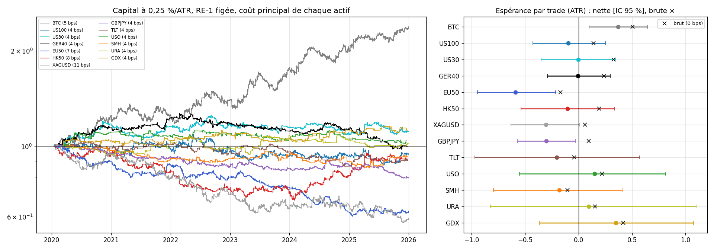

# EXP-D01.7 — Portabilité de RE-1 figée (zero-shot) : CFD sur indices, argent, GBPJPY et CFD sur ETF (Saxo)

- **Date :** 2026-10-01. **Étape :** D, test de portabilité.
- **Nature : descriptive.** RE-1 est strictement gelée : H = 26, R0 = 100, frontière 0,85, P75 de `nis_z_100` et médiane
  de `leg_atr` de BTC, cooldown, SL-B, F2b/F3. Aucun réglage par actif, aucune modification de RE-1 sur la base de ces
  résultats.
- **Version : partie 2, univers redéfini par le porteur.**
  - La partie 1 (GBPJPY de HistData : brut −0,035 ATR, −0,443 à 4 bps) reste consignée dans `RESEARCH_LOG.md`.
  - Les futures NQ, RTY, CL et HG sont abandonnés, faute d'accès puis parce que les séries continues de Saxo ne sont pas
    ajustées.
- **Données :**
  - 2020-2025 seulement, chaque série étant tronquée avant le 2026-01-01 au chargement ; rien de 2026 n'a été téléchargé.
  - Séries Saxo OpenAPI LIVE, compte du porteur ; références FRED.
- **Code :**
  - `experiments/D01_7/saxo_univers_D01_7.py` (séries) et `donnees_D01_7.py` (FRED) ;
  - `run_D01_7.py` (`--audit`, puis contrôles et mesures), qui réutilise la chaîne de D01 : `strategy.run_re1`,
    `prepare`, `diagnostics`.

## 0. Cadrage

- **QUESTION :** RE-1, verrouillée en C02bis sur BTC, conserve-t-elle son comportement hors crypto, sur trois familles
  de marchés ?
  - CFD sur indices au comptant cotés presque 24 h sur 24 : US100, US30, GER40, EU50, HK50 ;
  - argent et GBPJPY au comptant ;
  - CFD sur ETF cotés en séance américaine : TLT, USO, SMH, URA, GDX.
- **PERTINENCE POUR LE FILTRE AKF :** D01 a montré que la géométrie des signaux se transpose, mais que la rente dépend de
  la structure du marché : frais en ATR, séances. Cet univers croise marchés quasi continus et marchés de séance,
  régions et classes d'actifs.
- **CE QUE LE PROTOCOLE MESURE RÉELLEMENT :**
  - l'audit des données avant tout backtest ;
  - par actif, les 8 métriques en brut et nettes de coûts déclarés, l'espérance en ATR et en bps avec IC par grappes
    mensuelles, le capital à 0,25 %/ATR et à 1x ;
  - Long/Short, F2b/F3, volatilité, sessions, interruptions, concentration, queues.
- **CE QU'IL NE PERMET PAS DE CONCLURE :**
  - pas de validation hors échantillon ;
  - pas de classement statistique : choisir les meilleurs actifs pour D02 sur ce même échantillon est une sélection, à
    vérifier hors échantillon ;
  - coûts réels non mesurés : ni financement de nuit, ni ajustements de dividendes des CFD ;
  - aucun réglage.

## 1. Données et contrôles (avant les résultats)

### 1.1 Parcours des sources

- **Sources écartées :** QuantConnect (aucun export), puis le dépôt GitHub axb0306/cme-futures-ohlc (FAIL : aucune donnée
  2020-2025).
- **Saxo OpenAPI LIVE :** c'est la seule source qui fournit des séries locales complètes de 2020 à 2025.
  - Ses séries continues (futures c1, CFD « cont ») sont brutes : le raccord au changement de contrat n'est pas ajusté.
  - Celui du WTI tombe au milieu d'une barre de 30 min, le dernier jour de cotation, vers 11:00 heure de New York.
  - Le porteur a abandonné les séries continues (annexe 9 de `audit_saxo_D01_7.md`).
- **Univers redéfini par le porteur :**
  - US100, US30, GER40, EU50, HK50, XAGUSD, GBPJPY. HK50 remplace Japan 225, absent des CFD sur indice chez Saxo.
  - En option, 5 CFD sur ETF, inclus par le porteur : SMH et URA à sa demande ; TLT, USO et GDX choisis par l'agent.
- **GBPJPY :** lu chez Saxo, sur décision du porteur.
- **Coûts aller-retour :** validés par le porteur avant tout résultat (§2).

### 1.2 Audit [OBS]

- **13 séries sans défaut :**
  - aucun doublon, désordre, prix négatif ou nul, ni OHLC incohérent ;
  - couverture de 2020-01-02 à 2025-12-30/31 ;
  - modes de requête UpTo et From identiques, téléchargements reproductibles (`audit_univers_D01_7.md`).
- **Recoupements externes, critère de la partie 1 fixé avant :**

  | Série | Référence | Jours | Corrélation des variations | Écart médian (absolu) | Meilleur décalage |
  |---|---|---|---|---|---|
  | US100 | clôture officielle du NASDAQ-100 à 16:00 | 1 496 | 0,9991 | −0,3 bp (2,1) | 0 |
  | US30 | clôture du Dow Jones à 16:00 | 1 496 | 0,9994 | −0,3 bp (1,5) | 0 |
  | GBPJPY | taux de midi H.10 | 1 499 | 0,9997 | −1,9 bp (1,9) | 0 |

  Horodatage et prix des barres Saxo sont validés.
- **Fermetures de bourse admises**, déclarées avant le calcul (règle des 5 jours de D01 appliquée trou par trou) :
  - Noël 2025 pour GER40 et EU50 (123,5 h) ;
  - pour HK50 : Pâques et Ching Ming 2021, Nouvel An lunaire 2023 et 2025 (126,5 à 141,5 h).

  Aucun autre trou ne dépasse 5 jours.
- **Aucun changement de contrat caché dans les CFD sur indice :** les sauts en séance ne sont pas plus fréquents les
  jours d'échéance des futures.
- **Séances :**
  - CFD sur indices US : 23 h sur 24. Saxo a ajouté l'heure de 16:00 à 17:00 en 2022.
  - GER40 et EU50 : de 02:00 à 22:00 heure de Berlin.
  - HK50 : trois séances de la bourse de Hong Kong par jour.
  - XAGUSD : 23 h sur 24 ; GBPJPY : continu en semaine.
  - ETF : séance américaine seule, sans heures étendues ; historique ajusté des splits.
- **Signaux : la géométrie se transpose.**
  - Médiane locale de `leg_atr` : 2,85 à 3,07 sur les CFD, l'argent et GBPJPY ; 3,18 à 3,43 sur les ETF, allongée par
    les gaps de nuit (K8). BTC : 2,82.
  - P75 local de `nis_z_100` : 1,03 à 1,46 (BTC : 1,22).
  - ATR de 30 min médian : 11 bps (GBPJPY) à 72 bps (URA) ; BTC : 50 bps.

### 1.3 Contrôles bloquants

- Ancre P6.5d reproduite.
- RE-1 de la chaîne = C02bis : 1 080 trades, 40 métriques.
- Seuils de BTC gelés.
- Invariance d'échelle du moteur : contrôle de la partie 1, inchangé.

## 2. Résultats [OBS]

**Coûts aller-retour validés par le porteur.** Chaque actif se lit à trois niveaux : sans frais, à l'écart médian de
Saxo, et au coût principal. Ce coût principal vaut le plus grand de 4 bps et du P90 de l'écart, arrondi au point
supérieur. Pour les ETF, ce sont 0 et 4 bps. BTC, en référence, se lit à 5 bps.

| Actif (coût principal) | Trades (par mois) | Brut ATR | **Net ATR [IC]** | Net bps [IC] | Frais en ATR | WR ; PF (1x) | PnL : 0,25 %/ATR ; 1x | MDD : 0,25 %/ATR ; 1x | Années > 0 |
|---|---|---|---|---|---|---|---|---|---|
| BTC (5 bps, réf.) | 1 080 (15,0) | +0,504 | **+0,369 [+0,098 ; +0,645]** | +12,3 [+0,2 ; +24,4] | 0,14 | 44,3 % ; 1,20 | +138 % ; +204 % | −13,5 % ; −43,9 % | 6/6 |
| US100 (4) | 695 (9,7) | +0,139 | −0,097 [−0,428 ; +0,252] | −1,0 [−8,3 ; +6,5] | 0,24 | 39,6 % ; 0,97 | −5 % ; −10 % | −19,7 % ; −27,0 % | 1/6 |
| US30 (4) | 710 (9,9) | +0,327 | −0,004 [−0,350 ; +0,348] | +3,9 [−3,2 ; +12,0] | 0,33 | 41,0 % ; 1,17 | +11 % ; +29 % | −13,7 % ; −14,1 % | 2/6 |
| GER40 (4) | 545 (7,6) | +0,237 | −0,005 [−0,292 ; +0,294] | +1,4 [−5,2 ; +8,2] | 0,24 | 43,1 % ; 1,05 | +0 % ; +5 % | −22,9 % ; −27,5 % | 2/6 |
| EU50 (7) | 535 (7,4) | −0,172 | **−0,590 [−0,946 ; −0,214]** | −10,6 [−19,1 ; −2,4] | 0,42 | 38,3 % ; 0,70 | −37 % ; −44 % | −40,6 % ; −47,8 % | 1/6 |
| HK50 (8) | 425 (5,9) | +0,192 | −0,103 [−0,539 ; +0,334] | −3,0 [−15,0 ; +10,1] | 0,30 | 40,7 % ; 0,94 | −9 % ; −15 % | −32,3 % ; −41,9 % | 2/6 |
| XAGUSD (11) | 651 (9,0) | +0,060 | −0,307 [−0,634 ; +0,006] | −12,1 [−22,5 ; −1,9] | 0,37 | 38,1 % ; 0,79 | −41 % ; −57 % | −43,5 % ; −59,7 % | 1/6 |
| GBPJPY (4) | 754 (10,5) | +0,095 | **−0,303 [−0,572 ; −0,031]** | −3,0 [−6,5 ; +0,4] | 0,40 | 40,7 % ; 0,82 | −20 % ; −21 % | −22,0 % ; −22,1 % | 0/6 |
| TLT (4) | 157 (2,2) | −0,042 | −0,205 [−0,972 ; +0,570] | −6,4 [−27,8 ; +15,8] | 0,16 | 39,5 % ; 0,88 | −9 % ; −11 % | −16,6 % ; −21,1 % | 2/6 |
| USO (4) | 140 (1,9) | +0,220 | +0,148 [−0,553 ; +0,813] | +42,3 [−27,6 ; +122,1] | 0,07 | 47,9 % ; 1,42 | +4 % ; +65 % | −9,6 % ; −24,8 % | 2/6 |
| SMH (4) | 149 (2,1) | −0,105 | −0,180 [−0,795 ; +0,409] | −6,0 [−38,6 ; +24,7] | 0,08 | 41,6 % ; 0,94 | −7 % ; −13 % | −15,5 % ; −30,4 % | 2/6 |
| URA (4) | 127 (1,8) | +0,154 | +0,093 [−0,823 ; +1,100] | −10,6 [−68,6 ; +47,8] | 0,06 | 38,6 % ; 0,92 | +2 % ; −18 % | −12,6 % ; −41,8 % | 2/6 |
| GDX (4) | 143 (2,0) | +0,417 | +0,349 [−0,365 ; +1,076] | +42,8 [−13,1 ; +109,4] | 0,07 | 44,1 % ; 1,46 | +12 % ; +70 % | −8,5 % ; −19,1 % | 5/6 |

Durée médiane : 26 barres, soit 13 h pour les marchés quasi continus, 20 h pour HK50 et 48 h pour les ETF. La part des
frais et les tableaux complets à tous les coûts sont en annexe C.

- **Aucun actif n'a un IC à borne basse positive au coût principal ; BTC reste le seul.**
  - Estimations positives : GDX, USO et URA. Ce sont des ETF, avec 127 à 157 trades et des IC larges de ±0,7 à ±1,0 ATR.
  - Significativement négatifs : EU50, et GBPJPY d'un cheveu.
- **Le brut est faible.**
  - Positif en estimation sur 9 actifs sur 12 : de +0,06 à +0,42 ATR, contre +0,50 sur BTC. Tous les IC en ATR
    contiennent 0.
  - Seul US30 a un IC en bps au-dessus de 0 : +7,9 bps [+0,8 ; +16,0], pour un IC en ATR de [−0,019 ; +0,667].
- **Ce sont les frais en ATR qui tranchent.**
  - Sur les CFD sur indices, l'argent et GBPJPY, l'ATR de 30 min ne vaut que 11 à 34 bps. Les coûts principaux y
    coûtent de 0,24 à 0,42 ATR par trade, autant ou plus que le brut.
  - Sur les ETF, 4 bps ne coûtent que 0,06 à 0,16 ATR.
  - **À l'écart médian de Saxo :**
    - US30 : +0,211 ATR [−0,136 ; +0,556], soit +6,5 bps [−0,6 ; +14,6] ;
    - GER40 : +0,104 ;
    - US100 : +0,086 ;
    - HK50 : −0,033 ;
    - EU50 : −0,458.
- **ETF : le brut vient des nuits, sur peu de trades.**
  - 91 à 94 % des trades traversent au moins une nuit, et 78 à 81 % durent plus de 24 h.
  - Composante des gaps de nuit et composante en séance :
    - GDX : +0,41 et +0,02 ATR ;
    - USO : +0,24 et −0,01 ;
    - SMH : +0,21 et −0,34 ;
    - TLT : +0,14 et −0,18 ;
    - URA, seul à l'inverse : −0,00 et +0,14.
  - Stops percés à l'ouverture : 7 à 17 par ETF, avec un dépassement de +0,7 à +2,4 ATR. C'est le profil de SPY et XLE
    en D01 bis (K8).
- **Long et Short, en brut :**
  - **US30 gagne des deux côtés** (+0,44 et +0,20), comme HK50 (+0,16 et +0,23) et GDX (+0,23 et +0,59).
  - GER40 n'est porté que par ses Longs (+0,77 contre −0,31). C'est la dérive haussière du DAX ; la composante
    symétrique ne vaut que +0,23.
  - Même dissymétrie sur URA (+0,54 contre −0,35) et USO (−0,04 contre +0,47).
- **Années, au coût principal :**
  - GDX : 5 années positives sur 6 (2023 −0,80).
  - US30 : 2 sur 6, avec 2020 à +0,58.
  - GER40 : +0,65 et +0,51 en 2020-2021, −0,71 en 2025.
  - HK50 : négatif de 2020 à 2022, puis +0,65 et +0,73 en 2024-2025.
  - USO : 2020 à +1,46 à lui seul.
- **GBPJPY Saxo confirme la partie 1.**
  - Brut : +0,095 [−0,167 ; +0,364], contre −0,035 sur HistData.
  - À 4 bps : −0,303 contre −0,443.
  - Les trous de HistData en 2023 ne changeaient pas la conclusion.
- **Dimensionnement :** le 0,25 %/ATR est plafonné à 1x pour 70 à 98 % des trades sur les CFD sur indices et GBPJPY
  (ATR de 11 à 22 bps). Pour eux, la colonne « 0,25 %/ATR » vaut à peu près le 1x.
- **Queues :** médiane de −0,5 (USO) à −1,6 ATR (EU50), et le décile supérieur apporte de +0,7 à +1,1 ATR par trade.
  C'est le profil de BTC (médiane −0,42, décile supérieur +0,92), sans la moyenne positive.
- **Stop de F3 :** il aide US30 (+0,54 [+0,15 ; +0,93]) et nuit à HK50 (−0,49 [−0,94 ; −0,07]). Ailleurs, l'IC contient 0.

## 3. Lecture

- [HYP] **Le signal se transpose, la rente non.**
  - Hors BTC, RE-1 détecte la même cinématique, mais le mouvement qui suit, sur 13 h, vaut peu en ATR.
  - Le rapport décisif est brut / ATR contre frais / ATR. C'est la leçon de l'or en D01, étendue ici aux indices.
- [HYP] **US30 est le seul CFD sur indice dont le brut est symétrique et positif en bps.** Sa viabilité dépend du coût
  réel : écart Saxo de 1,4 bp (P90 1,9), contre 4 bps retenus. C'est une question de coût d'exécution, pas de signal.
- [HYP] **ETF :** le brut observé est un effet des gaps de nuit, mesuré sur environ 140 trades. On ne peut pas le
  distinguer du bruit. Même structure que SPY et XLE (K8 à K10).
- [PISTE] **Si le porteur retient des actifs pour D02,** les candidats par brut et par coût sont :
  - US30 : brut +0,33 ATR, écart de 1,4 bp ;
  - GER40 : brut +0,24, porté par la dérive ;
  - US100 : brut +0,14, écart de 0,9 bp ;
  - GDX : brut +0,42, mais venu des gaps, sur 143 trades.

  Un choix fait sur ce même échantillon est biaisé vers les gagnants chanceux. À valider hors échantillon.
- [PISTE] Mesurer le coût réel chez Saxo, sur un compte de démonstration ou par la grille tarifaire : écart, commission
  des CFD sur ETF, financement de nuit. Il décide pour US30, US100 et GER40.

## Annexes générées (run_D01_7.py)

### A. Audit des données (avant tout backtest)

**BTC — BTC/USD (Bitstamp, référence RE-1)**

| Contrôle | Mesure |
|---|---|
| Source ; instrument | bitstamp ; BTC/USD, carnet spot de Bitstamp (TradingView : BITSTAMP:BTCUSD) |
| Fuseau ; prix | UTC ; — |
| Barres ; première ; dernière | 105 216 ; 2020-01-01 00:00 ; 2025-12-31 23:30 |
| Intégrité (doublons, désordre, prix, OHLC) | aucun défaut |
| Couverture 2020-2025 | conforme |
| Trous (n ; barres manquantes) : ≤ 2 h ; ≤ 3 jours ; > 3 jours | 0 (0) ; 0 (0) ; 0 (0) |
| Plus longs trous |  |
| Barres plates ; SHA-256 | 40 ; 4a70ac3c9f999af0… |

**US100 — CFD US Tech 100, indice au comptant (Saxo USNAS100.I, bid)**

| Contrôle | Mesure |
|---|---|
| Source ; instrument | saxo-openapi ; USNAS100.I, US Tech 100 NAS (UIC 4912, CfdOnIndex) |
| Fuseau ; prix | UTC (début de barre) ; bid OHLC (CloseBid, etc.) ; volume absent (écrit nul) |
| Barres ; première ; dernière | 69 805 ; 2020-01-01 23:00 ; 2025-12-31 21:30 |
| Intégrité (doublons, désordre, prix, OHLC) | aucun défaut |
| Couverture 2020-2025 | conforme |
| Trous (n ; barres manquantes) : ≤ 2 h ; ≤ 3 jours ; > 3 jours | 1207 (3 218) ; 352 (30 524) ; 11 (1 619) |
| Plus longs trous | 76 h après 2020-12-24 18:00 ; 74 h après 2020-04-09 19:30 ; 74 h après 2020-12-31 20:30 |
| Barres plates ; SHA-256 | 11 ; 39c28eaa597c43e8… |
| Reprises après plus de 24 h ; ouverture (New York) | 316 ; dim 18:00 : 309, lun 18:00 : 4, mer 18:00 : 2, jeu 18:00 : 1 |
| Fin de semaine (New York) | ven 17:00 : 199, ven 16:00 : 97, ven 13:30 : 6, jeu 16:00 : 3, jeu 17:00 : 3, ven 13:00 : 2 |
| Interruptions de 30 min à 24 h en semaine ; barres manquantes ; par année | 1254 ; 3 698 ; 2020 : 224, 2021 : 207, 2022 : 207, 2023 : 206, 2024 : 205, 2025 : 205 |
| Recoupement : clôture officielle du NASDAQ-100 (FRED) (16:00 New York) | 1496 jours ; corrélation des variations 0,9991 ; écart médian −0,3 bps (absolu 2,1, P95 7,9) ; meilleur décalage 0 demi-heure ; valide |

**US30 — CFD US 30 Wall Street, indice au comptant (Saxo US30.I, bid)**

| Contrôle | Mesure |
|---|---|
| Source ; instrument | saxo-openapi ; US30.I, US 30 Wall Street (UIC 4911, CfdOnIndex) |
| Fuseau ; prix | UTC (début de barre) ; bid OHLC (CloseBid, etc.) ; volume absent (écrit nul) |
| Barres ; première ; dernière | 69 729 ; 2020-01-01 23:00 ; 2025-12-31 21:30 |
| Intégrité (doublons, désordre, prix, OHLC) | aucun défaut |
| Couverture 2020-2025 | conforme |
| Trous (n ; barres manquantes) : ≤ 2 h ; ≤ 3 jours ; > 3 jours | 1187 (3 162) ; 368 (30 656) ; 11 (1 619) |
| Plus longs trous | 76 h après 2020-12-24 18:00 ; 74 h après 2020-04-09 19:30 ; 74 h après 2020-12-31 20:30 |
| Barres plates ; SHA-256 | 3 ; 4d416befe63b5c21… |
| Reprises après plus de 24 h ; ouverture (New York) | 316 ; dim 18:00 : 304, lun 18:00 : 4, dim 20:00 : 3, dim 19:00 : 2, mer 18:00 : 2, jeu 18:00 : 1 |
| Fin de semaine (New York) | ven 17:00 : 199, ven 16:00 : 97, ven 13:30 : 6, jeu 16:00 : 3, jeu 17:00 : 3, ven 13:00 : 2 |
| Interruptions de 30 min à 24 h en semaine ; barres manquantes ; par année | 1250 ; 3 758 ; 2020 : 221, 2021 : 207, 2022 : 206, 2023 : 206, 2024 : 205, 2025 : 205 |
| Recoupement : clôture officielle du Dow Jones (FRED) (16:00 New York) | 1496 jours ; corrélation des variations 0,9994 ; écart médian −0,3 bps (absolu 1,5, P95 6,2) ; meilleur décalage 0 demi-heure ; valide |

**GER40 — CFD Germany 40, indice au comptant (Saxo GER40.I, bid)**

| Contrôle | Mesure |
|---|---|
| Source ; instrument | saxo-openapi ; GER40.I, Germany 40 (UIC 4910, CfdOnIndex) |
| Fuseau ; prix | UTC (début de barre) ; bid OHLC (CloseBid, etc.) ; volume absent (écrit nul) |
| Barres ; première ; dernière | 62 430 ; 2020-01-02 00:00 ; 2025-12-30 20:30 |
| Intégrité (doublons, désordre, prix, OHLC) | aucun défaut |
| Couverture 2020-2025 | conforme |
| Trous (n ; barres manquantes) : ≤ 2 h ; ≤ 3 jours ; > 3 jours | 1 (1) ; 1514 (39 591) ; 17 (3 092) |
| Plus longs trous | 123 h après 2025-12-23 20:30 ; 100 h après 2020-04-09 19:30 ; 100 h après 2021-04-01 19:30 |
| Barres plates ; SHA-256 | 1 ; e963ef8ad8698296… |
| Reprises après plus de 24 h ; ouverture (New York) | 317 ; dim 20:00 : 197, dim 19:00 : 106, lun 20:00 : 7, lun 19:00 : 2, mar 19:00 : 1, mer 20:00 : 1 |
| Fin de semaine (New York) | ven 16:00 : 281, ven 17:00 : 20, jeu 16:00 : 8, mer 16:00 : 3, mar 16:00 : 2, lun 16:00 : 2 |
| Interruptions de 30 min à 24 h en semaine ; barres manquantes ; par année | 1215 ; 8 732 ; 2020 : 204, 2021 : 204, 2022 : 205, 2023 : 203, 2024 : 199, 2025 : 200 |
| Trous de plus de 5 jours admis (fermetures de bourse déclarées avant le calcul) | 2025-12-23 (123,5 h) : Noël 2025 : Eurex et Xetra fermés du 24 au 26 décembre |

**EU50 — CFD EU Stocks 50, indice au comptant (Saxo EU50.I, bid)**

| Contrôle | Mesure |
|---|---|
| Source ; instrument | saxo-openapi ; EU50.I, EU Stocks 50 (UIC 16753, CfdOnIndex) |
| Fuseau ; prix | UTC (début de barre) ; bid OHLC (CloseBid, etc.) ; volume absent (écrit nul) |
| Barres ; première ; dernière | 62 370 ; 2020-01-02 00:00 ; 2025-12-30 20:30 |
| Intégrité (doublons, désordre, prix, OHLC) | aucun défaut |
| Couverture 2020-2025 | conforme |
| Trous (n ; barres manquantes) : ≤ 2 h ; ≤ 3 jours ; > 3 jours | 44 (48) ; 1514 (39 591) ; 17 (3 105) |
| Plus longs trous | 123 h après 2025-12-23 20:30 ; 100 h après 2020-04-09 19:30 ; 100 h après 2021-04-01 19:30 |
| Barres plates ; SHA-256 | 29 ; 23382e43c5321a55… |
| Reprises après plus de 24 h ; ouverture (New York) | 317 ; dim 20:00 : 197, dim 19:00 : 105, lun 20:00 : 7, lun 19:00 : 2, lun 01:30 : 1, mar 19:00 : 1 |
| Fin de semaine (New York) | ven 16:00 : 281, ven 17:00 : 20, jeu 16:00 : 8, mer 16:00 : 3, mar 16:00 : 2, lun 16:00 : 2 |
| Interruptions de 30 min à 24 h en semaine ; barres manquantes ; par année | 1258 ; 8 779 ; 2020 : 211, 2021 : 204, 2022 : 209, 2023 : 219, 2024 : 211, 2025 : 204 |
| Trous de plus de 5 jours admis (fermetures de bourse déclarées avant le calcul) | 2025-12-23 (123,5 h) : Noël 2025 : Eurex et Xetra fermés du 24 au 26 décembre |

**HK50 — CFD Hong Kong 50, indice au comptant (Saxo HK50.I, bid)**

| Contrôle | Mesure |
|---|---|
| Source ; instrument | saxo-openapi ; HK50.I, Hong Kong 50 (UIC 47624, CfdOnIndex) |
| Fuseau ; prix | UTC (début de barre) ; bid OHLC (CloseBid, etc.) ; volume absent (écrit nul) |
| Barres ; première ; dernière | 47 025 ; 2020-01-02 01:00 ; 2025-12-31 03:30 |
| Intégrité (doublons, désordre, prix, OHLC) | aucun défaut |
| Couverture 2020-2025 | conforme |
| Trous (n ; barres manquantes) : ≤ 2 h ; ≤ 3 jours ; > 3 jours | 2860 (4 321) ; 1432 (45 622) ; 43 (8 158) |
| Plus longs trous | 141 h après 2025-01-28 03:30 ; 126 h après 2021-04-01 18:30 ; 126 h après 2023-01-20 18:30 |
| Barres plates ; SHA-256 | 1 ; 40639ef711764bc9… |
| Reprises après plus de 24 h ; ouverture (New York) | 337 ; dim 21:00 : 184, dim 20:00 : 100, lun 21:00 : 17, mer 21:00 : 9, mar 21:00 : 7, jeu 21:00 : 6 |
| Fin de semaine (New York) | ven 15:00 : 171, ven 14:00 : 92, ven 04:30 : 16, jeu 15:00 : 10, ven 03:30 : 8, mar 15:00 : 7 |
| Interruptions de 30 min à 24 h en semaine ; barres manquantes ; par année | 3998 ; 18 610 ; 2020 : 669, 2021 : 667, 2022 : 668, 2023 : 661, 2024 : 661, 2025 : 672 |
| Trous de plus de 5 jours admis (fermetures de bourse déclarées avant le calcul) | 2021-04-01 (126,5 h) : Pâques et Ching Ming : HKEX fermé les 2, 5 et 6 avril 2021 ; 2023-01-20 (126,5 h) : Nouvel An lunaire : HKEX fermé du 23 au 25 janvier 2023 ; 2025-01-28 (141,5 h) : Nouvel An lunaire : HKEX fermé du 29 au 31 janvier 2025 (demi-séance le 28) |

**XAGUSD — Argent au comptant XAG/USD (Saxo FxSpot, bid)**

| Contrôle | Mesure |
|---|---|
| Source ; instrument | saxo-openapi ; XAGUSD, Silver/US Dollar (UIC 8177, FxSpot) |
| Fuseau ; prix | UTC (début de barre) ; bid OHLC (CloseBid, etc.) ; volume absent (écrit nul) |
| Barres ; première ; dernière | 70 962 ; 2020-01-01 23:00 ; 2025-12-31 21:30 |
| Intégrité (doublons, désordre, prix, OHLC) | aucun défaut |
| Couverture 2020-2025 | conforme |
| Trous (n ; barres manquantes) : ≤ 2 h ; ≤ 3 jours ; > 3 jours | 1195 (2 389) ; 341 (29 911) ; 13 (1 904) |
| Plus longs trous | 76 h après 2020-12-24 18:30 ; 73 h après 2020-04-09 20:30 ; 73 h après 2020-12-31 21:30 |
| Barres plates ; SHA-256 | 0 ; 040ae90bb33b8d10… |
| Reprises après plus de 24 h ; ouverture (New York) | 316 ; dim 18:00 : 307, lun 18:00 : 4, dim 18:30 : 2, mer 18:00 : 2, jeu 18:00 : 1 |
| Fin de semaine (New York) | ven 17:00 : 296, jeu 17:00 : 8, ven 14:00 : 4, ven 13:00 : 2, ven 15:00 : 2, jeu 14:00 : 1 |
| Interruptions de 30 min à 24 h en semaine ; barres manquantes ; par année | 1233 ; 2 688 ; 2020 : 206, 2021 : 206, 2022 : 206, 2023 : 205, 2024 : 205, 2025 : 205 |

**GBPJPY — GBP/JPY au comptant (Saxo FxSpot, bid)**

| Contrôle | Mesure |
|---|---|
| Source ; instrument | saxo-openapi ; GBPJPY, British Pound/Japanese Yen (UIC 26, FxSpot) |
| Fuseau ; prix | UTC (début de barre) ; bid OHLC (CloseBid, etc.) ; volume absent (écrit nul) |
| Barres ; première ; dernière | 76 607 ; 2020-01-01 18:00 ; 2025-12-31 21:30 |
| Intégrité (doublons, désordre, prix, OHLC) | aucun défaut |
| Couverture 2020-2025 | conforme |
| Trous (n ; barres manquantes) : ≤ 2 h ; ≤ 3 jours ; > 3 jours | 22 (29) ; 318 (28 540) ; 0 (0) |
| Plus longs trous | 69 h après 2020-12-31 21:30 ; 68 h après 2023-12-29 21:30 ; 59 h après 2020-12-25 06:30 |
| Barres plates ; SHA-256 | 80 ; 3436db95c5203338… |
| Reprises après plus de 24 h ; ouverture (New York) | 312 ; dim 15:00 : 152, dim 13:00 : 96, dim 14:00 : 48, dim 13:30 : 6, dim 15:30 : 4, dim 17:00 : 2 |
| Fin de semaine (New York) | ven 17:00 : 310, ven 02:00 : 1, jeu 17:00 : 1 |
| Interruptions de 30 min à 24 h en semaine ; barres manquantes ; par année | 28 ; 225 ; 2020 : 1, 2021 : 8, 2022 : 3, 2023 : 4, 2024 : 5, 2025 : 7 |
| Recoupement : taux de midi H.10 (DEXUSUK × DEXJPUS) (12:00 New York) | 1499 jours ; corrélation des variations 0,9997 ; écart médian −1,9 bps (absolu 1,9, P95 3,5) ; meilleur décalage 0 demi-heure ; valide |

**TLT — CFD sur ETF TLT, taux longs américains (Saxo, prix traités, séance)**

| Contrôle | Mesure |
|---|---|
| Source ; instrument | saxo-openapi ; TLT:xnas, iShares 20+ Year Treasury Bond  ETF (UIC 3441903, CfdOnEtf) |
| Fuseau ; prix | UTC (début de barre) ; dernier prix traité OHLC (Open, High, Low, Close) et volume |
| Barres ; première ; dernière | 19 532 ; 2020-01-02 14:30 ; 2025-12-31 20:30 |
| Intégrité (doublons, désordre, prix, OHLC) | aucun défaut |
| Couverture 2020-2025 | conforme |
| Trous (n ; barres manquantes) : ≤ 2 h ; ≤ 3 jours ; > 3 jours | 1 (1) ; 1464 (77 891) ; 43 (7 709) |
| Plus longs trous | 92 h après 2020-12-24 17:30 ; 92 h après 2025-07-03 16:30 ; 90 h après 2020-01-17 20:30 |
| Barres plates ; SHA-256 | 0 ; 25367f6ed9bf2fec… |
| Reprises après plus de 24 h ; ouverture (New York) | 327 ; lun 09:30 : 281, mar 09:30 : 32, ven 09:30 : 10, jeu 09:30 : 3, mer 09:30 : 1 |
| Fin de semaine (New York) | ven 16:00 : 296, jeu 16:00 : 9, mer 16:00 : 8, ven 13:00 : 6, jeu 13:00 : 2, mar 16:00 : 2 |
| Interruptions de 30 min à 24 h en semaine ; barres manquantes ; par année | 1181 ; 41 300 ; 2020 : 200, 2021 : 199, 2022 : 198, 2023 : 196, 2024 : 195, 2025 : 193 |

**USO — CFD sur ETF USO, pétrole WTI (Saxo, prix traités, séance)**

| Contrôle | Mesure |
|---|---|
| Source ; instrument | saxo-openapi ; USO:arcx, United States Oil ETF (PTP) (UIC 35959, CfdOnEtf) |
| Fuseau ; prix | UTC (début de barre) ; dernier prix traité OHLC (Open, High, Low, Close) et volume |
| Barres ; première ; dernière | 19 531 ; 2020-01-02 14:30 ; 2025-12-31 20:30 |
| Intégrité (doublons, désordre, prix, OHLC) | aucun défaut |
| Couverture 2020-2025 | conforme |
| Trous (n ; barres manquantes) : ≤ 2 h ; ≤ 3 jours ; > 3 jours | 2 (2) ; 1464 (77 891) ; 43 (7 709) |
| Plus longs trous | 92 h après 2020-12-24 17:30 ; 92 h après 2025-07-03 16:30 ; 90 h après 2020-01-17 20:30 |
| Barres plates ; SHA-256 | 0 ; 5b458f8913ac5bcc… |
| Reprises après plus de 24 h ; ouverture (New York) | 327 ; lun 09:30 : 281, mar 09:30 : 32, ven 09:30 : 10, jeu 09:30 : 3, mer 09:30 : 1 |
| Fin de semaine (New York) | ven 16:00 : 296, jeu 16:00 : 9, mer 16:00 : 8, ven 13:00 : 6, jeu 13:00 : 2, mar 16:00 : 2 |
| Interruptions de 30 min à 24 h en semaine ; barres manquantes ; par année | 1182 ; 41 301 ; 2020 : 200, 2021 : 199, 2022 : 198, 2023 : 196, 2024 : 196, 2025 : 193 |

**SMH — CFD sur ETF SMH, semi-conducteurs (Saxo, prix traités, séance)**

| Contrôle | Mesure |
|---|---|
| Source ; instrument | saxo-openapi ; SMH:xnas, VanEck Vectors Semiconductor ETF (UIC 15709451, CfdOnEtf) |
| Fuseau ; prix | UTC (début de barre) ; dernier prix traité OHLC (Open, High, Low, Close) et volume |
| Barres ; première ; dernière | 19 532 ; 2020-01-02 14:30 ; 2025-12-31 20:30 |
| Intégrité (doublons, désordre, prix, OHLC) | aucun défaut |
| Couverture 2020-2025 | conforme |
| Trous (n ; barres manquantes) : ≤ 2 h ; ≤ 3 jours ; > 3 jours | 1 (1) ; 1464 (77 891) ; 43 (7 709) |
| Plus longs trous | 92 h après 2020-12-24 17:30 ; 92 h après 2025-07-03 16:30 ; 90 h après 2020-01-17 20:30 |
| Barres plates ; SHA-256 | 1 ; f4756d75335505ee… |
| Reprises après plus de 24 h ; ouverture (New York) | 327 ; lun 09:30 : 281, mar 09:30 : 32, ven 09:30 : 10, jeu 09:30 : 3, mer 09:30 : 1 |
| Fin de semaine (New York) | ven 16:00 : 296, jeu 16:00 : 9, mer 16:00 : 8, ven 13:00 : 6, jeu 13:00 : 2, mar 16:00 : 2 |
| Interruptions de 30 min à 24 h en semaine ; barres manquantes ; par année | 1181 ; 41 300 ; 2020 : 200, 2021 : 199, 2022 : 198, 2023 : 196, 2024 : 195, 2025 : 193 |

**URA — CFD sur ETF URA, uranium (Saxo, prix traités, séance)**

| Contrôle | Mesure |
|---|---|
| Source ; instrument | saxo-openapi ; URA:arcx, Global X Uranium ETF (UIC 49142, CfdOnEtf) |
| Fuseau ; prix | UTC (début de barre) ; dernier prix traité OHLC (Open, High, Low, Close) et volume |
| Barres ; première ; dernière | 19 479 ; 2020-01-02 14:30 ; 2025-12-31 20:30 |
| Intégrité (doublons, désordre, prix, OHLC) | aucun défaut |
| Couverture 2020-2025 | conforme |
| Trous (n ; barres manquantes) : ≤ 2 h ; ≤ 3 jours ; > 3 jours | 48 (52) ; 1464 (77 893) ; 43 (7 709) |
| Plus longs trous | 92 h après 2020-12-24 17:30 ; 92 h après 2025-07-03 16:30 ; 90 h après 2020-01-17 20:30 |
| Barres plates ; SHA-256 | 139 ; df63955f53ec520f… |
| Reprises après plus de 24 h ; ouverture (New York) | 327 ; lun 09:30 : 281, mar 09:30 : 32, ven 09:30 : 10, jeu 09:30 : 3, mer 09:30 : 1 |
| Fin de semaine (New York) | ven 16:00 : 295, jeu 16:00 : 9, mer 16:00 : 8, ven 13:00 : 6, jeu 13:00 : 2, mar 16:00 : 2 |
| Interruptions de 30 min à 24 h en semaine ; barres manquantes ; par année | 1228 ; 41 352 ; 2020 : 245, 2021 : 200, 2022 : 198, 2023 : 196, 2024 : 196, 2025 : 193 |

**GDX — CFD sur ETF GDX, mines d'or (Saxo, prix traités, séance)**

| Contrôle | Mesure |
|---|---|
| Source ; instrument | saxo-openapi ; GDX:arcx, VanEck Vectors Gold Miners ETF (UIC 35663, CfdOnEtf) |
| Fuseau ; prix | UTC (début de barre) ; dernier prix traité OHLC (Open, High, Low, Close) et volume |
| Barres ; première ; dernière | 19 532 ; 2020-01-02 14:30 ; 2025-12-31 20:30 |
| Intégrité (doublons, désordre, prix, OHLC) | aucun défaut |
| Couverture 2020-2025 | conforme |
| Trous (n ; barres manquantes) : ≤ 2 h ; ≤ 3 jours ; > 3 jours | 1 (1) ; 1464 (77 891) ; 43 (7 709) |
| Plus longs trous | 92 h après 2020-12-24 17:30 ; 92 h après 2025-07-03 16:30 ; 90 h après 2020-01-17 20:30 |
| Barres plates ; SHA-256 | 0 ; 93653907772f0cdb… |
| Reprises après plus de 24 h ; ouverture (New York) | 327 ; lun 09:30 : 281, mar 09:30 : 32, ven 09:30 : 10, jeu 09:30 : 3, mer 09:30 : 1 |
| Fin de semaine (New York) | ven 16:00 : 296, jeu 16:00 : 9, mer 16:00 : 8, ven 13:00 : 6, jeu 13:00 : 2, mar 16:00 : 2 |
| Interruptions de 30 min à 24 h en semaine ; barres manquantes ; par année | 1181 ; 41 300 ; 2020 : 200, 2021 : 199, 2022 : 198, 2023 : 196, 2024 : 195, 2025 : 193 |

### B. Contrôles bloquants

- Ancre P6.5d reproduite ; RE-1 de la chaîne D01 = RE-1 de C02bis (1080 trades, 40 métriques, écart relatif max 4.5e-06).
- Seuils de population gelés à leur valeur BTC (médiane de `leg_atr`, P75 de `nis_z_100`) ; RE-1 inchangée.
- Réserve 2026 : chaque série est tronquée avant le 2026-01-01 au chargement ; rien de 2026 n'a été téléchargé.
- Invariance d'échelle du moteur (contrôle de la partie 1), BTC × 0.37 : signaux identiques ; descripteurs à 3.0e-05 près en relatif (le plus sensible : `nis_z_100`) ; 1 signaux changent de famille (F2b → F5 (retrace_ratio 0.500000000000)) ; RE-1 : 1080 trades communs, 0 seulement sur l'original, 0 seulement sur la série multipliée ; espérance à 5 bps +0,3686 → +0,3686 ATR.
- Invariance d'échelle du moteur (contrôle de la partie 1), BTC × 2.9 : signaux identiques ; descripteurs à 2.5e-05 près en relatif (le plus sensible : `nis_z_100`) ; 4 signaux changent de famille (F2b → F5 (retrace_ratio 0.500000000000); F2b → F5 (retrace_ratio 0.500000000000); F2b → F5 (retrace_ratio 0.500000000000); F2b → F5 (retrace_ratio 0.500000000000)) ; RE-1 : 1079 trades communs, 1 seulement sur l'original, 0 seulement sur la série multipliée ; espérance à 5 bps +0,3686 → +0,3676 ATR.
- BTC : mesuré (1080 trades, 1452 candidats, 6,00 ans).
- US100 : mesuré (695 trades, 862 candidats, 6,00 ans).
- US30 : mesuré (710 trades, 917 candidats, 6,00 ans).
- GER40 : mesuré (545 trades, 685 candidats, 6,00 ans).
- EU50 : mesuré (535 trades, 671 candidats, 6,00 ans).
- HK50 : mesuré (425 trades, 522 candidats, 6,00 ans).
- XAGUSD : mesuré (651 trades, 853 candidats, 6,00 ans).
- GBPJPY : mesuré (754 trades, 969 candidats, 6,00 ans).
- TLT : mesuré (157 trades, 193 candidats, 6,00 ans).
- USO : mesuré (140 trades, 167 candidats, 6,00 ans).
- SMH : mesuré (149 trades, 173 candidats, 6,00 ans).
- URA : mesuré (127 trades, 145 candidats, 6,00 ans).
- GDX : mesuré (143 trades, 172 candidats, 6,00 ans).

### C. Résultats nets (8 métriques ; brut = 0 bps)

| Actif, frais | PnL net : 0,25 %/ATR ; 1x ; bps cumulés (1x) | PF : 1x ; pondéré | WR | Espérance : bps [IC] ; ATR [IC] | MDD valorisé : 0,25 %/ATR ; 1x | Trades (par mois) ; stoppés | Durée médiane : barres ; calendaire | Part des frais : 1x ; pondérée |
|---|---|---|---|---|---|---|---|---|
| BTC 0 bps | +229 % ; +421 % ; +18720 | 1,29 ; 1,40 | 45,7 % | +17,3 [+5,2 ; +29,4] ; +0,504 [+0,235 ; +0,777] | −11,6 % ; −39,6 % | 1 080 (15,0) ; 24 % | 26 ; 13,0 h | 0 % ; 0 % |
| BTC 5 bps | +138 % ; +204 % ; +13320 | 1,20 ; 1,28 | 44,3 % | +12,3 [+0,2 ; +24,4] ; +0,369 [+0,098 ; +0,645] | −13,5 % ; −43,9 % | 1 080 (15,0) ; 24 % | 26 ; 13,0 h | 29 % ; 26 % |
| BTC 10 bps | +72 % ; +77 % ; +7920 | 1,11 ; 1,17 | 42,8 % | +7,3 [−4,8 ; +19,4] ; +0,233 [−0,041 ; +0,511] | −15,9 % ; −48,0 % | 1 080 (15,0) ; 24 % | 26 ; 13,0 h | 58 % ; 52 % |
| US100 0 bps | +22 % ; +19 % ; +2073 | 1,09 ; 1,12 | 41,7 % | +3,0 [−4,3 ; +10,5] ; +0,139 [−0,195 ; +0,482] | −13,8 % ; −18,4 % | 695 (9,7) ; 32 % | 26 ; 13,0 h | 0 % ; 0 % |
| US100 1 bps | +15 % ; +12 % ; +1447 | 1,06 ; 1,08 | 41,3 % | +2,1 [−5,2 ; +9,6] ; +0,086 [−0,245 ; +0,431] | −14,6 % ; −19,3 % | 695 (9,7) ; 32 % | 26 ; 13,0 h | 30 % ; 26 % |
| US100 4 bps | −5 % ; −10 % ; −707 | 0,97 ; 0,99 | 39,6 % | −1,0 [−8,3 ; +6,5] ; −0,097 [−0,428 ; +0,252] | −19,7 % ; −27,0 % | 695 (9,7) ; 32 % | 26 ; 13,0 h | 134 % ; 114 % |
| US30 0 bps | +46 % ; +71 % ; +5636 | 1,38 ; 1,30 | 43,0 % | +7,9 [+0,8 ; +16,0] ; +0,327 [−0,019 ; +0,667] | −9,4 % ; −10,0 % | 710 (9,9) ; 34 % | 26 ; 13,0 h | 0 % ; 0 % |
| US30 1 bps | +33 % ; +55 % ; +4642 | 1,30 ; 1,22 | 42,1 % | +6,5 [−0,6 ; +14,6] ; +0,211 [−0,136 ; +0,556] | −10,1 % ; −10,7 % | 710 (9,9) ; 34 % | 26 ; 13,0 h | 18 % ; 24 % |
| US30 4 bps | +11 % ; +29 % ; +2796 | 1,17 ; 1,08 | 41,0 % | +3,9 [−3,2 ; +12,0] ; −0,004 [−0,350 ; +0,348] | −13,7 % ; −14,1 % | 710 (9,9) ; 34 % | 26 ; 13,0 h | 50 % ; 69 % |
| GER40 0 bps | +23 % ; +31 % ; +2947 | 1,19 ; 1,17 | 44,2 % | +5,4 [−1,2 ; +12,2] ; +0,237 [−0,047 ; +0,538] | −14,2 % ; −17,2 % | 545 (7,6) ; 29 % | 26 ; 13,0 h | 0 % ; 0 % |
| GER40 2 bps | +10 % ; +16 % ; +1748 | 1,11 ; 1,08 | 43,7 % | +3,2 [−3,4 ; +10,0] ; +0,104 [−0,185 ; +0,404] | −18,4 % ; −23,0 % | 545 (7,6) ; 29 % | 26 ; 13,0 h | 41 % ; 51 % |
| GER40 4 bps | +0 % ; +5 % ; +767 | 1,05 ; 1,01 | 43,1 % | +1,4 [−5,2 ; +8,2] ; −0,005 [−0,292 ; +0,294] | −22,9 % ; −27,5 % | 545 (7,6) ; 29 % | 26 ; 13,0 h | 74 % ; 94 % |
| EU50 0 bps | −11 % ; −19 % ; −1937 | 0,88 ; 0,92 | 42,2 % | −3,6 [−12,1 ; +4,6] ; −0,172 [−0,531 ; +0,199] | −20,9 % ; −28,3 % | 535 (7,4) ; 30 % | 26 ; 13,0 h | brut ≤ 0 ; brut ≤ 0 |
| EU50 5 bps | −30 % ; −38 % ; −4505 | 0,75 ; 0,77 | 39,4 % | −8,4 [−16,9 ; −0,2] ; −0,458 [−0,816 ; −0,083] | −35,0 % ; −42,0 % | 535 (7,4) ; 30 % | 26 ; 13,0 h | brut ≤ 0 ; brut ≤ 0 |
| EU50 7 bps | −37 % ; −44 % ; −5682 | 0,70 ; 0,71 | 38,3 % | −10,6 [−19,1 ; −2,4] ; −0,590 [−0,946 ; −0,214] | −40,6 % ; −47,8 % | 535 (7,4) ; 30 % | 26 ; 13,0 h | brut ≤ 0 ; brut ≤ 0 |
| HK50 0 bps | +21 % ; +19 % ; +2105 | 1,12 ; 1,15 | 42,1 % | +5,0 [−7,0 ; +18,1] ; +0,192 [−0,243 ; +0,628] | −21,2 % ; −27,6 % | 425 (5,9) ; 31 % | 26 ; 20,0 h | 0 % ; 0 % |
| HK50 6 bps | −3 % ; −8 % ; −488 | 0,98 ; 1,00 | 41,2 % | −1,1 [−13,1 ; +12,0] ; −0,033 [−0,467 ; +0,404] | −29,1 % ; −38,6 % | 425 (5,9) ; 31 % | 26 ; 20,0 h | 123 % ; 103 % |
| HK50 8 bps | −9 % ; −15 % ; −1295 | 0,94 ; 0,95 | 40,7 % | −3,0 [−15,0 ; +10,1] ; −0,103 [−0,539 ; +0,334] | −32,3 % ; −41,9 % | 425 (5,9) ; 31 % | 26 ; 20,0 h | 162 % ; 135 % |
| XAGUSD 0 bps | +4 % ; −12 % ; −702 | 0,98 ; 1,03 | 40,2 % | −1,1 [−11,5 ; +9,1] ; +0,060 [−0,269 ; +0,377] | −21,3 % ; −27,5 % | 651 (9,0) ; 30 % | 26 ; 13,0 h | brut ≤ 0 ; 0 % |
| XAGUSD 7 bps | −26 % ; −43 % ; −4998 | 0,86 ; 0,89 | 38,7 % | −7,7 [−18,1 ; +2,5] ; −0,160 [−0,489 ; +0,151] | −31,9 % ; −46,6 % | 651 (9,0) ; 30 % | 26 ; 13,0 h | brut ≤ 0 ; 506 % |
| XAGUSD 11 bps | −41 % ; −57 % ; −7863 | 0,78 ; 0,81 | 38,1 % | −12,1 [−22,5 ; −1,9] ; −0,307 [−0,634 ; +0,006] | −43,5 % ; −59,7 % | 651 (9,0) ; 30 % | 26 ; 13,0 h | brut ≤ 0 ; 843 % |
| GBPJPY 0 bps | +7 % ; +7 % ; +716 | 1,06 ; 1,07 | 44,7 % | +1,0 [−2,5 ; +4,4] ; +0,095 [−0,167 ; +0,364] | −6,6 % ; −6,6 % | 754 (10,5) ; 25 % | 26 ; 13,0 h | 0 % ; 0 % |
| GBPJPY 2 bps | −11 % ; −12 % ; −1169 | 0,91 ; 0,91 | 42,3 % | −1,5 [−5,0 ; +1,9] ; −0,154 [−0,419 ; +0,115] | −13,2 % ; −13,0 % | 754 (10,5) ; 25 % | 26 ; 13,0 h | 263 % ; 239 % |
| GBPJPY 4 bps | −20 % ; −21 % ; −2300 | 0,82 ; 0,83 | 40,7 % | −3,0 [−6,5 ; +0,4] ; −0,303 [−0,572 ; −0,031] | −22,0 % ; −22,1 % | 754 (10,5) ; 25 % | 26 ; 13,0 h | 421 % ; 382 % |
| TLT 0 bps | −4 % ; −5 % ; −381 | 0,95 ; 0,95 | 39,5 % | −2,4 [−23,8 ; +19,8] ; −0,042 [−0,808 ; +0,726] | −14,0 % ; −17,9 % | 157 (2,2) ; 35 % | 26 ; 48,0 h | brut ≤ 0 ; brut ≤ 0 |
| TLT 4 bps | −9 % ; −11 % ; −1009 | 0,88 ; 0,87 | 39,5 % | −6,4 [−27,8 ; +15,8] ; −0,205 [−0,972 ; +0,570] | −16,6 % ; −21,1 % | 157 (2,2) ; 35 % | 26 ; 48,0 h | brut ≤ 0 ; brut ≤ 0 |
| USO 0 bps | +7 % ; +75 % ; +6486 | 1,47 ; 1,14 | 48,6 % | +46,3 [−23,6 ; +126,1] ; +0,220 [−0,479 ; +0,882] | −9,2 % ; −24,1 % | 140 (1,9) ; 28 % | 26 ; 48,0 h | 0 % ; 0 % |
| USO 4 bps | +4 % ; +65 % ; +5926 | 1,42 ; 1,09 | 47,9 % | +42,3 [−27,6 ; +122,1] ; +0,148 [−0,553 ; +0,813] | −9,6 % ; −24,8 % | 140 (1,9) ; 28 % | 26 ; 48,0 h | 9 % ; 32 % |
| SMH 0 bps | −5 % ; −7 % ; −292 | 0,98 ; 0,94 | 41,6 % | −2,0 [−34,6 ; +28,7] ; −0,105 [−0,719 ; +0,487] | −13,4 % ; −26,8 % | 149 (2,1) ; 31 % | 26 ; 48,0 h | brut ≤ 0 ; brut ≤ 0 |
| SMH 4 bps | −7 % ; −13 % ; −888 | 0,94 ; 0,90 | 41,6 % | −6,0 [−38,6 ; +24,7] ; −0,180 [−0,795 ; +0,409] | −15,5 % ; −30,4 % | 149 (2,1) ; 31 % | 26 ; 48,0 h | brut ≤ 0 ; brut ≤ 0 |
| URA 0 bps | +4 % ; −14 % ; −838 | 0,95 ; 1,09 | 38,6 % | −6,6 [−64,6 ; +51,8] ; +0,154 [−0,765 ; +1,162] | −12,1 % ; −39,9 % | 127 (1,8) ; 35 % | 26 ; 48,0 h | brut ≤ 0 ; 0 % |
| URA 4 bps | +2 % ; −18 % ; −1346 | 0,92 ; 1,05 | 38,6 % | −10,6 [−68,6 ; +47,8] ; +0,093 [−0,823 ; +1,100] | −12,6 % ; −41,8 % | 127 (1,8) ; 35 % | 26 ; 48,0 h | brut ≤ 0 ; 40 % |
| GDX 0 bps | +15 % ; +80 % ; +6695 | 1,52 ; 1,27 | 44,1 % | +46,8 [−9,1 ; +113,4] ; +0,417 [−0,296 ; +1,142] | −8,1 % ; −18,5 % | 143 (2,0) ; 29 % | 26 ; 48,0 h | 0 % ; 0 % |
| GDX 4 bps | +12 % ; +70 % ; +6123 | 1,46 ; 1,22 | 44,1 % | +42,8 [−13,1 ; +109,4] ; +0,349 [−0,365 ; +1,076] | −8,5 % ; −19,1 % | 143 (2,0) ; 29 % | 26 ; 48,0 h | 9 % ; 16 % |

| Actif, frais | Années | 0,25 %/ATR : CAGR ; Calmar | 1x : CAGR ; Calmar | Exposition moyenne ; trades plafonnés à 1x | Long / Short (ATR) | Timing ATR [IC] | Timing bps [IC] | F2b : n ; ATR | F3 : n ; ATR |
|---|---|---|---|---|---|---|---|---|---|
| BTC 0 bps | 6,00 | +22,0 % ; 1,89 | +31,6 % ; 0,80 | 60 % ; 16 % | +0,593 / +0,402 | +0,497 [+0,228 ; +0,766] | +17,3 [+5,2 ; +29,5] | 573 ; +0,592 | 507 ; +0,406 |
| BTC 5 bps | 6,00 | +15,6 % ; 1,16 | +20,3 % ; 0,46 | 60 % ; 16 % | +0,457 / +0,266 | +0,362 [+0,089 ; +0,638] | +12,3 [+0,2 ; +24,5] | 573 ; +0,459 | 507 ; +0,267 |
| BTC 10 bps | 6,00 | +9,5 % ; 0,60 | +10,0 % ; 0,21 | 60 % ; 16 % | +0,320 / +0,131 | +0,226 [−0,050 ; +0,507] | +7,3 [−4,8 ; +19,5] | 573 ; +0,326 | 507 ; +0,127 |
| US100 0 bps | 6,00 | +3,4 % ; 0,25 | +2,9 % ; 0,16 | 92 % ; 70 % | +0,228 / +0,048 | +0,138 [−0,193 ; +0,485] | +3,0 [−4,4 ; +10,5] | 334 ; +0,142 | 361 ; +0,136 |
| US100 1 bps | 6,00 | +2,4 % ; 0,17 | +1,8 % ; 0,10 | 92 % ; 70 % | +0,173 / −0,002 | +0,085 [−0,247 ; +0,435] | +2,1 [−5,3 ; +9,6] | 334 ; +0,089 | 361 ; +0,082 |
| US100 4 bps | 6,00 | −0,9 % ; −0,05 | −1,8 % ; −0,06 | 92 % ; 70 % | −0,020 / −0,175 | −0,097 [−0,430 ; +0,254] | −1,0 [−8,4 ; +6,5] | 334 ; −0,090 | 361 ; −0,103 |
| US30 0 bps | 6,00 | +6,5 % ; 0,70 | +9,4 % ; 0,94 | 96 % ; 87 % | +0,439 / +0,196 | +0,317 [−0,029 ; +0,664] | +7,7 [+0,5 ; +16,0] | 322 ; +0,353 | 388 ; +0,305 |
| US30 1 bps | 6,00 | +4,9 % ; 0,48 | +7,6 % ; 0,71 | 96 % ; 87 % | +0,324 / +0,080 | +0,202 [−0,142 ; +0,550] | +6,3 [−0,9 ; +14,6] | 322 ; +0,236 | 388 ; +0,190 |
| US30 4 bps | 6,00 | +1,8 % ; 0,13 | +4,3 % ; 0,31 | 96 % ; 87 % | +0,109 / −0,136 | −0,014 [−0,370 ; +0,336] | +3,7 [−3,5 ; +12,0] | 322 ; +0,018 | 388 ; −0,023 |
| GER40 0 bps | 6,00 | +3,4 % ; 0,24 | +4,6 % ; 0,27 | 93 % ; 77 % | +0,767 / −0,314 | +0,226 [−0,047 ; +0,521] | +5,2 [−1,3 ; +11,7] | 275 ; +0,213 | 270 ; +0,262 |
| GER40 2 bps | 6,00 | +1,5 % ; 0,08 | +2,5 % ; 0,11 | 93 % ; 77 % | +0,636 / −0,450 | +0,093 [−0,182 ; +0,386] | +3,0 [−3,5 ; +9,5] | 275 ; +0,080 | 270 ; +0,128 |
| GER40 4 bps | 6,00 | +0,0 % ; 0,00 | +0,9 % ; 0,03 | 93 % ; 77 % | +0,529 / −0,561 | −0,016 [−0,291 ; +0,275] | +1,2 [−5,3 ; +7,7] | 275 ; −0,028 | 270 ; +0,018 |
| EU50 0 bps | 6,00 | −2,0 % ; −0,10 | −3,5 % ; −0,12 | 93 % ; 77 % | +0,082 / −0,423 | −0,170 [−0,526 ; +0,200] | −3,6 [−11,9 ; +4,6] | 268 ; −0,301 | 267 ; −0,041 |
| EU50 5 bps | 6,00 | −5,8 % ; −0,17 | −7,5 % ; −0,18 | 93 % ; 77 % | −0,206 / −0,708 | −0,457 [−0,810 ; −0,085] | −8,4 [−16,7 ; −0,2] | 268 ; −0,591 | 267 ; −0,325 |
| EU50 7 bps | 6,00 | −7,5 % ; −0,19 | −9,3 % ; −0,20 | 93 % ; 77 % | −0,338 / −0,839 | −0,588 [−0,942 ; −0,216] | −10,6 [−18,9 ; −2,4] | 268 ; −0,723 | 267 ; −0,455 |
| HK50 0 bps | 6,00 | +3,2 % ; 0,15 | +3,0 % ; 0,11 | 84 % ; 36 % | +0,161 / +0,230 | +0,195 [−0,231 ; +0,634] | +4,8 [−7,6 ; +18,2] | 204 ; +0,107 | 221 ; +0,271 |
| HK50 6 bps | 6,00 | −0,5 % ; −0,02 | −1,4 % ; −0,04 | 84 % ; 36 % | −0,063 / +0,003 | −0,030 [−0,457 ; +0,407] | −1,3 [−13,7 ; +12,1] | 204 ; −0,119 | 221 ; +0,047 |
| HK50 8 bps | 6,00 | −1,6 % ; −0,05 | −2,7 % ; −0,06 | 84 % ; 36 % | −0,132 / −0,068 | −0,100 [−0,528 ; +0,338] | −3,2 [−15,6 ; +10,2] | 204 ; −0,189 | 221 ; −0,023 |
| XAGUSD 0 bps | 6,00 | +0,6 % ; 0,03 | −2,1 % ; −0,08 | 79 % ; 25 % | +0,242 / −0,140 | +0,051 [−0,281 ; +0,366] | −1,4 [−11,7 ; +8,9] | 313 ; −0,329 | 338 ; +0,420 |
| XAGUSD 7 bps | 6,00 | −5,0 % ; −0,16 | −8,9 % ; −0,19 | 79 % ; 25 % | +0,020 / −0,359 | −0,169 [−0,501 ; +0,143] | −8,0 [−18,3 ; +2,3] | 313 ; −0,547 | 338 ; +0,198 |
| XAGUSD 11 bps | 6,00 | −8,5 % ; −0,19 | −13,2 % ; −0,22 | 79 % ; 25 % | −0,128 / −0,505 | −0,316 [−0,646 ; −0,005] | −12,4 [−22,7 ; −2,1] | 313 ; −0,692 | 338 ; +0,049 |
| GBPJPY 0 bps | 6,00 | +1,2 % ; 0,18 | +1,1 % ; 0,16 | 100 % ; 98 % | +0,087 / +0,102 | +0,095 [−0,164 ; +0,364] | +0,9 [−2,5 ; +4,4] | 408 ; +0,055 | 346 ; +0,142 |
| GBPJPY 2 bps | 6,00 | −1,9 % ; −0,14 | −2,0 % ; −0,16 | 100 % ; 98 % | −0,164 / −0,143 | −0,154 [−0,416 ; +0,116] | −1,6 [−5,0 ; +1,9] | 408 ; −0,193 | 346 ; −0,108 |
| GBPJPY 4 bps | 6,00 | −3,7 % ; −0,17 | −3,9 % ; −0,18 | 100 % ; 98 % | −0,315 / −0,290 | −0,303 [−0,568 ; −0,030] | −3,1 [−6,5 ; +0,4] | 408 ; −0,341 | 346 ; −0,258 |
| TLT 0 bps | 6,00 | −0,7 % ; −0,05 | −0,8 % ; −0,05 | 88 % ; 50 % | −0,230 / +0,140 | −0,045 [−0,811 ; +0,727] | −2,5 [−23,8 ; +19,8] | 59 ; +0,282 | 98 ; −0,237 |
| TLT 4 bps | 6,00 | −1,6 % ; −0,10 | −1,9 % ; −0,09 | 88 % ; 50 % | −0,398 / −0,019 | −0,209 [−0,971 ; +0,567] | −6,5 [−27,8 ; +15,8] | 59 ; +0,122 | 98 ; −0,402 |
| USO 0 bps | 6,00 | +1,2 % ; 0,13 | +9,8 % ; 0,41 | 45 % ; 0 % | −0,035 / +0,468 | +0,216 [−0,475 ; +0,888] | +46,1 [−23,6 ; +126,5] | 69 ; +0,157 | 71 ; +0,281 |
| USO 4 bps | 6,00 | +0,7 % ; 0,08 | +8,7 % ; 0,35 | 45 % ; 0 % | −0,108 / +0,397 | +0,145 [−0,548 ; +0,818] | +42,1 [−27,6 ; +122,5] | 69 ; +0,084 | 71 ; +0,211 |
| SMH 0 bps | 6,00 | −0,8 % ; −0,06 | −1,3 % ; −0,05 | 47 % ; 0 % | +0,061 / −0,337 | −0,138 [−0,754 ; +0,440] | −4,0 [−37,7 ; +26,2] | 68 ; −0,571 | 81 ; +0,287 |
| SMH 4 bps | 6,00 | −1,3 % ; −0,08 | −2,3 % ; −0,07 | 47 % ; 0 % | −0,017 / −0,410 | −0,213 [−0,829 ; +0,364] | −8,0 [−41,7 ; +22,2] | 68 ; −0,646 | 81 ; +0,210 |
| URA 0 bps | 6,00 | +0,7 % ; 0,05 | −2,4 % ; −0,06 | 38 % ; 0 % | +0,536 / −0,346 | +0,095 [−0,779 ; +1,083] | −12,9 [−69,0 ; +44,6] | 48 ; +0,694 | 79 ; −0,174 |
| URA 4 bps | 6,00 | +0,3 % ; 0,03 | −3,2 % ; −0,08 | 38 % ; 0 % | +0,472 / −0,403 | +0,035 [−0,841 ; +1,015] | −16,9 [−73,0 ; +40,6] | 48 ; +0,628 | 79 ; −0,232 |
| GDX 0 bps | 6,00 | +2,4 % ; 0,29 | +10,3 % ; 0,56 | 42 % ; 0 % | +0,233 / +0,593 | +0,413 [−0,298 ; +1,147] | +46,7 [−9,1 ; +113,7] | 62 ; +0,260 | 81 ; +0,536 |
| GDX 4 bps | 6,00 | +1,9 % ; 0,23 | +9,3 % ; 0,49 | 42 % ; 0 % | +0,164 / +0,526 | +0,345 [−0,367 ; +1,080] | +42,7 [−13,1 ; +109,7] | 62 ; +0,193 | 81 ; +0,468 |

### D. Analyses (frais principaux de chaque actif)

**BTC (5 bps)**

| Famille | Sens | n | Espérance ATR [IC] | bps |
|---|---|---|---|---|
| F2b | Long | 290 | +0,617 [+0,140 ; +1,096] | +15,9 |
| F2b | Short | 283 | +0,296 [−0,206 ; +0,796] | +7,6 |
| F2b | tous | 573 | +0,459 [+0,106 ; +0,801] | +11,8 |
| F3 | Long | 290 | +0,296 [−0,108 ; +0,740] | +9,3 |
| F3 | Short | 217 | +0,227 [−0,210 ; +0,715] | +17,8 |
| F3 | tous | 507 | +0,267 [−0,063 ; +0,620] | +12,9 |
| tous | Long | 580 | +0,457 [+0,106 ; +0,807] | +12,6 |
| tous | Short | 500 | +0,266 [−0,094 ; +0,636] | +12,0 |
| tous | tous | 1080 | +0,369 [+0,098 ; +0,645] | +12,3 |

| Tercile d'ATR14(t) | ATR (bps) | n | Espérance ATR [IC] | WR | Stoppés |
|---|---|---|---|---|---|
| T1 calme | 5-35 | 360 | +0,517 [−0,062 ; +1,170] | 43,3 % | 26 % |
| T2 | 35-55 | 360 | +0,525 [+0,129 ; +0,935] | 45,3 % | 25 % |
| T3 agité | 56-260 | 360 | +0,064 [−0,272 ; +0,392] | 44,2 % | 20 % |

| Session du signal (New York) | n | Part | Espérance ATR [IC] | WR |
|---|---|---|---|---|
| Asie 17:00-02:00 | 415 | 38 % | +0,424 [+0,049 ; +0,836] | 44,8 % |
| Londres 02:00-08:00 | 329 | 30 % | +0,181 [−0,327 ; +0,686] | 41,9 % |
| Londres-New York 08:00-12:00 | 171 | 16 % | +0,453 [−0,196 ; +1,208] | 46,2 % |
| New York 12:00-17:00 | 165 | 15 % | +0,516 [−0,143 ; +1,267] | 45,5 % |

| Interruptions (week-end, fêtes, trous) | Mesure |
|---|---|
| Reprises ; écart de reprise absolu P50 / P90 (ATR) | 0 ; — / — |
| Trades exposés | 0,0 % |
| Net exposés ; non exposés (ATR) | — [— ; —] ; +0,369 [+0,098 ; +0,645] |
| Brut log = écarts + reste (ATR) | +0,503 = +0,000 + +0,503 |
| Stops en gap / stops ; dépassement moyen | 0/257 ; — ATR |

| Concentration et queues (ATR par trade) | Mesure |
|---|---|
| Moyenne ; médiane ; moyenne winsorisée P1-P99 | +0,369 ; −0,423 ; +0,379 |
| Apport des 5 meilleurs ; espérance sans eux | +0,100 ; +0,270 |
| Apport du décile supérieur ; espérance sans lui | +0,919 ; −0,612 |
| Apport du décile inférieur | −0,537 |
| Quantiles P5 ; P10 ; P50 ; P90 ; P95 | −4,43 ; −2,83 ; −0,42 ; +5,53 ; +8,44 |

- Stops de F3 : 257/507 ; effet apparié du stop sur F3 +0,031 [−0,230 ; +0,305] ATR ; sans stop : MDD −20,5 % (0,25 %/ATR).
- Bandes de `nis_z_100` (signaux R2 isolés, bornes BTC) : ≤ P70 : 1358, +0,166 ; P70–P75 : 94, +0,529 ; P75–P80 : 87, −0,300 ; P80–P85 : 82, −0,744 ; P85–P90 : 84, +0,223 ; > P90 : 169, −0,405.
- Durée calendaire : médiane 13,0 h, P90 13,0 h, plus de 24 h : 0 %.

**US100 (4 bps)**

| Famille | Sens | n | Espérance ATR [IC] | bps |
|---|---|---|---|---|
| F2b | Long | 162 | −0,055 [−0,947 ; +0,762] | +3,5 |
| F2b | Short | 172 | −0,123 [−0,899 ; +0,695] | −5,3 |
| F2b | tous | 334 | −0,090 [−0,647 ; +0,454] | −1,0 |
| F3 | Long | 187 | +0,011 [−0,555 ; +0,599] | +5,0 |
| F3 | Short | 174 | −0,226 [−0,832 ; +0,435] | −7,4 |
| F3 | tous | 361 | −0,103 [−0,571 ; +0,377] | −1,0 |
| tous | Long | 349 | −0,020 [−0,429 ; +0,402] | +4,3 |
| tous | Short | 346 | −0,175 [−0,754 ; +0,408] | −6,4 |
| tous | tous | 695 | −0,097 [−0,428 ; +0,252] | −1,0 |

| Tercile d'ATR14(t) | ATR (bps) | n | Espérance ATR [IC] | WR | Stoppés |
|---|---|---|---|---|---|
| T1 calme | 5-15 | 232 | −0,436 [−0,993 ; +0,120] | 32,8 % | 40 % |
| T2 | 15-23 | 231 | +0,147 [−0,473 ; +0,777] | 42,9 % | 27 % |
| T3 agité | 24-190 | 232 | −0,001 [−0,438 ; +0,480] | 43,1 % | 30 % |

| Session du signal (New York) | n | Part | Espérance ATR [IC] | WR |
|---|---|---|---|---|
| Asie 17:00-02:00 | 249 | 36 % | −0,157 [−0,584 ; +0,268] | 41,4 % |
| Londres 02:00-08:00 | 311 | 45 % | −0,230 [−0,793 ; +0,339] | 36,7 % |
| Londres-New York 08:00-12:00 | 83 | 12 % | +0,498 [−0,472 ; +1,581] | 44,6 % |
| New York 12:00-17:00 | 52 | 7 % | +0,036 [−0,744 ; +0,900] | 40,4 % |

| Interruptions (week-end, fêtes, trous) | Mesure |
|---|---|
| Reprises ; écart de reprise absolu P50 / P90 (ATR) | 1570 ; 0,15 / 0,87 |
| Trades exposés | 36,0 % |
| Net exposés ; non exposés (ATR) | +0,897 [+0,215 ; +1,586] ; −0,655 [−0,989 ; −0,329] |
| Brut log = écarts + reste (ATR) | +0,139 = −0,003 + +0,142 |
| Stops en gap / stops ; dépassement moyen | 1/223 ; +0,05 ATR |

| Concentration et queues (ATR par trade) | Mesure |
|---|---|
| Moyenne ; médiane ; moyenne winsorisée P1-P99 | −0,097 ; −1,195 ; −0,093 |
| Apport des 5 meilleurs ; espérance sans eux | +0,119 ; −0,218 |
| Apport du décile supérieur ; espérance sans lui | +0,904 ; −1,113 |
| Apport du décile inférieur | −0,744 |
| Quantiles P5 ; P10 ; P50 ; P90 ; P95 | −6,71 ; −3,93 ; −1,19 ; +6,00 ; +8,30 |

- Stops de F3 : 223/361 ; effet apparié du stop sur F3 −0,262 [−0,705 ; +0,158] ATR ; sans stop : MDD −20,6 % (0,25 %/ATR).
- Bandes de `nis_z_100` (signaux R2 isolés, bornes BTC) : ≤ P70 : 795, −0,053 ; P70–P75 : 67, −0,890 ; P75–P80 : 58, −0,041 ; P80–P85 : 32, +0,235 ; P85–P90 : 40, −0,137 ; > P90 : 72, +0,133.
- Durée calendaire : médiane 13,0 h, P90 15,0 h, plus de 24 h : 7 %.

**US30 (4 bps)**

| Famille | Sens | n | Espérance ATR [IC] | bps |
|---|---|---|---|---|
| F2b | Long | 174 | +0,535 [−0,255 ; +1,290] | +13,2 |
| F2b | Short | 148 | −0,590 [−1,382 ; +0,250] | −9,8 |
| F2b | tous | 322 | +0,018 [−0,535 ; +0,578] | +2,7 |
| F3 | Long | 208 | −0,247 [−0,736 ; +0,233] | +1,2 |
| F3 | Short | 180 | +0,237 [−0,446 ; +0,966] | +9,4 |
| F3 | tous | 388 | −0,023 [−0,416 ; +0,380] | +5,0 |
| tous | Long | 382 | +0,109 [−0,366 ; +0,613] | +6,7 |
| tous | Short | 328 | −0,136 [−0,649 ; +0,401] | +0,7 |
| tous | tous | 710 | −0,004 [−0,350 ; +0,348] | +3,9 |

| Tercile d'ATR14(t) | ATR (bps) | n | Espérance ATR [IC] | WR | Stoppés |
|---|---|---|---|---|---|
| T1 calme | 5-10 | 237 | +0,005 [−0,669 ; +0,679] | 38,0 % | 37 % |
| T2 | 10-16 | 236 | −0,438 [−0,994 ; +0,137] | 39,0 % | 33 % |
| T3 agité | 16-199 | 237 | +0,418 [−0,059 ; +0,842] | 46,0 % | 32 % |

| Session du signal (New York) | n | Part | Espérance ATR [IC] | WR |
|---|---|---|---|---|
| Asie 17:00-02:00 | 273 | 38 % | −0,125 [−0,735 ; +0,504] | 41,4 % |
| Londres 02:00-08:00 | 303 | 43 % | +0,041 [−0,453 ; +0,565] | 36,0 % |
| Londres-New York 08:00-12:00 | 86 | 12 % | +0,034 [−0,816 ; +0,818] | 50,0 % |
| New York 12:00-17:00 | 48 | 7 % | +0,330 [−0,398 ; +1,136] | 54,2 % |

| Interruptions (week-end, fêtes, trous) | Mesure |
|---|---|
| Reprises ; écart de reprise absolu P50 / P90 (ATR) | 1566 ; 0,20 / 0,89 |
| Trades exposés | 34,8 % |
| Net exposés ; non exposés (ATR) | +1,420 [+0,854 ; +2,038] ; −0,764 [−1,154 ; −0,373] |
| Brut log = écarts + reste (ATR) | +0,329 = +0,074 + +0,255 |
| Stops en gap / stops ; dépassement moyen | 1/242 ; +1,18 ATR |

| Concentration et queues (ATR par trade) | Mesure |
|---|---|
| Moyenne ; médiane ; moyenne winsorisée P1-P99 | −0,004 ; −1,319 ; −0,031 |
| Apport des 5 meilleurs ; espérance sans eux | +0,144 ; −0,150 |
| Apport du décile supérieur ; espérance sans lui | +0,919 ; −1,025 |
| Apport du décile inférieur | −0,658 |
| Quantiles P5 ; P10 ; P50 ; P90 ; P95 | −5,79 ; −3,49 ; −1,32 ; +5,34 ; +7,91 |

- Stops de F3 : 242/388 ; effet apparié du stop sur F3 +0,537 [+0,147 ; +0,932] ATR ; sans stop : MDD −28,7 % (0,25 %/ATR).
- Bandes de `nis_z_100` (signaux R2 isolés, bornes BTC) : ≤ P70 : 832, −0,152 ; P70–P75 : 85, +0,159 ; P75–P80 : 51, −0,249 ; P80–P85 : 50, +0,333 ; P85–P90 : 43, −0,769 ; > P90 : 92, −0,588.
- Durée calendaire : médiane 13,0 h, P90 15,0 h, plus de 24 h : 7 %.

**GER40 (4 bps)**

| Famille | Sens | n | Espérance ATR [IC] | bps |
|---|---|---|---|---|
| F2b | Long | 132 | +0,896 [+0,232 ; +1,610] | +24,6 |
| F2b | Short | 143 | −0,880 [−1,498 ; −0,242] | −15,8 |
| F2b | tous | 275 | −0,028 [−0,493 ; +0,423] | +3,6 |
| F3 | Long | 146 | +0,197 [−0,367 ; +0,785] | +3,6 |
| F3 | Short | 124 | −0,193 [−0,883 ; +0,615] | −6,0 |
| F3 | tous | 270 | +0,018 [−0,433 ; +0,505] | −0,8 |
| tous | Long | 278 | +0,529 [+0,095 ; +0,990] | +13,6 |
| tous | Short | 267 | −0,561 [−1,020 ; −0,078] | −11,3 |
| tous | tous | 545 | −0,005 [−0,292 ; +0,294] | +1,4 |

| Tercile d'ATR14(t) | ATR (bps) | n | Espérance ATR [IC] | WR | Stoppés |
|---|---|---|---|---|---|
| T1 calme | 6-14 | 182 | +0,048 [−0,626 ; +0,762] | 41,2 % | 30 % |
| T2 | 14-21 | 181 | −0,246 [−0,728 ; +0,239] | 40,9 % | 31 % |
| T3 agité | 21-161 | 182 | +0,181 [−0,304 ; +0,695] | 47,3 % | 25 % |

| Session du signal (New York) | n | Part | Espérance ATR [IC] | WR |
|---|---|---|---|---|
| Asie 17:00-02:00 | 230 | 42 % | −0,007 [−0,548 ; +0,551] | 41,7 % |
| Londres 02:00-08:00 | 137 | 25 % | −0,392 [−1,043 ; +0,329] | 40,9 % |
| Londres-New York 08:00-12:00 | 69 | 13 % | +0,040 [−0,594 ; +0,769] | 43,5 % |
| New York 12:00-17:00 | 109 | 20 % | +0,456 [−0,289 ; +1,169] | 48,6 % |

| Interruptions (week-end, fêtes, trous) | Mesure |
|---|---|
| Reprises ; écart de reprise absolu P50 / P90 (ATR) | 1532 ; 0,53 / 1,65 |
| Trades exposés | 41,3 % |
| Net exposés ; non exposés (ATR) | +0,539 [+0,041 ; +1,111] ; −0,387 [−0,828 ; +0,039] |
| Brut log = écarts + reste (ATR) | +0,239 = +0,021 + +0,218 |
| Stops en gap / stops ; dépassement moyen | 1/157 ; +0,86 ATR |

| Concentration et queues (ATR par trade) | Mesure |
|---|---|
| Moyenne ; médiane ; moyenne winsorisée P1-P99 | −0,005 ; −0,887 ; −0,033 |
| Apport des 5 meilleurs ; espérance sans eux | +0,158 ; −0,165 |
| Apport du décile supérieur ; espérance sans lui | +0,822 ; −0,918 |
| Apport du décile inférieur | −0,630 |
| Quantiles P5 ; P10 ; P50 ; P90 ; P95 | −5,79 ; −3,43 ; −0,89 ; +5,10 ; +6,66 |

- Stops de F3 : 157/270 ; effet apparié du stop sur F3 −0,101 [−0,503 ; +0,255] ATR ; sans stop : MDD −20,2 % (0,25 %/ATR).
- Bandes de `nis_z_100` (signaux R2 isolés, bornes BTC) : ≤ P70 : 621, +0,052 ; P70–P75 : 64, −0,681 ; P75–P80 : 66, −0,437 ; P80–P85 : 52, −0,068 ; P85–P90 : 38, −0,582 ; > P90 : 106, −0,533.
- Durée calendaire : médiane 13,0 h, P90 17,0 h, plus de 24 h : 8 %.

**EU50 (7 bps)**

| Famille | Sens | n | Espérance ATR [IC] | bps |
|---|---|---|---|---|
| F2b | Long | 124 | −0,288 [−0,983 ; +0,411] | +0,1 |
| F2b | Short | 144 | −1,098 [−1,801 ; −0,341] | −25,7 |
| F2b | tous | 268 | −0,723 [−1,262 ; −0,165] | −13,8 |
| F3 | Long | 142 | −0,381 [−0,923 ; +0,174] | −5,2 |
| F3 | Short | 125 | −0,540 [−1,097 ; +0,066] | −10,0 |
| F3 | tous | 267 | −0,455 [−0,874 ; −0,014] | −7,4 |
| tous | Long | 266 | −0,338 [−0,770 ; +0,102] | −2,7 |
| tous | Short | 269 | −0,839 [−1,304 ; −0,347] | −18,4 |
| tous | tous | 535 | −0,590 [−0,946 ; −0,214] | −10,6 |

| Tercile d'ATR14(t) | ATR (bps) | n | Espérance ATR [IC] | WR | Stoppés |
|---|---|---|---|---|---|
| T1 calme | 5-15 | 178 | −1,364 [−1,946 ; −0,743] | 28,1 % | 37 % |
| T2 | 15-22 | 178 | +0,127 [−0,483 ; +0,743] | 44,9 % | 25 % |
| T3 agité | 22-146 | 179 | −0,532 [−1,040 ; +0,013] | 41,9 % | 29 % |

| Session du signal (New York) | n | Part | Espérance ATR [IC] | WR |
|---|---|---|---|---|
| Asie 17:00-02:00 | 230 | 43 % | −0,882 [−1,428 ; −0,357] | 35,7 % |
| Londres 02:00-08:00 | 134 | 25 % | −0,251 [−0,932 ; +0,504] | 37,3 % |
| Londres-New York 08:00-12:00 | 76 | 14 % | −0,336 [−0,831 ; +0,207] | 50,0 % |
| New York 12:00-17:00 | 95 | 18 % | −0,561 [−1,147 ; +0,084] | 36,8 % |

| Interruptions (week-end, fêtes, trous) | Mesure |
|---|---|
| Reprises ; écart de reprise absolu P50 / P90 (ATR) | 1575 ; 0,53 / 1,58 |
| Trades exposés | 40,4 % |
| Net exposés ; non exposés (ATR) | +0,337 [−0,121 ; +0,865] ; −1,217 [−1,689 ; −0,741] |
| Brut log = écarts + reste (ATR) | −0,170 = +0,024 + −0,194 |
| Stops en gap / stops ; dépassement moyen | 5/161 ; +0,19 ATR |

| Concentration et queues (ATR par trade) | Mesure |
|---|---|
| Moyenne ; médiane ; moyenne winsorisée P1-P99 | −0,590 ; −1,550 ; −0,601 |
| Apport des 5 meilleurs ; espérance sans eux | +0,133 ; −0,729 |
| Apport du décile supérieur ; espérance sans lui | +0,708 ; −1,444 |
| Apport du décile inférieur | −0,656 |
| Quantiles P5 ; P10 ; P50 ; P90 ; P95 | −5,78 ; −3,91 ; −1,55 ; +4,04 ; +5,95 |

- Stops de F3 : 161/267 ; effet apparié du stop sur F3 +0,068 [−0,274 ; +0,405] ATR ; sans stop : MDD −42,3 % (0,25 %/ATR).
- Bandes de `nis_z_100` (signaux R2 isolés, bornes BTC) : ≤ P70 : 624, −0,486 ; P70–P75 : 47, −0,623 ; P75–P80 : 57, +0,108 ; P80–P85 : 57, −0,784 ; P85–P90 : 69, −0,046 ; > P90 : 90, −0,614.
- Durée calendaire : médiane 13,0 h, P90 17,0 h, plus de 24 h : 8 %.

**HK50 (8 bps)**

| Famille | Sens | n | Espérance ATR [IC] | bps |
|---|---|---|---|---|
| F2b | Long | 109 | −0,549 [−1,511 ; +0,334] | −10,6 |
| F2b | Short | 95 | +0,224 [−0,822 ; +1,300] | +9,8 |
| F2b | tous | 204 | −0,189 [−0,906 ; +0,553] | −1,1 |
| F3 | Long | 122 | +0,241 [−0,292 ; +0,836] | +5,9 |
| F3 | Short | 99 | −0,349 [−1,036 ; +0,342] | −18,0 |
| F3 | tous | 221 | −0,023 [−0,458 ; +0,411] | −4,8 |
| tous | Long | 231 | −0,132 [−0,721 ; +0,444] | −1,9 |
| tous | Short | 194 | −0,068 [−0,694 ; +0,552] | −4,4 |
| tous | tous | 425 | −0,103 [−0,539 ; +0,334] | −3,0 |

| Tercile d'ATR14(t) | ATR (bps) | n | Espérance ATR [IC] | WR | Stoppés |
|---|---|---|---|---|---|
| T1 calme | 13-25 | 142 | −0,414 [−1,190 ; +0,354] | 40,8 % | 33 % |
| T2 | 25-31 | 141 | +0,221 [−0,402 ; +0,849] | 44,7 % | 28 % |
| T3 agité | 32-125 | 142 | −0,113 [−0,756 ; +0,619] | 36,6 % | 31 % |

| Session du signal (New York) | n | Part | Espérance ATR [IC] | WR |
|---|---|---|---|---|
| Asie 17:00-02:00 | 63 | 15 % | −0,088 [−0,904 ; +0,703] | 42,9 % |
| Londres 02:00-08:00 | 93 | 22 % | +0,077 [−0,552 ; +0,819] | 40,9 % |
| Londres-New York 08:00-12:00 | 194 | 46 % | −0,305 [−1,032 ; +0,458] | 40,2 % |
| New York 12:00-17:00 | 75 | 18 % | +0,185 [−0,649 ; +1,114] | 40,0 % |

| Interruptions (week-end, fêtes, trous) | Mesure |
|---|---|
| Reprises ; écart de reprise absolu P50 / P90 (ATR) | 4335 ; 0,17 / 1,40 |
| Trades exposés | 88,2 % |
| Net exposés ; non exposés (ATR) | +0,170 [−0,314 ; +0,679] ; −2,146 [−2,358 ; −1,951] |
| Brut log = écarts + reste (ATR) | +0,196 = −0,012 + +0,208 |
| Stops en gap / stops ; dépassement moyen | 9/131 ; +1,07 ATR |

| Concentration et queues (ATR par trade) | Mesure |
|---|---|
| Moyenne ; médiane ; moyenne winsorisée P1-P99 | −0,103 ; −1,167 ; −0,132 |
| Apport des 5 meilleurs ; espérance sans eux | +0,211 ; −0,317 |
| Apport du décile supérieur ; espérance sans lui | +0,818 ; −1,022 |
| Apport du décile inférieur | −0,665 |
| Quantiles P5 ; P10 ; P50 ; P90 ; P95 | −5,02 ; −3,75 ; −1,17 ; +5,50 ; +6,90 |

- Stops de F3 : 131/221 ; effet apparié du stop sur F3 −0,489 [−0,943 ; −0,074] ATR ; sans stop : MDD −23,2 % (0,25 %/ATR).
- Bandes de `nis_z_100` (signaux R2 isolés, bornes BTC) : ≤ P70 : 492, −0,154 ; P70–P75 : 30, +0,169 ; P75–P80 : 39, −1,237 ; P80–P85 : 33, +0,736 ; P85–P90 : 37, +0,514 ; > P90 : 92, −0,421.
- Durée calendaire : médiane 20,0 h, P90 68,0 h, plus de 24 h : 16 %.

**XAGUSD (11 bps)**

| Famille | Sens | n | Espérance ATR [IC] | bps |
|---|---|---|---|---|
| F2b | Long | 152 | −0,595 [−1,173 ; +0,019] | −21,2 |
| F2b | Short | 161 | −0,784 [−1,415 ; −0,151] | −27,8 |
| F2b | tous | 313 | −0,692 [−1,111 ; −0,248] | −24,6 |
| F3 | Long | 189 | +0,248 [−0,421 ; +0,936] | +5,7 |
| F3 | Short | 149 | −0,203 [−0,740 ; +0,356] | −8,3 |
| F3 | tous | 338 | +0,049 [−0,416 ; +0,541] | −0,5 |
| tous | Long | 341 | −0,128 [−0,587 ; +0,364] | −6,3 |
| tous | Short | 310 | −0,505 [−0,926 ; −0,085] | −18,5 |
| tous | tous | 651 | −0,307 [−0,634 ; +0,006] | −12,1 |

| Tercile d'ATR14(t) | ATR (bps) | n | Espérance ATR [IC] | WR | Stoppés |
|---|---|---|---|---|---|
| T1 calme | 15-27 | 217 | −0,227 [−0,886 ; +0,431] | 39,6 % | 34 % |
| T2 | 27-35 | 217 | −0,393 [−0,970 ; +0,191] | 35,9 % | 32 % |
| T3 agité | 35-145 | 217 | −0,302 [−0,665 ; +0,087] | 38,7 % | 24 % |

| Session du signal (New York) | n | Part | Espérance ATR [IC] | WR |
|---|---|---|---|---|
| Asie 17:00-02:00 | 307 | 47 % | −0,592 [−1,073 ; −0,140] | 34,5 % |
| Londres 02:00-08:00 | 190 | 29 % | +0,277 [−0,258 ; +0,875] | 44,2 % |
| Londres-New York 08:00-12:00 | 77 | 12 % | −0,441 [−1,085 ; +0,306] | 37,7 % |
| New York 12:00-17:00 | 77 | 12 % | −0,481 [−1,212 ; +0,294] | 37,7 % |

| Interruptions (week-end, fêtes, trous) | Mesure |
|---|---|
| Reprises ; écart de reprise absolu P50 / P90 (ATR) | 1549 ; 0,15 / 0,51 |
| Trades exposés | 35,0 % |
| Net exposés ; non exposés (ATR) | +0,323 [−0,142 ; +0,784] ; −0,647 [−1,096 ; −0,212] |
| Brut log = écarts + reste (ATR) | +0,057 = −0,005 + +0,062 |
| Stops en gap / stops ; dépassement moyen | 1/196 ; +1,68 ATR |

| Concentration et queues (ATR par trade) | Mesure |
|---|---|
| Moyenne ; médiane ; moyenne winsorisée P1-P99 | −0,307 ; −1,296 ; −0,311 |
| Apport des 5 meilleurs ; espérance sans eux | +0,131 ; −0,442 |
| Apport du décile supérieur ; espérance sans lui | +0,829 ; −1,263 |
| Apport du décile inférieur | −0,666 |
| Quantiles P5 ; P10 ; P50 ; P90 ; P95 | −5,72 ; −3,63 ; −1,30 ; +4,69 ; +6,79 |

- Stops de F3 : 196/338 ; effet apparié du stop sur F3 −0,201 [−0,560 ; +0,149] ATR ; sans stop : MDD −41,2 % (0,25 %/ATR).
- Bandes de `nis_z_100` (signaux R2 isolés, bornes BTC) : ≤ P70 : 777, −0,275 ; P70–P75 : 76, −0,015 ; P75–P80 : 61, −0,956 ; P80–P85 : 51, −0,170 ; P85–P90 : 60, −0,343 ; > P90 : 117, −0,716.
- Durée calendaire : médiane 13,0 h, P90 14,0 h, plus de 24 h : 7 %.

**GBPJPY (4 bps)**

| Famille | Sens | n | Espérance ATR [IC] | bps |
|---|---|---|---|---|
| F2b | Long | 193 | −0,148 [−0,731 ; +0,484] | −1,0 |
| F2b | Short | 215 | −0,515 [−1,137 ; +0,081] | −5,2 |
| F2b | tous | 408 | −0,341 [−0,791 ; +0,114] | −3,2 |
| F3 | Long | 186 | −0,490 [−0,927 ; +0,038] | −4,7 |
| F3 | Short | 160 | +0,012 [−0,538 ; +0,592] | −0,8 |
| F3 | tous | 346 | −0,258 [−0,608 ; +0,127] | −2,9 |
| tous | Long | 379 | −0,315 [−0,668 ; +0,072] | −2,8 |
| tous | Short | 375 | −0,290 [−0,698 ; +0,093] | −3,3 |
| tous | tous | 754 | −0,303 [−0,572 ; −0,031] | −3,0 |

| Tercile d'ATR14(t) | ATR (bps) | n | Espérance ATR [IC] | WR | Stoppés |
|---|---|---|---|---|---|
| T1 calme | 4-9 | 251 | −0,380 [−0,808 ; +0,078] | 38,2 % | 27 % |
| T2 | 9-12 | 251 | −0,281 [−0,742 ; +0,195] | 41,8 % | 25 % |
| T3 agité | 12-61 | 252 | −0,249 [−0,634 ; +0,147] | 42,1 % | 23 % |

| Session du signal (New York) | n | Part | Espérance ATR [IC] | WR |
|---|---|---|---|---|
| Asie 17:00-02:00 | 403 | 53 % | −0,164 [−0,523 ; +0,187] | 41,2 % |
| Londres 02:00-08:00 | 159 | 21 % | −0,196 [−0,783 ; +0,420] | 42,8 % |
| Londres-New York 08:00-12:00 | 60 | 8 % | −1,001 [−1,675 ; −0,423] | 35,0 % |
| New York 12:00-17:00 | 132 | 18 % | −0,539 [−1,025 ; +0,014] | 39,4 % |

| Interruptions (week-end, fêtes, trous) | Mesure |
|---|---|
| Reprises ; écart de reprise absolu P50 / P90 (ATR) | 340 ; 1,86 / 3,58 |
| Trades exposés | 5,7 % |
| Net exposés ; non exposés (ATR) | +0,069 [−0,780 ; +0,942] ; −0,326 [−0,592 ; −0,054] |
| Brut log = écarts + reste (ATR) | +0,095 = −0,005 + +0,100 |
| Stops en gap / stops ; dépassement moyen | 6/186 ; +0,45 ATR |

| Concentration et queues (ATR par trade) | Mesure |
|---|---|
| Moyenne ; médiane ; moyenne winsorisée P1-P99 | −0,303 ; −1,001 ; −0,320 |
| Apport des 5 meilleurs ; espérance sans eux | +0,110 ; −0,416 |
| Apport du décile supérieur ; espérance sans lui | +0,740 ; −1,158 |
| Apport du décile inférieur | −0,615 |
| Quantiles P5 ; P10 ; P50 ; P90 ; P95 | −5,25 ; −3,84 ; −1,00 ; +4,41 ; +6,10 |

- Stops de F3 : 186/346 ; effet apparié du stop sur F3 −0,022 [−0,336 ; +0,313] ATR ; sans stop : MDD −24,1 % (0,25 %/ATR).
- Bandes de `nis_z_100` (signaux R2 isolés, bornes BTC) : ≤ P70 : 893, −0,328 ; P70–P75 : 76, −0,200 ; P75–P80 : 79, +0,135 ; P80–P85 : 70, −0,392 ; P85–P90 : 76, −1,177 ; > P90 : 134, −0,689.
- Durée calendaire : médiane 13,0 h, P90 13,0 h, plus de 24 h : 6 %.

**TLT (4 bps)**

| Famille | Sens | n | Espérance ATR [IC] | bps |
|---|---|---|---|---|
| F2b | Long | 30 | −0,060 [−2,068 ; +2,049] | −2,0 |
| F2b | Short | 29 | +0,309 [−1,663 ; +2,418] | +6,2 |
| F2b | tous | 59 | +0,122 [−1,351 ; +1,702] | +2,0 |
| F3 | Long | 47 | −0,613 [−1,782 ; +0,610] | −17,1 |
| F3 | Short | 51 | −0,206 [−1,338 ; +0,925] | −6,4 |
| F3 | tous | 98 | −0,402 [−1,299 ; +0,455] | −11,5 |
| tous | Long | 77 | −0,398 [−1,518 ; +0,738] | −11,2 |
| tous | Short | 80 | −0,019 [−0,973 ; +0,902] | −1,8 |
| tous | tous | 157 | −0,205 [−0,972 ; +0,570] | −6,4 |

| Tercile d'ATR14(t) | ATR (bps) | n | Espérance ATR [IC] | WR | Stoppés |
|---|---|---|---|---|---|
| T1 calme | 12-22 | 52 | +0,515 [−0,813 ; +2,027] | 44,2 % | 37 % |
| T2 | 22-29 | 52 | −0,933 [−2,121 ; +0,263] | 32,7 % | 38 % |
| T3 agité | 29-87 | 53 | −0,197 [−1,520 ; +1,219] | 41,5 % | 30 % |

| Session du signal (New York) | n | Part | Espérance ATR [IC] | WR |
|---|---|---|---|---|
| Asie 17:00-02:00 | 0 | 0 % | — [— ; —] | — |
| Londres 02:00-08:00 | 0 | 0 % | — [— ; —] | — |
| Londres-New York 08:00-12:00 | 43 | 27 % | +0,047 [−1,351 ; +1,458] | 37,2 % |
| New York 12:00-17:00 | 114 | 73 % | −0,300 [−1,177 ; +0,552] | 40,4 % |

| Interruptions (week-end, fêtes, trous) | Mesure |
|---|---|
| Reprises ; écart de reprise absolu P50 / P90 (ATR) | 1508 ; 1,93 / 4,56 |
| Trades exposés | 92,4 % |
| Net exposés ; non exposés (ATR) | −0,046 [−0,880 ; +0,780] ; −2,131 [−2,702 ; −1,572] |
| Brut log = écarts + reste (ATR) | −0,041 = +0,143 + −0,184 |
| Stops en gap / stops ; dépassement moyen | 17/55 ; +2,38 ATR |

| Concentration et queues (ATR par trade) | Mesure |
|---|---|
| Moyenne ; médiane ; moyenne winsorisée P1-P99 | −0,205 ; −1,347 ; −0,260 |
| Apport des 5 meilleurs ; espérance sans eux | +0,401 ; −0,626 |
| Apport du décile supérieur ; espérance sans lui | +0,875 ; −1,203 |
| Apport du décile inférieur | −0,764 |
| Quantiles P5 ; P10 ; P50 ; P90 ; P95 | −6,91 ; −4,75 ; −1,35 ; +5,56 ; +7,29 |

- Stops de F3 : 55/98 ; effet apparié du stop sur F3 +0,072 [−0,412 ; +0,531] ATR ; sans stop : MDD −15,0 % (0,25 %/ATR).
- Bandes de `nis_z_100` (signaux R2 isolés, bornes BTC) : ≤ P70 : 176, −0,236 ; P70–P75 : 17, +0,271 ; P75–P80 : 9, +0,124 ; P80–P85 : 15, +2,438 ; P85–P90 : 8, +0,670 ; > P90 : 41, +0,003.
- Durée calendaire : médiane 48,0 h, P90 96,0 h, plus de 24 h : 80 %.

**USO (4 bps)**

| Famille | Sens | n | Espérance ATR [IC] | bps |
|---|---|---|---|---|
| F2b | Long | 32 | +0,353 [−1,254 ; +1,918] | +71,3 |
| F2b | Short | 37 | −0,148 [−1,615 ; +1,313] | −36,1 |
| F2b | tous | 69 | +0,084 [−1,013 ; +1,113] | +13,7 |
| F3 | Long | 37 | −0,506 [−1,526 ; +0,597] | −10,9 |
| F3 | Short | 34 | +0,991 [−0,595 ; +2,688] | +158,3 |
| F3 | tous | 71 | +0,211 [−0,839 ; +1,267] | +70,1 |
| tous | Long | 69 | −0,108 [−1,045 ; +0,871] | +27,2 |
| tous | Short | 71 | +0,397 [−0,735 ; +1,494] | +57,0 |
| tous | tous | 140 | +0,148 [−0,553 ; +0,813] | +42,3 |

| Tercile d'ATR14(t) | ATR (bps) | n | Espérance ATR [IC] | WR | Stoppés |
|---|---|---|---|---|---|
| T1 calme | 31-48 | 47 | +0,132 [−1,091 ; +1,312] | 42,6 % | 26 % |
| T2 | 49-65 | 46 | +0,259 [−0,694 ; +1,255] | 47,8 % | 39 % |
| T3 agité | 65-393 | 47 | +0,057 [−1,396 ; +1,222] | 53,2 % | 19 % |

| Session du signal (New York) | n | Part | Espérance ATR [IC] | WR |
|---|---|---|---|---|
| Asie 17:00-02:00 | 0 | 0 % | — [— ; —] | — |
| Londres 02:00-08:00 | 0 | 0 % | — [— ; —] | — |
| Londres-New York 08:00-12:00 | 48 | 34 % | −0,838 [−1,782 ; +0,101] | 41,7 % |
| New York 12:00-17:00 | 92 | 66 % | +0,663 [−0,213 ; +1,500] | 51,1 % |

| Interruptions (week-end, fêtes, trous) | Mesure |
|---|---|
| Reprises ; écart de reprise absolu P50 / P90 (ATR) | 1509 ; 1,63 / 4,57 |
| Trades exposés | 92,9 % |
| Net exposés ; non exposés (ATR) | +0,341 [−0,391 ; +1,030] ; −2,360 [−2,950 ; −1,715] |
| Brut log = écarts + reste (ATR) | +0,230 = +0,239 + −0,009 |
| Stops en gap / stops ; dépassement moyen | 11/39 ; +1,11 ATR |

| Concentration et queues (ATR par trade) | Mesure |
|---|---|
| Moyenne ; médiane ; moyenne winsorisée P1-P99 | +0,148 ; −0,524 ; +0,110 |
| Apport des 5 meilleurs ; espérance sans eux | +0,398 ; −0,259 |
| Apport du décile supérieur ; espérance sans lui | +0,863 ; −0,794 |
| Apport du décile inférieur | −0,609 |
| Quantiles P5 ; P10 ; P50 ; P90 ; P95 | −5,39 ; −4,27 ; −0,52 ; +5,79 ; +8,23 |

- Stops de F3 : 39/71 ; effet apparié du stop sur F3 +0,023 [−0,658 ; +0,708] ATR ; sans stop : MDD −10,5 % (0,25 %/ATR).
- Bandes de `nis_z_100` (signaux R2 isolés, bornes BTC) : ≤ P70 : 156, +0,309 ; P70–P75 : 11, +1,203 ; P75–P80 : 14, −1,283 ; P80–P85 : 7, +1,958 ; P85–P90 : 12, −0,895 ; > P90 : 45, +0,829.
- Durée calendaire : médiane 48,0 h, P90 96,0 h, plus de 24 h : 81 %.

**SMH (4 bps)**

| Famille | Sens | n | Espérance ATR [IC] | bps |
|---|---|---|---|---|
| F2b | Long | 40 | −0,642 [−2,259 ; +0,969] | −17,9 |
| F2b | Short | 28 | −0,652 [−2,209 ; +0,898] | −30,1 |
| F2b | tous | 68 | −0,646 [−1,728 ; +0,383] | −22,9 |
| F3 | Long | 47 | +0,515 [−0,638 ; +1,669] | +22,9 |
| F3 | Short | 34 | −0,211 [−1,134 ; +0,743] | −12,0 |
| F3 | tous | 81 | +0,210 [−0,537 ; +0,949] | +8,3 |
| tous | Long | 87 | −0,017 [−0,960 ; +0,875] | +4,1 |
| tous | Short | 62 | −0,410 [−1,289 ; +0,448] | −20,1 |
| tous | tous | 149 | −0,180 [−0,795 ; +0,409] | −6,0 |

| Tercile d'ATR14(t) | ATR (bps) | n | Espérance ATR [IC] | WR | Stoppés |
|---|---|---|---|---|---|
| T1 calme | 29-47 | 50 | −0,275 [−1,387 ; +0,882] | 40,0 % | 32 % |
| T2 | 47-61 | 49 | −0,327 [−1,642 ; +0,876] | 38,8 % | 29 % |
| T3 agité | 61-166 | 50 | +0,058 [−0,800 ; +0,964] | 46,0 % | 32 % |

| Session du signal (New York) | n | Part | Espérance ATR [IC] | WR |
|---|---|---|---|---|
| Asie 17:00-02:00 | 0 | 0 % | — [— ; —] | — |
| Londres 02:00-08:00 | 0 | 0 % | — [— ; —] | — |
| Londres-New York 08:00-12:00 | 47 | 32 % | +0,042 [−0,672 ; +0,761] | 46,8 % |
| New York 12:00-17:00 | 102 | 68 % | −0,283 [−1,092 ; +0,508] | 39,2 % |

| Interruptions (week-end, fêtes, trous) | Mesure |
|---|---|
| Reprises ; écart de reprise absolu P50 / P90 (ATR) | 1508 ; 1,42 / 3,34 |
| Trades exposés | 91,9 % |
| Net exposés ; non exposés (ATR) | −0,056 [−0,728 ; +0,568] ; −1,596 [−2,201 ; −0,994] |
| Brut log = écarts + reste (ATR) | −0,126 = +0,214 + −0,340 |
| Stops en gap / stops ; dépassement moyen | 7/46 ; +1,50 ATR |

| Concentration et queues (ATR par trade) | Mesure |
|---|---|
| Moyenne ; médiane ; moyenne winsorisée P1-P99 | −0,180 ; −0,852 ; −0,210 |
| Apport des 5 meilleurs ; espérance sans eux | +0,374 ; −0,574 |
| Apport du décile supérieur ; espérance sans lui | +0,836 ; −1,130 |
| Apport du décile inférieur | −0,758 |
| Quantiles P5 ; P10 ; P50 ; P90 ; P95 | −6,87 ; −5,64 ; −0,85 ; +5,68 ; +7,38 |

- Stops de F3 : 46/81 ; effet apparié du stop sur F3 +0,261 [−0,610 ; +1,128] ATR ; sans stop : MDD −18,6 % (0,25 %/ATR).
- Bandes de `nis_z_100` (signaux R2 isolés, bornes BTC) : ≤ P70 : 156, −0,344 ; P70–P75 : 17, +1,135 ; P75–P80 : 10, +1,662 ; P80–P85 : 7, −0,104 ; P85–P90 : 12, +1,046 ; > P90 : 27, +0,026.
- Durée calendaire : médiane 48,0 h, P90 96,0 h, plus de 24 h : 78 %.

**URA (4 bps)**

| Famille | Sens | n | Espérance ATR [IC] | bps |
|---|---|---|---|---|
| F2b | Long | 30 | +1,241 [−1,301 ; +3,860] | +57,3 |
| F2b | Short | 18 | −0,394 [−2,597 ; +2,169] | −53,6 |
| F2b | tous | 48 | +0,628 [−1,239 ; +2,577] | +15,7 |
| F3 | Long | 42 | −0,077 [−1,154 ; +1,167] | +10,9 |
| F3 | Short | 37 | −0,407 [−1,501 ; +0,828] | −69,1 |
| F3 | tous | 79 | −0,232 [−1,092 ; +0,756] | −26,6 |
| tous | Long | 72 | +0,472 [−0,827 ; +1,898] | +30,2 |
| tous | Short | 55 | −0,403 [−1,477 ; +0,726] | −64,0 |
| tous | tous | 127 | +0,093 [−0,823 ; +1,100] | −10,6 |

| Tercile d'ATR14(t) | ATR (bps) | n | Espérance ATR [IC] | WR | Stoppés |
|---|---|---|---|---|---|
| T1 calme | 30-59 | 42 | +1,405 [−0,897 ; +3,863] | 45,2 % | 26 % |
| T2 | 60-82 | 42 | −0,650 [−2,089 ; +0,788] | 31,0 % | 36 % |
| T3 agité | 82-197 | 43 | −0,463 [−1,253 ; +0,377] | 39,5 % | 42 % |

| Session du signal (New York) | n | Part | Espérance ATR [IC] | WR |
|---|---|---|---|---|
| Asie 17:00-02:00 | 0 | 0 % | — [— ; —] | — |
| Londres 02:00-08:00 | 0 | 0 % | — [— ; —] | — |
| Londres-New York 08:00-12:00 | 32 | 25 % | +0,086 [−1,818 ; +2,327] | 37,5 % |
| New York 12:00-17:00 | 95 | 75 % | +0,095 [−0,874 ; +1,095] | 38,9 % |

| Interruptions (week-end, fêtes, trous) | Mesure |
|---|---|
| Reprises ; écart de reprise absolu P50 / P90 (ATR) | 1555 ; 1,07 / 2,96 |
| Trades exposés | 90,6 % |
| Net exposés ; non exposés (ATR) | +0,288 [−0,747 ; +1,406] ; −1,778 [−2,221 ; −1,300] |
| Brut log = écarts + reste (ATR) | +0,137 = −0,002 + +0,139 |
| Stops en gap / stops ; dépassement moyen | 10/44 ; +0,67 ATR |

| Concentration et queues (ATR par trade) | Mesure |
|---|---|
| Moyenne ; médiane ; moyenne winsorisée P1-P99 | +0,093 ; −1,440 ; +0,081 |
| Apport des 5 meilleurs ; espérance sans eux | +0,572 ; −0,498 |
| Apport du décile supérieur ; espérance sans lui | +1,091 ; −1,112 |
| Apport du décile inférieur | −0,682 |
| Quantiles P5 ; P10 ; P50 ; P90 ; P95 | −4,82 ; −3,71 ; −1,44 ; +6,66 ; +9,44 |

- Stops de F3 : 44/79 ; effet apparié du stop sur F3 −0,002 [−0,651 ; +0,723] ATR ; sans stop : MDD −15,7 % (0,25 %/ATR).
- Bandes de `nis_z_100` (signaux R2 isolés, bornes BTC) : ≤ P70 : 136, +0,023 ; P70–P75 : 9, −0,335 ; P75–P80 : 7, +0,151 ; P80–P85 : 7, −3,077 ; P85–P90 : 4, −2,527 ; > P90 : 36, −0,221.
- Durée calendaire : médiane 48,0 h, P90 96,0 h, plus de 24 h : 80 %.

**GDX (4 bps)**

| Famille | Sens | n | Espérance ATR [IC] | bps |
|---|---|---|---|---|
| F2b | Long | 32 | +0,002 [−1,347 ; +1,304] | +38,1 |
| F2b | Short | 30 | +0,397 [−1,230 ; +2,416] | +15,2 |
| F2b | tous | 62 | +0,193 [−0,935 ; +1,402] | +27,0 |
| F3 | Long | 38 | +0,300 [−0,920 ; +1,588] | +33,5 |
| F3 | Short | 43 | +0,617 [−0,651 ; +2,003] | +73,8 |
| F3 | tous | 81 | +0,468 [−0,440 ; +1,466] | +54,9 |
| tous | Long | 70 | +0,164 [−0,629 ; +0,941] | +35,6 |
| tous | Short | 73 | +0,526 [−0,496 ; +1,635] | +49,7 |
| tous | tous | 143 | +0,349 [−0,365 ; +1,076] | +42,8 |

| Tercile d'ATR14(t) | ATR (bps) | n | Espérance ATR [IC] | WR | Stoppés |
|---|---|---|---|---|---|
| T1 calme | 33-52 | 48 | +0,015 [−1,364 ; +1,487] | 43,8 % | 40 % |
| T2 | 52-70 | 47 | +0,285 [−0,646 ; +1,360] | 40,4 % | 26 % |
| T3 agité | 71-373 | 48 | +0,745 [−0,345 ; +1,923] | 47,9 % | 23 % |

| Session du signal (New York) | n | Part | Espérance ATR [IC] | WR |
|---|---|---|---|---|
| Asie 17:00-02:00 | 0 | 0 % | — [— ; —] | — |
| Londres 02:00-08:00 | 0 | 0 % | — [— ; —] | — |
| Londres-New York 08:00-12:00 | 46 | 32 % | +0,848 [−0,394 ; +2,297] | 47,8 % |
| New York 12:00-17:00 | 97 | 68 % | +0,112 [−0,845 ; +1,013] | 42,3 % |

| Interruptions (week-end, fêtes, trous) | Mesure |
|---|---|
| Reprises ; écart de reprise absolu P50 / P90 (ATR) | 1508 ; 1,36 / 3,66 |
| Trades exposés | 94,4 % |
| Net exposés ; non exposés (ATR) | +0,511 [−0,226 ; +1,231] ; −2,390 [−2,948 ; −1,890] |
| Brut log = écarts + reste (ATR) | +0,430 = +0,413 + +0,018 |
| Stops en gap / stops ; dépassement moyen | 10/42 ; +1,17 ATR |

| Concentration et queues (ATR par trade) | Mesure |
|---|---|
| Moyenne ; médiane ; moyenne winsorisée P1-P99 | +0,349 ; −0,683 ; +0,405 |
| Apport des 5 meilleurs ; espérance sans eux | +0,418 ; −0,072 |
| Apport du décile supérieur ; espérance sans lui | +0,977 ; −0,696 |
| Apport du décile inférieur | −0,655 |
| Quantiles P5 ; P10 ; P50 ; P90 ; P95 | −5,59 ; −3,86 ; −0,68 ; +6,53 ; +9,46 |

- Stops de F3 : 42/81 ; effet apparié du stop sur F3 +0,063 [−0,402 ; +0,533] ATR ; sans stop : MDD −7,6 % (0,25 %/ATR).
- Bandes de `nis_z_100` (signaux R2 isolés, bornes BTC) : ≤ P70 : 160, +0,167 ; P70–P75 : 12, +1,177 ; P75–P80 : 8, −1,344 ; P80–P85 : 10, +0,118 ; P85–P90 : 8, −0,082 ; > P90 : 41, +0,365.
- Durée calendaire : médiane 48,0 h, P90 96,0 h, plus de 24 h : 80 %.

### E. Figure

