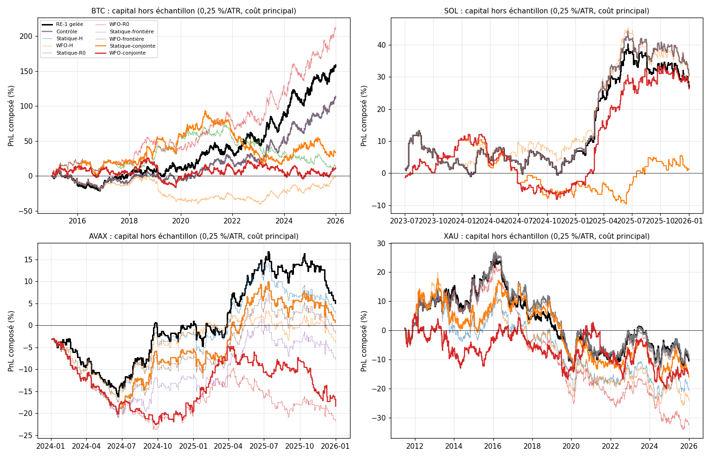
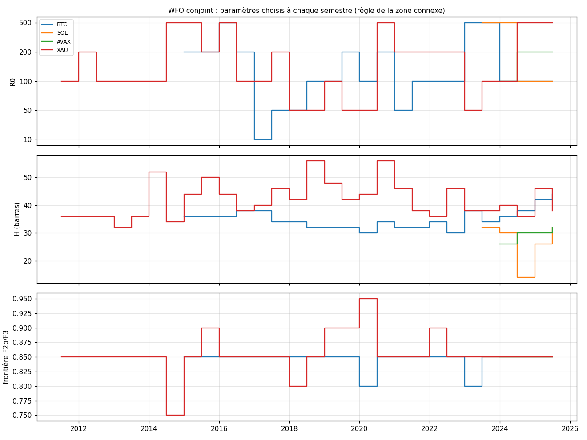

# EXP-D02 — Walk-forward de RE-1 : adaptation dynamique de H, R0 et de la frontière F2b/F3 (BTC, SOL, AVAX, or)

- **Date :** 2026-10-01. **Étape :** D, D02. Protocole écrit par le porteur, audité, arbitré par lui en deux temps
  (GO pour le code et Gate 0, puis second GO pour la grille).
- **Nature :** mesure hors échantillon de la valeur ajoutée d'un recalibrage semestriel, contre RE-1 gelée et contre une
  calibration statique. RE-1 n'est pas modifiée sur la base de ces résultats sans décision du porteur.
- **Données :**
  - BTC/USD Bitstamp 2013-2025, panne de janvier 2015 retirée (215 barres, convention de D02.0) ;
  - SOL/USD Coinbase dès le 2021-06-17 ; AVAX/USD Coinbase dès le 2021-09-30 ;
  - CFD or XAU/USD HistData dès le 2009-03-15 ;
  - barres de 30 min jusqu'au 2025-12-31, empreintes égales aux audits ; ni 2026, ni ETH, ni XRP ne sont lus.
- **Code :** `src/optimization/` (noyau Numba identique à RE-1 au bit près, fenêtres, seuils par IS, règle de choix,
  séries, statistiques appariées) ; `experiments/D02/run_D02.py` (`--gate0`, `--grille`, `--rapport`).

## 0. Cadrage (validé par le porteur)

- **QUESTION :** recalibrer chaque semestre H, R0 ou la frontière F2b/F3, un à un puis ensemble, apporte-t-il hors
  échantillon une valeur nette face à RE-1 gelée et à une calibration statique ?
- **PERTINENCE AKF :** R0 est le seul axe sensible du moteur sous le reset de P ; H fixe le moment où le jugement
  cinématique est encaissé ; la frontière ne change pas la population, elle décide quels trades portent le stop SL-B.
  D02.0 a montré que l'avantage de RE-1 dépend de la période.
- **DONNÉES :** ci-dessus ; 60 semestres hors échantillon (BTC 22 de 2015 à 2025, or 29 du S2 2011 à 2025, SOL 5 du
  S2 2023 à 2025, AVAX 4 de 2024 à 2025).
- **MÉTHODE :**
  - fenêtres semestrielles calendaires, apprentissage (IS) = les 24 mois qui précèdent chaque semestre de test (OOS) ;
  - un atlas par R0 ∈ {10, 50, 100, 200, 500} ; seuils de population (P50 de `leg_atr`, P75 de `nis_z_100`) réestimés sur
    les signaux de chaque IS, pour chaque R0, puis gelés pour le semestre suivant ;
  - grille exhaustive de 700 configurations par IS (H de 6 à 60 au pas de 2, cooldown = H ; R0 ; frontière de 0,75 à
    0,95), soit 42 000 évaluations ; branches OFAT = axes de la grille passant par RE-1 (100, 26, 0,85) ;
  - choix en IS (règle du porteur) : la plus grande zone connexe de configurations admissibles (E[ATR] net > 0,
    MDD < 0) à Calmar net > 0 (0,25 %/ATR), puis la configuration la plus proche de son centre géométrique ; repli sur
    RE-1 si aucune ;
  - 10 séries hors échantillon par actif, en une course continue chacune, sur les mêmes dates : RE-1 gelée (seuils BTC
    gelés), Contrôle (paramètres de RE-1, seuils réestimés seuls), puis Statique (choix de l'IS du premier semestre) et
    WFO (choix de chaque IS) pour H, R0, la frontière et la conjointe ;
  - étanchéité : un trade d'IS est clos à la dernière barre de son IS ; une position à cheval sur deux semestres garde
    ses règles ; un trade ouvert le 2025-12-31 est clos à la dernière barre de 2025.
- **CRITÈRE DE LECTURE :** écarts appariés par mois (mêmes tirages, 2 000, graine fixe) ; « tangible » = IC 95 %
  entièrement au-dessus de 0.
  - « surpasse RE-1 gelée » : espérance (ATR et bps) et rendement tangibles, MDD non dégradé (plage des chemins pas
    entièrement défavorable) ;
  - « WFO retenu face à son Statique » : espérance tangible, Calmar en hausse sur toute la plage des chemins, MDD non
    dégradé ; sinon Statique ;
  - conjointe : règle « surpasse » face à la meilleure variante 1D ;
  - sans variante qui surpasse RE-1 gelée, absence de valeur ajoutée démontrée et RE-1 inchangée.
- **CE QUE ÇA NE PERMET PAS DE CONCLURE :**
  - BTC 2020-2025 a servi à construire RE-1 : aucun de ses semestres n'est vierge ;
  - avant 2020, RE-1 gelée porte des seuils estimés sur 2020-2025 : c'est une référence fixe, pas une stratégie causale ;
  - SOL et AVAX : 4 à 5 semestres, puissance faible ;
  - environ 90 comparaisons au coût principal : quelques « significatives » sont attendues par hasard ;
  - ni portage ni glissement au-delà des frais ; hold-out non lu.

## 1. Décisions du porteur et contrôles

- **Arbitrages (2026-10-01) :** noyau Numba (VectorBT abandonné) ; grille exhaustive ; règle de la zone connexe et de
  son centre (l'option « voisin absent = 0 », qui postulait une falaise au-delà de la grille, est rejetée) ; Calmar
  indéfini jamais choisi ; écarts appariés par mois ; sensibilités de BTC (panne gardée ; lecture dès 2016) ; stress de
  coût à 10 bps sur la crypto et à 6 bps sur l'or.
- **Gate 0 (avant la grille) :** le noyau redonne les 1 080 trades de RE-1 au bit près, la parité tient hors du point de
  RE-1 et à chaque frontière de semestre, et les ancres de D01 et D02.0 sont reproduites (`gate0_D02.md`). Ses
  contrôles bloquants (données, 1 080 trades) sont repassés en tête de la grille.

## 2. Résultats nets hors échantillon (8 métriques, coût principal)

Six séries sur dix par actif ; les dix sont dans les annexes A1 à A4. Capital continu sur toute la période hors
échantillon de l'actif (BTC 2015-2025, SOL S2 2023-2025, AVAX 2024-2025, or S2 2011-2025).

| Actif · variante (coût) | PnL : 0,25 %/ATR ; 1x ; bps (1x) | PF (1x) | WR | Espérance ATR [IC] ; bps | MDD : 0,25 %/ATR ; 1x | Trades (/mois) | Durée médiane | Part des frais (1x) ; brut ; frais (ATR) | Calmar 0,25 %/ATR |
|---|---|---|---|---|---|---|---|---|---|
| BTC · RE-1 gelée (5) | +159 % ; +396 % ; +21 149 | 1,15 | 43,9 % | +0,218 [+0,032 ; +0,401] ; +10,2 | −28,4 % ; −53,0 % | 2 075 (15,7) | 26 b ; 13 h | 33 % ; +0,34 ; 0,12 | 0,32 |
| BTC · Contrôle (5) | +114 % ; +221 % ; +16 162 | 1,12 | 43,0 % | +0,194 [+0,000 ; +0,399] ; +8,5 | −27,9 % ; −48,4 % | 1 909 (14,5) | 26 b ; 13 h | 37 % ; +0,32 ; 0,13 | 0,26 |
| BTC · WFO-R0 (5) | +214 % ; +478 % ; +22 133 | 1,18 | 43,6 % | +0,291 [+0,088 ; +0,499] ; +12,1 | −15,8 % ; −40,6 % | 1 836 (13,9) | 26 b ; 13 h | 29 % ; +0,42 ; 0,13 | 0,69 |
| BTC · WFO-H (5) | −2 % ; −20 % ; +2 260 | 1,02 | 42,4 % | +0,019 [−0,202 ; +0,244] ; +1,2 | −46,0 % ; −69,8 % | 1 847 (14,0) | 26 b ; 13 h | 80 % ; +0,14 ; 0,13 | −0,00 |
| BTC · Statique-conjointe (5) | +33 % ; −42 % ; −338 | 1,00 | 40,0 % | +0,104 [−0,164 ; +0,366] ; −0,2 | −40,2 % ; −72,9 % | 1 423 (10,8) | 36 b ; 18 h | 105 % ; +0,23 ; 0,13 | 0,07 |
| BTC · WFO-conjointe (5) | +11 % ; −39 % ; +191 | 1,00 | 41,2 % | +0,049 [−0,190 ; +0,284] ; +0,1 | −34,0 % ; −60,9 % | 1 591 (12,1) | 32 b ; 16 h | 98 % ; +0,17 ; 0,12 | 0,03 |
| SOL · RE-1 gelée (5) | +27 % ; +114 % ; +9 443 | 1,25 | 45,2 % | +0,252 [−0,191 ; +0,712] ; +23,3 | −13,1 % ; −42,3 % | 405 (13,5) | 26 b ; 13 h | 18 % ; +0,32 ; 0,07 | 0,76 |
| SOL · Contrôle (5) | +31 % ; +129 % ; +10 152 | 1,26 | 45,3 % | +0,272 [−0,172 ; +0,734] ; +24,2 | −13,1 % ; −42,3 % | 419 (14,0) | 26 b ; 13 h | 17 % ; +0,34 ; 0,07 | 0,86 |
| SOL · WFO-R0 (5) | +31 % ; +129 % ; +10 152 | 1,26 | 45,3 % | +0,272 [−0,172 ; +0,734] ; +24,2 | −13,1 % ; −42,3 % | 419 (14,0) | 26 b ; 13 h | 17 % ; +0,34 ; 0,07 | 0,86 |
| SOL · WFO-H (5) | +30 % ; +92 % ; +8 155 | 1,21 | 47,6 % | +0,241 [−0,133 ; +0,640] ; +17,8 | −11,8 % ; −38,7 % | 458 (15,3) | 18 b ; 9 h | 22 % ; +0,31 ; 0,07 | 0,93 |
| SOL · Statique-conjointe (5) | +1 % ; −26 % ; −1 786 | 0,94 | 44,3 % | +0,035 [−0,504 ; +0,597] ; −6,8 | −20,0 % ; −61,4 % | 264 (8,8) | 32 b ; 16 h | brut ≤ 0 ; +0,10 ; 0,07 | 0,02 |
| SOL · WFO-conjointe (5) | +26 % ; +78 % ; +7 539 | 1,20 | 48,2 % | +0,261 [−0,199 ; +0,731] ; +19,7 | −19,1 % ; −59,1 % | 382 (12,7) | 26 b ; 13 h | 20 % ; +0,33 ; 0,07 | 0,51 |
| AVAX · RE-1 gelée (5) | +5 % ; −17 % ; −536 | 0,99 | 42,6 % | +0,074 [−0,301 ; +0,431] ; −1,6 | −16,5 % ; −52,9 % | 329 (13,7) | 26 b ; 13 h | 148 % ; +0,14 ; 0,06 | 0,15 |
| AVAX · Contrôle (5) | +1 % ; −28 % ; −1 905 | 0,95 | 42,1 % | +0,021 [−0,332 ; +0,382] ; −5,4 | −20,6 % ; −57,9 % | 354 (14,8) | 26 b ; 13 h | brut ≤ 0 ; +0,08 ; 0,06 | 0,01 |
| AVAX · WFO-R0 (5) | −22 % ; −60 % ; −7 811 | 0,80 | 38,0 % | −0,289 [−0,626 ; +0,062] ; −24,0 | −24,3 % ; −62,5 % | 326 (13,6) | 26 b ; 13 h | brut ≤ 0 ; −0,23 ; 0,06 | −0,48 |
| AVAX · WFO-H (5) | −4 % ; −33 % ; −2 861 | 0,92 | 44,2 % | −0,031 [−0,315 ; +0,254] ; −7,5 | −17,9 % ; −53,0 % | 380 (15,8) | 20 b ; 10 h | brut ≤ 0 ; +0,03 ; 0,06 | −0,11 |
| AVAX · Statique-conjointe (5) | +1 % ; −28 % ; −1 905 | 0,95 | 42,1 % | +0,021 [−0,332 ; +0,382] ; −5,4 | −20,6 % ; −57,9 % | 354 (14,8) | 26 b ; 13 h | brut ≤ 0 ; +0,08 ; 0,06 | 0,01 |
| AVAX · WFO-conjointe (5) | −18 % ; −48 % ; −5 166 | 0,87 | 39,4 % | −0,238 [−0,615 ; +0,163] ; −16,0 | −23,3 % ; −61,2 % | 322 (13,4) | 30 b ; 15 h | brut ≤ 0 ; −0,17 ; 0,06 | −0,42 |
| XAU · RE-1 gelée (4) | −10 % ; −7 % ; −388 | 0,99 | 41,4 % | −0,045 [−0,273 ; +0,177] ; −0,2 | −31,9 % ; −32,1 % | 1 637 (9,4) | 26 b ; 13 h | 106 % ; +0,24 ; 0,29 | −0,02 |
| XAU · Contrôle (4) | −9 % ; −4 % ; −31 | 1,00 | 41,5 % | −0,046 [−0,285 ; +0,184] ; −0,0 | −32,7 % ; −32,9 % | 1 656 (9,5) | 26 b ; 13 h | 100 % ; +0,24 ; 0,29 | −0,02 |
| XAU · WFO-R0 (4) | −32 % ; −29 % ; −3 046 | 0,93 | 40,1 % | −0,196 [−0,432 ; +0,036] ; −1,9 | −46,7 % ; −43,6 % | 1 598 (9,2) | 26 b ; 13 h | 191 % ; +0,09 ; 0,29 | −0,06 |
| XAU · WFO-H (4) | −24 % ; −21 % ; −1 903 | 0,95 | 41,6 % | −0,110 [−0,394 ; +0,149] ; −1,2 | −39,2 % ; −36,7 % | 1 565 (9,0) | 26 b ; 13 h | 144 % ; +0,18 ; 0,29 | −0,05 |
| XAU · Statique-conjointe (4) | −16 % ; −15 % ; −1 149 | 0,97 | 42,2 % | −0,084 [−0,377 ; +0,180] ; −0,8 | −31,1 % ; −30,3 % | 1 519 (8,7) | 36 b ; 18 h | 123 % ; +0,20 ; 0,29 | −0,04 |
| XAU · WFO-conjointe (4) | −14 % ; −15 % ; −1 151 | 0,97 | 40,9 % | −0,067 [−0,377 ; +0,232] ; −0,9 | −24,6 % ; −24,7 % | 1 322 (7,6) | 38 b ; 20 h | 128 % ; +0,22 ; 0,29 | −0,04 |

**Stress de coût (paramètres choisis au coût principal, sans réoptimisation) : espérance ATR [IC] ; PnL à 0,25 %/ATR**

| Actif (coût) | RE-1 gelée | Contrôle | WFO-R0 | WFO-H | Statique-conjointe | WFO-conjointe |
|---|---|---|---|---|---|---|
| BTC (10 bps) | +0,093 [−0,094 ; +0,277] ; +43 % | +0,066 [−0,128 ; +0,269] ; +23 % | +0,165 [−0,043 ; +0,373] ; +85 % | −0,106 [−0,328 ; +0,120] ; −42 % | −0,023 [−0,292 ; +0,239] ; −11 % | −0,072 [−0,313 ; +0,170] ; −29 % |
| SOL (10 bps) | +0,185 [−0,262 ; +0,647] ; +18 % | +0,204 [−0,240 ; +0,669] ; +22 % | +0,204 [−0,240 ; +0,669] ; +22 % | +0,173 [−0,203 ; +0,575] ; +20 % | −0,032 [−0,567 ; +0,531] ; −3 % | +0,194 [−0,262 ; +0,666] ; +18 % |
| AVAX (10 bps) | +0,011 [−0,367 ; +0,370] ; −0 % | −0,043 [−0,394 ; +0,320] ; −5 % | −0,352 [−0,689 ; +0,001] ; −26 % | −0,095 [−0,379 ; +0,187] ; −10 % | −0,043 [−0,394 ; +0,320] ; −5 % | −0,303 [−0,681 ; +0,097] ; −23 % |
| XAU (6 bps) | −0,189 [−0,418 ; +0,035] ; −35 % | −0,189 [−0,431 ; +0,040] ; −34 % | −0,339 [−0,576 ; −0,107] ; −51 % | −0,253 [−0,537 ; +0,007] ; −44 % | −0,228 [−0,519 ; +0,039] ; −38 % | −0,212 [−0,521 ; +0,088] ; −34 % |

## 3. Comparaisons appariées (mêmes mois, 2 000 tirages)

| Actif · A contre B | Δ espérance ATR [IC] | Δ espérance bps [IC] | Δ rendement annuel [IC] | Δ MDD sorties [plage] | Δ Calmar [plage] ; part A mieux | Verdict |
|---|---|---|---|---|---|---|
| BTC · WFO-R0 / RE-1 gelée | +0,074 [−0,067 ; +0,225] | +1,9 [−7,7 ; +12,4] | +1,9 % [−4,7 % ; +9,0 %] | +11,8 % [−10,0 % ; +17,7 %] | +0,38 [−0,33 ; +0,72] ; 72 % | non |
| BTC · WFO-R0 / Contrôle | +0,098 [−0,030 ; +0,232] | +3,6 [−4,3 ; +12,2] | +3,8 % [−2,0 % ; +9,8 %] | +11,3 % [−6,9 % ; +19,5 %] | +0,44 [−0,15 ; +0,79] ; 90 % | non |
| BTC · WFO-R0 / Statique-R0 | +0,266 [+0,028 ; +0,503] | +12,4 [−1,2 ; +26,6] | +9,8 % [+0,4 % ; +19,5 %] | +21,1 % [−9,6 % ; +33,8 %] | +0,68 [−0,03 ; +1,22] ; 97 % | Statique préféré |
| BTC · WFO-H / Statique-H | −0,174 [−0,276 ; −0,074] | −7,2 [−11,9 ; −2,4] | −7,4 % [−11,2 % ; −3,4 %] | −18,3 % [−34,4 % ; −0,4 %] | −0,27 [−0,64 ; −0,08] ; 0 % | Statique préféré |
| BTC · WFO-conjointe / RE-1 gelée | −0,168 [−0,412 ; +0,076] | −10,1 [−23,7 ; +2,8] | −8,1 % [−17,5 % ; +1,5 %] | −6,4 % [−39,5 % ; +9,3 %] | −0,30 [−0,91 ; +0,07] ; 6 % | non |
| BTC · Contrôle / RE-1 gelée | −0,024 [−0,093 ; +0,049] | −1,7 [−6,3 ; +3,0] | −1,9 % [−5,1 % ; +1,5 %] | +0,5 % [−11,8 % ; +6,8 %] | −0,06 [−0,38 ; +0,13] ; 19 % | non |
| BTC 2016-2025 · WFO-R0 / RE-1 gelée | +0,004 [−0,114 ; +0,134] | −1,7 [−10,3 ; +6,8] | −1,4 % [−7,2 % ; +5,0 %] | −0,9 % [−12,4 % ; +10,7 %] | −0,13 [−0,62 ; +0,46] ; 38 % | non |
| SOL · WFO-conjointe / RE-1 gelée | +0,010 [−0,359 ; +0,419] | −3,6 [−36,0 ; +28,9] | −0,2 % [−16,4 % ; +16,7 %] | −5,5 % [−11,6 % ; +13,3 %] | −0,25 [−2,02 ; +2,39] ; 52 % | non |
| SOL · WFO-H / Statique-H | −0,031 [−0,202 ; +0,163] | −6,4 [−21,0 ; +9,6] | −0,3 % [−8,7 % ; +8,8 %] | +1,5 % [−5,1 % ; +7,9 %] | +0,09 [−1,08 ; +1,21] ; 46 % | Statique préféré |
| AVAX · WFO-R0 / RE-1 gelée | −0,363 [−0,756 ; +0,026] | −22,3 [−53,1 ; +10,2] | −14,1 % [−29,9 % ; +0,8 %] | −7,5 % [−25,7 % ; +3,3 %] | −0,64 [−2,58 ; +0,07] ; 4 % | non |
| XAU · WFO-R0 / Contrôle | −0,150 [−0,294 ; −0,021] | −1,9 [−3,8 ; −0,2] | −2,0 % [−4,0 % ; −0,2 %] | −14,1 % [−24,5 % ; +1,9 %] | −0,04 [−0,18 ; −0,00] ; 2 % | non |
| XAU · WFO-conjointe / RE-1 gelée | −0,022 [−0,335 ; +0,282] | −0,6 [−5,2 ; +3,7] | −0,3 % [−4,6 % ; +3,8 %] | +7,2 % [−27,5 % ; +19,4 %] | −0,02 [−0,19 ; +0,15] ; 45 % | non |

- `[OBS]` **Aucune variante ne surpasse RE-1 gelée, sur aucun actif.** Sur 92 comparaisons au coût principal :
  - aucun gain d'espérance tangible en ATR et en bps à la fois ;
  - un seul gain de rendement tangible : WFO-R0 contre Statique-R0 sur BTC ;
  - aucun WFO retenu face à son Statique.
- `[OBS]` **Le recalibrage dégrade plus souvent qu'il n'améliore.** Huit écarts d'espérance sont significativement
  négatifs en ATR, pour un seul positif : BTC WFO-H (contre RE-1, le Contrôle et Statique-H), BTC WFO conjoint contre
  WFO-R0, AVAX Statique-frontière, or WFO-R0 (trois fois). Le positif est WFO-R0 contre Statique-R0 sur BTC, +0,266 ATR
  [+0,028 ; +0,503], dont l'IC en bps contient 0.
- `[OBS]` **Seuils réestimés seuls (Contrôle) :** sans effet mesurable. BTC −0,024 ATR [−0,093 ; +0,049], SOL +0,020,
  AVAX −0,053, or −0,000 face à RE-1 gelée.

## 4. Mécanique

### 4.1 BTC : le gain de WFO-R0 tient à 2015-2018

- `[OBS]` **R0 choisi :** 200 du S1 2015 au S1 2017, 50 du S2 2017 au S1 2018, puis 100 jusqu'à la fin. Dès le S2 2018,
  WFO-R0 et le Contrôle prennent les mêmes trades.
- `[OBS]` Espérance par année (ATR, 5 bps) :

  | Variante | 2015 | 2016 | 2017 | 2018 | 2019 | 2020-2025 (moyenne) |
  |---|---|---|---|---|---|---|
  | RE-1 gelée | −0,272 | −0,002 | +0,469 | +0,062 | +0,098 | +0,357 (6/6) |
  | Contrôle | −0,221 | −0,113 | +0,268 | +0,197 | −0,074 | +0,355 (6/6) |
  | WFO-R0 | **+0,535** | +0,063 | +0,076 | **+0,482** | −0,074 | +0,355 (6/6) |
  | Statique-R0 (R0 = 200) | +0,535 | +0,063 | +0,140 | +0,117 | +0,692 | **−0,191** (1/6) |

- `[OBS]` **Par période,** moyennes par trade (ATR, 5 bps) :

  | Variante | 2015-2019 | 2020-2025 |
  |---|---|---|
  | RE-1 gelée | +0,064 | +0,357 |
  | Contrôle | −0,005 | +0,355 |
  | WFO-R0 | +0,205 | +0,355 |
  | Statique-R0 | +0,301 | −0,191 |
  | Statique-conjointe | +0,337 | −0,077 |

- `[OBS]` **Lecture dès 2016 :** WFO-R0 +0,272 contre RE-1 gelée +0,267 ; écart +0,004 [−0,114 ; +0,134], Calmar
  0,64 contre 0,76. Le gain sur 2015-2025 (+0,074, non significatif) vient pour l'essentiel de 2015.

### 4.2 Les autres branches

- `[OBS]` **H (BTC) :** le choix varie de 12 à 50 barres d'un semestre à l'autre (12, 12, 50, 32, 32, 18, 46, 44, 18…),
  avec 4 replis sur RE-1 sur 22. Sur les mêmes entrées que le Contrôle, l'horizon choisi ne change rien : −0,008 ATR
  [−0,121 ; +0,116]. La perte de WFO-H (−0,174 contre Statique-H) vient donc du calendrier : changer H change les
  trades pris en course séquentielle (I-M16, K9).
- `[OBS]` **Statiques de BTC :** l'IS 2013-2014 n'a aucune configuration admissible à Calmar > 0 sur les axes H et
  frontière (R0 = 100) ; Statique-H et Statique-frontière y sont donc des replis sur RE-1 et valent le Contrôle.
- `[OBS]` **Frontière :** 0,85 dans 21 semestres sur 22 sur BTC. Quand tout l'axe est positif, le centre de la zone
  tombe sur 0,85. La branche est inerte ; WFO-frontière = Contrôle à ±0,001 ATR près.
- `[OBS]` **Conjointe :** R0 change souvent d'un semestre à l'autre (de 10 à 500) ; H va de 30 à 44 sur BTC et de 32 à 56 sur
  l'or, au-dessus de 26.
- `[OBS]` **Replis sur RE-1** (aucune configuration admissible à Calmar > 0 dans l'IS) : nombreux sur l'or (H 9, R0 11,
  frontière 14 sur 29 semestres). Sur BTC : 4 pour H et 6 pour la frontière, tous sur les premiers semestres, dont les
  IS (2013 à mi-2017) perdaient à R0 = 100.
- `[OBS]` **Or :** toutes les variantes perdent, de −0,045 (RE-1 gelée) à −0,196 ATR (WFO-R0). Le brut reste de +0,09 à
  +0,24 ATR pour 0,29 ATR de frais. WFO-R0 est significativement pire que le Contrôle (−0,150 [−0,294 ; −0,021]).
- `[OBS]` **SOL et AVAX :** sur 4 à 5 semestres, les écarts tiennent dans des IC de ±0,4 à ±0,7 ATR. Sur SOL, R0 et la
  frontière restent aux valeurs de RE-1 : six séries sur dix sont identiques au Contrôle.
- `[OBS]` **Sensibilités :** la panne de 2015 ne change rien (écarts ≤ 0,002 ATR).

## 5. Lecture de rentabilité

- **Brut et net :** sur BTC 2015-2025, RE-1 gelée fait +0,34 ATR brut et +0,218 net à 5 bps (IC > 0), mais seulement
  +0,093 [−0,094 ; +0,277] à 10 bps. WFO-R0 fait +0,42 brut, +0,291 net à 5 bps et +0,165 [−0,043 ; +0,373] à 10 bps. Sur
  l'or, 4 bps coûtent 0,29 ATR, autant que le brut.
- **Rendement et risque :** à 0,25 %/ATR, RE-1 gelée fait +159 % en 11 ans (MDD −28,4 %, Calmar 0,32) et WFO-R0 +214 %
  (MDD −15,8 %, Calmar 0,69). À 1x, les MDD vont de −41 à −73 % sur BTC.
- **Queues :** partout, médiane de −0,2 à −1,4 ATR. Les trades du décile supérieur valent +6 à +11 ATR en moyenne,
  soit +0,6 à +1,1 ATR par trade de la série, plus que l'espérance totale. Le profil de RE-1 ne change pas : quelques
  grands gagnants portent tout.
- **Plausibilité :** sur BTC, 2020-2025 a servi à construire RE-1. Le seul hors échantillon propre, 2015-2019, donne
  +0,064 ATR à RE-1 gelée et +0,205 à WFO-R0, sur 5 années dont deux portent l'écart (2015, 2018).

## 6. Hypothèses et pistes

- `[HYP]` **Sur BTC, les réglages valent pour une époque.** Les paramètres tirés de 2013-2014 (R0 = 200, H = 36)
  gagnent sur 2015-2019 et perdent sur 2020-2025 ; ceux de RE-1, tirés de 2020-2025, font l'inverse (D02.0). Le
  recalibrage semestriel sur 24 mois ne suit pas ce basculement de façon fiable : WFO-R0 a basculé vers 100 en
  2017-2018, mais a manqué 2019 (R0 = 200 : +0,692 ; WFO : −0,074).
- `[HYP]` **H se recalibre mal :** l'effet de sortie est nul sur entrées figées ; le recalibrage ne fait que déplacer le
  calendrier des trades, au détriment de BTC.
- `[HYP]` **En trois dimensions, la règle de la zone et de son centre ramène le choix vers le centre de la grille.** Les
  zones conjointes retenues sont très grandes : sur BTC, 107 à 559 cases sur 700 (médiane 280). L'axe H compte 28 pas
  contre 5 pour R0 et la frontière, si bien que le centre de ces zones tombe vers H = 30-44, autour du centre de la
  grille (H ≈ 33). C'est un effet de la géométrie de la grille, pas une mesure du marché.
- `[HYP]` **Coût :** à 10 bps, plus rien n'est significatif sur BTC ; la rente de RE-1 suppose un coût d'exécution de
  l'ordre de 5 bps.
- `[PISTE]` **Hold-out (phase 7) :** RE-1 inchangée, telle qu'elle est figée, sous réserve que le hold-out n'est pas
  vierge.
- `[PISTE]` **R0 seul, IS plus long ou ancré :** à cadrer si le porteur le souhaite. Le seul signal du WFO porte sur
  R0, mais il tient à deux années.

## 7. Décision (proposée au porteur)

- **Verdict du protocole :** aucune variante ne surpasse RE-1 gelée ; aucun WFO n'est retenu face à son Statique.
  Avec ce protocole, la valeur ajoutée du walk-forward n'est pas démontrée, ni par actif, ni conjointement. RE-1 reste
  inchangée.
- La suite est à trancher par le porteur.

---

# Annexes générées (`run_D02.py --grille`, puis `--rapport`)

Calcul du 2026-10-01 06:32 UTC, commit `457a1ed`, 319 s ; 146 comparaisons appariées publiées. Contrôles bloquants de Gate 0 repassés avant la grille (données, 1 080 trades de RE-1).

## A1. BTC — BTC/USD Bitstamp 2013-2025, panne de janvier 2015 retirée

- 22 semestres hors échantillon dès le 2015-01-01 ; 15 400 évaluations IS en 1,3 s ; signaux par R0 : 10 : 12 588, 50 : 16 355, 100 : 15 819, 200 : 14 424, 500 : 12 380.

**Résultats nets à 5 bps (coût principal)**

| Variante | PnL : 0,25 %/ATR ; 1x ; bps (1x) | PF (1x) | WR | Espérance ATR [IC] ; bps | MDD : 0,25 %/ATR ; 1x | Trades (/mois) | Durée médiane | Part des frais (1x) ; brut ; frais (ATR) | Calmar 0,25 %/ATR |
|---|---|---|---|---|---|---|---|---|---|
| RE-1 gelée | +159 % ; +396 % ; +21 149 | 1,15 | 43,9 % | +0,218 [+0,032 ; +0,401] ; +10,2 | −28,4 % ; −53,0 % | 2 075 (15,7) | 26 b ; 13 h | 33 % ; +0,34 ; 0,12 | 0,32 |
| Contrôle | +114 % ; +221 % ; +16 162 | 1,12 | 43,0 % | +0,194 [+0,000 ; +0,399] ; +8,5 | −27,9 % ; −48,4 % | 1 909 (14,5) | 26 b ; 13 h | 37 % ; +0,32 ; 0,13 | 0,26 |
| Statique-H | +114 % ; +221 % ; +16 162 | 1,12 | 43,0 % | +0,194 [+0,000 ; +0,399] ; +8,5 | −27,9 % ; −48,4 % | 1 909 (14,5) | 26 b ; 13 h | 37 % ; +0,32 ; 0,13 | 0,26 |
| WFO-H | −2 % ; −20 % ; +2 260 | 1,02 | 42,4 % | +0,019 [−0,202 ; +0,244] ; +1,2 | −46,0 % ; −69,8 % | 1 847 (14,0) | 26 b ; 13 h | 80 % ; +0,14 ; 0,13 | −0,00 |
| Statique-R0 | +13 % ; −37 % ; −511 | 1,00 | 39,9 % | +0,025 [−0,182 ; +0,237] ; −0,3 | −37,5 % ; −63,0 % | 1 546 (11,7) | 26 b ; 13 h | 107 % ; +0,15 ; 0,13 | 0,03 |
| WFO-R0 | +214 % ; +478 % ; +22 133 | 1,18 | 43,6 % | +0,291 [+0,088 ; +0,499] ; +12,1 | −15,8 % ; −40,6 % | 1 836 (13,9) | 26 b ; 13 h | 29 % ; +0,42 ; 0,13 | 0,69 |
| Statique-frontière | +114 % ; +221 % ; +16 162 | 1,12 | 43,0 % | +0,194 [+0,000 ; +0,399] ; +8,5 | −27,9 % ; −48,4 % | 1 909 (14,5) | 26 b ; 13 h | 37 % ; +0,32 ; 0,13 | 0,26 |
| WFO-frontière | +115 % ; +243 % ; +16 781 | 1,13 | 43,0 % | +0,195 [+0,002 ; +0,397] ; +8,8 | −27,9 % ; −48,4 % | 1 909 (14,5) | 26 b ; 13 h | 36 % ; +0,32 ; 0,13 | 0,26 |
| Statique-conjointe | +33 % ; −42 % ; −338 | 1,00 | 40,0 % | +0,104 [−0,164 ; +0,366] ; −0,2 | −40,2 % ; −72,9 % | 1 423 (10,8) | 36 b ; 18 h | 105 % ; +0,23 ; 0,13 | 0,07 |
| WFO-conjointe | +11 % ; −39 % ; +191 | 1,00 | 41,2 % | +0,049 [−0,190 ; +0,284] ; +0,1 | −34,0 % ; −60,9 % | 1 591 (12,1) | 32 b ; 16 h | 98 % ; +0,17 ; 0,12 | 0,03 |

**Stress à 10 bps (paramètres choisis à 5 bps)**

| Variante | PnL : 0,25 %/ATR ; 1x ; bps (1x) | PF (1x) | WR | Espérance ATR [IC] ; bps | MDD : 0,25 %/ATR ; 1x | Trades (/mois) | Durée médiane | Part des frais (1x) ; brut ; frais (ATR) | Calmar 0,25 %/ATR |
|---|---|---|---|---|---|---|---|---|---|
| RE-1 gelée | +43 % ; +76 % ; +10 774 | 1,07 | 42,6 % | +0,093 [−0,094 ; +0,277] ; +5,2 | −36,3 % ; −60,8 % | 2 075 (15,7) | 26 b ; 13 h | 66 % ; +0,34 ; 0,25 | 0,09 |
| Contrôle | +23 % ; +24 % ; +6 617 | 1,05 | 41,7 % | +0,066 [−0,128 ; +0,269] ; +3,5 | −35,1 % ; −56,6 % | 1 909 (14,5) | 26 b ; 13 h | 74 % ; +0,32 ; 0,25 | 0,05 |
| Statique-H | +23 % ; +24 % ; +6 617 | 1,05 | 41,7 % | +0,066 [−0,128 ; +0,269] ; +3,5 | −35,1 % ; −56,6 % | 1 909 (14,5) | 26 b ; 13 h | 74 % ; +0,32 ; 0,25 | 0,05 |
| WFO-H | −42 % ; −68 % ; −6 975 | 0,95 | 41,0 % | −0,106 [−0,328 ; +0,120] ; −3,8 | −62,0 % ; −82,1 % | 1 847 (14,0) | 26 b ; 13 h | 161 % ; +0,14 ; 0,25 | −0,08 |
| Statique-R0 | −27 % ; −71 % ; −8 241 | 0,93 | 38,6 % | −0,103 [−0,319 ; +0,113] ; −5,3 | −49,4 % ; −80,7 % | 1 546 (11,7) | 26 b ; 13 h | 214 % ; +0,15 ; 0,26 | −0,06 |
| WFO-R0 | +85 % ; +131 % ; +12 953 | 1,10 | 42,1 % | +0,165 [−0,043 ; +0,373] ; +7,1 | −20,6 % ; −46,6 % | 1 836 (13,9) | 26 b ; 13 h | 59 % ; +0,42 ; 0,25 | 0,28 |
| Statique-frontière | +23 % ; +24 % ; +6 617 | 1,05 | 41,7 % | +0,066 [−0,128 ; +0,269] ; +3,5 | −35,1 % ; −56,6 % | 1 909 (14,5) | 26 b ; 13 h | 74 % ; +0,32 ; 0,25 | 0,05 |
| WFO-frontière | +23 % ; +32 % ; +7 236 | 1,05 | 41,6 % | +0,067 [−0,128 ; +0,270] ; +3,8 | −35,1 % ; −56,6 % | 1 909 (14,5) | 26 b ; 13 h | 73 % ; +0,32 ; 0,25 | 0,05 |
| Statique-conjointe | −11 % ; −72 % ; −7 453 | 0,94 | 39,1 % | −0,023 [−0,292 ; +0,239] ; −5,2 | −46,2 % ; −79,4 % | 1 423 (10,8) | 36 b ; 18 h | 210 % ; +0,23 ; 0,25 | −0,02 |
| WFO-conjointe | −29 % ; −72 % ; −7 764 | 0,94 | 39,9 % | −0,072 [−0,313 ; +0,170] ; −4,9 | −44,5 % ; −80,7 % | 1 591 (12,1) | 32 b ; 16 h | 195 % ; +0,17 ; 0,24 | −0,07 |

**Queues et sous-familles (coût principal)**

| Variante | Médiane (ATR) | P10 ; P90 | Moyenne du décile sup. | Années > 0 | Part stoppée | F2b ; F3 (ATR) |
|---|---|---|---|---|---|---|
| RE-1 gelée | −0,43 | −2,97 ; +5,00 | +8,87 | 9 | 23 % | +0,202 ; +0,236 |
| Contrôle | −0,51 | −2,95 ; +5,00 | +8,86 | 8 | 24 % | +0,162 ; +0,229 |
| Statique-H | −0,51 | −2,95 ; +5,00 | +8,86 | 8 | 24 % | +0,162 ; +0,229 |
| WFO-H | −0,61 | −3,09 ; +4,80 | +8,92 | 6 | 25 % | −0,065 ; +0,115 |
| Statique-R0 | −0,77 | −3,11 ; +4,44 | +9,15 | 6 | 25 % | +0,071 ; −0,024 |
| WFO-R0 | −0,47 | −2,89 ; +5,00 | +9,01 | 10 | 23 % | +0,300 ; +0,281 |
| Statique-frontière | −0,51 | −2,95 ; +5,00 | +8,86 | 8 | 24 % | +0,162 ; +0,229 |
| WFO-frontière | −0,51 | −2,94 ; +5,00 | +8,86 | 8 | 25 % | +0,152 ; +0,243 |
| Statique-conjointe | −1,06 | −3,72 ; +5,98 | +11,32 | 7 | 28 % | +0,099 ; +0,108 |
| WFO-conjointe | −0,87 | −3,82 ; +5,59 | +10,01 | 7 | 26 % | −0,219 ; +0,362 |

**Comparaisons appariées par mois, contre RE-1 gelée (5 bps)**

| A contre B | Δ espérance ATR [IC] | Δ espérance bps [IC] | Δ rendement annuel [IC] | Δ MDD sorties (plage) ; part A mieux | Δ Calmar sorties (plage) ; part A mieux | Verdict |
|---|---|---|---|---|---|---|
| Contrôle / RE-1 gelée | −0,024 [−0,093 ; +0,049] | −1,7 [−6,3 ; +3,0] | −1,9 % [−5,1 % ; +1,5 %] | +0,5 % [−11,8 % ; +6,8 %] ; 35 % | −0,06 [−0,38 ; +0,13] ; 19 % | non |
| Statique-H / RE-1 gelée | −0,024 [−0,093 ; +0,049] | −1,7 [−6,3 ; +3,0] | −1,9 % [−5,1 % ; +1,5 %] | +0,5 % [−11,8 % ; +6,8 %] ; 35 % | −0,06 [−0,38 ; +0,13] ; 19 % | non |
| WFO-H / RE-1 gelée | −0,198 [−0,323 ; −0,074] | −9,0 [−15,8 ; −2,3] | −9,2 % [−14,6 % ; −4,0 %] | −17,8 % [−38,4 % ; +0,4 %] ; 3 % | −0,34 [−0,85 ; −0,11] ; 0 % | non |
| Statique-R0 / RE-1 gelée | −0,192 [−0,435 ; +0,067] | −10,5 [−25,0 ; +4,4] | −7,9 % [−18,1 % ; +2,7 %] | −9,3 % [−33,0 % ; +13,9 %] ; 24 % | −0,30 [−0,98 ; +0,16] ; 8 % | non |
| WFO-R0 / RE-1 gelée | +0,074 [−0,067 ; +0,225] | +1,9 [−7,7 ; +12,4] | +1,9 % [−4,7 % ; +9,0 %] | +11,8 % [−10,0 % ; +17,7 %] ; 66 % | +0,38 [−0,33 ; +0,72] ; 72 % | non |
| Statique-frontière / RE-1 gelée | −0,024 [−0,093 ; +0,049] | −1,7 [−6,3 ; +3,0] | −1,9 % [−5,1 % ; +1,5 %] | +0,5 % [−11,8 % ; +6,8 %] ; 35 % | −0,06 [−0,38 ; +0,13] ; 19 % | non |
| WFO-frontière / RE-1 gelée | −0,023 [−0,093 ; +0,050] | −1,4 [−6,0 ; +3,2] | −1,8 % [−5,1 % ; +1,6 %] | +0,5 % [−11,7 % ; +6,9 %] ; 37 % | −0,06 [−0,38 ; +0,13] ; 20 % | non |
| Statique-conjointe / RE-1 gelée | −0,114 [−0,390 ; +0,152] | −10,4 [−26,0 ; +4,7] | −6,4 % [−16,6 % ; +3,6 %] | −12,7 % [−35,2 % ; +13,5 %] ; 22 % | −0,26 [−0,90 ; +0,21] ; 12 % | non |
| WFO-conjointe / RE-1 gelée | −0,168 [−0,412 ; +0,076] | −10,1 [−23,7 ; +2,8] | −8,1 % [−17,5 % ; +1,5 %] | −6,4 % [−39,5 % ; +9,3 %] ; 13 % | −0,30 [−0,91 ; +0,07] ; 6 % | non |

**Comparaisons appariées par mois, contre le Contrôle (5 bps)**

| A contre B | Δ espérance ATR [IC] | Δ espérance bps [IC] | Δ rendement annuel [IC] | Δ MDD sorties (plage) ; part A mieux | Δ Calmar sorties (plage) ; part A mieux | Verdict |
|---|---|---|---|---|---|---|
| Statique-H / Contrôle | +0,000 [+0,000 ; +0,000] | +0,0 [+0,0 ; +0,0] | +0,0 % [+0,0 % ; +0,0 %] | +0,0 % [+0,0 % ; +0,0 %] ; 0 % | +0,00 [+0,00 ; +0,00] ; 0 % | non |
| WFO-H / Contrôle | −0,174 [−0,276 ; −0,074] | −7,2 [−11,9 ; −2,4] | −7,4 % [−11,2 % ; −3,4 %] | −18,3 % [−34,4 % ; −0,4 %] ; 2 % | −0,27 [−0,64 ; −0,08] ; 0 % | non |
| Statique-R0 / Contrôle | −0,169 [−0,430 ; +0,100] | −8,8 [−23,9 ; +6,4] | −6,0 % [−16,3 % ; +4,6 %] | −9,8 % [−32,1 % ; +18,3 %] ; 30 % | −0,24 [−0,81 ; +0,22] ; 14 % | non |
| WFO-R0 / Contrôle | +0,098 [−0,030 ; +0,232] | +3,6 [−4,3 ; +12,2] | +3,8 % [−2,0 % ; +9,8 %] | +11,3 % [−6,9 % ; +19,5 %] ; 77 % | +0,44 [−0,15 ; +0,79] ; 90 % | non |
| Statique-frontière / Contrôle | +0,000 [+0,000 ; +0,000] | +0,0 [+0,0 ; +0,0] | +0,0 % [+0,0 % ; +0,0 %] | +0,0 % [+0,0 % ; +0,0 %] ; 0 % | +0,00 [+0,00 ; +0,00] ; 0 % | non |
| WFO-frontière / Contrôle | +0,001 [−0,005 ; +0,008] | +0,3 [−0,2 ; +1,2] | +0,0 % [−0,2 % ; +0,4 %] | +0,0 % [−0,6 % ; +1,4 %] ; 38 % | +0,00 [−0,01 ; +0,03] ; 52 % | non |
| Statique-conjointe / Contrôle | −0,090 [−0,376 ; +0,189] | −8,7 [−24,9 ; +6,6] | −4,5 % [−14,9 % ; +6,0 %] | −13,2 % [−32,6 % ; +17,5 %] ; 28 % | −0,20 [−0,75 ; +0,27] ; 20 % | non |
| WFO-conjointe / Contrôle | −0,144 [−0,377 ; +0,100] | −8,3 [−20,5 ; +3,4] | −6,2 % [−15,1 % ; +2,7 %] | −6,9 % [−36,7 % ; +11,6 %] ; 16 % | −0,24 [−0,75 ; +0,13] ; 9 % | non |

**Comparaisons appariées par mois, WFO contre Statique (5 bps)**

| A contre B | Δ espérance ATR [IC] | Δ espérance bps [IC] | Δ rendement annuel [IC] | Δ MDD sorties (plage) ; part A mieux | Δ Calmar sorties (plage) ; part A mieux | Verdict |
|---|---|---|---|---|---|---|
| WFO-H / Statique-H | −0,174 [−0,276 ; −0,074] | −7,2 [−11,9 ; −2,4] | −7,4 % [−11,2 % ; −3,4 %] | −18,3 % [−34,4 % ; −0,4 %] ; 2 % | −0,27 [−0,64 ; −0,08] ; 0 % | Statique préféré |
| WFO-R0 / Statique-R0 | +0,266 [+0,028 ; +0,503] | +12,4 [−1,2 ; +26,6] | +9,8 % [+0,4 % ; +19,5 %] | +21,1 % [−9,6 % ; +33,8 %] ; 85 % | +0,68 [−0,03 ; +1,22] ; 97 % | Statique préféré |
| WFO-frontière / Statique-frontière | +0,001 [−0,005 ; +0,008] | +0,3 [−0,2 ; +1,2] | +0,0 % [−0,2 % ; +0,4 %] | +0,0 % [−0,6 % ; +1,4 %] ; 38 % | +0,00 [−0,01 ; +0,03] ; 52 % | Statique préféré |
| WFO-conjointe / Statique-conjointe | −0,054 [−0,327 ; +0,234] | +0,4 [−14,1 ; +15,8] | −1,7 % [−10,8 % ; +7,6 %] | +6,3 % [−31,0 % ; +21,0 %] ; 36 % | −0,04 [−0,43 ; +0,30] ; 35 % | Statique préféré |

**Comparaisons appariées par mois, conjointe contre meilleure 1D (5 bps)**

| A contre B | Δ espérance ATR [IC] | Δ espérance bps [IC] | Δ rendement annuel [IC] | Δ MDD sorties (plage) ; part A mieux | Δ Calmar sorties (plage) ; part A mieux | Verdict |
|---|---|---|---|---|---|---|
| Statique-conjointe / WFO-R0 | −0,188 [−0,457 ; +0,081] | −12,3 [−27,7 ; +2,9] | −8,3 % [−18,0 % ; +1,4 %] | −24,5 % [−36,1 % ; +9,2 %] ; 13 % | −0,64 [−1,14 ; +0,08] ; 5 % | non |
| WFO-conjointe / WFO-R0 | −0,242 [−0,439 ; −0,034] | −11,9 [−21,3 ; −3,3] | −10,0 % [−17,3 % ; −2,3 %] | −18,2 % [−38,9 % ; +2,1 %] ; 4 % | −0,68 [−1,15 ; −0,09] ; 0 % | non |

**Contre RE-1 gelée au stress de 10 bps**

| A contre B | Δ espérance ATR [IC] | Δ espérance bps [IC] | Δ rendement annuel [IC] | Δ MDD sorties (plage) ; part A mieux | Δ Calmar sorties (plage) ; part A mieux | Verdict |
|---|---|---|---|---|---|---|
| Contrôle / RE-1 gelée | −0,027 [−0,097 ; +0,045] | −1,7 [−6,3 ; +3,0] | −1,5 % [−4,5 % ; +1,7 %] | +1,4 % [−13,7 % ; +7,5 %] ; 33 % | −0,04 [−0,22 ; +0,08] ; 21 % | non |
| Statique-H / RE-1 gelée | −0,027 [−0,097 ; +0,045] | −1,7 [−6,3 ; +3,0] | −1,5 % [−4,5 % ; +1,7 %] | +1,4 % [−13,7 % ; +7,5 %] ; 33 % | −0,04 [−0,22 ; +0,08] ; 21 % | non |
| WFO-H / RE-1 gelée | −0,200 [−0,324 ; −0,076] | −9,0 [−15,8 ; −2,3] | −8,2 % [−13,3 % ; −3,3 %] | −25,9 % [−42,2 % ; −2,3 %] ; 1 % | −0,17 [−0,51 ; −0,05] ; 0 % | non |
| Statique-R0 / RE-1 gelée | −0,197 [−0,441 ; +0,062] | −10,5 [−25,0 ; +4,4] | −6,2 % [−15,7 % ; +3,9 %] | −13,1 % [−40,4 % ; +18,1 %] ; 21 % | −0,15 [−0,58 ; +0,11] ; 10 % | non |
| WFO-R0 / RE-1 gelée | +0,071 [−0,070 ; +0,222] | +1,9 [−7,7 ; +12,4] | +2,4 % [−3,9 % ; +9,2 %] | +15,2 % [−10,4 % ; +23,5 %] ; 72 % | +0,19 [−0,18 ; +0,51] ; 77 % | non |
| Statique-frontière / RE-1 gelée | −0,027 [−0,097 ; +0,045] | −1,7 [−6,3 ; +3,0] | −1,5 % [−4,5 % ; +1,7 %] | +1,4 % [−13,7 % ; +7,5 %] ; 33 % | −0,04 [−0,22 ; +0,08] ; 21 % | non |
| WFO-frontière / RE-1 gelée | −0,026 [−0,097 ; +0,046] | −1,4 [−6,0 ; +3,2] | −1,4 % [−4,5 % ; +1,8 %] | +1,4 % [−13,5 % ; +7,8 %] ; 34 % | −0,04 [−0,22 ; +0,08] ; 22 % | non |
| Statique-conjointe / RE-1 gelée | −0,117 [−0,392 ; +0,152] | −10,4 [−26,0 ; +4,7] | −4,4 % [−14,2 % ; +5,2 %] | −10,6 % [−38,8 % ; +18,9 %] ; 25 % | −0,12 [−0,52 ; +0,17] ; 19 % | non |
| WFO-conjointe / RE-1 gelée | −0,165 [−0,409 ; +0,079] | −10,1 [−23,7 ; +2,8] | −6,4 % [−15,3 % ; +2,8 %] | −8,5 % [−43,0 % ; +13,4 %] ; 14 % | −0,16 [−0,55 ; +0,08] ; 9 % | non |

**Paramètres choisis (règle de la zone connexe)**

| Branche | Paramètre choisi à chaque semestre (WFO) | Replis sur RE-1 | Zone : médiane (min-max) |
|---|---|---|---|
| H | 26, 26, 26, 26, 12, 12, 50, 32, 32, 18, 46, 44, 18, 32, 24, 28, 28, 28, 36, 34, 38, 38 | 4 sur 22 | 14 (2-28) |
| R0 | 200, 200, 200, 200, 200, 50, 50, 100, 100, 100, 100, 100, 100, 100, 100, 100, 100, 100, 100, 100, 100, 100 | 0 sur 22 | 2 (1-5) |
| frontiere | 0,85, 0,85, 0,85, 0,85, 0,85, 0,85, 0,85, 0,85, 0,85, 0,85, 0,80, 0,85, 0,85, 0,85, 0,85, 0,85, 0,85, 0,85, 0,85, 0,85, 0,85, 0,85 | 6 sur 22 | 5 (3-5) |
| conjointe | (200, 36, 0,85) ; (200, 36, 0,85) ; (500, 36, 0,85) ; (200, 38, 0,85) ; (10, 38, 0,85) ; (50, 34, 0,85) ; (50, 34, 0,85) ; (100, 32, 0,85) ; (100, 32, 0,85) ; (200, 32, 0,85) ; (100, 30, 0,80) ; (200, 34, 0,85) ; (50, 32, 0,85) ; (100, 32, 0,85) ; (100, 34, 0,85) ; (100, 30, 0,85) ; (500, 38, 0,80) ; (500, 34, 0,85) ; (100, 36, 0,85) ; (100, 38, 0,85) ; (100, 42, 0,85) ; (100, 44, 0,85) | 0 sur 22 | 280 (107-559) |

**Effet de l'horizon sur les entrées figées du Contrôle (I-M16)**

| Variante | Trades | H moyen ; part à 26 | Effet ATR [IC] | Effet bps [IC] |
|---|---|---|---|---|
| Statique-H | 1 909 | 26,0 ; 100 % | +0,000 [+0,000 ; +0,000] | +0,0 [+0,0 ; +0,0] |
| WFO-H | 1 909 | 29,8 ; 20 % | −0,008 [−0,121 ; +0,116] | −0,2 [−5,0 ; +5,1] |

## A2. SOL — SOL/USD Coinbase, dès le 2021-06-17

- 5 semestres hors échantillon dès le 2023-07-01 ; 3 500 évaluations IS en 0,3 s ; signaux par R0 : 10 : 4 596, 50 : 5 537, 100 : 5 385, 200 : 4 977, 500 : 4 283.

**Résultats nets à 5 bps (coût principal)**

| Variante | PnL : 0,25 %/ATR ; 1x ; bps (1x) | PF (1x) | WR | Espérance ATR [IC] ; bps | MDD : 0,25 %/ATR ; 1x | Trades (/mois) | Durée médiane | Part des frais (1x) ; brut ; frais (ATR) | Calmar 0,25 %/ATR |
|---|---|---|---|---|---|---|---|---|---|
| RE-1 gelée | +27 % ; +114 % ; +9 443 | 1,25 | 45,2 % | +0,252 [−0,191 ; +0,712] ; +23,3 | −13,1 % ; −42,3 % | 405 (13,5) | 26 b ; 13 h | 18 % ; +0,32 ; 0,07 | 0,76 |
| Contrôle | +31 % ; +129 % ; +10 152 | 1,26 | 45,3 % | +0,272 [−0,172 ; +0,734] ; +24,2 | −13,1 % ; −42,3 % | 419 (14,0) | 26 b ; 13 h | 17 % ; +0,34 ; 0,07 | 0,86 |
| Statique-H | +31 % ; +129 % ; +10 152 | 1,26 | 45,3 % | +0,272 [−0,172 ; +0,734] ; +24,2 | −13,1 % ; −42,3 % | 419 (14,0) | 26 b ; 13 h | 17 % ; +0,34 ; 0,07 | 0,86 |
| WFO-H | +30 % ; +92 % ; +8 155 | 1,21 | 47,6 % | +0,241 [−0,133 ; +0,640] ; +17,8 | −11,8 % ; −38,7 % | 458 (15,3) | 18 b ; 9 h | 22 % ; +0,31 ; 0,07 | 0,93 |
| Statique-R0 | +31 % ; +129 % ; +10 152 | 1,26 | 45,3 % | +0,272 [−0,172 ; +0,734] ; +24,2 | −13,1 % ; −42,3 % | 419 (14,0) | 26 b ; 13 h | 17 % ; +0,34 ; 0,07 | 0,86 |
| WFO-R0 | +31 % ; +129 % ; +10 152 | 1,26 | 45,3 % | +0,272 [−0,172 ; +0,734] ; +24,2 | −13,1 % ; −42,3 % | 419 (14,0) | 26 b ; 13 h | 17 % ; +0,34 ; 0,07 | 0,86 |
| Statique-frontière | +31 % ; +129 % ; +10 152 | 1,26 | 45,3 % | +0,272 [−0,172 ; +0,734] ; +24,2 | −13,1 % ; −42,3 % | 419 (14,0) | 26 b ; 13 h | 17 % ; +0,34 ; 0,07 | 0,86 |
| WFO-frontière | +31 % ; +129 % ; +10 152 | 1,26 | 45,3 % | +0,272 [−0,172 ; +0,734] ; +24,2 | −13,1 % ; −42,3 % | 419 (14,0) | 26 b ; 13 h | 17 % ; +0,34 ; 0,07 | 0,86 |
| Statique-conjointe | +1 % ; −26 % ; −1 786 | 0,94 | 44,3 % | +0,035 [−0,504 ; +0,597] ; −6,8 | −20,0 % ; −61,4 % | 264 (8,8) | 32 b ; 16 h | brut ≤ 0 ; +0,10 ; 0,07 | 0,02 |
| WFO-conjointe | +26 % ; +78 % ; +7 539 | 1,20 | 48,2 % | +0,261 [−0,199 ; +0,731] ; +19,7 | −19,1 % ; −59,1 % | 382 (12,7) | 26 b ; 13 h | 20 % ; +0,33 ; 0,07 | 0,51 |

**Stress à 10 bps (paramètres choisis à 5 bps)**

| Variante | PnL : 0,25 %/ATR ; 1x ; bps (1x) | PF (1x) | WR | Espérance ATR [IC] ; bps | MDD : 0,25 %/ATR ; 1x | Trades (/mois) | Durée médiane | Part des frais (1x) ; brut ; frais (ATR) | Calmar 0,25 %/ATR |
|---|---|---|---|---|---|---|---|---|---|
| RE-1 gelée | +18 % ; +75 % ; +7 418 | 1,19 | 44,7 % | +0,185 [−0,262 ; +0,647] ; +18,3 | −15,2 % ; −44,4 % | 405 (13,5) | 26 b ; 13 h | 35 % ; +0,32 ; 0,13 | 0,46 |
| Contrôle | +22 % ; +86 % ; +8 057 | 1,20 | 44,9 % | +0,204 [−0,240 ; +0,669] ; +19,2 | −15,2 % ; −44,5 % | 419 (14,0) | 26 b ; 13 h | 34 % ; +0,34 ; 0,13 | 0,54 |
| Statique-H | +22 % ; +86 % ; +8 057 | 1,20 | 44,9 % | +0,204 [−0,240 ; +0,669] ; +19,2 | −15,2 % ; −44,5 % | 419 (14,0) | 26 b ; 13 h | 34 % ; +0,34 ; 0,13 | 0,54 |
| WFO-H | +20 % ; +52 % ; +5 865 | 1,15 | 46,3 % | +0,173 [−0,203 ; +0,575] ; +12,8 | −13,5 % ; −45,1 % | 458 (15,3) | 18 b ; 9 h | 44 % ; +0,31 ; 0,14 | 0,56 |
| Statique-R0 | +22 % ; +86 % ; +8 057 | 1,20 | 44,9 % | +0,204 [−0,240 ; +0,669] ; +19,2 | −15,2 % ; −44,5 % | 419 (14,0) | 26 b ; 13 h | 34 % ; +0,34 ; 0,13 | 0,54 |
| WFO-R0 | +22 % ; +86 % ; +8 057 | 1,20 | 44,9 % | +0,204 [−0,240 ; +0,669] ; +19,2 | −15,2 % ; −44,5 % | 419 (14,0) | 26 b ; 13 h | 34 % ; +0,34 ; 0,13 | 0,54 |
| Statique-frontière | +22 % ; +86 % ; +8 057 | 1,20 | 44,9 % | +0,204 [−0,240 ; +0,669] ; +19,2 | −15,2 % ; −44,5 % | 419 (14,0) | 26 b ; 13 h | 34 % ; +0,34 ; 0,13 | 0,54 |
| WFO-frontière | +22 % ; +86 % ; +8 057 | 1,20 | 44,9 % | +0,204 [−0,240 ; +0,669] ; +19,2 | −15,2 % ; −44,5 % | 419 (14,0) | 26 b ; 13 h | 34 % ; +0,34 ; 0,13 | 0,54 |
| Statique-conjointe | −3 % ; −35 % ; −3 106 | 0,90 | 43,6 % | −0,032 [−0,567 ; +0,531] ; −11,8 | −21,8 % ; −64,1 % | 264 (8,8) | 32 b ; 16 h | brut ≤ 0 ; +0,10 ; 0,13 | −0,06 |
| WFO-conjointe | +18 % ; +47 % ; +5 629 | 1,15 | 47,9 % | +0,194 [−0,262 ; +0,666] ; +14,7 | −20,4 % ; −61,4 % | 382 (12,7) | 26 b ; 13 h | 40 % ; +0,33 ; 0,13 | 0,34 |

**Queues et sous-familles (coût principal)**

| Variante | Médiane (ATR) | P10 ; P90 | Moyenne du décile sup. | Années > 0 | Part stoppée | F2b ; F3 (ATR) |
|---|---|---|---|---|---|---|
| RE-1 gelée | −0,46 | −2,74 ; +4,56 | +7,75 | 3 | 24 % | +0,278 ; +0,222 |
| Contrôle | −0,32 | −2,74 ; +4,55 | +7,71 | 3 | 25 % | +0,301 ; +0,241 |
| Statique-H | −0,32 | −2,74 ; +4,55 | +7,71 | 3 | 25 % | +0,301 ; +0,241 |
| WFO-H | −0,14 | −2,56 ; +3,86 | +6,97 | 3 | 21 % | +0,154 ; +0,331 |
| Statique-R0 | −0,32 | −2,74 ; +4,55 | +7,71 | 3 | 25 % | +0,301 ; +0,241 |
| WFO-R0 | −0,32 | −2,74 ; +4,55 | +7,71 | 3 | 25 % | +0,301 ; +0,241 |
| Statique-frontière | −0,32 | −2,74 ; +4,55 | +7,71 | 3 | 25 % | +0,301 ; +0,241 |
| WFO-frontière | −0,32 | −2,74 ; +4,55 | +7,71 | 3 | 25 % | +0,301 ; +0,241 |
| Statique-conjointe | −0,60 | −3,40 ; +4,20 | +8,03 | 2 | 22 % | −0,131 ; +0,195 |
| WFO-conjointe | −0,18 | −3,18 ; +4,63 | +7,38 | 2 | 22 % | +0,245 ; +0,277 |

**Comparaisons appariées par mois, contre RE-1 gelée (5 bps)**

| A contre B | Δ espérance ATR [IC] | Δ espérance bps [IC] | Δ rendement annuel [IC] | Δ MDD sorties (plage) ; part A mieux | Δ Calmar sorties (plage) ; part A mieux | Verdict |
|---|---|---|---|---|---|---|
| Contrôle / RE-1 gelée | +0,020 [−0,023 ; +0,065] | +0,9 [−1,9 ; +4,0] | +1,3 % [−0,8 % ; +4,1 %] | +0,0 % [−1,9 % ; +1,8 %] ; 40 % | +0,10 [−0,18 ; +0,45] ; 78 % | non |
| Statique-H / RE-1 gelée | +0,020 [−0,023 ; +0,065] | +0,9 [−1,9 ; +4,0] | +1,3 % [−0,8 % ; +4,1 %] | +0,0 % [−1,9 % ; +1,8 %] ; 40 % | +0,10 [−0,18 ; +0,45] ; 78 % | non |
| WFO-H / RE-1 gelée | −0,011 [−0,188 ; +0,184] | −5,5 [−21,2 ; +10,8] | +1,0 % [−7,3 % ; +10,1 %] | +1,5 % [−5,7 % ; +8,3 %] ; 53 % | +0,19 [−0,98 ; +1,39] ; 55 % | non |
| Statique-R0 / RE-1 gelée | +0,020 [−0,023 ; +0,065] | +0,9 [−1,9 ; +4,0] | +1,3 % [−0,8 % ; +4,1 %] | +0,0 % [−1,9 % ; +1,8 %] ; 40 % | +0,10 [−0,18 ; +0,45] ; 78 % | non |
| WFO-R0 / RE-1 gelée | +0,020 [−0,023 ; +0,065] | +0,9 [−1,9 ; +4,0] | +1,3 % [−0,8 % ; +4,1 %] | +0,0 % [−1,9 % ; +1,8 %] ; 40 % | +0,10 [−0,18 ; +0,45] ; 78 % | non |
| Statique-frontière / RE-1 gelée | +0,020 [−0,023 ; +0,065] | +0,9 [−1,9 ; +4,0] | +1,3 % [−0,8 % ; +4,1 %] | +0,0 % [−1,9 % ; +1,8 %] ; 40 % | +0,10 [−0,18 ; +0,45] ; 78 % | non |
| WFO-frontière / RE-1 gelée | +0,020 [−0,023 ; +0,065] | +0,9 [−1,9 ; +4,0] | +1,3 % [−0,8 % ; +4,1 %] | +0,0 % [−1,9 % ; +1,8 %] ; 40 % | +0,10 [−0,18 ; +0,45] ; 78 % | non |
| Statique-conjointe / RE-1 gelée | −0,217 [−0,807 ; +0,407] | −30,1 [−82,0 ; +24,8] | −9,5 % [−32,1 % ; +11,9 %] | −6,9 % [−20,4 % ; +14,1 %] ; 38 % | −0,77 [−3,62 ; +1,12] ; 23 % | non |
| WFO-conjointe / RE-1 gelée | +0,010 [−0,359 ; +0,419] | −3,6 [−36,0 ; +28,9] | −0,2 % [−16,4 % ; +16,7 %] | −5,5 % [−11,6 % ; +13,3 %] ; 53 % | −0,25 [−2,02 ; +2,39] ; 52 % | non |

**Comparaisons appariées par mois, contre le Contrôle (5 bps)**

| A contre B | Δ espérance ATR [IC] | Δ espérance bps [IC] | Δ rendement annuel [IC] | Δ MDD sorties (plage) ; part A mieux | Δ Calmar sorties (plage) ; part A mieux | Verdict |
|---|---|---|---|---|---|---|
| Statique-H / Contrôle | +0,000 [+0,000 ; +0,000] | +0,0 [+0,0 ; +0,0] | +0,0 % [+0,0 % ; +0,0 %] | +0,0 % [+0,0 % ; +0,0 %] ; 0 % | +0,00 [+0,00 ; +0,00] ; 0 % | non |
| WFO-H / Contrôle | −0,031 [−0,202 ; +0,163] | −6,4 [−21,0 ; +9,6] | −0,3 % [−8,7 % ; +8,8 %] | +1,5 % [−5,1 % ; +7,9 %] ; 54 % | +0,09 [−1,08 ; +1,21] ; 46 % | non |
| Statique-R0 / Contrôle | +0,000 [+0,000 ; +0,000] | +0,0 [+0,0 ; +0,0] | +0,0 % [+0,0 % ; +0,0 %] | +0,0 % [+0,0 % ; +0,0 %] ; 0 % | +0,00 [+0,00 ; +0,00] ; 0 % | non |
| WFO-R0 / Contrôle | +0,000 [+0,000 ; +0,000] | +0,0 [+0,0 ; +0,0] | +0,0 % [+0,0 % ; +0,0 %] | +0,0 % [+0,0 % ; +0,0 %] ; 0 % | +0,00 [+0,00 ; +0,00] ; 0 % | non |
| Statique-frontière / Contrôle | +0,000 [+0,000 ; +0,000] | +0,0 [+0,0 ; +0,0] | +0,0 % [+0,0 % ; +0,0 %] | +0,0 % [+0,0 % ; +0,0 %] ; 0 % | +0,00 [+0,00 ; +0,00] ; 0 % | non |
| WFO-frontière / Contrôle | +0,000 [+0,000 ; +0,000] | +0,0 [+0,0 ; +0,0] | +0,0 % [+0,0 % ; +0,0 %] | +0,0 % [+0,0 % ; +0,0 %] ; 0 % | +0,00 [+0,00 ; +0,00] ; 0 % | non |
| Statique-conjointe / Contrôle | −0,237 [−0,829 ; +0,394] | −31,0 [−83,1 ; +23,9] | −10,8 % [−34,5 % ; +10,8 %] | −6,9 % [−20,4 % ; +14,4 %] ; 40 % | −0,87 [−3,80 ; +1,08] ; 22 % | non |
| WFO-conjointe / Contrôle | −0,010 [−0,362 ; +0,387] | −4,5 [−36,0 ; +28,2] | −1,5 % [−17,6 % ; +15,2 %] | −5,5 % [−11,4 % ; +13,3 %] ; 54 % | −0,35 [−2,18 ; +2,25] ; 47 % | non |

**Comparaisons appariées par mois, WFO contre Statique (5 bps)**

| A contre B | Δ espérance ATR [IC] | Δ espérance bps [IC] | Δ rendement annuel [IC] | Δ MDD sorties (plage) ; part A mieux | Δ Calmar sorties (plage) ; part A mieux | Verdict |
|---|---|---|---|---|---|---|
| WFO-H / Statique-H | −0,031 [−0,202 ; +0,163] | −6,4 [−21,0 ; +9,6] | −0,3 % [−8,7 % ; +8,8 %] | +1,5 % [−5,1 % ; +7,9 %] ; 54 % | +0,09 [−1,08 ; +1,21] ; 46 % | Statique préféré |
| WFO-R0 / Statique-R0 | +0,000 [+0,000 ; +0,000] | +0,0 [+0,0 ; +0,0] | +0,0 % [+0,0 % ; +0,0 %] | +0,0 % [+0,0 % ; +0,0 %] ; 0 % | +0,00 [+0,00 ; +0,00] ; 0 % | Statique préféré |
| WFO-frontière / Statique-frontière | +0,000 [+0,000 ; +0,000] | +0,0 [+0,0 ; +0,0] | +0,0 % [+0,0 % ; +0,0 %] | +0,0 % [+0,0 % ; +0,0 %] ; 0 % | +0,00 [+0,00 ; +0,00] ; 0 % | Statique préféré |
| WFO-conjointe / Statique-conjointe | +0,227 [−0,246 ; +0,677] | +26,5 [−12,8 ; +66,3] | +9,3 % [−5,4 % ; +27,0 %] | +1,3 % [−7,1 % ; +16,1 %] ; 72 % | +0,52 [−0,44 ; +3,24] ; 87 % | Statique préféré |

**Comparaisons appariées par mois, conjointe contre meilleure 1D (5 bps)**

| A contre B | Δ espérance ATR [IC] | Δ espérance bps [IC] | Δ rendement annuel [IC] | Δ MDD sorties (plage) ; part A mieux | Δ Calmar sorties (plage) ; part A mieux | Verdict |
|---|---|---|---|---|---|---|
| Statique-conjointe / WFO-H | −0,206 [−0,834 ; +0,449] | −24,6 [−73,3 ; +28,8] | −10,5 % [−34,8 % ; +12,8 %] | −8,3 % [−22,7 % ; +14,4 %] ; 37 % | −0,96 [−3,81 ; +1,24] ; 23 % | non |
| WFO-conjointe / WFO-H | +0,021 [−0,382 ; +0,421] | +1,9 [−31,4 ; +34,5] | −1,1 % [−19,7 % ; +16,9 %] | −7,0 % [−14,3 % ; +13,9 %] ; 52 % | −0,45 [−2,40 ; +2,57] ; 48 % | non |

**Contre RE-1 gelée au stress de 10 bps**

| A contre B | Δ espérance ATR [IC] | Δ espérance bps [IC] | Δ rendement annuel [IC] | Δ MDD sorties (plage) ; part A mieux | Δ Calmar sorties (plage) ; part A mieux | Verdict |
|---|---|---|---|---|---|---|
| Contrôle / RE-1 gelée | +0,020 [−0,023 ; +0,065] | +0,9 [−1,9 ; +4,0] | +1,1 % [−0,9 % ; +3,8 %] | +0,0 % [−1,9 % ; +1,8 %] ; 40 % | +0,08 [−0,14 ; +0,37] ; 78 % | non |
| Statique-H / RE-1 gelée | +0,020 [−0,023 ; +0,065] | +0,9 [−1,9 ; +4,0] | +1,1 % [−0,9 % ; +3,8 %] | +0,0 % [−1,9 % ; +1,8 %] ; 40 % | +0,08 [−0,14 ; +0,37] ; 78 % | non |
| WFO-H / RE-1 gelée | −0,012 [−0,188 ; +0,182] | −5,5 [−21,2 ; +10,8] | +0,5 % [−7,4 % ; +9,2 %] | +2,1 % [−6,4 % ; +8,6 %] ; 50 % | +0,12 [−0,92 ; +1,06] ; 50 % | non |
| Statique-R0 / RE-1 gelée | +0,020 [−0,023 ; +0,065] | +0,9 [−1,9 ; +4,0] | +1,1 % [−0,9 % ; +3,8 %] | +0,0 % [−1,9 % ; +1,8 %] ; 40 % | +0,08 [−0,14 ; +0,37] ; 78 % | non |
| WFO-R0 / RE-1 gelée | +0,020 [−0,023 ; +0,065] | +0,9 [−1,9 ; +4,0] | +1,1 % [−0,9 % ; +3,8 %] | +0,0 % [−1,9 % ; +1,8 %] ; 40 % | +0,08 [−0,14 ; +0,37] ; 78 % | non |
| Statique-frontière / RE-1 gelée | +0,020 [−0,023 ; +0,065] | +0,9 [−1,9 ; +4,0] | +1,1 % [−0,9 % ; +3,8 %] | +0,0 % [−1,9 % ; +1,8 %] ; 40 % | +0,08 [−0,14 ; +0,37] ; 78 % | non |
| WFO-frontière / RE-1 gelée | +0,020 [−0,023 ; +0,065] | +0,9 [−1,9 ; +4,0] | +1,1 % [−0,9 % ; +3,8 %] | +0,0 % [−1,9 % ; +1,8 %] ; 40 % | +0,08 [−0,14 ; +0,37] ; 78 % | non |
| Statique-conjointe / RE-1 gelée | −0,217 [−0,808 ; +0,408] | −30,1 [−82,0 ; +24,8] | −8,3 % [−30,4 % ; +12,5 %] | −6,3 % [−21,2 % ; +16,0 %] ; 41 % | −0,53 [−3,05 ; +1,03] ; 26 % | non |
| WFO-conjointe / RE-1 gelée | +0,010 [−0,359 ; +0,419] | −3,6 [−36,0 ; +28,9] | +0,0 % [−15,8 % ; +16,4 %] | −4,6 % [−11,5 % ; +14,5 %] ; 55 % | −0,11 [−1,72 ; +2,03] ; 52 % | non |

**Paramètres choisis (règle de la zone connexe)**

| Branche | Paramètre choisi à chaque semestre (WFO) | Replis sur RE-1 | Zone : médiane (min-max) |
|---|---|---|---|
| H | 26, 10, 18, 20, 24 | 0 sur 5 | 10 (4-17) |
| R0 | 100, 100, 100, 100, 100 | 0 sur 5 | 2 (2-4) |
| frontiere | 0,85, 0,85, 0,85, 0,85, 0,85 | 0 sur 5 | 5 (1-5) |
| conjointe | (500, 32, 0,85) ; (500, 30, 0,85) ; (100, 14, 0,85) ; (100, 26, 0,85) ; (100, 32, 0,85) | 0 sur 5 | 300 (155-516) |

**Effet de l'horizon sur les entrées figées du Contrôle (I-M16)**

| Variante | Trades | H moyen ; part à 26 | Effet ATR [IC] | Effet bps [IC] |
|---|---|---|---|---|
| Statique-H | 419 | 26,0 ; 100 % | +0,000 [+0,000 ; +0,000] | +0,0 [+0,0 ; +0,0] |
| WFO-H | 419 | 19,9 ; 19 % | −0,104 [−0,253 ; +0,042] | −11,9 [−26,4 ; +2,3] |

## A3. AVAX — AVAX/USD Coinbase, dès le 2021-09-30

- 4 semestres hors échantillon dès le 2024-01-01 ; 2 800 évaluations IS en 0,3 s ; signaux par R0 : 10 : 4 181, 50 : 5 231, 100 : 5 061, 200 : 4 658, 500 : 3 993.

**Résultats nets à 5 bps (coût principal)**

| Variante | PnL : 0,25 %/ATR ; 1x ; bps (1x) | PF (1x) | WR | Espérance ATR [IC] ; bps | MDD : 0,25 %/ATR ; 1x | Trades (/mois) | Durée médiane | Part des frais (1x) ; brut ; frais (ATR) | Calmar 0,25 %/ATR |
|---|---|---|---|---|---|---|---|---|---|
| RE-1 gelée | +5 % ; −17 % ; −536 | 0,99 | 42,6 % | +0,074 [−0,301 ; +0,431] ; −1,6 | −16,5 % ; −52,9 % | 329 (13,7) | 26 b ; 13 h | 148 % ; +0,14 ; 0,06 | 0,15 |
| Contrôle | +1 % ; −28 % ; −1 905 | 0,95 | 42,1 % | +0,021 [−0,332 ; +0,382] ; −5,4 | −20,6 % ; −57,9 % | 354 (14,8) | 26 b ; 13 h | brut ≤ 0 ; +0,08 ; 0,06 | 0,01 |
| Statique-H | +3 % ; −21 % ; −1 097 | 0,97 | 45,0 % | +0,043 [−0,284 ; +0,377] ; −3,0 | −17,9 % ; −53,0 % | 360 (15,0) | 24 b ; 12 h | 256 % ; +0,11 ; 0,06 | 0,08 |
| WFO-H | −4 % ; −33 % ; −2 861 | 0,92 | 44,2 % | −0,031 [−0,315 ; +0,254] ; −7,5 | −17,9 % ; −53,0 % | 380 (15,8) | 20 b ; 10 h | brut ≤ 0 ; +0,03 ; 0,06 | −0,11 |
| Statique-R0 | +1 % ; −28 % ; −1 905 | 0,95 | 42,1 % | +0,021 [−0,332 ; +0,382] ; −5,4 | −20,6 % ; −57,9 % | 354 (14,8) | 26 b ; 13 h | brut ≤ 0 ; +0,08 ; 0,06 | 0,01 |
| WFO-R0 | −22 % ; −60 % ; −7 811 | 0,80 | 38,0 % | −0,289 [−0,626 ; +0,062] ; −24,0 | −24,3 % ; −62,5 % | 326 (13,6) | 26 b ; 13 h | brut ≤ 0 ; −0,23 ; 0,06 | −0,48 |
| Statique-frontière | −8 % ; −47 % ; −4 899 | 0,88 | 40,1 % | −0,078 [−0,435 ; +0,288] ; −13,8 | −21,3 % ; −60,2 % | 354 (14,8) | 26 b ; 13 h | brut ≤ 0 ; −0,01 ; 0,06 | −0,19 |
| WFO-frontière | −2 % ; −37 % ; −3 210 | 0,92 | 41,5 % | −0,007 [−0,359 ; +0,354] ; −9,1 | −21,3 % ; −60,2 % | 354 (14,8) | 26 b ; 13 h | brut ≤ 0 ; +0,06 ; 0,06 | −0,04 |
| Statique-conjointe | +1 % ; −28 % ; −1 905 | 0,95 | 42,1 % | +0,021 [−0,332 ; +0,382] ; −5,4 | −20,6 % ; −57,9 % | 354 (14,8) | 26 b ; 13 h | brut ≤ 0 ; +0,08 ; 0,06 | 0,01 |
| WFO-conjointe | −18 % ; −48 % ; −5 166 | 0,87 | 39,4 % | −0,238 [−0,615 ; +0,163] ; −16,0 | −23,3 % ; −61,2 % | 322 (13,4) | 30 b ; 15 h | brut ≤ 0 ; −0,17 ; 0,06 | −0,42 |

**Stress à 10 bps (paramètres choisis à 5 bps)**

| Variante | PnL : 0,25 %/ATR ; 1x ; bps (1x) | PF (1x) | WR | Espérance ATR [IC] ; bps | MDD : 0,25 %/ATR ; 1x | Trades (/mois) | Durée médiane | Part des frais (1x) ; brut ; frais (ATR) | Calmar 0,25 %/ATR |
|---|---|---|---|---|---|---|---|---|---|
| RE-1 gelée | −0 % ; −30 % ; −2 181 | 0,94 | 42,2 % | +0,011 [−0,367 ; +0,370] ; −6,6 | −17,5 % ; −54,8 % | 329 (13,7) | 26 b ; 13 h | 297 % ; +0,14 ; 0,13 | −0,01 |
| Contrôle | −5 % ; −40 % ; −3 675 | 0,91 | 41,8 % | −0,043 [−0,394 ; +0,320] ; −10,4 | −21,6 % ; −59,7 % | 354 (14,8) | 26 b ; 13 h | brut ≤ 0 ; +0,08 ; 0,13 | −0,11 |
| Statique-H | −3 % ; −34 % ; −2 897 | 0,93 | 44,4 % | −0,020 [−0,350 ; +0,316] ; −8,0 | −18,9 % ; −55,1 % | 360 (15,0) | 24 b ; 12 h | 512 % ; +0,11 ; 0,13 | −0,08 |
| WFO-H | −10 % ; −44 % ; −4 761 | 0,87 | 42,9 % | −0,095 [−0,379 ; +0,187] ; −12,5 | −18,9 % ; −55,1 % | 380 (15,8) | 20 b ; 10 h | brut ≤ 0 ; +0,03 ; 0,13 | −0,26 |
| Statique-R0 | −5 % ; −40 % ; −3 675 | 0,91 | 41,8 % | −0,043 [−0,394 ; +0,320] ; −10,4 | −21,6 % ; −59,7 % | 354 (14,8) | 26 b ; 13 h | brut ≤ 0 ; +0,08 ; 0,13 | −0,11 |
| WFO-R0 | −26 % ; −66 % ; −9 441 | 0,77 | 37,7 % | −0,352 [−0,689 ; +0,001] ; −29,0 | −26,0 % ; −66,3 % | 326 (13,6) | 26 b ; 13 h | brut ≤ 0 ; −0,23 ; 0,13 | −0,53 |
| Statique-frontière | −13 % ; −55 % ; −6 669 | 0,84 | 39,8 % | −0,141 [−0,500 ; +0,225] ; −18,8 | −22,3 % ; −61,9 % | 354 (14,8) | 26 b ; 13 h | brut ≤ 0 ; −0,01 ; 0,13 | −0,30 |
| WFO-frontière | −7 % ; −47 % ; −4 980 | 0,88 | 41,2 % | −0,070 [−0,423 ; +0,290] ; −14,1 | −22,3 % ; −61,9 % | 354 (14,8) | 26 b ; 13 h | brut ≤ 0 ; +0,06 ; 0,13 | −0,16 |
| Statique-conjointe | −5 % ; −40 % ; −3 675 | 0,91 | 41,8 % | −0,043 [−0,394 ; +0,320] ; −10,4 | −21,6 % ; −59,7 % | 354 (14,8) | 26 b ; 13 h | brut ≤ 0 ; +0,08 ; 0,13 | −0,11 |
| WFO-conjointe | −23 % ; −56 % ; −6 776 | 0,83 | 38,8 % | −0,303 [−0,681 ; +0,097] ; −21,0 | −24,8 % ; −63,5 % | 322 (13,4) | 30 b ; 15 h | brut ≤ 0 ; −0,17 ; 0,13 | −0,48 |

**Queues et sous-familles (coût principal)**

| Variante | Médiane (ATR) | P10 ; P90 | Moyenne du décile sup. | Années > 0 | Part stoppée | F2b ; F3 (ATR) |
|---|---|---|---|---|---|---|
| RE-1 gelée | −0,64 | −2,89 ; +4,45 | +6,39 | 2 | 27 % | +0,146 ; +0,008 |
| Contrôle | −0,80 | −2,89 ; +4,21 | +6,44 | 1 | 28 % | +0,047 ; −0,002 |
| Statique-H | −0,61 | −2,73 ; +4,03 | +6,40 | 1 | 27 % | +0,120 ; −0,024 |
| WFO-H | −0,42 | −2,65 ; +3,82 | +5,62 | 0 | 24 % | +0,241 ; −0,276 |
| Statique-R0 | −0,80 | −2,89 ; +4,21 | +6,44 | 1 | 28 % | +0,047 ; −0,002 |
| WFO-R0 | −1,18 | −2,98 ; +4,18 | +6,28 | 0 | 32 % | −0,476 ; −0,151 |
| Statique-frontière | −1,12 | −2,79 ; +4,12 | +6,35 | 1 | 33 % | −0,257 ; +0,029 |
| WFO-frontière | −0,90 | −2,87 ; +4,20 | +6,44 | 1 | 30 % | −0,099 ; +0,062 |
| Statique-conjointe | −0,80 | −2,89 ; +4,21 | +6,44 | 1 | 28 % | +0,047 ; −0,002 |
| WFO-conjointe | −1,04 | −3,13 ; +3,94 | +6,74 | 1 | 31 % | −0,327 ; −0,169 |

**Comparaisons appariées par mois, contre RE-1 gelée (5 bps)**

| A contre B | Δ espérance ATR [IC] | Δ espérance bps [IC] | Δ rendement annuel [IC] | Δ MDD sorties (plage) ; part A mieux | Δ Calmar sorties (plage) ; part A mieux | Verdict |
|---|---|---|---|---|---|---|
| Contrôle / RE-1 gelée | −0,053 [−0,172 ; +0,073] | −3,8 [−12,2 ; +4,7] | −2,2 % [−7,3 % ; +3,1 %] | −4,1 % [−9,1 % ; +4,6 %] ; 30 % | −0,14 [−0,88 ; +0,36] ; 21 % | non |
| Statique-H / RE-1 gelée | −0,031 [−0,200 ; +0,138] | −1,4 [−14,5 ; +11,4] | −1,1 % [−8,5 % ; +5,8 %] | −1,3 % [−7,7 % ; +7,6 %] ; 46 % | −0,08 [−0,96 ; +0,68] ; 37 % | non |
| WFO-H / RE-1 gelée | −0,106 [−0,332 ; +0,106] | −5,9 [−25,0 ; +11,7] | −4,5 % [−14,6 % ; +4,3 %] | −1,3 % [−11,1 % ; +7,0 %] ; 41 % | −0,27 [−1,62 ; +0,38] ; 18 % | non |
| Statique-R0 / RE-1 gelée | −0,053 [−0,172 ; +0,073] | −3,8 [−12,2 ; +4,7] | −2,2 % [−7,3 % ; +3,1 %] | −4,1 % [−9,1 % ; +4,6 %] ; 30 % | −0,14 [−0,88 ; +0,36] ; 21 % | non |
| WFO-R0 / RE-1 gelée | −0,363 [−0,756 ; +0,026] | −22,3 [−53,1 ; +10,2] | −14,1 % [−29,9 % ; +0,8 %] | −7,5 % [−25,7 % ; +3,3 %] ; 6 % | −0,64 [−2,58 ; +0,07] ; 4 % | non |
| Statique-frontière / RE-1 gelée | −0,152 [−0,293 ; +0,000] | −12,2 [−23,3 ; −0,5] | −6,5 % [−12,7 % ; −0,2 %] | −4,8 % [−14,8 % ; +2,9 %] ; 14 % | −0,34 [−1,51 ; +0,01] ; 3 % | non |
| WFO-frontière / RE-1 gelée | −0,081 [−0,209 ; +0,047] | −7,4 [−17,2 ; +2,1] | −3,4 % [−8,7 % ; +2,1 %] | −4,8 % [−10,2 % ; +4,0 %] ; 24 % | −0,20 [−1,05 ; +0,20] ; 12 % | non |
| Statique-conjointe / RE-1 gelée | −0,053 [−0,172 ; +0,073] | −3,8 [−12,2 ; +4,7] | −2,2 % [−7,3 % ; +3,1 %] | −4,1 % [−9,1 % ; +4,6 %] ; 30 % | −0,14 [−0,88 ; +0,36] ; 21 % | non |
| WFO-conjointe / RE-1 gelée | −0,313 [−0,745 ; +0,148] | −14,4 [−51,9 ; +24,9] | −12,2 % [−29,6 % ; +5,4 %] | −6,5 % [−26,0 % ; +5,0 %] ; 10 % | −0,58 [−2,54 ; +0,28] ; 10 % | non |

**Comparaisons appariées par mois, contre le Contrôle (5 bps)**

| A contre B | Δ espérance ATR [IC] | Δ espérance bps [IC] | Δ rendement annuel [IC] | Δ MDD sorties (plage) ; part A mieux | Δ Calmar sorties (plage) ; part A mieux | Verdict |
|---|---|---|---|---|---|---|
| Statique-H / Contrôle | +0,022 [−0,091 ; +0,126] | +2,3 [−6,1 ; +10,7] | +1,1 % [−4,1 % ; +5,5 %] | +2,8 % [−2,6 % ; +6,2 %] ; 78 % | +0,06 [−0,37 ; +0,56] ; 68 % | non |
| WFO-H / Contrôle | −0,052 [−0,270 ; +0,139] | −2,1 [−20,0 ; +13,6] | −2,3 % [−12,4 % ; +5,7 %] | +2,8 % [−7,7 % ; +8,4 %] ; 59 % | −0,13 [−1,16 ; +0,46] ; 32 % | non |
| Statique-R0 / Contrôle | +0,000 [+0,000 ; +0,000] | +0,0 [+0,0 ; +0,0] | +0,0 % [+0,0 % ; +0,0 %] | +0,0 % [+0,0 % ; +0,0 %] ; 0 % | +0,00 [+0,00 ; +0,00] ; 0 % | non |
| WFO-R0 / Contrôle | −0,310 [−0,672 ; +0,064] | −18,6 [−48,3 ; +12,0] | −11,9 % [−27,1 % ; +2,7 %] | −3,5 % [−23,1 % ; +3,9 %] ; 9 % | −0,50 [−2,22 ; +0,10] ; 6 % | non |
| Statique-frontière / Contrôle | −0,099 [−0,191 ; −0,014] | −8,5 [−16,1 ; −1,0] | −4,3 % [−8,7 % ; −0,6 %] | −0,7 % [−8,5 % ; +0,4 %] ; 8 % | −0,20 [−0,94 ; −0,01] ; 1 % | non |
| WFO-frontière / Contrôle | −0,028 [−0,070 ; +0,005] | −3,7 [−9,5 ; +0,6] | −1,2 % [−3,2 % ; +0,2 %] | −0,7 % [−2,9 % ; +0,3 %] ; 15 % | −0,06 [−0,35 ; +0,01] ; 6 % | non |
| Statique-conjointe / Contrôle | +0,000 [+0,000 ; +0,000] | +0,0 [+0,0 ; +0,0] | +0,0 % [+0,0 % ; +0,0 %] | +0,0 % [+0,0 % ; +0,0 %] ; 0 % | +0,00 [+0,00 ; +0,00] ; 0 % | non |
| WFO-conjointe / Contrôle | −0,259 [−0,680 ; +0,180] | −10,7 [−47,3 ; +28,3] | −10,0 % [−27,4 % ; +7,0 %] | −2,4 % [−24,6 % ; +6,9 %] ; 15 % | −0,44 [−2,16 ; +0,35] ; 14 % | non |

**Comparaisons appariées par mois, WFO contre Statique (5 bps)**

| A contre B | Δ espérance ATR [IC] | Δ espérance bps [IC] | Δ rendement annuel [IC] | Δ MDD sorties (plage) ; part A mieux | Δ Calmar sorties (plage) ; part A mieux | Verdict |
|---|---|---|---|---|---|---|
| WFO-H / Statique-H | −0,075 [−0,280 ; +0,129] | −4,5 [−21,7 ; +12,3] | −3,3 % [−13,5 % ; +5,6 %] | +0,0 % [−9,5 % ; +6,7 %] ; 42 % | −0,19 [−1,37 ; +0,48] ; 26 % | Statique préféré |
| WFO-R0 / Statique-R0 | −0,310 [−0,672 ; +0,064] | −18,6 [−48,3 ; +12,0] | −11,9 % [−27,1 % ; +2,7 %] | −3,5 % [−23,1 % ; +3,9 %] ; 9 % | −0,50 [−2,22 ; +0,10] ; 6 % | Statique préféré |
| WFO-frontière / Statique-frontière | +0,071 [−0,007 ; +0,161] | +4,8 [−0,9 ; +11,5] | +3,0 % [−0,3 % ; +7,3 %] | +0,0 % [−0,6 % ; +7,2 %] ; 83 % | +0,15 [−0,01 ; +0,71] ; 95 % | Statique préféré |
| WFO-conjointe / Statique-conjointe | −0,259 [−0,680 ; +0,180] | −10,7 [−47,3 ; +28,3] | −10,0 % [−27,4 % ; +7,0 %] | −2,4 % [−24,6 % ; +6,9 %] ; 15 % | −0,44 [−2,16 ; +0,35] ; 14 % | Statique préféré |

**Comparaisons appariées par mois, conjointe contre meilleure 1D (5 bps)**

| A contre B | Δ espérance ATR [IC] | Δ espérance bps [IC] | Δ rendement annuel [IC] | Δ MDD sorties (plage) ; part A mieux | Δ Calmar sorties (plage) ; part A mieux | Verdict |
|---|---|---|---|---|---|---|
| Statique-conjointe / Statique-H | −0,022 [−0,126 ; +0,091] | −2,3 [−10,7 ; +6,1] | −1,1 % [−5,5 % ; +4,1 %] | −2,8 % [−6,2 % ; +2,6 %] ; 22 % | −0,06 [−0,56 ; +0,37] ; 32 % | non |
| WFO-conjointe / Statique-H | −0,282 [−0,699 ; +0,160] | −13,0 [−49,2 ; +25,5] | −11,1 % [−28,1 % ; +6,3 %] | −5,3 % [−25,6 % ; +5,7 %] ; 11 % | −0,51 [−2,29 ; +0,36] ; 12 % | non |

**Contre RE-1 gelée au stress de 10 bps**

| A contre B | Δ espérance ATR [IC] | Δ espérance bps [IC] | Δ rendement annuel [IC] | Δ MDD sorties (plage) ; part A mieux | Δ Calmar sorties (plage) ; part A mieux | Verdict |
|---|---|---|---|---|---|---|
| Contrôle / RE-1 gelée | −0,053 [−0,172 ; +0,073] | −3,8 [−12,2 ; +4,7] | −2,3 % [−7,3 % ; +2,8 %] | −4,1 % [−9,4 % ; +4,5 %] ; 27 % | −0,11 [−0,74 ; +0,26] ; 19 % | non |
| Statique-H / RE-1 gelée | −0,031 [−0,200 ; +0,139] | −1,4 [−14,5 ; +11,4] | −1,4 % [−8,5 % ; +5,4 %] | −1,4 % [−8,2 % ; +7,4 %] ; 42 % | −0,07 [−0,83 ; +0,50] ; 35 % | non |
| WFO-H / RE-1 gelée | −0,106 [−0,332 ; +0,106] | −5,9 [−25,0 ; +11,7] | −4,7 % [−14,7 % ; +3,8 %] | −1,4 % [−12,8 % ; +6,5 %] ; 35 % | −0,26 [−1,45 ; +0,22] ; 14 % | non |
| Statique-R0 / RE-1 gelée | −0,053 [−0,172 ; +0,073] | −3,8 [−12,2 ; +4,7] | −2,3 % [−7,3 % ; +2,8 %] | −4,1 % [−9,4 % ; +4,5 %] ; 27 % | −0,11 [−0,74 ; +0,26] ; 19 % | non |
| WFO-R0 / RE-1 gelée | −0,363 [−0,755 ; +0,027] | −22,3 [−53,1 ; +10,2] | −13,7 % [−29,0 % ; +0,6 %] | −8,6 % [−27,2 % ; +3,1 %] ; 5 % | −0,53 [−2,15 ; +0,05] ; 5 % | non |
| Statique-frontière / RE-1 gelée | −0,152 [−0,293 ; −0,000] | −12,2 [−23,3 ; −0,5] | −6,5 % [−12,5 % ; −0,4 %] | −4,8 % [−15,4 % ; +2,5 %] ; 11 % | −0,29 [−1,26 ; −0,00] ; 2 % | non |
| WFO-frontière / RE-1 gelée | −0,081 [−0,208 ; +0,047] | −7,4 [−17,2 ; +2,1] | −3,5 % [−8,6 % ; +1,9 %] | −4,8 % [−11,0 % ; +4,0 %] ; 21 % | −0,16 [−0,87 ; +0,14] ; 10 % | non |
| Statique-conjointe / RE-1 gelée | −0,053 [−0,172 ; +0,073] | −3,8 [−12,2 ; +4,7] | −2,3 % [−7,3 % ; +2,8 %] | −4,1 % [−9,4 % ; +4,5 %] ; 27 % | −0,11 [−0,74 ; +0,26] ; 19 % | non |
| WFO-conjointe / RE-1 gelée | −0,313 [−0,747 ; +0,149] | −14,4 [−51,9 ; +24,9] | −11,8 % [−28,6 % ; +5,2 %] | −7,0 % [−27,5 % ; +4,8 %] ; 10 % | −0,49 [−2,11 ; +0,21] ; 10 % | non |

**Paramètres choisis (règle de la zone connexe)**

| Branche | Paramètre choisi à chaque semestre (WFO) | Replis sur RE-1 | Zone : médiane (min-max) |
|---|---|---|---|
| H | 24, 26, 10, 20 | 1 sur 4 | 5 (2-12) |
| R0 | 100, 200, 200, 100 | 0 sur 4 | 2 (1-3) |
| frontiere | 0,80, 0,85, 0,80, 0,85 | 1 sur 4 | 3 (2-5) |
| conjointe | (100, 26, 0,85) ; (200, 30, 0,85) ; (200, 30, 0,85) ; (200, 32, 0,85) | 0 sur 4 | 212 (113-251) |

**Effet de l'horizon sur les entrées figées du Contrôle (I-M16)**

| Variante | Trades | H moyen ; part à 26 | Effet ATR [IC] | Effet bps [IC] |
|---|---|---|---|---|
| Statique-H | 354 | 24,0 ; 0 % | +0,022 [−0,092 ; +0,121] | +2,5 [−6,6 ; +10,7] |
| WFO-H | 354 | 19,8 ; 23 % | −0,022 [−0,193 ; +0,126] | −1,2 [−15,9 ; +11,3] |

## A4. XAU — CFD or XAU/USD HistData, dès 2009-03-15

- 29 semestres hors échantillon dès le 2011-07-01 ; 20 300 évaluations IS en 1,4 s ; signaux par R0 : 10 : 11 133, 50 : 13 940, 100 : 13 426, 200 : 12 436, 500 : 10 723.

**Résultats nets à 4 bps (coût principal)**

| Variante | PnL : 0,25 %/ATR ; 1x ; bps (1x) | PF (1x) | WR | Espérance ATR [IC] ; bps | MDD : 0,25 %/ATR ; 1x | Trades (/mois) | Durée médiane | Part des frais (1x) ; brut ; frais (ATR) | Calmar 0,25 %/ATR |
|---|---|---|---|---|---|---|---|---|---|
| RE-1 gelée | −10 % ; −7 % ; −388 | 0,99 | 41,4 % | −0,045 [−0,273 ; +0,177] ; −0,2 | −31,9 % ; −32,1 % | 1 637 (9,4) | 26 b ; 13 h | 106 % ; +0,24 ; 0,29 | −0,02 |
| Contrôle | −9 % ; −4 % ; −31 | 1,00 | 41,5 % | −0,046 [−0,285 ; +0,184] ; −0,0 | −32,7 % ; −32,9 % | 1 656 (9,5) | 26 b ; 13 h | 100 % ; +0,24 ; 0,29 | −0,02 |
| Statique-H | −20 % ; −19 % ; −1 620 | 0,96 | 41,0 % | −0,105 [−0,397 ; +0,149] ; −1,0 | −34,2 % ; −33,5 % | 1 552 (8,9) | 34 b ; 18 h | 135 % ; +0,18 ; 0,29 | −0,05 |
| WFO-H | −24 % ; −21 % ; −1 903 | 0,95 | 41,6 % | −0,110 [−0,394 ; +0,149] ; −1,2 | −39,2 % ; −36,7 % | 1 565 (9,0) | 26 b ; 13 h | 144 % ; +0,18 ; 0,29 | −0,05 |
| Statique-R0 | −9 % ; −4 % ; −31 | 1,00 | 41,5 % | −0,046 [−0,285 ; +0,184] ; −0,0 | −32,7 % ; −32,9 % | 1 656 (9,5) | 26 b ; 13 h | 100 % ; +0,24 ; 0,29 | −0,02 |
| WFO-R0 | −32 % ; −29 % ; −3 046 | 0,93 | 40,1 % | −0,196 [−0,432 ; +0,036] ; −1,9 | −46,7 % ; −43,6 % | 1 598 (9,2) | 26 b ; 13 h | 191 % ; +0,09 ; 0,29 | −0,06 |
| Statique-frontière | −9 % ; −4 % ; −31 | 1,00 | 41,5 % | −0,046 [−0,285 ; +0,184] ; −0,0 | −32,7 % ; −32,9 % | 1 656 (9,5) | 26 b ; 13 h | 100 % ; +0,24 ; 0,29 | −0,02 |
| WFO-frontière | −11 % ; −6 % ; −177 | 1,00 | 41,3 % | −0,050 [−0,295 ; +0,181] ; −0,1 | −32,7 % ; −32,9 % | 1 656 (9,5) | 26 b ; 13 h | 103 % ; +0,24 ; 0,29 | −0,02 |
| Statique-conjointe | −16 % ; −15 % ; −1 149 | 0,97 | 42,2 % | −0,084 [−0,377 ; +0,180] ; −0,8 | −31,1 % ; −30,3 % | 1 519 (8,7) | 36 b ; 18 h | 123 % ; +0,20 ; 0,29 | −0,04 |
| WFO-conjointe | −14 % ; −15 % ; −1 151 | 0,97 | 40,9 % | −0,067 [−0,377 ; +0,232] ; −0,9 | −24,6 % ; −24,7 % | 1 322 (7,6) | 38 b ; 20 h | 128 % ; +0,22 ; 0,29 | −0,04 |

**Stress à 6 bps (paramètres choisis à 4 bps)**

| Variante | PnL : 0,25 %/ATR ; 1x ; bps (1x) | PF (1x) | WR | Espérance ATR [IC] ; bps | MDD : 0,25 %/ATR ; 1x | Trades (/mois) | Durée médiane | Part des frais (1x) ; brut ; frais (ATR) | Calmar 0,25 %/ATR |
|---|---|---|---|---|---|---|---|---|---|
| RE-1 gelée | −35 % ; −33 % ; −3 662 | 0,91 | 39,8 % | −0,189 [−0,418 ; +0,035] ; −2,2 | −43,5 % ; −41,7 % | 1 637 (9,4) | 26 b ; 13 h | 159 % ; +0,24 ; 0,43 | −0,07 |
| Contrôle | −34 % ; −31 % ; −3 343 | 0,92 | 40,0 % | −0,189 [−0,431 ; +0,040] ; −2,0 | −44,1 % ; −41,0 % | 1 656 (9,5) | 26 b ; 13 h | 151 % ; +0,24 ; 0,43 | −0,07 |
| Statique-H | −41 % ; −40 % ; −4 724 | 0,89 | 40,4 % | −0,248 [−0,541 ; +0,006] ; −3,0 | −48,9 % ; −48,5 % | 1 552 (8,9) | 34 b ; 18 h | 203 % ; +0,18 ; 0,43 | −0,07 |
| WFO-H | −44 % ; −42 % ; −5 033 | 0,89 | 40,1 % | −0,253 [−0,537 ; +0,007] ; −3,2 | −53,1 % ; −51,2 % | 1 565 (9,0) | 26 b ; 13 h | 216 % ; +0,18 ; 0,43 | −0,07 |
| Statique-R0 | −34 % ; −31 % ; −3 343 | 0,92 | 40,0 % | −0,189 [−0,431 ; +0,040] ; −2,0 | −44,1 % ; −41,0 % | 1 656 (9,5) | 26 b ; 13 h | 151 % ; +0,24 ; 0,43 | −0,07 |
| WFO-R0 | −51 % ; −48 % ; −6 242 | 0,85 | 38,7 % | −0,339 [−0,576 ; −0,107] ; −3,9 | −56,7 % ; −54,3 % | 1 598 (9,2) | 26 b ; 13 h | 287 % ; +0,09 ; 0,43 | −0,08 |
| Statique-frontière | −34 % ; −31 % ; −3 343 | 0,92 | 40,0 % | −0,189 [−0,431 ; +0,040] ; −2,0 | −44,1 % ; −41,0 % | 1 656 (9,5) | 26 b ; 13 h | 151 % ; +0,24 ; 0,43 | −0,07 |
| WFO-frontière | −35 % ; −32 % ; −3 489 | 0,92 | 39,9 % | −0,193 [−0,441 ; +0,041] ; −2,1 | −44,2 % ; −41,2 % | 1 656 (9,5) | 26 b ; 13 h | 154 % ; +0,24 ; 0,43 | −0,07 |
| Statique-conjointe | −38 % ; −37 % ; −4 187 | 0,90 | 41,1 % | −0,228 [−0,519 ; +0,039] ; −2,8 | −45,7 % ; −44,9 % | 1 519 (8,7) | 36 b ; 18 h | 185 % ; +0,20 ; 0,43 | −0,07 |
| WFO-conjointe | −34 % ; −35 % ; −3 795 | 0,91 | 40,5 % | −0,212 [−0,521 ; +0,088] ; −2,9 | −40,5 % ; −40,8 % | 1 322 (7,6) | 38 b ; 20 h | 192 % ; +0,22 ; 0,43 | −0,07 |

**Queues et sous-familles (coût principal)**

| Variante | Médiane (ATR) | P10 ; P90 | Moyenne du décile sup. | Années > 0 | Part stoppée | F2b ; F3 (ATR) |
|---|---|---|---|---|---|---|
| RE-1 gelée | −1,01 | −3,75 ; +5,20 | +9,06 | 7 | 26 % | −0,041 ; −0,051 |
| Contrôle | −0,98 | −3,81 ; +5,20 | +9,08 | 6 | 25 % | −0,073 ; −0,012 |
| Statique-H | −1,21 | −4,42 ; +5,92 | +9,70 | 6 | 27 % | −0,183 ; −0,009 |
| WFO-H | −0,97 | −4,35 ; +5,48 | +9,48 | 5 | 25 % | −0,236 ; +0,047 |
| Statique-R0 | −0,98 | −3,81 ; +5,20 | +9,08 | 6 | 25 % | −0,073 ; −0,012 |
| WFO-R0 | −1,19 | −3,94 ; +5,17 | +8,93 | 6 | 26 % | −0,232 ; −0,153 |
| Statique-frontière | −0,98 | −3,81 ; +5,20 | +9,08 | 6 | 25 % | −0,073 ; −0,012 |
| WFO-frontière | −1,02 | −3,80 ; +5,21 | +9,08 | 6 | 26 % | −0,070 ; −0,025 |
| Statique-conjointe | −1,36 | −4,37 ; +6,15 | +9,77 | 6 | 27 % | −0,170 ; +0,020 |
| WFO-conjointe | −1,39 | −4,68 ; +6,48 | +10,60 | 6 | 28 % | −0,105 ; −0,020 |

**Comparaisons appariées par mois, contre RE-1 gelée (4 bps)**

| A contre B | Δ espérance ATR [IC] | Δ espérance bps [IC] | Δ rendement annuel [IC] | Δ MDD sorties (plage) ; part A mieux | Δ Calmar sorties (plage) ; part A mieux | Verdict |
|---|---|---|---|---|---|---|
| Contrôle / RE-1 gelée | −0,000 [−0,053 ; +0,052] | +0,2 [−0,7 ; +1,2] | +0,1 % [−0,9 % ; +1,0 %] | −0,5 % [−7,0 % ; +5,5 %] ; 43 % | +0,00 [−0,04 ; +0,05] ; 60 % | non |
| Statique-H / RE-1 gelée | −0,060 [−0,187 ; +0,065] | −0,8 [−2,9 ; +1,1] | −0,8 % [−2,9 % ; +1,2 %] | −1,7 % [−19,8 % ; +5,9 %] ; 17 % | −0,02 [−0,12 ; +0,04] ; 24 % | non |
| WFO-H / RE-1 gelée | −0,064 [−0,197 ; +0,073] | −1,0 [−3,1 ; +1,2] | −1,1 % [−3,2 % ; +1,1 %] | −6,6 % [−22,7 % ; +5,0 %] ; 11 % | −0,03 [−0,13 ; +0,04] ; 18 % | non |
| Statique-R0 / RE-1 gelée | −0,000 [−0,053 ; +0,052] | +0,2 [−0,7 ; +1,2] | +0,1 % [−0,9 % ; +1,0 %] | −0,5 % [−7,0 % ; +5,5 %] ; 43 % | +0,00 [−0,04 ; +0,05] ; 60 % | non |
| WFO-R0 / RE-1 gelée | −0,151 [−0,298 ; −0,017] | −1,7 [−3,8 ; +0,2] | −1,9 % [−4,1 % ; +0,1 %] | −14,6 % [−25,2 % ; +2,0 %] ; 6 % | −0,03 [−0,17 ; +0,00] ; 3 % | non |
| Statique-frontière / RE-1 gelée | −0,000 [−0,053 ; +0,052] | +0,2 [−0,7 ; +1,2] | +0,1 % [−0,9 % ; +1,0 %] | −0,5 % [−7,0 % ; +5,5 %] ; 43 % | +0,00 [−0,04 ; +0,05] ; 60 % | non |
| WFO-frontière / RE-1 gelée | −0,004 [−0,064 ; +0,051] | +0,1 [−0,9 ; +1,2] | −0,0 % [−1,1 % ; +1,0 %] | −0,5 % [−8,1 % ; +5,4 %] ; 38 % | +0,00 [−0,04 ; +0,05] ; 52 % | non |
| Statique-conjointe / RE-1 gelée | −0,039 [−0,185 ; +0,107] | −0,5 [−2,8 ; +1,7] | −0,5 % [−2,8 % ; +1,8 %] | +1,6 % [−18,9 % ; +8,4 %] ; 27 % | −0,02 [−0,11 ; +0,08] ; 36 % | non |
| WFO-conjointe / RE-1 gelée | −0,022 [−0,335 ; +0,282] | −0,6 [−5,2 ; +3,7] | −0,3 % [−4,6 % ; +3,8 %] | +7,2 % [−27,5 % ; +19,4 %] ; 39 % | −0,02 [−0,19 ; +0,15] ; 45 % | non |

**Comparaisons appariées par mois, contre le Contrôle (4 bps)**

| A contre B | Δ espérance ATR [IC] | Δ espérance bps [IC] | Δ rendement annuel [IC] | Δ MDD sorties (plage) ; part A mieux | Δ Calmar sorties (plage) ; part A mieux | Verdict |
|---|---|---|---|---|---|---|
| Statique-H / Contrôle | −0,059 [−0,174 ; +0,045] | −1,0 [−2,9 ; +0,7] | −0,9 % [−2,8 % ; +0,8 %] | −1,3 % [−17,9 % ; +5,0 %] ; 18 % | −0,03 [−0,13 ; +0,03] ; 18 % | non |
| WFO-H / Contrôle | −0,064 [−0,181 ; +0,057] | −1,2 [−3,1 ; +0,6] | −1,2 % [−3,1 % ; +0,6 %] | −6,2 % [−20,7 % ; +3,6 %] ; 10 % | −0,03 [−0,13 ; +0,02] ; 13 % | non |
| Statique-R0 / Contrôle | +0,000 [+0,000 ; +0,000] | +0,0 [+0,0 ; +0,0] | +0,0 % [+0,0 % ; +0,0 %] | +0,0 % [+0,0 % ; +0,0 %] ; 0 % | +0,00 [+0,00 ; +0,00] ; 0 % | non |
| WFO-R0 / Contrôle | −0,150 [−0,294 ; −0,021] | −1,9 [−3,8 ; −0,2] | −2,0 % [−4,0 % ; −0,2 %] | −14,1 % [−24,5 % ; +1,9 %] ; 6 % | −0,04 [−0,18 ; −0,00] ; 2 % | non |
| Statique-frontière / Contrôle | +0,000 [+0,000 ; +0,000] | +0,0 [+0,0 ; +0,0] | +0,0 % [+0,0 % ; +0,0 %] | +0,0 % [+0,0 % ; +0,0 %] ; 0 % | +0,00 [+0,00 ; +0,00] ; 0 % | non |
| WFO-frontière / Contrôle | −0,004 [−0,024 ; +0,015] | −0,1 [−0,4 ; +0,2] | −0,1 % [−0,4 % ; +0,2 %] | −0,0 % [−3,1 % ; +1,8 %] ; 36 % | −0,00 [−0,02 ; +0,01] ; 29 % | non |
| Statique-conjointe / Contrôle | −0,038 [−0,174 ; +0,091] | −0,7 [−2,8 ; +1,3] | −0,5 % [−2,6 % ; +1,5 %] | +2,1 % [−17,1 % ; +7,9 %] ; 28 % | −0,02 [−0,12 ; +0,06] ; 33 % | non |
| WFO-conjointe / Contrôle | −0,021 [−0,337 ; +0,276] | −0,9 [−5,5 ; +3,4] | −0,4 % [−4,7 % ; +3,6 %] | +7,6 % [−27,1 % ; +20,2 %] ; 41 % | −0,02 [−0,19 ; +0,14] ; 42 % | non |

**Comparaisons appariées par mois, WFO contre Statique (4 bps)**

| A contre B | Δ espérance ATR [IC] | Δ espérance bps [IC] | Δ rendement annuel [IC] | Δ MDD sorties (plage) ; part A mieux | Δ Calmar sorties (plage) ; part A mieux | Verdict |
|---|---|---|---|---|---|---|
| WFO-H / Statique-H | −0,005 [−0,112 ; +0,111] | −0,2 [−2,0 ; +1,8] | −0,3 % [−2,1 % ; +1,6 %] | −4,9 % [−14,9 % ; +10,1 %] ; 38 % | −0,00 [−0,07 ; +0,05] ; 38 % | Statique préféré |
| WFO-R0 / Statique-R0 | −0,150 [−0,294 ; −0,021] | −1,9 [−3,8 ; −0,2] | −2,0 % [−4,0 % ; −0,2 %] | −14,1 % [−24,5 % ; +1,9 %] ; 6 % | −0,04 [−0,18 ; −0,00] ; 2 % | Statique préféré |
| WFO-frontière / Statique-frontière | −0,004 [−0,024 ; +0,015] | −0,1 [−0,4 ; +0,2] | −0,1 % [−0,4 % ; +0,2 %] | −0,0 % [−3,1 % ; +1,8 %] ; 36 % | −0,00 [−0,02 ; +0,01] ; 29 % | Statique préféré |
| WFO-conjointe / Statique-conjointe | +0,017 [−0,272 ; +0,289] | −0,1 [−4,1 ; +3,7] | +0,1 % [−3,5 % ; +3,7 %] | +5,6 % [−19,9 % ; +21,6 %] ; 54 % | −0,00 [−0,13 ; +0,13] ; 52 % | Statique préféré |

**Comparaisons appariées par mois, conjointe contre meilleure 1D (4 bps)**

| A contre B | Δ espérance ATR [IC] | Δ espérance bps [IC] | Δ rendement annuel [IC] | Δ MDD sorties (plage) ; part A mieux | Δ Calmar sorties (plage) ; part A mieux | Verdict |
|---|---|---|---|---|---|---|
| Statique-conjointe / Statique-R0 | −0,038 [−0,174 ; +0,091] | −0,7 [−2,8 ; +1,3] | −0,5 % [−2,6 % ; +1,5 %] | +2,1 % [−17,1 % ; +7,9 %] ; 28 % | −0,02 [−0,12 ; +0,06] ; 33 % | non |
| WFO-conjointe / Statique-R0 | −0,021 [−0,337 ; +0,276] | −0,9 [−5,5 ; +3,4] | −0,4 % [−4,7 % ; +3,6 %] | +7,6 % [−27,1 % ; +20,2 %] ; 41 % | −0,02 [−0,19 ; +0,14] ; 42 % | non |

**Contre RE-1 gelée au stress de 6 bps**

| A contre B | Δ espérance ATR [IC] | Δ espérance bps [IC] | Δ rendement annuel [IC] | Δ MDD sorties (plage) ; part A mieux | Δ Calmar sorties (plage) ; part A mieux | Verdict |
|---|---|---|---|---|---|---|
| Contrôle / RE-1 gelée | −0,000 [−0,053 ; +0,052] | +0,2 [−0,7 ; +1,2] | +0,1 % [−0,9 % ; +0,9 %] | −0,2 % [−6,6 % ; +6,4 %] ; 46 % | +0,00 [−0,02 ; +0,03] ; 60 % | non |
| Statique-H / RE-1 gelée | −0,060 [−0,187 ; +0,065] | −0,8 [−2,9 ; +1,1] | −0,7 % [−2,7 % ; +1,3 %] | −4,7 % [−18,4 % ; +7,5 %] ; 22 % | −0,01 [−0,05 ; +0,03] ; 30 % | non |
| WFO-H / RE-1 gelée | −0,064 [−0,197 ; +0,073] | −1,0 [−3,1 ; +1,2] | −1,0 % [−3,1 % ; +1,1 %] | −9,4 % [−21,3 % ; +6,5 %] ; 14 % | −0,01 [−0,06 ; +0,03] ; 22 % | non |
| Statique-R0 / RE-1 gelée | −0,000 [−0,053 ; +0,052] | +0,2 [−0,7 ; +1,2] | +0,1 % [−0,9 % ; +0,9 %] | −0,2 % [−6,6 % ; +6,4 %] ; 46 % | +0,00 [−0,02 ; +0,03] ; 60 % | non |
| WFO-R0 / RE-1 gelée | −0,151 [−0,298 ; −0,017] | −1,7 [−3,8 ; +0,2] | −1,8 % [−3,9 % ; +0,1 %] | −12,9 % [−25,9 % ; +1,4 %] ; 4 % | −0,02 [−0,08 ; +0,00] ; 4 % | non |
| Statique-frontière / RE-1 gelée | −0,000 [−0,053 ; +0,052] | +0,2 [−0,7 ; +1,2] | +0,1 % [−0,9 % ; +0,9 %] | −0,2 % [−6,6 % ; +6,4 %] ; 46 % | +0,00 [−0,02 ; +0,03] ; 60 % | non |
| WFO-frontière / RE-1 gelée | −0,004 [−0,064 ; +0,051] | +0,1 [−0,9 ; +1,2] | −0,0 % [−1,1 % ; +1,0 %] | −0,4 % [−7,7 % ; +6,1 %] ; 41 % | −0,00 [−0,02 ; +0,02] ; 53 % | non |
| Statique-conjointe / RE-1 gelée | −0,039 [−0,185 ; +0,107] | −0,5 [−2,8 ; +1,7] | −0,3 % [−2,6 % ; +1,9 %] | −2,0 % [−18,1 % ; +11,2 %] ; 34 % | −0,00 [−0,05 ; +0,05] ; 44 % | non |
| WFO-conjointe / RE-1 gelée | −0,023 [−0,336 ; +0,282] | −0,6 [−5,2 ; +3,7] | +0,1 % [−4,1 % ; +4,1 %] | +2,9 % [−27,8 % ; +23,5 %] ; 48 % | −0,00 [−0,08 ; +0,10] ; 52 % | non |

**Paramètres choisis (règle de la zone connexe)**

| Branche | Paramètre choisi à chaque semestre (WFO) | Replis sur RE-1 | Zone : médiane (min-max) |
|---|---|---|---|
| H | 34, 38, 38, 38, 40, 50, 60, 16, 16, 24, 30, 38, 38, 26, 26, 26, 26, 26, 26, 26, 26, 22, 20, 26, 36, 38, 58, 58, 26 | 9 sur 29 | 8 (1-24) |
| R0 | 100, 100, 100, 100, 100, 100, 100, 500, 100, 100, 100, 500, 200, 100, 100, 100, 100, 100, 100, 500, 500, 100, 100, 100, 100, 100, 50, 100, 100 | 11 sur 29 | 1 (1-3) |
| frontiere | 0,85, 0,85, 0,85, 0,85, 0,85, 0,85, 0,85, 0,90, 0,90, 0,85, 0,85, 0,75, 0,85, 0,85, 0,85, 0,85, 0,85, 0,85, 0,85, 0,85, 0,85, 0,75, 0,85, 0,75, 0,85, 0,85, 0,85, 0,85, 0,85 | 14 sur 29 | 5 (1-5) |
| conjointe | (100, 36, 0,85) ; (200, 36, 0,85) ; (100, 36, 0,85) ; (100, 32, 0,85) ; (100, 36, 0,85) ; (100, 52, 0,85) ; (500, 34, 0,75) ; (500, 44, 0,85) ; (200, 50, 0,90) ; (500, 44, 0,85) ; (100, 38, 0,85) ; (100, 40, 0,85) ; (200, 46, 0,85) ; (50, 42, 0,80) ; (50, 56, 0,85) ; (100, 48, 0,90) ; (50, 42, 0,90) ; (50, 44, 0,95) ; (500, 56, 0,85) ; (200, 46, 0,85) ; (200, 38, 0,85) ; (200, 36, 0,90) ; (200, 46, 0,85) ; (50, 38, 0,85) ; (100, 38, 0,85) ; (100, 40, 0,85) ; (500, 36, 0,85) ; (500, 46, 0,85) ; (500, 38, 0,85) | 0 sur 29 | 71 (1-308) |

**Effet de l'horizon sur les entrées figées du Contrôle (I-M16)**

| Variante | Trades | H moyen ; part à 26 | Effet ATR [IC] | Effet bps [IC] |
|---|---|---|---|---|
| Statique-H | 1 656 | 34,0 ; 0 % | −0,060 [−0,158 ; +0,035] | −1,2 [−2,7 ; +0,3] |
| WFO-H | 1 656 | 33,0 ; 35 % | −0,049 [−0,167 ; +0,069] | −1,0 [−2,8 ; +0,8] |

## A5. Sensibilités de BTC

**Lecture dès le S1 2016 (Statique tiré de l'IS 2014-2015), 5 bps**

| Variante | PnL : 0,25 %/ATR ; 1x ; bps (1x) | PF (1x) | WR | Espérance ATR [IC] ; bps | MDD : 0,25 %/ATR ; 1x | Trades (/mois) | Durée médiane | Part des frais (1x) ; brut ; frais (ATR) | Calmar 0,25 %/ATR |
|---|---|---|---|---|---|---|---|---|---|
| RE-1 gelée | +199 % ; +600 % ; +24 093 | 1,19 | 44,1 % | +0,267 [+0,081 ; +0,444] ; +12,8 | −15,3 % ; −43,9 % | 1 884 (15,7) | 26 b ; 13 h | 28 % ; +0,39 ; 0,13 | 0,76 |
| Contrôle | +137 % ; +343 % ; +19 001 | 1,16 | 43,1 % | +0,232 [+0,035 ; +0,433] ; +10,9 | −17,6 % ; −39,0 % | 1 749 (14,6) | 26 b ; 13 h | 32 % ; +0,36 ; 0,13 | 0,51 |
| Statique-H | +137 % ; +343 % ; +19 001 | 1,16 | 43,1 % | +0,232 [+0,035 ; +0,433] ; +10,9 | −17,6 % ; −39,0 % | 1 749 (14,6) | 26 b ; 13 h | 32 % ; +0,36 ; 0,13 | 0,51 |
| WFO-H | +8 % ; +10 % ; +5 098 | 1,04 | 42,5 % | +0,042 [−0,195 ; +0,263] ; +3,0 | −41,2 % ; −69,8 % | 1 687 (14,1) | 26 b ; 13 h | 62 % ; +0,17 ; 0,13 | 0,02 |
| Statique-R0 | −5 % ; −53 % ; −3 871 | 0,96 | 39,6 % | −0,024 [−0,254 ; +0,192] ; −2,7 | −37,5 % ; −63,0 % | 1 409 (11,7) | 26 b ; 13 h | 222 % ; +0,11 ; 0,13 | −0,01 |
| WFO-R0 | +164 % ; +335 % ; +18 772 | 1,16 | 43,6 % | +0,272 [+0,071 ; +0,475] ; +11,0 | −15,8 % ; −40,6 % | 1 699 (14,2) | 26 b ; 13 h | 31 % ; +0,40 ; 0,13 | 0,64 |
| Statique-frontière | +137 % ; +343 % ; +19 001 | 1,16 | 43,1 % | +0,232 [+0,035 ; +0,433] ; +10,9 | −17,6 % ; −39,0 % | 1 749 (14,6) | 26 b ; 13 h | 32 % ; +0,36 ; 0,13 | 0,51 |
| WFO-frontière | +138 % ; +374 % ; +19 620 | 1,17 | 43,1 % | +0,233 [+0,037 ; +0,433] ; +11,2 | −17,6 % ; −39,0 % | 1 749 (14,6) | 26 b ; 13 h | 31 % ; +0,36 ; 0,13 | 0,51 |
| Statique-conjointe | +9 % ; −10 % ; +2 723 | 1,03 | 41,4 % | +0,108 [−0,190 ; +0,402] ; +2,8 | −27,5 % ; −69,4 % | 975 (8,1) | 36 b ; 18 h | 64 % ; +0,24 ; 0,13 | 0,03 |
| WFO-conjointe | −2 % ; −44 % ; −1 392 | 0,99 | 41,1 % | +0,017 [−0,238 ; +0,271] ; −1,0 | −34,0 % ; −57,7 % | 1 463 (12,2) | 32 b ; 16 h | 123 % ; +0,14 ; 0,12 | −0,00 |

| A contre B | Δ espérance ATR [IC] | Δ espérance bps [IC] | Δ rendement annuel [IC] | Δ MDD sorties (plage) ; part A mieux | Δ Calmar sorties (plage) ; part A mieux | Verdict |
|---|---|---|---|---|---|---|
| Contrôle / RE-1 gelée | −0,036 [−0,107 ; +0,037] | −1,9 [−6,6 ; +2,8] | −2,6 % [−6,1 % ; +0,9 %] | −2,3 % [−11,6 % ; +4,7 %] ; 31 % | −0,26 [−0,54 ; +0,11] ; 12 % | non |
| Statique-H / RE-1 gelée | −0,036 [−0,107 ; +0,037] | −1,9 [−6,6 ; +2,8] | −2,6 % [−6,1 % ; +0,9 %] | −2,3 % [−11,6 % ; +4,7 %] ; 31 % | −0,26 [−0,54 ; +0,11] ; 12 % | non |
| WFO-H / RE-1 gelée | −0,225 [−0,357 ; −0,096] | −9,8 [−16,8 ; −2,5] | −10,8 % [−16,2 % ; −5,2 %] | −26,0 % [−37,8 % ; −0,8 %] ; 2 % | −0,77 [−1,19 ; −0,16] ; 0 % | non |
| Statique-R0 / RE-1 gelée | −0,292 [−0,542 ; −0,023] | −15,5 [−30,1 ; −0,5] | −12,0 % [−22,2 % ; −1,1 %] | −22,0 % [−39,7 % ; +8,3 %] ; 12 % | −0,80 [−1,39 ; −0,03] ; 2 % | non |
| WFO-R0 / RE-1 gelée | +0,004 [−0,114 ; +0,134] | −1,7 [−10,3 ; +6,8] | −1,4 % [−7,2 % ; +5,0 %] | −0,9 % [−12,4 % ; +10,7 %] ; 47 % | −0,13 [−0,62 ; +0,46] ; 38 % | non |
| Statique-frontière / RE-1 gelée | −0,036 [−0,107 ; +0,037] | −1,9 [−6,6 ; +2,8] | −2,6 % [−6,1 % ; +0,9 %] | −2,3 % [−11,6 % ; +4,7 %] ; 31 % | −0,26 [−0,54 ; +0,11] ; 12 % | non |
| WFO-frontière / RE-1 gelée | −0,035 [−0,106 ; +0,038] | −1,6 [−6,3 ; +3,1] | −2,5 % [−6,0 % ; +0,9 %] | −2,3 % [−11,6 % ; +4,9 %] ; 33 % | −0,26 [−0,53 ; +0,12] ; 13 % | non |
| Statique-conjointe / RE-1 gelée | −0,159 [−0,487 ; +0,186] | −10,0 [−27,8 ; +8,1] | −10,7 % [−21,4 % ; +0,4 %] | −12,1 % [−34,9 % ; +11,2 %] ; 18 % | −0,76 [−1,39 ; +0,10] ; 4 % | non |
| WFO-conjointe / RE-1 gelée | −0,251 [−0,490 ; +0,012] | −13,7 [−27,0 ; +0,8] | −11,7 % [−21,3 % ; −1,3 %] | −19,1 % [−44,1 % ; +3,9 %] ; 7 % | −0,80 [−1,32 ; −0,05] ; 2 % | non |

**Série brute, panne de janvier 2015 gardée, 5 bps**

| Variante | PnL : 0,25 %/ATR ; 1x ; bps (1x) | PF (1x) | WR | Espérance ATR [IC] ; bps | MDD : 0,25 %/ATR ; 1x | Trades (/mois) | Durée médiane | Part des frais (1x) ; brut ; frais (ATR) | Calmar 0,25 %/ATR |
|---|---|---|---|---|---|---|---|---|---|
| RE-1 gelée | +157 % ; +389 % ; +21 010 | 1,15 | 43,9 % | +0,216 [+0,031 ; +0,400] ; +10,1 | −28,4 % ; −53,0 % | 2 075 (15,7) | 26 b ; 13 h | 33 % ; +0,34 ; 0,12 | 0,32 |
| Contrôle | +113 % ; +217 % ; +16 023 | 1,12 | 43,0 % | +0,192 [−0,001 ; +0,396] ; +8,4 | −27,9 % ; −48,4 % | 1 909 (14,5) | 26 b ; 13 h | 37 % ; +0,32 ; 0,13 | 0,25 |
| Statique-H | +113 % ; +217 % ; +16 023 | 1,12 | 43,0 % | +0,192 [−0,001 ; +0,396] ; +8,4 | −27,9 % ; −48,4 % | 1 909 (14,5) | 26 b ; 13 h | 37 % ; +0,32 ; 0,13 | 0,25 |
| WFO-H | −3 % ; −21 % ; +2 120 | 1,02 | 42,4 % | +0,018 [−0,205 ; +0,243] ; +1,1 | −46,0 % ; −69,8 % | 1 847 (14,0) | 26 b ; 13 h | 81 % ; +0,14 ; 0,13 | −0,01 |
| Statique-R0 | +13 % ; −38 % ; −553 | 1,00 | 39,9 % | +0,025 [−0,183 ; +0,236] ; −0,4 | −37,5 % ; −63,0 % | 1 545 (11,7) | 26 b ; 13 h | 108 % ; +0,15 ; 0,13 | 0,03 |
| WFO-R0 | +213 % ; +476 % ; +22 091 | 1,18 | 43,5 % | +0,291 [+0,088 ; +0,499] ; +12,0 | −15,8 % ; −40,6 % | 1 835 (13,9) | 26 b ; 13 h | 29 % ; +0,42 ; 0,13 | 0,69 |
| Statique-frontière | +113 % ; +217 % ; +16 023 | 1,12 | 43,0 % | +0,192 [−0,001 ; +0,396] ; +8,4 | −27,9 % ; −48,4 % | 1 909 (14,5) | 26 b ; 13 h | 37 % ; +0,32 ; 0,13 | 0,25 |
| WFO-frontière | +113 % ; +239 % ; +16 642 | 1,13 | 42,9 % | +0,193 [+0,001 ; +0,396] ; +8,7 | −27,9 % ; −48,4 % | 1 909 (14,5) | 26 b ; 13 h | 36 % ; +0,32 ; 0,13 | 0,26 |
| Statique-conjointe | +34 % ; −41 % ; −192 | 1,00 | 40,0 % | +0,105 [−0,163 ; +0,368] ; −0,1 | −40,2 % ; −72,9 % | 1 422 (10,8) | 36 b ; 18 h | 103 % ; +0,23 ; 0,13 | 0,07 |
| WFO-conjointe | +12 % ; −38 % ; +337 | 1,00 | 41,2 % | +0,051 [−0,190 ; +0,286] ; +0,2 | −34,0 % ; −60,9 % | 1 590 (12,0) | 32 b ; 16 h | 96 % ; +0,17 ; 0,12 | 0,03 |

| A contre B | Δ espérance ATR [IC] | Δ espérance bps [IC] | Δ rendement annuel [IC] | Δ MDD sorties (plage) ; part A mieux | Δ Calmar sorties (plage) ; part A mieux | Verdict |
|---|---|---|---|---|---|---|
| Contrôle / RE-1 gelée | −0,024 [−0,093 ; +0,049] | −1,7 [−6,3 ; +2,9] | −1,9 % [−5,1 % ; +1,5 %] | +0,5 % [−11,9 % ; +6,9 %] ; 35 % | −0,06 [−0,38 ; +0,13] ; 19 % | non |
| Statique-H / RE-1 gelée | −0,024 [−0,093 ; +0,049] | −1,7 [−6,3 ; +2,9] | −1,9 % [−5,1 % ; +1,5 %] | +0,5 % [−11,9 % ; +6,9 %] ; 35 % | −0,06 [−0,38 ; +0,13] ; 19 % | non |
| WFO-H / RE-1 gelée | −0,198 [−0,323 ; −0,074] | −9,0 [−15,8 ; −2,3] | −9,2 % [−14,6 % ; −4,0 %] | −17,8 % [−38,4 % ; +0,2 %] ; 3 % | −0,33 [−0,85 ; −0,11] ; 0 % | non |
| Statique-R0 / RE-1 gelée | −0,192 [−0,435 ; +0,067] | −10,5 [−25,0 ; +4,5] | −7,8 % [−18,0 % ; +2,7 %] | −9,3 % [−33,1 % ; +14,2 %] ; 25 % | −0,30 [−0,98 ; +0,16] ; 9 % | non |
| WFO-R0 / RE-1 gelée | +0,075 [−0,066 ; +0,227] | +1,9 [−7,7 ; +12,5] | +2,0 % [−4,6 % ; +9,1 %] | +11,8 % [−9,7 % ; +17,9 %] ; 67 % | +0,38 [−0,33 ; +0,72] ; 72 % | non |
| Statique-frontière / RE-1 gelée | −0,024 [−0,093 ; +0,049] | −1,7 [−6,3 ; +2,9] | −1,9 % [−5,1 % ; +1,5 %] | +0,5 % [−11,9 % ; +6,9 %] ; 35 % | −0,06 [−0,38 ; +0,13] ; 19 % | non |
| WFO-frontière / RE-1 gelée | −0,023 [−0,093 ; +0,050] | −1,4 [−6,0 ; +3,2] | −1,8 % [−5,1 % ; +1,6 %] | +0,5 % [−11,7 % ; +7,0 %] ; 37 % | −0,06 [−0,37 ; +0,13] ; 20 % | non |
| Statique-conjointe / RE-1 gelée | −0,111 [−0,388 ; +0,157] | −10,3 [−25,8 ; +5,1] | −6,3 % [−16,5 % ; +3,8 %] | −12,7 % [−35,2 % ; +13,7 %] ; 22 % | −0,26 [−0,88 ; +0,21] ; 12 % | non |
| WFO-conjointe / RE-1 gelée | −0,166 [−0,411 ; +0,079] | −9,9 [−23,7 ; +3,3] | −8,0 % [−17,5 % ; +1,7 %] | −6,4 % [−39,5 % ; +9,7 %] ; 14 % | −0,30 [−0,90 ; +0,08] ; 6 % | non |

## A6. Figures

