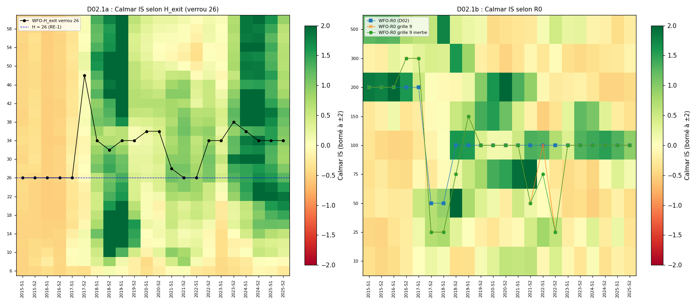
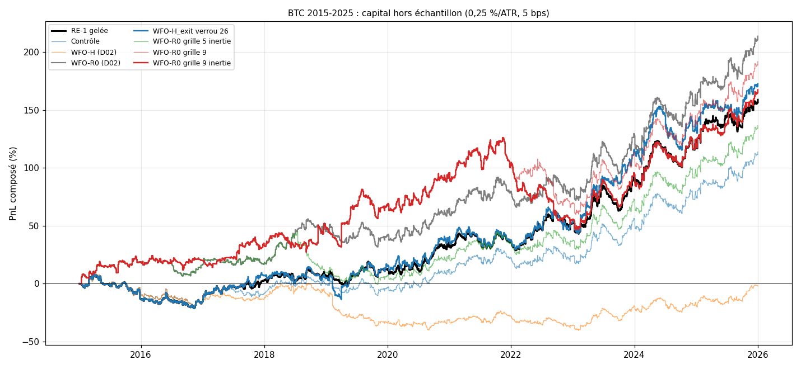

# EXP-D02.1 — Verrou fixe et WFO de H_exit ; WFO de R0 sur grille fine avec inertie ; stress (BTC 2015-2025)

*Demande, cadrage et arbitrages du porteur du 2026-10-03 (`RESEARCH_LOG.md`, entrée EXP-D02.1). Calcul :
`python experiments/D02_1/run_D02_1.py --calcul` (174 s, commit 466d767). BTC/USD Bitstamp, 22 semestres hors échantillon
(S1 2015 → S2 2025), IS de 24 mois, 5 bps (10 bps en stress), 0,25 % du capital par ATR14(t), levier ≤ 1x. Annexes
générées en fin de document.*

## Verdict

- **D02.1a, verrou fixe de 26 barres.** Il répare le WFO-H : +0,227 ATR [+0,090 ; +0,365] face au WFO-H de D02, règle
  « surpasse » de D02 remplie. Il n'ajoute rien à RE-1 gelée : +0,029 ATR [−0,075 ; +0,139], −0,2 bps [−4,9 ; +4,7], même
  MDD. Sur les mêmes 2 075 entrées, l'effet des sorties choisies est nul, avec ou sans la coupure de l'option C.
- **D02.1b, grille fine et inertie.** La candidate (grille 9, inertie) ne fait pas mieux que le WFO-R0 de D02 (−0,038 ATR
  [−0,209 ; +0,130]) et prend plus de risque (MDD −35,7 % contre −15,8 % à 0,25 %/ATR). La grille fine gagne en 2015-2019
  et perd en 2020-2025, surtout en 2022.
- **Le WFO-R0 de D02 tenait à un départage.** En 2018-S2, l'égalité {50 ; 100} a été tranchée vers R0 = 100, le point de
  RE-1. Avec l'inertie (R0 = 50 gardé), 2018 passe de +0,482 à −0,160 ATR et la série retombe au niveau de RE-1
  (−0,065 ATR [−0,155 ; −0,002] face au WFO-R0 de D02).
- **Stress.** À 10 bps, aucune série n'a d'IC > 0. Sans son 1 % de meilleurs trades (21 sur 2 075), RE-1 gelée passe de
  +0,218 à +0,035 ATR [−0,128 ; +0,199] et de +159 % à +9 % à 0,25 %/ATR. Toutes les séries tombent entre −0,17 et
  +0,10 ATR. Les deux stress combinés rendent toutes les séries négatives.
- **Décision proposée au porteur.** Aucune des deux modifications ne surpasse RE-1 gelée (règle de D02). RE-1 gelée reste
  la référence. Le verrou fixe de 26 barres devient la convention, sans effet sur RE-1 (H = 26).

## 1. Contrôle de non-régression (bloquant, passé)

- **Données :** empreinte BTC 2013-2025 conforme à l'audit D02.0, réserve 2026 tronquée, panne de 215 barres retirée,
  22 semestres.
- **Noyau :** les 1 080 trades de RE-1 sur BTC 2020-2025 sont identiques (contrôles de Gate 0 de D02 repassés).
- **D02 reproduit avec le verrou par défaut (verrou = H) :**
  - cartes IS des branches R0 et H identiques au bit près (22 semestres) ;
  - choix identiques à `parametres_D02.csv` ;
  - séries RE-1 gelée (2 075 trades), Contrôle (1 909), WFO-R0 (1 836) et WFO-H (1 847) identiques à
    `trades_D02.csv.gz`.
- **Verrou ≥ H :** à H = 6, 16 et 26 avec un verrou de 26, les séries sont identiques à `envelope.lock_trades` (D01.6).
- **Population constante :** avec un verrou de 26, les 2 075 entrées de RE-1 gelée sont identiques pour les 28 valeurs
  de H.

## 2. Résultats nets, BTC 2015-2025, 5 bps

| Variante | PnL : 0,25 %/ATR ; 1x ; bps (1x) | PF (1x) | WR | Espérance ATR [IC] ; bps | MDD : 0,25 %/ATR ; 1x | Trades (/mois) | Durée médiane | Part des frais (1x) ; brut ; frais (ATR) | Calmar 0,25 %/ATR |
|---|---|---|---|---|---|---|---|---|---|
| RE-1 gelée | +159 % ; +396 % ; +21 149 | 1,15 | 43,9 % | +0,218 [+0,032 ; +0,401] ; +10,2 | −28,4 % ; −53,0 % | 2 075 (15,7) | 26 b ; 13 h | 33 % ; +0,34 ; 0,12 | 0,32 |
| WFO-H_exit verrou 26 | +173 % ; +335 % ; +20 828 | 1,13 | 43,7 % | +0,246 [+0,028 ; +0,467] ; +10,0 | −28,4 % ; −53,0 % | 2 075 (15,7) | 26 b ; 13 h | 33 % ; +0,37 ; 0,12 | 0,34 |
| WFO-H (D02) | −2 % ; −20 % ; +2 260 | 1,02 | 42,4 % | +0,019 [−0,202 ; +0,244] ; +1,2 | −46,0 % ; −69,8 % | 1 847 (14,0) | 26 b ; 13 h | 80 % ; +0,14 ; 0,13 | −0,00 |
| WFO-R0 (D02) | +214 % ; +478 % ; +22 133 | 1,18 | 43,6 % | +0,291 [+0,088 ; +0,499] ; +12,1 | −15,8 % ; −40,6 % | 1 836 (13,9) | 26 b ; 13 h | 29 % ; +0,42 ; 0,13 | 0,69 |
| WFO-R0 grille 9 inertie | +168 % ; +441 % ; +21 790 | 1,18 | 43,3 % | +0,253 [+0,035 ; +0,465] ; +11,7 | −35,7 % ; −56,3 % | 1 859 (14,1) | 26 b ; 13 h | 30 % ; +0,38 ; 0,13 | 0,26 |
| WFO-R0 grille 9 | +192 % ; +443 % ; +21 840 | 1,18 | 43,3 % | +0,273 [+0,060 ; +0,480] ; +11,8 | −29,9 % ; −56,1 % | 1 855 (14,1) | 26 b ; 13 h | 30 % ; +0,40 ; 0,13 | 0,34 |
| WFO-R0 grille 5 inertie | +137 % ; +297 % ; +18 369 | 1,14 | 43,3 % | +0,226 [+0,018 ; +0,436] ; +9,8 | −31,8 % ; −49,4 % | 1 867 (14,1) | 26 b ; 13 h | 34 % ; +0,35 ; 0,13 | 0,26 |
| Contrôle | +114 % ; +221 % ; +16 162 | 1,12 | 43,0 % | +0,194 [+0,000 ; +0,399] ; +8,5 | −27,9 % ; −48,4 % | 1 909 (14,5) | 26 b ; 13 h | 37 % ; +0,32 ; 0,13 | 0,26 |

Médiane par trade de −0,43 à −0,61 ATR pour toutes les séries ; P90 de +4,8 à +5,5 ATR ; décile supérieur de +8,8 à
+10,0 ATR en moyenne (annexe A7).

## 3. D02.1a — WFO de H_exit à entrées constantes

- `[OBS]` **Le verrou fixe supprime l'effet de population.** Les 2 075 entrées sont celles de RE-1 gelée. Face au WFO-H de
  D02 : +0,227 ATR [+0,090 ; +0,365], +8,8 bps [+1,4 ; +16,2], rendement +9,7 points par an [+3,6 ; +16,3], Calmar
  meilleur sur 100 % des chemins réordonnés.
- `[OBS]` **Aucune valeur des sorties.** Effet trade par trade face à RE-1 gelée (mêmes entrées, IC par grappes de mois) :
  - 2015-2025 : +0,029 ATR [−0,075 ; +0,139], −0,2 bps [−4,9 ; +4,7] ; sans la coupure de l'option C : +0,035 ATR
    [−0,071 ; +0,147], −0,1 bps ;
  - 2015-2019 : +0,005 ; 2020-2025 : +0,050 [−0,085 ; +0,183].
  - L'écart positif en ATR et nul en bps vient des trades à ATR faible.
- `[OBS]` **H choisi :** 26 (repli, 5 semestres jusqu'au S1 2017), puis 48, 34, 32, 34, 34, 36, 36, 28, 26, 26, 34, 34,
  38, 36, 34, 34, 34. H moyen 31,9 ; 35 % des trades à H = 26.
- `[OBS]` **La règle du centre décide plus souvent qu'en D02.** 10 semestres sur 22 ont une zone de 23 à 28 cases (7 en
  D02), et le choix tombe alors à 32-38. Le meilleur Calmar IS était ailleurs, et changeant : H = 14-16 de 2018-S2 à
  2019-S2 (+1,59 à +2,95), 40-42 en 2020 et 2024, 22 en 2025.
- `[OBS]` **Option C :** 137 trades (6,6 %) sont clos par l'entrée suivante, 10,1 % de ceux à H > 26.
- `[OBS]` **Profil à H fixe sur les mêmes entrées** (lecture descriptive ex post sur tout 2015-2025, sans choix) :
  - espérance de −0,08 ATR à H = 6, +0,218 à 26 et +0,25 à 30 ;
  - creux à +0,22-0,24 entre 32 et 36, bosse à +0,32-0,34 entre 38 et 44 ;
  - +0,25 à +0,30 de 46 à 60.
  - Choisir H sur ce profil serait un choix en échantillon ; le WFO, lui, ne l'a pas trouvé.

## 4. D02.1b — WFO de R0, grille fine et inertie

- `[OBS]` **R0 choisi** (\* : égalité tranchée par l'inertie quand elle change le choix) :
  - WFO-R0 de D02 : 200 de 2015-S1 à 2017-S1, 50 en 2017-S2 et 2018-S1, 100 ensuite ;
  - grille 5 avec inertie : idem, sauf 2018-S2 = 50\* (12 égalités tranchées par l'inertie, une seule change le choix) ;
  - grille 9 : 200, 200, 200, 300, 300, 25, 25, 75, 150, puis 100, sauf 2021-S2 = 50 et 2022-S2 = 25 ;
  - grille 9 avec inertie : idem, sauf 2022-S1 = 75\*.
  - R0 = 100 tient 15, 14, 11 et 10 semestres respectivement.
- `[OBS]` **Par période** (5 bps ; espérance ATR [IC] ; PnL 0,25 %/ATR (1x) ; MDD 0,25 %/ATR (1x)) :

| Série | 2015-2019 | 2020-2025 |
|---|---|---|
| RE-1 gelée | +0,064 [−0,158 ; +0,308] ; +12 % (+74 %) ; −28,4 % (−53,0 %) | +0,357 [+0,086 ; +0,633] ; +132 % (+184 %) ; −13,5 % (−43,9 %) |
| WFO-H_exit verrou 26 | +0,070 [−0,230 ; +0,385] ; +15 % (+56 %) ; −28,4 % (−53,0 %) | +0,407 [+0,111 ; +0,707] ; +138 % (+179 %) ; −15,8 % (−45,0 %) |
| WFO-R0 (D02) | +0,205 [−0,084 ; +0,488] ; +41 % (+101 %) ; −15,8 % (−40,6 %) | +0,355 [+0,076 ; +0,639] ; +122 % (+188 %) ; −13,8 % (−33,4 %) |
| WFO-R0 grille 9 inertie | +0,304 [−0,016 ; +0,650] ; +67 % (+202 %) ; −15,3 % (−30,1 %) | +0,216 [−0,072 ; +0,504] ; +60 % (+79 %) ; −35,7 % (−56,3 %) |
| WFO-R0 grille 9 | +0,304 [−0,016 ; +0,650] ; +67 % (+202 %) ; −15,3 % (−30,1 %) | +0,249 [−0,035 ; +0,527] ; +74 % (+80 %) ; −29,9 % (−56,1 %) |
| WFO-R0 grille 5 inertie | +0,059 [−0,249 ; +0,362] ; +6 % (+38 %) ; −31,8 % (−49,4 %) | +0,355 [+0,076 ; +0,639] ; +122 % (+188 %) ; −13,8 % (−33,4 %) |

- `[OBS]` **2015-2019 :** la grille fine fait +0,240 ATR [−0,092 ; +0,569] face à RE-1 gelée et +0,099 [−0,175 ; +0,406]
  face au WFO-R0 de D02 (Calmar 0,71 contre 0,08 pour RE-1).
- `[OBS]` **2020-2025 :** elle quitte R0 = 100 en 2021-S2 (50) et en 2022 (75 puis 25). 2022 vaut −0,392 ATR
  (−17,2 %) avec la règle de D02, −0,562 (−24,1 %) avec l'inertie, contre +0,305 (+11,5 %) pour RE-1 gelée. Le MDD de la
  candidate (−35,7 %) date de 2022.
- `[OBS]` **Décomposition sur 2015-2025** (écart en ATR [IC]) :
  - inertie sur grille 5 : −0,065 [−0,155 ; −0,002], venu de 2018-S2 seul (2018 : −0,160 contre +0,482) ;
  - grille 9 face à grille 5 (règle de D02) : −0,019 [−0,186 ; +0,145], MDD −13,8 points ;
  - inertie sur grille 9 : −0,019 [−0,063 ; +0,016].

## 5. Stress et anatomie de la queue droite

Espérance ATR [IC] ; PnL 0,25 %/ATR (1x) ; MDD 0,25 %/ATR (1x), 2015-2025 ; tableaux complets en annexe A4.

| Série | 5 bps | 10 bps | 5 bps sans top 1 % | 10 bps sans top 1 % |
|---|---|---|---|---|
| RE-1 gelée | +0,218 [+0,032 ; +0,401] ; +159 % (+396 %) ; −28,4 % (−53,0 %) | +0,093 [−0,094 ; +0,277] ; +43 % (+76 %) ; −36,3 % (−60,8 %) | +0,035 [−0,128 ; +0,199] ; +9 % (+58 %) ; −35,0 % (−58,6 %) | −0,089 [−0,250 ; +0,075] ; −40 % (−44 %) ; −52,2 % (−66,0 %) |
| WFO-H_exit verrou 26 | +0,246 [+0,028 ; +0,467] ; +173 % (+335 %) ; −28,4 % (−53,0 %) | +0,122 [−0,095 ; +0,344] ; +51 % (+54 %) ; −37,1 % (−60,8 %) | +0,017 [−0,158 ; +0,193] ; +0 % (+21 %) ; −42,3 % (−60,2 %) | −0,106 [−0,282 ; +0,070] ; −44 % (−57 %) ; −54,6 % (−71,6 %) |
| WFO-H (D02) | +0,019 [−0,202 ; +0,244] ; −2 % (−20 %) ; −46,0 % (−69,8 %) | −0,106 [−0,328 ; +0,120] ; −42 % (−68 %) ; −62,0 % (−82,1 %) | −0,166 [−0,367 ; +0,029] ; −53 % (−70 %) ; −63,9 % (−82,5 %) | −0,291 [−0,494 ; −0,095] ; −72 % (−88 %) ; −76,0 % (−91,1 %) |
| WFO-R0 (D02) | +0,291 [+0,088 ; +0,499] ; +214 % (+478 %) ; −15,8 % (−40,6 %) | +0,165 [−0,043 ; +0,373] ; +85 % (+131 %) ; −20,6 % (−46,6 %) | +0,096 [−0,093 ; +0,285] ; +40 % (+95 %) ; −22,2 % (−48,0 %) | −0,030 [−0,218 ; +0,160] ; −17 % (−21 %) ; −33,2 % (−58,0 %) |
| WFO-R0 grille 9 inertie | +0,253 [+0,035 ; +0,465] ; +168 % (+441 %) ; −35,7 % (−56,3 %) | +0,127 [−0,091 ; +0,341] ; +57 % (+114 %) ; −39,5 % (−61,4 %) | +0,021 [−0,162 ; +0,202] ; −0 % (+15 %) ; −37,4 % (−59,4 %) | −0,105 [−0,290 ; +0,077] ; −41 % (−54 %) ; −52,5 % (−70,8 %) |
| WFO-R0 grille 9 | +0,273 [+0,060 ; +0,480] ; +192 % (+443 %) ; −29,9 % (−56,1 %) | +0,146 [−0,071 ; +0,355] ; +72 % (+115 %) ; −33,9 % (−61,1 %) | +0,040 [−0,146 ; +0,218] ; +9 % (+15 %) ; −31,7 % (−59,3 %) | −0,086 [−0,273 ; +0,094] ; −35 % (−54 %) ; −48,2 % (−70,6 %) |
| WFO-R0 grille 5 inertie | +0,226 [+0,018 ; +0,436] ; +137 % (+297 %) ; −31,8 % (−49,4 %) | +0,099 [−0,109 ; +0,308] ; +38 % (+56 %) ; −36,5 % (−53,9 %) | +0,037 [−0,156 ; +0,227] ; +9 % (+39 %) ; −35,6 % (−51,7 %) | −0,089 [−0,284 ; +0,099] ; −37 % (−49 %) ; −49,3 % (−68,0 %) |
| Contrôle | +0,194 [+0,000 ; +0,399] ; +114 % (+221 %) ; −27,9 % (−48,4 %) | +0,066 [−0,128 ; +0,269] ; +23 % (+24 %) ; −35,1 % (−56,6 %) | +0,008 [−0,165 ; +0,184] ; −4 % (+17 %) ; −41,4 % (−56,2 %) | −0,118 [−0,293 ; +0,057] ; −44 % (−54 %) ; −55,6 % (−69,6 %) |

- `[OBS]` **Comparaisons sous stress** (annexe A4) : aucune série ne surpasse RE-1 gelée. Les écarts restent dans un IC
  qui contient 0, sauf celui du WFO-H de D02, négatif sous chaque stress (−0,20 ATR). WFO-H_exit face au WFO-H de D02
  reste tangible sous chaque stress (+0,18 à +0,23 ATR).
- `[OBS]` **Anatomie de la queue de RE-1 gelée** (5 bps) :
  - les 21 meilleurs trades (1 %) font 84 % de la somme nette en ATR (379,5 sur 451,4) et 91 % de la croissance
    log du capital à 0,25 %/ATR ;
  - les 104 meilleurs (5 %) font 266 % du total, les 208 meilleurs (10 %) 409 % : les 90 % restants perdent environ
    trois fois le résultat final ;
  - ces 21 trades sont des mouvements de +196 à +961 bps bruts, ouverts quand l'ATR était bas (32 bps en moyenne,
    contre 57 pour l'ensemble) ; 6 sont plafonnés à 1x et aucun n'est stoppé ;
  - ils sont répartis sur 10 des 11 années : 2 en 2015, 2016, 2017, 2018 et 2025 ; 3 en 2019 ; 5 en 2022 ; 1 en 2021,
    2023 et 2024 ; aucun en 2020.

## 6. Lecture

- `[HYP]` **Les sorties ne portent pas l'avantage.** À entrées constantes, aucun horizon choisi en IS ne bat H = 26 hors
  échantillon. Le recalibrage de H n'a d'effet que par le calendrier des entrées, effet que le verrou fixe neutralise.
  La règle du centre ramène ensuite le choix vers le milieu de la grille (I-M18).
- `[HYP]` **R0 se choisit mal sur 24 mois.** Plus la grille est fine, plus le WFO change de R0, et chaque changement est un
  pari sur un semestre. 2022 montre le coût d'un pari perdu. L'avance du WFO-R0 de D02 tenait à un seul départage vers
  le point de RE-1, construite sur 2020-2025. Ce n'est pas un avantage adaptatif démontré.
- `[HYP]` **RE-1 récolte des expansions de volatilité nées d'états calmes.** Environ deux par an, elles font l'essentiel du
  résultat ; le trade médian perd 0,4 ATR. La robustesse se joue sur la fréquence et la taille de ces expansions, pas
  sur le trade moyen. Les 10 bps et le retrait du 1 % meilleur s'additionnent jusqu'à effacer l'avantage.

## 7. Pistes (à cadrer par le porteur, rien de lancé)

1. **Prop firm :** la série saigne entre deux grands gagnants (MDD −28 % à 0,25 %/ATR sur 2015-2025). Les règles de
   perte journalière et totale de la firme visée fixent la taille par trade : à mesurer avec ces règles, sur RE-1 gelée.
2. **Queue droite :** étudier ce qui précède les 21 grands gagnants (ATR bas, compression, sous-famille, heure),
   description seule, sans apprentissage, pour savoir si la queue se laisse cibler ou seulement attendre.
3. **H_exit fixe plus long :** le profil descriptif bombe entre 38 et 44 barres. Un test propre exigerait de choisir H
   sur une période et de le lire sur une autre (par exemple, choix sur 2015-2019, lecture sur 2020-2025), pas sur ce
   profil.
4. **WFO de R0 :** à mettre de côté sur BTC, ou à réserver au hold-out ; aucune règle testée n'a battu RE-1 gelée.

---

# Annexes générées (`run_D02_1.py --calcul`, puis `--rapport`)

Calcul du 2026-10-02 23:26 UTC, commit `466d767`, 174 s ; 96 comparaisons appariées publiées.

## A1. Contrôle de non-régression (bloquant, passé)

- G1 données : empreinte `fa38b1796e9ee0db…` conforme à l'audit D02.0 ; dernière barre 2025-12-31 23:30:00+00:00 ; panne de 215 barres retirée ; 22 semestres dès le 2015-01-01.
- G2 noyau : 1 080 trades de RE-1 sur BTC 2020-2025 identiques (contrôles G0-1, G0-5, G0-6 de D02 repassés).
- G3 D02 reproduit avec le verrou par défaut : cartes : 22 semestres × (5 R0 + 28 H) cases identiques au bit près ; choix de R0 : identiques ; choix de H : identiques ; série RE-1 gelée : 2 075 trades identiques ; série Contrôle : 1 909 trades identiques ; série WFO-R0 : 1 836 trades identiques ; série WFO-H : 1 847 trades identiques.
- G4 verrou ≥ H = `lock_trades` : H = 6 : 2 075 trades identiques à lock_trades ; H = 16 : 2 075 trades identiques à lock_trades ; H = 26 : 2 075 trades identiques à lock_trades.
- G5 population constante : 2 075 entrées identiques pour les 28 valeurs de H.

## A2. D02.1a — WFO de H_exit, verrou de 26 barres, entrées de RE-1 gelée

**Résultats nets, 2015-2025 · 5 bps**

| Variante | PnL : 0,25 %/ATR ; 1x ; bps (1x) | PF (1x) | WR | Espérance ATR [IC] ; bps | MDD : 0,25 %/ATR ; 1x | Trades (/mois) | Durée médiane | Part des frais (1x) ; brut ; frais (ATR) | Calmar 0,25 %/ATR |
|---|---|---|---|---|---|---|---|---|---|
| RE-1 gelée | +159 % ; +396 % ; +21 149 | 1,15 | 43,9 % | +0,218 [+0,032 ; +0,401] ; +10,2 | −28,4 % ; −53,0 % | 2 075 (15,7) | 26 b ; 13 h | 33 % ; +0,34 ; 0,12 | 0,32 |
| WFO-H (D02) | −2 % ; −20 % ; +2 260 | 1,02 | 42,4 % | +0,019 [−0,202 ; +0,244] ; +1,2 | −46,0 % ; −69,8 % | 1 847 (14,0) | 26 b ; 13 h | 80 % ; +0,14 ; 0,13 | −0,00 |
| WFO-H_exit verrou 26 | +173 % ; +335 % ; +20 828 | 1,13 | 43,7 % | +0,246 [+0,028 ; +0,467] ; +10,0 | −28,4 % ; −53,0 % | 2 075 (15,7) | 26 b ; 13 h | 33 % ; +0,37 ; 0,12 | 0,34 |

**Stress à 10 bps**

| Variante | PnL : 0,25 %/ATR ; 1x ; bps (1x) | PF (1x) | WR | Espérance ATR [IC] ; bps | MDD : 0,25 %/ATR ; 1x | Trades (/mois) | Durée médiane | Part des frais (1x) ; brut ; frais (ATR) | Calmar 0,25 %/ATR |
|---|---|---|---|---|---|---|---|---|---|
| RE-1 gelée | +43 % ; +76 % ; +10 774 | 1,07 | 42,6 % | +0,093 [−0,094 ; +0,277] ; +5,2 | −36,3 % ; −60,8 % | 2 075 (15,7) | 26 b ; 13 h | 66 % ; +0,34 ; 0,25 | 0,09 |
| WFO-H (D02) | −42 % ; −68 % ; −6 975 | 0,95 | 41,0 % | −0,106 [−0,328 ; +0,120] ; −3,8 | −62,0 % ; −82,1 % | 1 847 (14,0) | 26 b ; 13 h | 161 % ; +0,14 ; 0,25 | −0,08 |
| WFO-H_exit verrou 26 | +51 % ; +54 % ; +10 453 | 1,06 | 42,7 % | +0,122 [−0,095 ; +0,344] ; +5,0 | −37,1 % ; −60,8 % | 2 075 (15,7) | 26 b ; 13 h | 67 % ; +0,37 ; 0,25 | 0,10 |

**Effet trade par trade à entrées égales (I-M16) : WFO-H_exit − RE-1 gelée**

| Période | Trades | Avec la coupure (option C) : ATR [IC] ; bps [IC] | Sans la coupure (entrées figées) : ATR [IC] ; bps [IC] |
|---|---|---|---|
| 2015-2025 | 2 075 | +0,029 [−0,075 ; +0,139] ; −0,2 [−4,9 ; +4,7] | +0,035 [−0,071 ; +0,147] ; −0,1 [−5,4 ; +4,9] |
| 2015-2019 | 988 | +0,005 [−0,169 ; +0,182] ; −0,6 [−9,7 ; +8,1] | +0,018 [−0,159 ; +0,190] ; −0,6 [−10,8 ; +8,9] |
| 2020-2025 | 1 087 | +0,050 [−0,085 ; +0,183] ; +0,2 [−4,4 ; +4,6] | +0,051 [−0,079 ; +0,189] ; +0,3 [−4,2 ; +4,6] |

Trades clos par l'entrée suivante : 137 (6,6 % ; 10,1 % des trades à H > 26). H moyen 31,9 ; H = 26 pour 35 % des trades ; replis sur H = 26 : 5 semestres ; zone couvrant tout l'axe (28 cases) : 1 semestre, 23 cases ou plus : 10.

**Profil à H fixe sur les mêmes entrées (lecture descriptive, 2015-2025, 5 bps ; aucun choix)**

| H | Espérance ATR | Part close par l'entrée suivante | Part stoppée |
|---|---|---|---|
| 6 | −0,082 | 0,0 % | 8 % |
| 8 | −0,018 | 0,0 % | 11 % |
| 10 | +0,063 | 0,0 % | 13 % |
| 12 | +0,072 | 0,0 % | 15 % |
| 14 | +0,106 | 0,0 % | 17 % |
| 16 | +0,134 | 0,0 % | 18 % |
| 18 | +0,145 | 0,0 % | 20 % |
| 20 | +0,148 | 0,0 % | 21 % |
| 22 | +0,184 | 0,0 % | 21 % |
| 24 | +0,202 | 0,0 % | 22 % |
| 26 | +0,218 | 0,0 % | 23 % |
| 28 | +0,236 | 2,6 % | 24 % |
| 30 | +0,250 | 4,7 % | 25 % |
| 32 | +0,234 | 7,4 % | 25 % |
| 34 | +0,224 | 9,5 % | 26 % |
| 36 | +0,236 | 12,1 % | 26 % |
| 38 | +0,318 | 13,3 % | 26 % |
| 40 | +0,342 | 15,1 % | 26 % |
| 42 | +0,330 | 17,2 % | 27 % |
| 44 | +0,327 | 19,3 % | 27 % |
| 46 | +0,295 | 21,3 % | 27 % |
| 48 | +0,288 | 22,7 % | 27 % |
| 50 | +0,283 | 24,5 % | 27 % |
| 52 | +0,250 | 26,0 % | 28 % |
| 54 | +0,267 | 27,5 % | 28 % |
| 56 | +0,254 | 28,8 % | 28 % |
| 58 | +0,275 | 29,8 % | 28 % |
| 60 | +0,281 | 31,2 % | 28 % |

**Comparaisons appariées par mois (5 bps)**

| A contre B | Δ espérance ATR [IC] | Δ espérance bps [IC] | Δ rendement annuel [IC] | Δ MDD sorties (plage) ; part A mieux | Δ Calmar sorties (plage) ; part A mieux | Verdict |
|---|---|---|---|---|---|---|
| WFO-H (D02) / RE-1 gelée | −0,198 [−0,323 ; −0,074] | −9,0 [−15,8 ; −2,3] | −9,2 % [−14,6 % ; −4,0 %] | −17,8 % [−38,4 % ; +0,4 %] ; 3 % | −0,34 [−0,85 ; −0,11] ; 0 % | non |
| WFO-H_exit verrou 26 / RE-1 gelée | +0,029 [−0,075 ; +0,139] | −0,2 [−4,9 ; +4,7] | +0,5 % [−4,2 % ; +5,6 %] | +0,0 % [−17,2 % ; +5,7 %] ; 24 % | +0,02 [−0,35 ; +0,29] ; 42 % | non |

| A contre B | Δ espérance ATR [IC] | Δ espérance bps [IC] | Δ rendement annuel [IC] | Δ MDD sorties (plage) ; part A mieux | Δ Calmar sorties (plage) ; part A mieux | Verdict |
|---|---|---|---|---|---|---|
| WFO-H_exit verrou 26 / WFO-H (D02) | +0,227 [+0,090 ; +0,365] | +8,8 [+1,4 ; +16,2] | +9,7 % [+3,6 % ; +16,3 %] | +17,8 % [−2,8 % ; +32,8 %] ; 94 % | +0,35 [+0,08 ; +0,83] ; 100 % | surpasse |

## A3. D02.1b — WFO de R0, grille fine et inertie

**Résultats nets, 2015-2025 · 5 bps**

| Variante | PnL : 0,25 %/ATR ; 1x ; bps (1x) | PF (1x) | WR | Espérance ATR [IC] ; bps | MDD : 0,25 %/ATR ; 1x | Trades (/mois) | Durée médiane | Part des frais (1x) ; brut ; frais (ATR) | Calmar 0,25 %/ATR |
|---|---|---|---|---|---|---|---|---|---|
| RE-1 gelée | +159 % ; +396 % ; +21 149 | 1,15 | 43,9 % | +0,218 [+0,032 ; +0,401] ; +10,2 | −28,4 % ; −53,0 % | 2 075 (15,7) | 26 b ; 13 h | 33 % ; +0,34 ; 0,12 | 0,32 |
| Contrôle | +114 % ; +221 % ; +16 162 | 1,12 | 43,0 % | +0,194 [+0,000 ; +0,399] ; +8,5 | −27,9 % ; −48,4 % | 1 909 (14,5) | 26 b ; 13 h | 37 % ; +0,32 ; 0,13 | 0,26 |
| WFO-R0 (D02) | +214 % ; +478 % ; +22 133 | 1,18 | 43,6 % | +0,291 [+0,088 ; +0,499] ; +12,1 | −15,8 % ; −40,6 % | 1 836 (13,9) | 26 b ; 13 h | 29 % ; +0,42 ; 0,13 | 0,69 |
| WFO-R0 grille 5 inertie | +137 % ; +297 % ; +18 369 | 1,14 | 43,3 % | +0,226 [+0,018 ; +0,436] ; +9,8 | −31,8 % ; −49,4 % | 1 867 (14,1) | 26 b ; 13 h | 34 % ; +0,35 ; 0,13 | 0,26 |
| WFO-R0 grille 9 | +192 % ; +443 % ; +21 840 | 1,18 | 43,3 % | +0,273 [+0,060 ; +0,480] ; +11,8 | −29,9 % ; −56,1 % | 1 855 (14,1) | 26 b ; 13 h | 30 % ; +0,40 ; 0,13 | 0,34 |
| WFO-R0 grille 9 inertie | +168 % ; +441 % ; +21 790 | 1,18 | 43,3 % | +0,253 [+0,035 ; +0,465] ; +11,7 | −35,7 % ; −56,3 % | 1 859 (14,1) | 26 b ; 13 h | 30 % ; +0,38 ; 0,13 | 0,26 |

**Stress à 10 bps**

| Variante | PnL : 0,25 %/ATR ; 1x ; bps (1x) | PF (1x) | WR | Espérance ATR [IC] ; bps | MDD : 0,25 %/ATR ; 1x | Trades (/mois) | Durée médiane | Part des frais (1x) ; brut ; frais (ATR) | Calmar 0,25 %/ATR |
|---|---|---|---|---|---|---|---|---|---|
| RE-1 gelée | +43 % ; +76 % ; +10 774 | 1,07 | 42,6 % | +0,093 [−0,094 ; +0,277] ; +5,2 | −36,3 % ; −60,8 % | 2 075 (15,7) | 26 b ; 13 h | 66 % ; +0,34 ; 0,25 | 0,09 |
| Contrôle | +23 % ; +24 % ; +6 617 | 1,05 | 41,7 % | +0,066 [−0,128 ; +0,269] ; +3,5 | −35,1 % ; −56,6 % | 1 909 (14,5) | 26 b ; 13 h | 74 % ; +0,32 ; 0,25 | 0,05 |
| WFO-R0 (D02) | +85 % ; +131 % ; +12 953 | 1,10 | 42,1 % | +0,165 [−0,043 ; +0,373] ; +7,1 | −20,6 % ; −46,6 % | 1 836 (13,9) | 26 b ; 13 h | 59 % ; +0,42 ; 0,25 | 0,28 |
| WFO-R0 grille 5 inertie | +38 % ; +56 % ; +9 034 | 1,07 | 41,6 % | +0,099 [−0,109 ; +0,308] ; +4,8 | −36,5 % ; −53,9 % | 1 867 (14,1) | 26 b ; 13 h | 67 % ; +0,35 ; 0,25 | 0,08 |
| WFO-R0 grille 9 | +72 % ; +115 % ; +12 565 | 1,10 | 41,2 % | +0,146 [−0,071 ; +0,355] ; +6,8 | −33,9 % ; −61,1 % | 1 855 (14,1) | 26 b ; 13 h | 60 % ; +0,40 ; 0,25 | 0,15 |
| WFO-R0 grille 9 inertie | +57 % ; +114 % ; +12 495 | 1,10 | 41,2 % | +0,127 [−0,091 ; +0,341] ; +6,7 | −39,5 % ; −61,4 % | 1 859 (14,1) | 26 b ; 13 h | 60 % ; +0,38 ; 0,25 | 0,11 |

**Comparaisons appariées par mois contre RE-1 gelée (5 bps)**

| A contre B | Δ espérance ATR [IC] | Δ espérance bps [IC] | Δ rendement annuel [IC] | Δ MDD sorties (plage) ; part A mieux | Δ Calmar sorties (plage) ; part A mieux | Verdict |
|---|---|---|---|---|---|---|
| Contrôle / RE-1 gelée | −0,024 [−0,093 ; +0,049] | −1,7 [−6,3 ; +3,0] | −1,9 % [−5,1 % ; +1,5 %] | +0,5 % [−11,8 % ; +6,8 %] ; 35 % | −0,06 [−0,38 ; +0,13] ; 19 % | non |
| WFO-R0 (D02) / RE-1 gelée | +0,074 [−0,067 ; +0,225] | +1,9 [−7,7 ; +12,4] | +1,9 % [−4,7 % ; +9,0 %] | +11,8 % [−10,0 % ; +17,7 %] ; 66 % | +0,38 [−0,33 ; +0,72] ; 72 % | non |
| WFO-R0 grille 5 inertie / RE-1 gelée | +0,008 [−0,163 ; +0,178] | −0,4 [−10,5 ; +10,1] | −0,9 % [−8,5 % ; +7,0 %] | −4,4 % [−18,9 % ; +15,4 %] ; 43 % | −0,07 [−0,59 ; +0,46] ; 41 % | non |
| WFO-R0 grille 9 / RE-1 gelée | +0,055 [−0,127 ; +0,250] | +1,6 [−8,5 ; +12,8] | +1,2 % [−7,5 % ; +10,5 %] | −2,0 % [−17,2 % ; +17,3 %] ; 53 % | +0,02 [−0,52 ; +0,69] ; 58 % | non |
| WFO-R0 grille 9 inertie / RE-1 gelée | +0,036 [−0,151 ; +0,236] | +1,5 [−8,7 ; +12,9] | +0,3 % [−8,5 % ; +9,7 %] | −7,9 % [−18,9 % ; +16,7 %] ; 45 % | −0,06 [−0,57 ; +0,62] ; 50 % | non |

**Candidate contre WFO-R0 de D02, et décomposition 2 × 2 (5 bps)**

| A contre B | Δ espérance ATR [IC] | Δ espérance bps [IC] | Δ rendement annuel [IC] | Δ MDD sorties (plage) ; part A mieux | Δ Calmar sorties (plage) ; part A mieux | Verdict |
|---|---|---|---|---|---|---|
| WFO-R0 grille 9 inertie / WFO-R0 (D02) | −0,038 [−0,209 ; +0,130] | −0,3 [−10,1 ; +8,7] | −1,6 % [−9,4 % ; +6,0 %] | −19,7 % [−19,4 % ; +9,6 %] ; 29 % | −0,44 [−0,76 ; +0,40] ; 30 % | non |

| A contre B | Δ espérance ATR [IC] | Δ espérance bps [IC] | Δ rendement annuel [IC] | Δ MDD sorties (plage) ; part A mieux | Δ Calmar sorties (plage) ; part A mieux | Verdict |
|---|---|---|---|---|---|---|
| WFO-R0 grille 5 inertie / WFO-R0 (D02) | −0,065 [−0,155 ; −0,002] | −2,2 [−5,4 ; +0,2] | −2,8 % [−6,8 % ; +0,0 %] | −16,2 % [−17,8 % ; +0,4 %] ; 16 % | −0,45 [−0,66 ; +0,00] ; 3 % | non |
| WFO-R0 grille 9 / WFO-R0 (D02) | −0,019 [−0,186 ; +0,145] | −0,3 [−9,7 ; +8,4] | −0,7 % [−8,4 % ; +6,6 %] | −13,8 % [−17,5 % ; +10,7 %] ; 36 % | −0,36 [−0,71 ; +0,44] ; 38 % | non |
| WFO-R0 grille 9 inertie / WFO-R0 grille 9 | −0,019 [−0,063 ; +0,016] | −0,1 [−2,2 ; +1,9] | −0,9 % [−2,8 % ; +0,8 %] | −5,9 % [−7,2 % ; +2,5 %] ; 19 % | −0,08 [−0,24 ; +0,06] ; 14 % | non |

**R0 choisi à chaque semestre**

| Variante | 2015-01 | 2015-07 | 2016-01 | 2016-07 | 2017-01 | 2017-07 | 2018-01 | 2018-07 | 2019-01 | 2019-07 | 2020-01 | 2020-07 | 2021-01 | 2021-07 | 2022-01 | 2022-07 | 2023-01 | 2023-07 | 2024-01 | 2024-07 | 2025-01 | 2025-07 |
|---|---|---|---|---|---|---|---|---|---|---|---|---|---|---|---|---|---|---|---|---|---|---|
| WFO-R0 (D02) | 200 | 200 | 200 | 200 | 200 | 50 | 50 | 100 | 100 | 100 | 100 | 100 | 100 | 100 | 100 | 100 | 100 | 100 | 100 | 100 | 100 | 100 |
| WFO-R0 grille 5 inertie | 200* | 200* | 200* | 200* | 200* | 50* | 50 | 50* | 100* | 100 | 100* | 100* | 100* | 100* | 100 | 100 | 100 | 100 | 100 | 100 | 100 | 100 |
| WFO-R0 grille 9 | 200 | 200 | 200 | 300 | 300 | 25 | 25 | 75 | 150 | 100 | 100 | 100 | 100 | 50 | 100 | 25 | 100 | 100 | 100 | 100 | 100 | 100 |
| WFO-R0 grille 9 inertie | 200 | 200 | 200* | 300 | 300 | 25 | 25 | 75 | 150 | 100 | 100 | 100* | 100 | 50 | 75* | 25* | 100* | 100* | 100* | 100* | 100* | 100* |

\* égalité au centre tranchée par l'inertie ; ° aucune zone, R0 précédent gardé.

| Variante | Replis | Égalités tranchées par l'inertie | Zones paires | Semestres à R0 = 100 |
|---|---|---|---|---|
| WFO-R0 (D02) | 0 | 0 | 12 | 15 |
| WFO-R0 grille 5 inertie | 0 | 12 | 12 | 14 |
| WFO-R0 grille 9 | 0 | 0 | 10 | 11 |
| WFO-R0 grille 9 inertie | 0 | 10 | 10 | 10 |

## A4. Stress du porteur (toutes les séries, 2015-2025)

**5 bps**

| Variante | PnL : 0,25 %/ATR ; 1x ; bps (1x) | PF (1x) | WR | Espérance ATR [IC] ; bps | MDD : 0,25 %/ATR ; 1x | Trades (/mois) | Durée médiane | Part des frais (1x) ; brut ; frais (ATR) | Calmar 0,25 %/ATR |
|---|---|---|---|---|---|---|---|---|---|
| RE-1 gelée | +159 % ; +396 % ; +21 149 | 1,15 | 43,9 % | +0,218 [+0,032 ; +0,401] ; +10,2 | −28,4 % ; −53,0 % | 2 075 (15,7) | 26 b ; 13 h | 33 % ; +0,34 ; 0,12 | 0,32 |
| Contrôle | +114 % ; +221 % ; +16 162 | 1,12 | 43,0 % | +0,194 [+0,000 ; +0,399] ; +8,5 | −27,9 % ; −48,4 % | 1 909 (14,5) | 26 b ; 13 h | 37 % ; +0,32 ; 0,13 | 0,26 |
| WFO-H (D02) | −2 % ; −20 % ; +2 260 | 1,02 | 42,4 % | +0,019 [−0,202 ; +0,244] ; +1,2 | −46,0 % ; −69,8 % | 1 847 (14,0) | 26 b ; 13 h | 80 % ; +0,14 ; 0,13 | −0,00 |
| WFO-R0 (D02) | +214 % ; +478 % ; +22 133 | 1,18 | 43,6 % | +0,291 [+0,088 ; +0,499] ; +12,1 | −15,8 % ; −40,6 % | 1 836 (13,9) | 26 b ; 13 h | 29 % ; +0,42 ; 0,13 | 0,69 |
| WFO-H_exit verrou 26 | +173 % ; +335 % ; +20 828 | 1,13 | 43,7 % | +0,246 [+0,028 ; +0,467] ; +10,0 | −28,4 % ; −53,0 % | 2 075 (15,7) | 26 b ; 13 h | 33 % ; +0,37 ; 0,12 | 0,34 |
| WFO-R0 grille 5 inertie | +137 % ; +297 % ; +18 369 | 1,14 | 43,3 % | +0,226 [+0,018 ; +0,436] ; +9,8 | −31,8 % ; −49,4 % | 1 867 (14,1) | 26 b ; 13 h | 34 % ; +0,35 ; 0,13 | 0,26 |
| WFO-R0 grille 9 | +192 % ; +443 % ; +21 840 | 1,18 | 43,3 % | +0,273 [+0,060 ; +0,480] ; +11,8 | −29,9 % ; −56,1 % | 1 855 (14,1) | 26 b ; 13 h | 30 % ; +0,40 ; 0,13 | 0,34 |
| WFO-R0 grille 9 inertie | +168 % ; +441 % ; +21 790 | 1,18 | 43,3 % | +0,253 [+0,035 ; +0,465] ; +11,7 | −35,7 % ; −56,3 % | 1 859 (14,1) | 26 b ; 13 h | 30 % ; +0,38 ; 0,13 | 0,26 |

| A contre B | Δ espérance ATR [IC] | Δ espérance bps [IC] | Δ rendement annuel [IC] | Δ MDD sorties (plage) ; part A mieux | Δ Calmar sorties (plage) ; part A mieux | Verdict |
|---|---|---|---|---|---|---|
| Contrôle / RE-1 gelée | −0,024 [−0,093 ; +0,049] | −1,7 [−6,3 ; +3,0] | −1,9 % [−5,1 % ; +1,5 %] | +0,5 % [−11,8 % ; +6,8 %] ; 35 % | −0,06 [−0,38 ; +0,13] ; 19 % | non |
| WFO-H (D02) / RE-1 gelée | −0,198 [−0,323 ; −0,074] | −9,0 [−15,8 ; −2,3] | −9,2 % [−14,6 % ; −4,0 %] | −17,8 % [−38,4 % ; +0,4 %] ; 3 % | −0,34 [−0,85 ; −0,11] ; 0 % | non |
| WFO-R0 (D02) / RE-1 gelée | +0,074 [−0,067 ; +0,225] | +1,9 [−7,7 ; +12,4] | +1,9 % [−4,7 % ; +9,0 %] | +11,8 % [−10,0 % ; +17,7 %] ; 66 % | +0,38 [−0,33 ; +0,72] ; 72 % | non |
| WFO-H_exit verrou 26 / RE-1 gelée | +0,029 [−0,075 ; +0,139] | −0,2 [−4,9 ; +4,7] | +0,5 % [−4,2 % ; +5,6 %] | +0,0 % [−17,2 % ; +5,7 %] ; 24 % | +0,02 [−0,35 ; +0,29] ; 42 % | non |
| WFO-R0 grille 5 inertie / RE-1 gelée | +0,008 [−0,163 ; +0,178] | −0,4 [−10,5 ; +10,1] | −0,9 % [−8,5 % ; +7,0 %] | −4,4 % [−18,9 % ; +15,4 %] ; 43 % | −0,07 [−0,59 ; +0,46] ; 41 % | non |
| WFO-R0 grille 9 / RE-1 gelée | +0,055 [−0,127 ; +0,250] | +1,6 [−8,5 ; +12,8] | +1,2 % [−7,5 % ; +10,5 %] | −2,0 % [−17,2 % ; +17,3 %] ; 53 % | +0,02 [−0,52 ; +0,69] ; 58 % | non |
| WFO-R0 grille 9 inertie / RE-1 gelée | +0,036 [−0,151 ; +0,236] | +1,5 [−8,7 ; +12,9] | +0,3 % [−8,5 % ; +9,7 %] | −7,9 % [−18,9 % ; +16,7 %] ; 45 % | −0,06 [−0,57 ; +0,62] ; 50 % | non |

**10 bps**

| Variante | PnL : 0,25 %/ATR ; 1x ; bps (1x) | PF (1x) | WR | Espérance ATR [IC] ; bps | MDD : 0,25 %/ATR ; 1x | Trades (/mois) | Durée médiane | Part des frais (1x) ; brut ; frais (ATR) | Calmar 0,25 %/ATR |
|---|---|---|---|---|---|---|---|---|---|
| RE-1 gelée | +43 % ; +76 % ; +10 774 | 1,07 | 42,6 % | +0,093 [−0,094 ; +0,277] ; +5,2 | −36,3 % ; −60,8 % | 2 075 (15,7) | 26 b ; 13 h | 66 % ; +0,34 ; 0,25 | 0,09 |
| Contrôle | +23 % ; +24 % ; +6 617 | 1,05 | 41,7 % | +0,066 [−0,128 ; +0,269] ; +3,5 | −35,1 % ; −56,6 % | 1 909 (14,5) | 26 b ; 13 h | 74 % ; +0,32 ; 0,25 | 0,05 |
| WFO-H (D02) | −42 % ; −68 % ; −6 975 | 0,95 | 41,0 % | −0,106 [−0,328 ; +0,120] ; −3,8 | −62,0 % ; −82,1 % | 1 847 (14,0) | 26 b ; 13 h | 161 % ; +0,14 ; 0,25 | −0,08 |
| WFO-R0 (D02) | +85 % ; +131 % ; +12 953 | 1,10 | 42,1 % | +0,165 [−0,043 ; +0,373] ; +7,1 | −20,6 % ; −46,6 % | 1 836 (13,9) | 26 b ; 13 h | 59 % ; +0,42 ; 0,25 | 0,28 |
| WFO-H_exit verrou 26 | +51 % ; +54 % ; +10 453 | 1,06 | 42,7 % | +0,122 [−0,095 ; +0,344] ; +5,0 | −37,1 % ; −60,8 % | 2 075 (15,7) | 26 b ; 13 h | 67 % ; +0,37 ; 0,25 | 0,10 |
| WFO-R0 grille 5 inertie | +38 % ; +56 % ; +9 034 | 1,07 | 41,6 % | +0,099 [−0,109 ; +0,308] ; +4,8 | −36,5 % ; −53,9 % | 1 867 (14,1) | 26 b ; 13 h | 67 % ; +0,35 ; 0,25 | 0,08 |
| WFO-R0 grille 9 | +72 % ; +115 % ; +12 565 | 1,10 | 41,2 % | +0,146 [−0,071 ; +0,355] ; +6,8 | −33,9 % ; −61,1 % | 1 855 (14,1) | 26 b ; 13 h | 60 % ; +0,40 ; 0,25 | 0,15 |
| WFO-R0 grille 9 inertie | +57 % ; +114 % ; +12 495 | 1,10 | 41,2 % | +0,127 [−0,091 ; +0,341] ; +6,7 | −39,5 % ; −61,4 % | 1 859 (14,1) | 26 b ; 13 h | 60 % ; +0,38 ; 0,25 | 0,11 |

| A contre B | Δ espérance ATR [IC] | Δ espérance bps [IC] | Δ rendement annuel [IC] | Δ MDD sorties (plage) ; part A mieux | Δ Calmar sorties (plage) ; part A mieux | Verdict |
|---|---|---|---|---|---|---|
| Contrôle / RE-1 gelée | −0,027 [−0,097 ; +0,045] | −1,7 [−6,3 ; +3,0] | −1,5 % [−4,5 % ; +1,7 %] | +1,4 % [−13,7 % ; +7,5 %] ; 33 % | −0,04 [−0,22 ; +0,08] ; 21 % | non |
| WFO-H (D02) / RE-1 gelée | −0,200 [−0,324 ; −0,076] | −9,0 [−15,8 ; −2,3] | −8,2 % [−13,3 % ; −3,3 %] | −25,9 % [−42,2 % ; −2,3 %] ; 1 % | −0,17 [−0,51 ; −0,05] ; 0 % | non |
| WFO-R0 (D02) / RE-1 gelée | +0,071 [−0,070 ; +0,222] | +1,9 [−7,7 ; +12,4] | +2,4 % [−3,9 % ; +9,2 %] | +15,2 % [−10,4 % ; +23,5 %] ; 72 % | +0,19 [−0,18 ; +0,51] ; 77 % | non |
| WFO-H_exit verrou 26 / RE-1 gelée | +0,029 [−0,075 ; +0,139] | −0,2 [−4,9 ; +4,7] | +0,5 % [−3,9 % ; +5,4 %] | −1,0 % [−17,9 % ; +9,2 %] ; 28 % | +0,01 [−0,17 ; +0,22] ; 52 % | non |
| WFO-R0 grille 5 inertie / RE-1 gelée | +0,006 [−0,167 ; +0,176] | −0,4 [−10,5 ; +10,1] | −0,3 % [−7,6 % ; +7,2 %] | −1,0 % [−22,9 % ; +20,8 %] ; 46 % | −0,01 [−0,33 ; +0,32] ; 47 % | non |
| WFO-R0 grille 9 / RE-1 gelée | +0,053 [−0,128 ; +0,249] | +1,6 [−8,5 ; +12,8] | +1,7 % [−6,6 % ; +10,6 %] | +2,0 % [−19,9 % ; +24,2 %] ; 57 % | +0,06 [−0,29 ; +0,48] ; 65 % | non |
| WFO-R0 grille 9 inertie / RE-1 gelée | +0,034 [−0,153 ; +0,234] | +1,5 [−8,7 ; +12,9] | +0,9 % [−7,5 % ; +9,7 %] | −3,7 % [−22,3 % ; +23,0 %] ; 49 % | +0,01 [−0,31 ; +0,43] ; 57 % | non |

| A contre B | Δ espérance ATR [IC] | Δ espérance bps [IC] | Δ rendement annuel [IC] | Δ MDD sorties (plage) ; part A mieux | Δ Calmar sorties (plage) ; part A mieux | Verdict |
|---|---|---|---|---|---|---|
| WFO-H_exit verrou 26 / WFO-H (D02) | +0,228 [+0,091 ; +0,366] | +8,8 [+1,4 ; +16,2] | +8,7 % [+2,9 % ; +14,9 %] | +24,9 % [−0,9 % ; +37,3 %] ; 97 % | +0,18 [+0,04 ; +0,55] ; 100 % | surpasse |

| A contre B | Δ espérance ATR [IC] | Δ espérance bps [IC] | Δ rendement annuel [IC] | Δ MDD sorties (plage) ; part A mieux | Δ Calmar sorties (plage) ; part A mieux | Verdict |
|---|---|---|---|---|---|---|
| WFO-R0 grille 9 inertie / WFO-R0 (D02) | −0,038 [−0,208 ; +0,131] | −0,3 [−10,1 ; +8,7] | −1,6 % [−9,0 % ; +5,7 %] | −18,9 % [−24,4 % ; +12,2 %] ; 29 % | −0,18 [−0,50 ; +0,26] ; 32 % | non |

**5 bps sans top 1 %**

| Variante | PnL : 0,25 %/ATR ; 1x ; bps (1x) | PF (1x) | WR | Espérance ATR [IC] ; bps | MDD : 0,25 %/ATR ; 1x | Trades (/mois) | Durée médiane | Part des frais (1x) ; brut ; frais (ATR) | Calmar 0,25 %/ATR |
|---|---|---|---|---|---|---|---|---|---|
| RE-1 gelée | +9 % ; +58 % ; +9 344 | 1,07 | 43,3 % | +0,035 [−0,128 ; +0,199] ; +4,5 | −35,0 % ; −58,6 % | 2 054 (15,6) | 26 b ; 13 h | 52 % ; +0,16 ; 0,12 | 0,02 |
| Contrôle | −4 % ; +17 % ; +5 803 | 1,04 | 42,4 % | +0,008 [−0,165 ; +0,184] ; +3,1 | −41,4 % ; −56,2 % | 1 889 (14,3) | 26 b ; 13 h | 62 % ; +0,14 ; 0,13 | −0,01 |
| WFO-H (D02) | −53 % ; −70 % ; −7 911 | 0,94 | 41,8 % | −0,166 [−0,367 ; +0,029] ; −4,3 | −63,9 % ; −82,5 % | 1 828 (13,8) | 26 b ; 13 h | 744 % ; −0,04 ; 0,12 | −0,10 |
| WFO-R0 (D02) | +40 % ; +95 % ; +10 885 | 1,09 | 43,0 % | +0,096 [−0,093 ; +0,285] ; +6,0 | −22,2 % ; −48,0 % | 1 817 (13,8) | 26 b ; 13 h | 45 % ; +0,22 ; 0,13 | 0,14 |
| WFO-H_exit verrou 26 | +0 % ; +21 % ; +7 596 | 1,05 | 43,1 % | +0,017 [−0,158 ; +0,193] ; +3,7 | −42,3 % ; −60,2 % | 2 054 (15,6) | 26 b ; 13 h | 57 % ; +0,14 ; 0,12 | 0,00 |
| WFO-R0 grille 5 inertie | +9 % ; +39 % ; +7 519 | 1,06 | 42,7 % | +0,037 [−0,156 ; +0,227] ; +4,1 | −35,6 % ; −51,7 % | 1 848 (14,0) | 26 b ; 13 h | 55 % ; +0,16 ; 0,13 | 0,02 |
| WFO-R0 grille 9 | +9 % ; +15 % ; +5 505 | 1,04 | 42,8 % | +0,040 [−0,146 ; +0,218] ; +3,0 | −31,7 % ; −59,3 % | 1 836 (13,9) | 26 b ; 13 h | 63 % ; +0,17 ; 0,13 | 0,02 |
| WFO-R0 grille 9 inertie | −0 % ; +15 % ; +5 454 | 1,04 | 42,7 % | +0,021 [−0,162 ; +0,202] ; +3,0 | −37,4 % ; −59,4 % | 1 840 (13,9) | 26 b ; 13 h | 63 % ; +0,15 ; 0,13 | −0,00 |

| A contre B | Δ espérance ATR [IC] | Δ espérance bps [IC] | Δ rendement annuel [IC] | Δ MDD sorties (plage) ; part A mieux | Δ Calmar sorties (plage) ; part A mieux | Verdict |
|---|---|---|---|---|---|---|
| Contrôle / RE-1 gelée | −0,027 [−0,093 ; +0,039] | −1,5 [−5,9 ; +3,1] | −1,2 % [−4,1 % ; +1,7 %] | −5,9 % [−14,5 % ; +8,0 %] ; 34 % | −0,03 [−0,17 ; +0,06] ; 23 % | non |
| WFO-H (D02) / RE-1 gelée | −0,201 [−0,322 ; −0,090] | −8,9 [−15,5 ; −2,6] | −7,5 % [−12,2 % ; −3,1 %] | −28,6 % [−43,2 % ; −3,7 %] ; 1 % | −0,13 [−0,41 ; −0,04] ; 0 % | non |
| WFO-R0 (D02) / RE-1 gelée | +0,061 [−0,059 ; +0,184] | +1,4 [−7,5 ; +10,4] | +2,3 % [−2,9 % ; +7,7 %] | +13,4 % [−11,3 % ; +24,6 %] ; 75 % | +0,12 [−0,12 ; +0,39] ; 80 % | non |
| WFO-H_exit verrou 26 / RE-1 gelée | −0,018 [−0,115 ; +0,075] | −0,9 [−5,6 ; +3,9] | −0,8 % [−4,8 % ; +3,1 %] | −7,2 % [−20,3 % ; +9,4 %] ; 28 % | −0,02 [−0,18 ; +0,12] ; 34 % | non |
| WFO-R0 grille 5 inertie / RE-1 gelée | +0,002 [−0,135 ; +0,139] | −0,5 [−9,9 ; +8,8] | −0,0 % [−5,9 % ; +6,0 %] | −0,6 % [−22,3 % ; +19,8 %] ; 48 % | −0,00 [−0,22 ; +0,24] ; 49 % | non |
| WFO-R0 grille 9 / RE-1 gelée | +0,005 [−0,132 ; +0,138] | −1,6 [−10,2 ; +7,5] | −0,0 % [−5,9 % ; +5,8 %] | +3,6 % [−22,0 % ; +20,0 %] ; 49 % | +0,00 [−0,23 ; +0,22] ; 50 % | non |
| WFO-R0 grille 9 inertie / RE-1 gelée | −0,014 [−0,154 ; +0,123] | −1,6 [−10,4 ; +7,8] | −0,8 % [−7,0 % ; +5,2 %] | −2,1 % [−25,1 % ; +17,6 %] ; 40 % | −0,02 [−0,26 ; +0,19] ; 40 % | non |

| A contre B | Δ espérance ATR [IC] | Δ espérance bps [IC] | Δ rendement annuel [IC] | Δ MDD sorties (plage) ; part A mieux | Δ Calmar sorties (plage) ; part A mieux | Verdict |
|---|---|---|---|---|---|---|
| WFO-H_exit verrou 26 / WFO-H (D02) | +0,183 [+0,067 ; +0,296] | +8,0 [+1,3 ; +14,6] | +6,7 % [+2,2 % ; +11,3 %] | +21,4 % [+1,0 % ; +37,9 %] ; 98 % | +0,11 [+0,02 ; +0,37] ; 100 % | surpasse |

| A contre B | Δ espérance ATR [IC] | Δ espérance bps [IC] | Δ rendement annuel [IC] | Δ MDD sorties (plage) ; part A mieux | Δ Calmar sorties (plage) ; part A mieux | Verdict |
|---|---|---|---|---|---|---|
| WFO-R0 grille 9 inertie / WFO-R0 (D02) | −0,075 [−0,209 ; +0,055] | −3,0 [−12,0 ; +5,9] | −3,1 % [−8,8 % ; +2,3 %] | −15,5 % [−29,5 % ; +8,9 %] ; 18 % | −0,15 [−0,42 ; +0,09] ; 14 % | non |

**10 bps sans top 1 %**

| Variante | PnL : 0,25 %/ATR ; 1x ; bps (1x) | PF (1x) | WR | Espérance ATR [IC] ; bps | MDD : 0,25 %/ATR ; 1x | Trades (/mois) | Durée médiane | Part des frais (1x) ; brut ; frais (ATR) | Calmar 0,25 %/ATR |
|---|---|---|---|---|---|---|---|---|---|
| RE-1 gelée | −40 % ; −44 % ; −1 089 | 0,99 | 42,0 % | −0,089 [−0,250 ; +0,075] ; −0,5 | −52,2 % ; −66,0 % | 2 054 (15,6) | 26 b ; 13 h | 106 % ; +0,16 ; 0,25 | −0,09 |
| Contrôle | −44 % ; −54 % ; −3 642 | 0,97 | 41,1 % | −0,118 [−0,293 ; +0,057] ; −1,9 | −55,6 % ; −69,6 % | 1 889 (14,3) | 26 b ; 13 h | 124 % ; +0,14 ; 0,25 | −0,09 |
| WFO-H (D02) | −72 % ; −88 % ; −17 051 | 0,88 | 40,4 % | −0,291 [−0,494 ; −0,095] ; −9,3 | −76,0 % ; −91,1 % | 1 828 (13,8) | 26 b ; 13 h | 1487 % ; −0,04 ; 0,25 | −0,15 |
| WFO-R0 (D02) | −17 % ; −21 % ; +1 800 | 1,01 | 41,5 % | −0,030 [−0,218 ; +0,160] ; +1,0 | −33,2 % ; −58,0 % | 1 817 (13,8) | 26 b ; 13 h | 91 % ; +0,22 ; 0,25 | −0,05 |
| WFO-H_exit verrou 26 | −44 % ; −57 % ; −2 674 | 0,98 | 42,1 % | −0,106 [−0,282 ; +0,070] ; −1,3 | −54,6 % ; −71,6 % | 2 054 (15,6) | 26 b ; 13 h | 115 % ; +0,14 ; 0,25 | −0,09 |
| WFO-R0 grille 5 inertie | −37 % ; −49 % ; −2 650 | 0,98 | 41,0 % | −0,089 [−0,284 ; +0,099] ; −1,4 | −49,3 % ; −68,0 % | 1 848 (14,0) | 26 b ; 13 h | 117 % ; +0,16 ; 0,25 | −0,08 |
| WFO-R0 grille 9 | −35 % ; −54 % ; −3 675 | 0,97 | 40,6 % | −0,086 [−0,273 ; +0,094] ; −2,0 | −48,2 % ; −70,6 % | 1 836 (13,9) | 26 b ; 13 h | 125 % ; +0,17 ; 0,25 | −0,08 |
| WFO-R0 grille 9 inertie | −41 % ; −54 % ; −3 746 | 0,97 | 40,6 % | −0,105 [−0,290 ; +0,077] ; −2,0 | −52,5 % ; −70,8 % | 1 840 (13,9) | 26 b ; 13 h | 126 % ; +0,15 ; 0,25 | −0,09 |

| A contre B | Δ espérance ATR [IC] | Δ espérance bps [IC] | Δ rendement annuel [IC] | Δ MDD sorties (plage) ; part A mieux | Δ Calmar sorties (plage) ; part A mieux | Verdict |
|---|---|---|---|---|---|---|
| Contrôle / RE-1 gelée | −0,030 [−0,094 ; +0,038] | −1,4 [−5,8 ; +3,1] | −0,7 % [−3,2 % ; +2,0 %] | −2,9 % [−13,4 % ; +8,7 %] ; 37 % | −0,01 [−0,07 ; +0,03] ; 32 % | non |
| WFO-H (D02) / RE-1 gelée | −0,202 [−0,322 ; −0,092] | −8,8 [−15,4 ; −2,5] | −6,5 % [−10,9 % ; −2,4 %] | −23,7 % [−40,0 % ; −6,1 %] ; 0 % | −0,06 [−0,18 ; −0,02] ; 0 % | non |
| WFO-R0 (D02) / RE-1 gelée | +0,059 [−0,058 ; +0,180] | +1,5 [−7,3 ; +10,3] | +2,9 % [−2,0 % ; +8,0 %] | +19,2 % [−9,3 % ; +29,8 %] ; 83 % | +0,04 [−0,04 ; +0,23] ; 87 % | non |
| WFO-H_exit verrou 26 / RE-1 gelée | −0,018 [−0,114 ; +0,078] | −0,8 [−5,6 ; +3,9] | −0,6 % [−4,5 % ; +3,2 %] | −2,5 % [−18,6 % ; +11,5 %] ; 32 % | −0,01 [−0,07 ; +0,07] ; 41 % | non |
| WFO-R0 grille 5 inertie / RE-1 gelée | −0,001 [−0,136 ; +0,133] | −0,9 [−10,1 ; +8,1] | +0,4 % [−5,0 % ; +6,0 %] | +3,0 % [−21,3 % ; +23,8 %] ; 54 % | +0,00 [−0,09 ; +0,13] ; 56 % | non |
| WFO-R0 grille 9 / RE-1 gelée | +0,003 [−0,132 ; +0,137] | −1,5 [−10,0 ; +7,6] | +0,6 % [−5,0 % ; +6,2 %] | +4,1 % [−21,9 % ; +24,6 %] ; 57 % | +0,01 [−0,10 ; +0,13] ; 57 % | non |
| WFO-R0 grille 9 inertie / RE-1 gelée | −0,016 [−0,156 ; +0,123] | −1,5 [−10,4 ; +7,9] | −0,2 % [−6,0 % ; +5,6 %] | −0,3 % [−24,8 % ; +22,6 %] ; 47 % | −0,00 [−0,11 ; +0,11] ; 48 % | non |

| A contre B | Δ espérance ATR [IC] | Δ espérance bps [IC] | Δ rendement annuel [IC] | Δ MDD sorties (plage) ; part A mieux | Δ Calmar sorties (plage) ; part A mieux | Verdict |
|---|---|---|---|---|---|---|
| WFO-H_exit verrou 26 / WFO-H (D02) | +0,184 [+0,070 ; +0,297] | +8,0 [+1,3 ; +14,6] | +5,9 % [+1,6 % ; +10,3 %] | +21,2 % [+2,7 % ; +37,5 %] ; 99 % | +0,05 [+0,01 ; +0,18] ; 99 % | surpasse |

| A contre B | Δ espérance ATR [IC] | Δ espérance bps [IC] | Δ rendement annuel [IC] | Δ MDD sorties (plage) ; part A mieux | Δ Calmar sorties (plage) ; part A mieux | Verdict |
|---|---|---|---|---|---|---|
| WFO-R0 grille 9 inertie / WFO-R0 (D02) | −0,075 [−0,208 ; +0,054] | −3,0 [−12,0 ; +5,9] | −3,0 % [−8,4 % ; +2,2 %] | −19,5 % [−31,5 % ; +9,2 %] ; 16 % | −0,04 [−0,24 ; +0,05] ; 14 % | non |

## A5. Périodes (5 bps)

**2015-2019**

| Variante | PnL : 0,25 %/ATR ; 1x ; bps (1x) | PF (1x) | WR | Espérance ATR [IC] ; bps | MDD : 0,25 %/ATR ; 1x | Trades (/mois) | Durée médiane | Part des frais (1x) ; brut ; frais (ATR) | Calmar 0,25 %/ATR |
|---|---|---|---|---|---|---|---|---|---|
| RE-1 gelée | +12 % ; +74 % ; +8 455 | 1,11 | 43,6 % | +0,064 [−0,158 ; +0,308] ; +8,6 | −28,4 % ; −53,0 % | 988 (16,5) | 26 b ; 13 h | 37 % ; +0,18 ; 0,11 | 0,08 |
| Contrôle | −4 % ; +12 % ; +3 456 | 1,05 | 42,2 % | −0,005 [−0,241 ; +0,263] ; +4,0 | −27,9 % ; −48,4 % | 857 (14,3) | 26 b ; 13 h | 55 % ; +0,11 ; 0,12 | −0,03 |
| WFO-H (D02) | −34 % ; −40 % ; −2 819 | 0,96 | 41,4 % | −0,197 [−0,496 ; +0,093] ; −3,3 | −42,4 % ; −55,6 % | 865 (14,4) | 26 b ; 13 h | 287 % ; −0,08 ; 0,11 | −0,19 |
| WFO-R0 (D02) | +41 % ; +101 % ; +9 426 | 1,16 | 43,5 % | +0,205 [−0,084 ; +0,488] ; +12,0 | −15,8 % ; −40,6 % | 784 (13,1) | 26 b ; 13 h | 29 % ; +0,32 ; 0,11 | 0,45 |
| WFO-H_exit verrou 26 | +15 % ; +56 % ; +7 881 | 1,10 | 43,1 % | +0,070 [−0,230 ; +0,385] ; +8,0 | −28,4 % ; −53,0 % | 988 (16,5) | 26 b ; 13 h | 39 % ; +0,18 ; 0,11 | 0,10 |
| WFO-R0 grille 5 inertie | +6 % ; +38 % ; +5 663 | 1,09 | 42,9 % | +0,059 [−0,249 ; +0,362] ; +6,9 | −31,8 % ; −49,4 % | 815 (13,6) | 26 b ; 13 h | 42 % ; +0,17 ; 0,11 | 0,04 |
| WFO-R0 grille 9 | +67 % ; +202 % ; +13 857 | 1,24 | 43,9 % | +0,304 [−0,016 ; +0,650] ; +17,7 | −15,3 % ; −30,1 % | 783 (13,1) | 26 b ; 13 h | 22 % ; +0,41 ; 0,11 | 0,71 |
| WFO-R0 grille 9 inertie | +67 % ; +202 % ; +13 857 | 1,24 | 43,9 % | +0,304 [−0,016 ; +0,650] ; +17,7 | −15,3 % ; −30,1 % | 783 (13,1) | 26 b ; 13 h | 22 % ; +0,41 ; 0,11 | 0,71 |

| A contre B | Δ espérance ATR [IC] | Δ espérance bps [IC] | Δ rendement annuel [IC] | Δ MDD sorties (plage) ; part A mieux | Δ Calmar sorties (plage) ; part A mieux | Verdict |
|---|---|---|---|---|---|---|
| Contrôle / RE-1 gelée | −0,069 [−0,178 ; +0,048] | −4,5 [−12,6 ; +3,6] | −3,0 % [−8,1 % ; +2,3 %] | +0,5 % [−14,5 % ; +7,5 %] ; 30 % | −0,11 [−0,54 ; +0,11] ; 14 % | non |
| WFO-H (D02) / RE-1 gelée | −0,262 [−0,462 ; −0,077] | −11,8 [−23,8 ; −0,5] | −10,3 % [−18,3 % ; −2,7 %] | −14,3 % [−35,4 % ; +1,9 %] ; 4 % | −0,27 [−0,96 ; −0,04] ; 0 % | non |
| WFO-R0 (D02) / RE-1 gelée | +0,141 [−0,150 ; +0,448] | +3,5 [−17,7 ; +25,2] | +4,9 % [−8,2 % ; +18,8 %] | +11,8 % [−10,5 % ; +25,0 %] ; 77 % | +0,38 [−0,47 ; +1,46] ; 77 % | non |
| WFO-H_exit verrou 26 / RE-1 gelée | +0,005 [−0,169 ; +0,182] | −0,6 [−9,7 ; +8,1] | +0,6 % [−6,8 % ; +9,3 %] | +0,0 % [−18,7 % ; +7,6 %] ; 27 % | +0,02 [−0,35 ; +0,53] ; 52 % | non |
| WFO-R0 grille 5 inertie / RE-1 gelée | −0,006 [−0,359 ; +0,343] | −1,6 [−23,8 ; +20,6] | −1,0 % [−17,0 % ; +14,7 %] | −4,4 % [−27,5 % ; +22,0 %] ; 47 % | −0,04 [−0,89 ; +0,87] ; 47 % | non |
| WFO-R0 grille 9 / RE-1 gelée | +0,240 [−0,092 ; +0,569] | +9,1 [−9,7 ; +28,6] | +8,6 % [−6,1 % ; +23,4 %] | +13,4 % [−9,5 % ; +26,3 %] ; 79 % | +0,70 [−0,40 ; +1,97] ; 86 % | non |
| WFO-R0 grille 9 inertie / RE-1 gelée | +0,240 [−0,092 ; +0,569] | +9,1 [−9,7 ; +28,6] | +8,6 % [−6,1 % ; +23,4 %] | +13,4 % [−9,5 % ; +26,3 %] ; 79 % | +0,70 [−0,40 ; +1,97] ; 86 % | non |

| A contre B | Δ espérance ATR [IC] | Δ espérance bps [IC] | Δ rendement annuel [IC] | Δ MDD sorties (plage) ; part A mieux | Δ Calmar sorties (plage) ; part A mieux | Verdict |
|---|---|---|---|---|---|---|
| WFO-H_exit verrou 26 / WFO-H (D02) | +0,267 [+0,076 ; +0,491] | +11,2 [−1,4 ; +24,9] | +10,8 % [+2,4 % ; +22,1 %] | +14,3 % [−3,7 % ; +29,5 %] ; 93 % | +0,30 [+0,03 ; +1,15] ; 99 % | non |

| A contre B | Δ espérance ATR [IC] | Δ espérance bps [IC] | Δ rendement annuel [IC] | Δ MDD sorties (plage) ; part A mieux | Δ Calmar sorties (plage) ; part A mieux | Verdict |
|---|---|---|---|---|---|---|
| WFO-R0 grille 9 inertie / WFO-R0 (D02) | +0,099 [−0,175 ; +0,406] | +5,7 [−10,3 ; +22,0] | +3,7 % [−7,7 % ; +16,8 %] | +1,6 % [−13,3 % ; +14,3 %] ; 55 % | +0,32 [−0,81 ; +1,46] ; 68 % | non |

**2020-2025**

| Variante | PnL : 0,25 %/ATR ; 1x ; bps (1x) | PF (1x) | WR | Espérance ATR [IC] ; bps | MDD : 0,25 %/ATR ; 1x | Trades (/mois) | Durée médiane | Part des frais (1x) ; brut ; frais (ATR) | Calmar 0,25 %/ATR |
|---|---|---|---|---|---|---|---|---|---|
| RE-1 gelée | +132 % ; +184 % ; +12 694 | 1,18 | 44,2 % | +0,357 [+0,086 ; +0,633] ; +11,7 | −13,5 % ; −43,9 % | 1 087 (15,1) | 26 b ; 13 h | 30 % ; +0,49 ; 0,14 | 1,12 |
| Contrôle | +122 % ; +188 % ; +12 706 | 1,19 | 43,6 % | +0,355 [+0,076 ; +0,639] ; +12,1 | −13,8 % ; −33,4 % | 1 052 (14,6) | 26 b ; 13 h | 29 % ; +0,49 ; 0,14 | 1,03 |
| WFO-H (D02) | +49 % ; +34 % ; +5 079 | 1,07 | 43,4 % | +0,210 [−0,116 ; +0,529] ; +5,2 | −22,8 % ; −46,5 % | 982 (13,6) | 28 b ; 14 h | 49 % ; +0,35 ; 0,14 | 0,30 |
| WFO-R0 (D02) | +122 % ; +188 % ; +12 706 | 1,19 | 43,6 % | +0,355 [+0,076 ; +0,639] ; +12,1 | −13,8 % ; −33,4 % | 1 052 (14,6) | 26 b ; 13 h | 29 % ; +0,49 ; 0,14 | 1,03 |
| WFO-H_exit verrou 26 | +138 % ; +179 % ; +12 947 | 1,17 | 44,2 % | +0,407 [+0,111 ; +0,707] ; +11,9 | −15,8 % ; −45,0 % | 1 087 (15,1) | 31 b ; 16 h | 30 % ; +0,54 ; 0,14 | 0,98 |
| WFO-R0 grille 5 inertie | +122 % ; +188 % ; +12 706 | 1,19 | 43,6 % | +0,355 [+0,076 ; +0,639] ; +12,1 | −13,8 % ; −33,4 % | 1 052 (14,6) | 26 b ; 13 h | 29 % ; +0,49 ; 0,14 | 1,03 |
| WFO-R0 grille 9 | +74 % ; +80 % ; +7 983 | 1,12 | 42,9 % | +0,249 [−0,035 ; +0,527] ; +7,4 | −29,9 % ; −56,1 % | 1 072 (14,9) | 26 b ; 13 h | 40 % ; +0,39 ; 0,14 | 0,32 |
| WFO-R0 grille 9 inertie | +60 % ; +79 % ; +7 933 | 1,12 | 42,8 % | +0,216 [−0,072 ; +0,504] ; +7,4 | −35,7 % ; −56,3 % | 1 076 (14,9) | 26 b ; 13 h | 40 % ; +0,35 ; 0,14 | 0,23 |

| A contre B | Δ espérance ATR [IC] | Δ espérance bps [IC] | Δ rendement annuel [IC] | Δ MDD sorties (plage) ; part A mieux | Δ Calmar sorties (plage) ; part A mieux | Verdict |
|---|---|---|---|---|---|---|
| Contrôle / RE-1 gelée | −0,001 [−0,084 ; +0,077] | +0,4 [−4,1 ; +5,0] | −0,8 % [−5,1 % ; +3,1 %] | −0,6 % [−6,9 % ; +5,3 %] ; 40 % | −0,11 [−0,61 ; +0,43] ; 35 % | non |
| WFO-H (D02) / RE-1 gelée | −0,146 [−0,313 ; +0,010] | −6,5 [−14,4 ; +0,8] | −8,2 % [−15,6 % ; −1,5 %] | −9,2 % [−22,5 % ; +2,1 %] ; 6 % | −0,86 [−1,61 ; −0,09] ; 1 % | non |
| WFO-R0 (D02) / RE-1 gelée | −0,001 [−0,084 ; +0,077] | +0,4 [−4,1 ; +5,0] | −0,8 % [−5,1 % ; +3,1 %] | −0,6 % [−6,9 % ; +5,3 %] ; 40 % | −0,11 [−0,61 ; +0,43] ; 35 % | non |
| WFO-H_exit verrou 26 / RE-1 gelée | +0,050 [−0,085 ; +0,183] | +0,2 [−4,4 ; +4,6] | +0,5 % [−5,1 % ; +6,1 %] | −2,1 % [−9,7 % ; +4,6 %] ; 24 % | −0,13 [−0,78 ; +0,53] ; 37 % | non |
| WFO-R0 grille 5 inertie / RE-1 gelée | −0,001 [−0,084 ; +0,077] | +0,4 [−4,1 ; +5,0] | −0,8 % [−5,1 % ; +3,1 %] | −0,6 % [−6,9 % ; +5,3 %] ; 40 % | −0,11 [−0,61 ; +0,43] ; 35 % | non |
| WFO-R0 grille 9 / RE-1 gelée | −0,107 [−0,318 ; +0,081] | −4,2 [−15,9 ; +6,4] | −5,3 % [−16,0 % ; +3,8 %] | −16,4 % [−19,8 % ; +6,2 %] ; 22 % | −0,84 [−1,65 ; +0,33] ; 13 % | non |
| WFO-R0 grille 9 inertie / RE-1 gelée | −0,141 [−0,366 ; +0,056] | −4,3 [−16,6 ; +6,9] | −6,9 % [−18,1 % ; +3,0 %] | −22,3 % [−24,1 % ; +5,0 %] ; 16 % | −0,94 [−1,79 ; +0,22] ; 8 % | non |

| A contre B | Δ espérance ATR [IC] | Δ espérance bps [IC] | Δ rendement annuel [IC] | Δ MDD sorties (plage) ; part A mieux | Δ Calmar sorties (plage) ; part A mieux | Verdict |
|---|---|---|---|---|---|---|
| WFO-H_exit verrou 26 / WFO-H (D02) | +0,196 [+0,021 ; +0,378] | +6,7 [−0,9 ; +14,5] | +8,7 % [+1,2 % ; +16,7 %] | +7,1 % [−4,2 % ; +19,2 %] ; 83 % | +0,73 [+0,01 ; +1,44] ; 98 % | non |

| A contre B | Δ espérance ATR [IC] | Δ espérance bps [IC] | Δ rendement annuel [IC] | Δ MDD sorties (plage) ; part A mieux | Δ Calmar sorties (plage) ; part A mieux | Verdict |
|---|---|---|---|---|---|---|
| WFO-R0 grille 9 inertie / WFO-R0 (D02) | −0,140 [−0,341 ; +0,038] | −4,7 [−16,6 ; +6,1] | −6,1 % [−16,2 % ; +2,9 %] | −21,7 % [−22,2 % ; +4,8 %] ; 15 % | −0,83 [−1,60 ; +0,21] ; 9 % | non |

## A6. Espérance nette par année (ATR, 5 bps)

| Année | RE-1 gelée | Contrôle | WFO-H (D02) | WFO-R0 (D02) | WFO-H_exit verrou 26 | WFO-R0 grille 5 inertie | WFO-R0 grille 9 | WFO-R0 grille 9 inertie |
|---|---|---|---|---|---|---|---|---|
| 2015 | −0,272 | −0,221 | −0,221 | +0,535 | −0,272 | +0,535 | +0,535 | +0,535 |
| 2016 | −0,002 | −0,113 | −0,113 | +0,063 | −0,002 | +0,063 | +0,113 | +0,113 |
| 2017 | +0,469 | +0,268 | +0,122 | +0,076 | +0,553 | +0,076 | +0,341 | +0,341 |
| 2018 | +0,062 | +0,197 | +0,074 | +0,482 | −0,073 | −0,160 | +0,239 | +0,239 |
| 2019 | +0,098 | −0,074 | −0,756 | −0,074 | +0,175 | −0,074 | +0,341 | +0,341 |
| 2020 | +0,443 | +0,391 | +0,154 | +0,391 | +0,455 | +0,391 | +0,391 | +0,391 |
| 2021 | +0,024 | +0,208 | +0,107 | +0,208 | −0,025 | +0,208 | +0,116 | +0,116 |
| 2022 | +0,305 | +0,079 | −0,231 | +0,079 | +0,306 | +0,079 | −0,392 | −0,562 |
| 2023 | +0,504 | +0,513 | +0,553 | +0,513 | +0,992 | +0,513 | +0,513 | +0,513 |
| 2024 | +0,334 | +0,292 | −0,009 | +0,292 | +0,184 | +0,292 | +0,292 | +0,292 |
| 2025 | +0,550 | +0,640 | +0,690 | +0,640 | +0,519 | +0,640 | +0,640 | +0,640 |

## A7. Queues et sous-familles (2015-2025, 5 bps)

| Variante | Médiane (ATR) | P10 ; P90 | Moyenne du décile sup. | Années > 0 | Part stoppée | F2b ; F3 (ATR) |
|---|---|---|---|---|---|---|
| RE-1 gelée | −0,43 | −2,97 ; +5,00 | +8,87 | 9 | 23 % | +0,202 ; +0,236 |
| Contrôle | −0,51 | −2,95 ; +5,00 | +8,86 | 8 | 24 % | +0,162 ; +0,229 |
| WFO-H (D02) | −0,61 | −3,09 ; +4,80 | +8,92 | 6 | 25 % | −0,065 ; +0,115 |
| WFO-R0 (D02) | −0,47 | −2,89 ; +5,00 | +9,01 | 10 | 23 % | +0,300 ; +0,281 |
| WFO-H_exit verrou 26 | −0,55 | −3,22 ; +5,55 | +10,02 | 7 | 25 % | +0,285 ; +0,199 |
| WFO-R0 grille 5 inertie | −0,50 | −2,90 ; +4,96 | +8,83 | 9 | 24 % | +0,206 ; +0,250 |
| WFO-R0 grille 9 | −0,51 | −2,79 ; +4,91 | +9,25 | 10 | 24 % | +0,358 ; +0,170 |
| WFO-R0 grille 9 inertie | −0,51 | −2,80 ; +4,82 | +9,17 | 10 | 24 % | +0,338 ; +0,150 |

## A8. Figures

