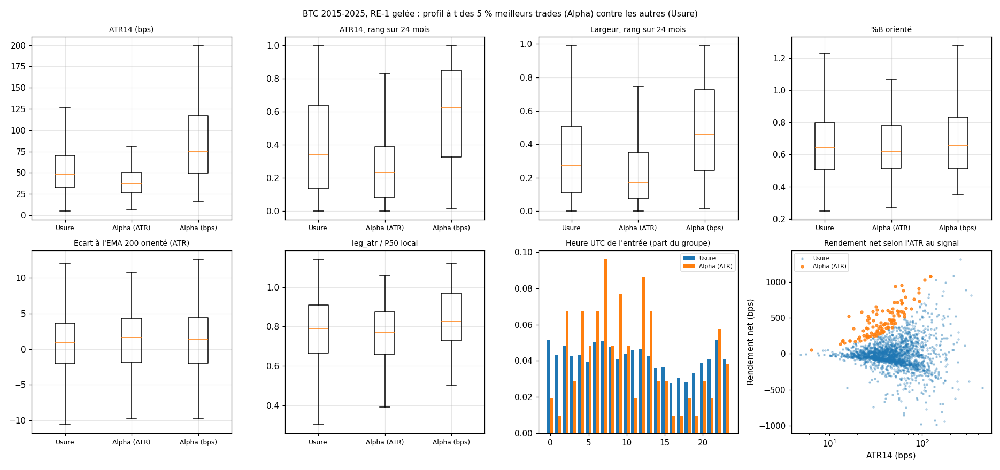
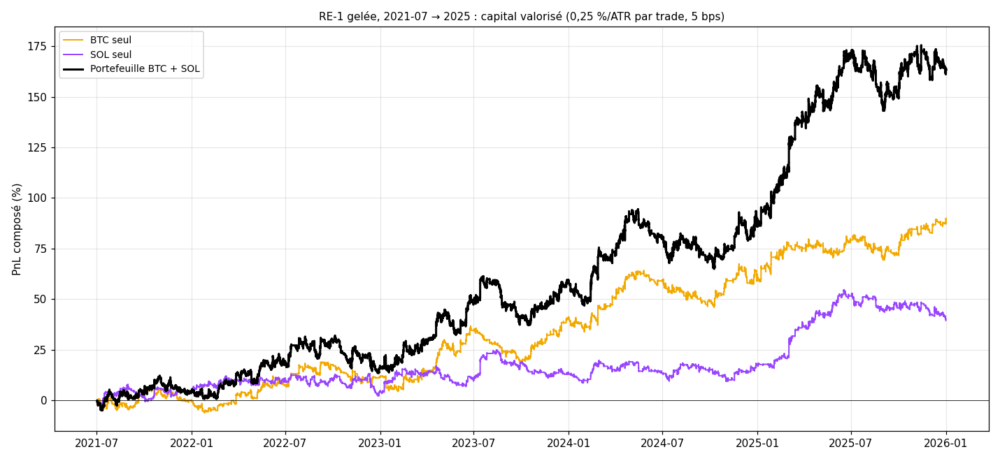

# EXP-D03 — Profilage des extrêmes, filtre de compression (ATR) et portefeuille BTC + SOL

*Demande du porteur du 2026-10-03, après ses décisions : WFO abandonné, RE-1 gelée version finale du moteur, exploitation
en fonds propres (`RESEARCH_LOG.md`, entrée EXP-D03). Calcul : `python experiments/D03/run_D03.py --calcul` (41 s).
RE-1 gelée (seuils BTC gelés, R0 = 100, frontière 0,85, H = 26, verrou 26), 5 bps (10 bps en lecture), 0,25 % du capital
par ATR14(t). Aucune optimisation. Annexes générées en fin de document.*

## Verdict

- **Action 1 : le « calme » des grands gagnants est surtout un effet de la mesure.**
  - Classés par rendement net en ATR, les 5 % meilleurs trades naissent à ATR plus bas que les autres : médiane 37 bps
    contre 48 ; 69 % sous la médiane de l'Usure.
  - Classés en bps, ils naissent à ATR plus haut : médiane 75 bps, 21 % seulement sous la médiane de l'Usure. Les deux
    classements n'ont que 53 trades en commun sur 104.
  - Avec un risque de 0,25 % par ATR, un trade ouvert à ATR bas engage plus de notionnel : c'est la taille de position,
    pas le marché, qui fait peser les états calmes dans le capital.
  - %B, écart à l'EMA 200 et `leg_atr` ne séparent pas les groupes.
- **Action 2 : le filtre ATR ≤ P60 glissant réduit l'exposition sans améliorer le Calmar.**
  - Il garde les 21 trades du top 1 % et 92 des 104 trades Alpha. Il retire 557 trades d'Usure (−0,091 ATR en moyenne),
    mais aussi 12 trades Alpha : l'ensemble retiré gagnait +0,111 ATR en moyenne.
  - Calmar 0,34 contre 0,32 ; écart apparié +0,03, Calmar meilleur sur 43 % seulement des chemins réordonnés. PnL +125 %
    contre +159 %, MDD −22,3 % contre −28,4 %.
  - Le gain d'espérance ne vient que de 2020-2025, la période de construction de RE-1 ; il ne se retrouve ni en
    2015-2019, ni sur SOL.
- **Action 3 : le portefeuille BTC + SOL améliore le rendement par unité de drawdown.**
  - De juillet 2021 à 2025 : Calmar 1,58 contre 1,18 pour BTC seul et 0,59 pour SOL seul ; PnL +163 % pour un MDD de
    −15,2 %.
  - Les rendements mensuels des deux actifs ne sont pas corrélés (−0,04).
  - La plus longue période sous le pic n'est pas raccourcie (238 jours contre 224 pour BTC seul).
  - Le gain repose sur l'avantage de SOL, dont l'IC contient 0 (+0,190 ATR [−0,079 ; +0,484]).

## 1. Contrôles bloquants (passés)

- Empreintes des séries BTC et SOL conformes ; réserve 2026 tronquée ; panne de 215 barres retirée sur BTC.
- RE-1 gelée BTC 2015-2025 identique aux 2 075 trades de D02.
- RE-1 gelée SOL identique à `run_re1`, métriques de D01 à 10⁻⁵ près (769 trades, 5 et 10 bps).
- Le portefeuille d'une seule jambe redonne le PnL et le MDD du capital valorisé du dépôt (10⁻¹⁰).

## 2. Action 1 — profil à t des trades Alpha (5 %) et Usure (95 %), BTC 2015-2025

- `[OBS]` **Concentration :** les 104 trades Alpha (classés en ATR) font 266 % de la somme nette en ATR et 226 % de la
  somme en bps ; les 104 meilleurs en bps font 305 % de la somme en bps.
- `[OBS]` **Volatilité au signal** (médiane [P25 ; P75]) :

| Variable | Usure | Alpha classé en ATR | Alpha classé en bps |
|---|---|---|---|
| ATR14 (bps) | 47,8 [32,8 ; 70,5] | 36,9 [26,6 ; 50,1] | 74,9 [49,6 ; 117,1] |
| ATR14, rang sur 24 mois | 0,34 [0,14 ; 0,64] | 0,23 [0,08 ; 0,39] | 0,62 [0,32 ; 0,85] |
| Largeur de Bollinger, rang sur 24 mois | 0,28 [0,11 ; 0,51] | 0,17 [0,07 ; 0,35] | 0,46 [0,24 ; 0,73] |
| Largeur de Bollinger (%) | 1,22 [0,77 ; 2,01] | 0,91 [0,67 ; 1,36] | 2,02 [1,26 ; 3,35] |

- `[OBS]` **Par quintile du rang d'ATR** (bas → haut), espérance par trade :
  - en ATR : +0,297, +0,202, +0,340, +0,090, +0,159 ;
  - en bps : +4,8, +7,4, +15,0, +2,6, +21,2.
  - Le quintile le plus volatil porte 42 % de la somme en bps, mais 15 % de la somme en ATR et aucun trade du top 1 %.
- `[OBS]` **Aucune séparation** sur le %B orienté (médianes 0,62 contre 0,64), l'écart à l'EMA 200 orienté (+1,6 contre
  +0,8 ATR, quintiles non monotones) ou `leg_atr` / P50 local (0,77 contre 0,79).
- `[OBS]` **Heure UTC de l'entrée** (lecture descriptive, 6 blocs, aucun IC) :
  - 04-08 h : +0,689 ATR et +26,8 bps sur 391 trades, avec 29 trades Alpha et 6 du top 1 % ;
  - 16-20 h : −0,205 ATR et −16,3 bps sur 240 trades, avec 5 trades Alpha.

## 3. Action 2 — filtre ATR14 ≤ P60 glissant sur 24 mois

**BTC 2015-2025, 5 bps**

| Variante | PnL : 0,25 %/ATR ; 1x ; bps (1x) | PF (1x) | WR | Espérance ATR [IC] ; bps | MDD : 0,25 %/ATR ; 1x | Trades (/mois) | Durée médiane | Part des frais (1x) ; brut ; frais (ATR) | Calmar 0,25 %/ATR |
|---|---|---|---|---|---|---|---|---|---|
| RE-1 gelée | +159 % ; +396 % ; +21 149 | 1,15 | 43,9 % | +0,218 [+0,032 ; +0,401] ; +10,2 | −28,4 % ; −53,0 % | 2 075 (15,7) | 26 b ; 13 h | 33 % ; +0,34 ; 0,12 | 0,32 |
| RE-1 + filtre ATR (entrées figées) | +125 % ; +205 % ; +13 454 | 1,17 | 43,2 % | +0,258 [+0,024 ; +0,486] ; +8,9 | −22,3 % ; −40,2 % | 1 506 (11,4) | 26 b ; 13 h | 36 % ; +0,41 ; 0,15 | 0,34 |
| RE-1 + filtre ATR (séquentiel) | +102 % ; +175 % ; +12 519 | 1,15 | 42,8 % | +0,224 [−0,010 ; +0,446] ; +8,1 | −23,7 % ; −38,4 % | 1 545 (11,7) | 26 b ; 13 h | 38 % ; +0,37 ; 0,15 | 0,28 |

- `[OBS]` **Écarts appariés face à RE-1 gelée** (entrées figées) :
  - espérance +0,040 ATR [−0,056 ; +0,131] mais −1,3 bps [−9,8 ; +6,5] ;
  - rendement −1,4 point par an [−5,4 ; +2,1] ;
  - MDD +6,1 points, moins profond sur 71 % des chemins réordonnés ;
  - Calmar +0,03, meilleur sur 43 % des chemins.
  - En séquentiel : +0,006 ATR ; les 51 trades libérés du verrou font −0,221 ATR en moyenne.
- `[OBS]` **Ce que le filtre retire :**
  - 569 trades (27 %) : 557 d'Usure, à −0,091 ATR de moyenne, et 12 trades Alpha ; l'ensemble retiré gagnait +0,111 ATR ;
  - il garde les 21 trades du top 1 % et 92 des 104 trades Alpha.
- `[OBS]` **Par période** (entrées figées) :
  - 2015-2019 : +0,029 contre +0,064 ATR ;
  - 2020-2025 : +0,456 contre +0,357, MDD à 1x −22,0 % contre −43,9 %, Calmar 1,11 contre 1,12.
- `[OBS]` **À 10 bps :** Calmar 0,09 dans les deux cas.
- `[OBS]` **SOL, hors de l'échantillon de l'idée** (entrées du S2 2023 à 2025) : +0,243 contre +0,252 ATR ; Calmar 0,57
  contre 0,76.

## 4. Action 3 — portefeuille RE-1 gelée BTC + SOL, entrées du 2021-07-01 au 2025-12-31

**5 bps, 0,25 %/ATR par trade sur chaque actif (entre parenthèses : 1x par position)**

| Série | PnL | PF (1x) | WR | Espérance bps | MDD | Trades (/mois) | Durée médiane | Part des frais | Calmar | Plus longue période sous le pic | Mois positifs |
|---|---|---|---|---|---|---|---|---|---|---|---|
| BTC seul | +90 % (+118 %) | 1,20 | 43,1 % | +11,3 | −12,9 % (−29,9 %) | 806 (14,9) | 26 b | 31 % | 1,18 | 224 j | 54 % |
| SOL seul | +39 % (+173 %) | 1,17 | 44,1 % | +19,2 | −13,1 % (−42,3 %) | 769 (14,2) | 26 b | 21 % | 0,59 | 567 j | 56 % |
| Portefeuille BTC + SOL | +163 % (+478 %) | 1,18 | 43,6 % | +15,1 | −15,2 % (−40,1 %) | 1 575 (29,1) | 26 b | 25 % | 1,58 | 238 j | 59 % |

- `[OBS]` **Diversification :** les rendements mensuels de BTC et de SOL ne sont pas corrélés (−0,04). Le portefeuille
  est en position 37 % du temps, avec les deux positions ouvertes 7 % du temps.
- `[OBS]` **Exposition :** exposition brute maximale 2,0 à 0,25 %/ATR et 2,3 à 1x par position.
- `[OBS]` **À 10 bps :** PnL +80 %, MDD −18,1 %, Calmar 0,77, contre 0,59 pour BTC seul et 0,32 pour SOL seul.
- `[OBS]` **Espérance de SOL seul** sur la période : +0,190 ATR [−0,079 ; +0,484], brut +0,25 et frais 0,06 ATR. Celle
  de BTC : +0,370 [+0,050 ; +0,686], mais 2021-2025 est dans la période de construction de RE-1.

## 5. Lecture

- `[HYP]` **Taille de position.** Le risque de 0,25 % par ATR concentre le capital sur les trades ouverts à ATR bas. En
  bps, les plus gros gains de RE-1 viennent au contraire des marchés agités. Un filtre de compression trie donc surtout
  les trades selon leur taille de position, pas selon leur qualité.
- `[HYP]` **Le filtre ATR revient à désendetter.** Moins de trades, un drawdown moins profond, un PnL plus faible, et un
  Calmar inchangé, comme le break-even de C03.
- `[HYP]` **Le seul levier mesuré qui améliore le rapport rendement / drawdown est la diversification.** Il ne vaut que
  si l'avantage de chaque actif est réel ; celui de SOL n'est pas établi à 95 %.

## 6. Pistes (à cadrer par le porteur, rien de lancé)

1. **Filtre ATR :** non retenu. Aucun gain de Calmar ; avec l'Usure, il retire 12 trades Alpha et l'ensemble retiré
   gagnait en moyenne ; son gain se limite à 2020-2025 et ne se retrouve pas sur SOL.
2. **Portefeuille :** confirmer l'avantage de SOL avant d'y engager du capital, par une période jamais lue (2026, si le
   porteur lève la réserve) ou par un suivi sans argent réel.
3. **Heure UTC :** le contraste 04-08 h / 16-20 h est descriptif ; il demanderait une lecture sur des données non vues
   (SOL, BTC 2013-2014) avant toute règle.

---

# Annexes générées (`run_D03.py --calcul`, puis `--rapport`)

Calcul du 2026-10-03 00:22 UTC, commit `8350415`, 39 s ; 16 comparaisons appariées publiées.

## A1. Contrôles bloquants (passés)

- RE-1 gelée BTC 2015-2025 : 2 075 trades identiques à D02.
- RE-1 gelée SOL : 769 trades identiques à run_re1 ; métriques de D01 à 1e-5 (5 et 10 bps).
- portefeuille une jambe : PnL et MDD identiques au capital valorisé de RE-1 gelée BTC (1e-10).

## A2. Profil à t : Alpha (5 % meilleurs) contre Usure (95 %), BTC 2015-2025, 5 bps

Alpha : 104 trades (266 % de la somme nette en ATR, 226 % de la somme en bps) ; Alpha classé en bps : 305 % de la somme en bps ; 53 trades communs aux deux classements.

| Variable | Usure : médiane [P25 ; P75] | Alpha (ATR) : médiane [P25 ; P75] ; sous la médiane d'Usure | Alpha (bps) : médiane [P25 ; P75] ; sous la médiane d'Usure | Top 1 % : médiane |
|---|---|---|---|---|
| ATR14 (bps) | 47,8 [32,8 ; 70,5] | 36,9 [26,6 ; 50,1] ; 69 % | 74,9 [49,6 ; 117,1] ; 21 % | 29,2 |
| ATR14, rang sur 24 mois | 0,34 [0,14 ; 0,64] | 0,23 [0,08 ; 0,39] ; 71 % | 0,62 [0,32 ; 0,85] ; 30 % | 0,09 |
| leg_atr | 2,12 [1,78 ; 2,44] | 2,06 [1,79 ; 2,40] ; 57 % | 2,22 [1,95 ; 2,52] ; 43 % | 1,95 |
| leg_atr / P50 local | 0,79 [0,67 ; 0,91] | 0,77 [0,66 ; 0,87] ; 57 % | 0,83 [0,73 ; 0,97] ; 41 % | 0,73 |
| %B (Bollinger 20, 2) | 0,52 [0,37 ; 0,67] | 0,50 [0,39 ; 0,67] ; 53 % | 0,52 [0,36 ; 0,69] ; 51 % | 0,46 |
| %B orienté | 0,64 [0,51 ; 0,80] | 0,62 [0,51 ; 0,78] ; 55 % | 0,65 [0,51 ; 0,83] ; 46 % | 0,72 |
| Largeur de Bollinger (%) | 1,22 [0,77 ; 2,01] | 0,91 [0,67 ; 1,36] ; 67 % | 2,02 [1,26 ; 3,35] ; 24 % | 0,69 |
| Largeur, rang sur 24 mois | 0,28 [0,11 ; 0,51] | 0,17 [0,07 ; 0,35] ; 69 % | 0,46 [0,24 ; 0,73] ; 34 % | 0,07 |
| Écart à l'EMA 200 orienté (ATR) | 0,83 [−2,09 ; 3,60] | 1,65 [−1,92 ; 4,27] ; 42 % | 1,34 [−1,95 ; 4,38] ; 46 % | 1,09 |

**Espérance par quintile de la variable (2 075 trades, 5 bps)**

*ATR14, rang sur 24 mois*

| Quintile (bornes) | Trades | Espérance ATR ; bps | Médiane ATR | Alpha ; top 1 % | Part de la somme ATR ; bps |
|---|---|---|---|---|---|
| Q1 (0,00 à 0,10) | 415 | +0,297 ; +4,8 | −0,71 | 31 ; 11 | 27 % ; 9 % |
| Q2 (0,10 à 0,25) | 415 | +0,202 ; +7,4 | −0,70 | 25 ; 7 | 19 % ; 15 % |
| Q3 (0,25 à 0,44) | 415 | +0,340 ; +15,0 | −0,38 | 26 ; 3 | 31 % ; 29 % |
| Q4 (0,44 à 0,69) | 415 | +0,090 ; +2,6 | −0,32 | 17 ; 0 | 8 % ; 5 % |
| Q5 (0,69 à 1,00) | 415 | +0,159 ; +21,2 | −0,13 | 5 ; 0 | 15 % ; 42 % |

*ATR14 (bps)*

| Quintile (bornes) | Trades | Espérance ATR ; bps | Médiane ATR | Alpha ; top 1 % | Part de la somme ATR ; bps |
|---|---|---|---|---|---|
| Q1 (4,9 à 29,9) | 415 | +0,433 ; +9,2 | −0,79 | 34 ; 12 | 40 % ; 18 % |
| Q2 (29,9 à 40,8) | 415 | +0,215 ; +6,9 | −0,43 | 26 ; 4 | 20 % ; 14 % |
| Q3 (40,8 à 54,2) | 415 | +0,229 ; +10,7 | −0,43 | 22 ; 3 | 21 % ; 21 % |
| Q4 (54,2 à 76,9) | 415 | +0,134 ; +9,8 | −0,30 | 15 ; 2 | 12 % ; 19 % |
| Q5 (77,0 à 444,1) | 415 | +0,076 ; +14,3 | −0,26 | 7 ; 0 | 7 % ; 28 % |

*Largeur, rang sur 24 mois*

| Quintile (bornes) | Trades | Espérance ATR ; bps | Médiane ATR | Alpha ; top 1 % | Part de la somme ATR ; bps |
|---|---|---|---|---|---|
| Q1 (0,00 à 0,08) | 415 | +0,113 ; −0,1 | −0,90 | 29 ; 11 | 10 % ; −0 % |
| Q2 (0,08 à 0,20) | 415 | +0,413 ; +15,5 | −0,64 | 27 ; 5 | 38 % ; 30 % |
| Q3 (0,20 à 0,35) | 415 | +0,213 ; +6,4 | −0,43 | 21 ; 5 | 20 % ; 13 % |
| Q4 (0,35 à 0,56) | 415 | +0,161 ; +6,4 | −0,32 | 19 ; 0 | 15 % ; 13 % |
| Q5 (0,56 à 0,99) | 415 | +0,189 ; +22,8 | −0,12 | 8 ; 0 | 17 % ; 45 % |

*%B orienté*

| Quintile (bornes) | Trades | Espérance ATR ; bps | Médiane ATR | Alpha ; top 1 % | Part de la somme ATR ; bps |
|---|---|---|---|---|---|
| Q1 (0,25 à 0,48) | 415 | +0,016 ; +0,3 | +0,04 | 17 ; 1 | 2 % ; 1 % |
| Q2 (0,48 à 0,59) | 415 | +0,347 ; +13,9 | −0,13 | 24 ; 4 | 32 % ; 27 % |
| Q3 (0,59 à 0,69) | 415 | +0,469 ; +21,7 | −0,42 | 24 ; 4 | 43 % ; 43 % |
| Q4 (0,69 à 0,84) | 415 | +0,097 ; +7,1 | −0,66 | 19 ; 6 | 9 % ; 14 % |
| Q5 (0,84 à 1,47) | 415 | +0,158 ; +7,9 | −1,44 | 20 ; 6 | 15 % ; 16 % |

*Écart à l'EMA 200 orienté (ATR)*

| Quintile (bornes) | Trades | Espérance ATR ; bps | Médiane ATR | Alpha ; top 1 % | Part de la somme ATR ; bps |
|---|---|---|---|---|---|
| Q1 (−15,62 à −2,79) | 415 | +0,190 ; +12,8 | −0,15 | 19 ; 5 | 17 % ; 25 % |
| Q2 (−2,78 à −0,30) | 415 | +0,214 ; +3,5 | −0,32 | 16 ; 3 | 20 % ; 7 % |
| Q3 (−0,30 à 1,85) | 415 | +0,262 ; +16,0 | −0,41 | 23 ; 5 | 24 % ; 31 % |
| Q4 (1,86 à 4,34) | 415 | +0,064 ; +6,2 | −0,60 | 20 ; 4 | 6 % ; 12 % |
| Q5 (4,34 à 17,65) | 415 | +0,358 ; +12,5 | −0,79 | 26 ; 4 | 33 % ; 24 % |

*leg_atr / P50 local*

| Quintile (bornes) | Trades | Espérance ATR ; bps | Médiane ATR | Alpha ; top 1 % | Part de la somme ATR ; bps |
|---|---|---|---|---|---|
| Q1 (0,28 à 0,64) | 415 | +0,177 ; −0,1 | −1,22 | 24 ; 6 | 16 % ; −0 % |
| Q2 (0,64 à 0,74) | 415 | +0,048 ; +2,6 | −0,50 | 17 ; 5 | 4 % ; 5 % |
| Q3 (0,74 à 0,84) | 415 | +0,620 ; +22,6 | −0,22 | 30 ; 5 | 57 % ; 44 % |
| Q4 (0,84 à 0,93) | 415 | −0,100 ; −2,8 | −0,31 | 15 ; 1 | −9 % ; −6 % |
| Q5 (0,93 à 1,14) | 415 | +0,342 ; +28,7 | +0,07 | 18 ; 4 | 31 % ; 56 % |

*Heure UTC de l'entrée*

| Heures UTC | Trades | Alpha ; top 1 % | Espérance ATR ; bps |
|---|---|---|---|
| 00-04 | 379 | 13 ; 2 | +0,042 ; +8,5 |
| 04-08 | 391 | 29 ; 6 | +0,689 ; +26,8 |
| 08-12 | 371 | 20 ; 4 | +0,099 ; +3,6 |
| 12-16 | 341 | 22 ; 4 | +0,277 ; +6,6 |
| 16-20 | 240 | 5 ; 1 | −0,205 ; −16,3 |
| 20-24 | 353 | 15 ; 4 | +0,239 ; +22,0 |

## A3. Filtre ATR14 ≤ P60 glissant sur 24 mois (BTC)

Trades de RE-1 gardés : 73 % ; Alpha gardés : 92 sur 104 ; top 1 % gardés : 21 sur 21 ; retirés : 557 trades d'Usure (−0,091 ATR en moyenne) et 12 Alpha. Espérance de tous les trades retirés +0,111 ATR, des gardés +0,258. En séquentiel : 51 trades nouveaux (signaux libérés du verrou), −0,221 ATR en moyenne.

**BTC 2015-2025 · 5 bps**

| Variante | PnL : 0,25 %/ATR ; 1x ; bps (1x) | PF (1x) | WR | Espérance ATR [IC] ; bps | MDD : 0,25 %/ATR ; 1x | Trades (/mois) | Durée médiane | Part des frais (1x) ; brut ; frais (ATR) | Calmar 0,25 %/ATR |
|---|---|---|---|---|---|---|---|---|---|
| RE-1 gelée | +159 % ; +396 % ; +21 149 | 1,15 | 43,9 % | +0,218 [+0,032 ; +0,401] ; +10,2 | −28,4 % ; −53,0 % | 2 075 (15,7) | 26 b ; 13 h | 33 % ; +0,34 ; 0,12 | 0,32 |
| RE-1 + filtre ATR (entrées figées) | +125 % ; +205 % ; +13 454 | 1,17 | 43,2 % | +0,258 [+0,024 ; +0,486] ; +8,9 | −22,3 % ; −40,2 % | 1 506 (11,4) | 26 b ; 13 h | 36 % ; +0,41 ; 0,15 | 0,34 |
| RE-1 + filtre ATR (séquentiel) | +102 % ; +175 % ; +12 519 | 1,15 | 42,8 % | +0,224 [−0,010 ; +0,446] ; +8,1 | −23,7 % ; −38,4 % | 1 545 (11,7) | 26 b ; 13 h | 38 % ; +0,37 ; 0,15 | 0,28 |

| A contre B | Δ espérance ATR [IC] | Δ espérance bps [IC] | Δ rendement annuel [IC] | Δ MDD sorties (plage) ; part A mieux | Δ Calmar sorties (plage) ; part A mieux | Verdict |
|---|---|---|---|---|---|---|
| RE-1 + filtre ATR (entrées figées) / RE-1 gelée | +0,040 [−0,056 ; +0,131] | −1,3 [−9,8 ; +6,5] | −1,4 % [−5,4 % ; +2,1 %] | +6,1 % [−7,2 % ; +10,8 %] ; 71 % | +0,03 [−0,33 ; +0,24] ; 43 % | non |
| RE-1 + filtre ATR (séquentiel) / RE-1 gelée | +0,006 [−0,095 ; +0,104] | −2,1 [−10,4 ; +5,5] | −2,4 % [−6,5 % ; +1,2 %] | +4,6 % [−10,6 % ; +9,4 %] ; 51 % | −0,04 [−0,42 ; +0,15] ; 20 % | non |

**BTC 2015-2025 · 10 bps**

| Variante | PnL : 0,25 %/ATR ; 1x ; bps (1x) | PF (1x) | WR | Espérance ATR [IC] ; bps | MDD : 0,25 %/ATR ; 1x | Trades (/mois) | Durée médiane | Part des frais (1x) ; brut ; frais (ATR) | Calmar 0,25 %/ATR |
|---|---|---|---|---|---|---|---|---|---|
| RE-1 gelée | +43 % ; +76 % ; +10 774 | 1,07 | 42,6 % | +0,093 [−0,094 ; +0,277] ; +5,2 | −36,3 % ; −60,8 % | 2 075 (15,7) | 26 b ; 13 h | 66 % ; +0,34 ; 0,25 | 0,09 |
| RE-1 + filtre ATR (entrées figées) | +36 % ; +44 % ; +5 924 | 1,07 | 41,8 % | +0,109 [−0,128 ; +0,340] ; +3,9 | −31,1 % ; −52,0 % | 1 506 (11,4) | 26 b ; 13 h | 72 % ; +0,41 ; 0,30 | 0,09 |
| RE-1 + filtre ATR (séquentiel) | +21 % ; +27 % ; +4 794 | 1,05 | 41,4 % | +0,076 [−0,159 ; +0,300] ; +3,1 | −31,1 % ; −51,3 % | 1 545 (11,7) | 26 b ; 13 h | 76 % ; +0,37 ; 0,30 | 0,06 |

| A contre B | Δ espérance ATR [IC] | Δ espérance bps [IC] | Δ rendement annuel [IC] | Δ MDD sorties (plage) ; part A mieux | Δ Calmar sorties (plage) ; part A mieux | Verdict |
|---|---|---|---|---|---|---|
| RE-1 + filtre ATR (entrées figées) / RE-1 gelée | +0,015 [−0,083 ; +0,108] | −1,3 [−9,8 ; +6,5] | −0,5 % [−4,3 % ; +2,7 %] | +5,8 % [−8,7 % ; +13,5 %] ; 69 % | +0,00 [−0,20 ; +0,16] ; 47 % | non |
| RE-1 + filtre ATR (séquentiel) / RE-1 gelée | −0,017 [−0,119 ; +0,079] | −2,1 [−10,4 ; +5,5] | −1,6 % [−5,5 % ; +1,9 %] | +5,3 % [−13,3 % ; +11,3 %] ; 49 % | −0,04 [−0,25 ; +0,09] ; 23 % | non |

**BTC 2015-2019 · 5 bps**

| Variante | PnL : 0,25 %/ATR ; 1x ; bps (1x) | PF (1x) | WR | Espérance ATR [IC] ; bps | MDD : 0,25 %/ATR ; 1x | Trades (/mois) | Durée médiane | Part des frais (1x) ; brut ; frais (ATR) | Calmar 0,25 %/ATR |
|---|---|---|---|---|---|---|---|---|---|
| RE-1 gelée | +12 % ; +74 % ; +8 455 | 1,11 | 43,6 % | +0,064 [−0,158 ; +0,308] ; +8,6 | −28,4 % ; −53,0 % | 988 (16,5) | 26 b ; 13 h | 37 % ; +0,18 ; 0,11 | 0,08 |
| RE-1 + filtre ATR (entrées figées) | +1 % ; +2 % ; +1 290 | 1,03 | 42,3 % | +0,029 [−0,267 ; +0,328] ; +1,8 | −22,3 % ; −40,2 % | 699 (11,7) | 26 b ; 13 h | 73 % ; +0,17 ; 0,14 | 0,01 |
| RE-1 + filtre ATR (séquentiel) | +5 % ; +18 % ; +2 791 | 1,07 | 42,6 % | +0,052 [−0,266 ; +0,369] ; +3,9 | −23,7 % ; −38,4 % | 712 (11,9) | 26 b ; 13 h | 56 % ; +0,19 ; 0,14 | 0,04 |

| A contre B | Δ espérance ATR [IC] | Δ espérance bps [IC] | Δ rendement annuel [IC] | Δ MDD sorties (plage) ; part A mieux | Δ Calmar sorties (plage) ; part A mieux | Verdict |
|---|---|---|---|---|---|---|
| RE-1 + filtre ATR (entrées figées) / RE-1 gelée | −0,035 [−0,190 ; +0,103] | −6,7 [−22,6 ; +7,5] | −2,0 % [−8,1 % ; +3,2 %] | +6,1 % [−10,1 % ; +10,8 %] ; 60 % | −0,07 [−0,49 ; +0,22] ; 28 % | non |
| RE-1 + filtre ATR (séquentiel) / RE-1 gelée | −0,013 [−0,176 ; +0,138] | −4,6 [−20,3 ; +9,3] | −1,2 % [−7,2 % ; +4,3 %] | +4,6 % [−10,5 % ; +11,2 %] ; 61 % | −0,04 [−0,42 ; +0,31] ; 38 % | non |

**BTC 2015-2019 · 10 bps**

| Variante | PnL : 0,25 %/ATR ; 1x ; bps (1x) | PF (1x) | WR | Espérance ATR [IC] ; bps | MDD : 0,25 %/ATR ; 1x | Trades (/mois) | Durée médiane | Part des frais (1x) ; brut ; frais (ATR) | Calmar 0,25 %/ATR |
|---|---|---|---|---|---|---|---|---|---|
| RE-1 gelée | −14 % ; +6 % ; +3 515 | 1,05 | 42,4 % | −0,047 [−0,273 ; +0,196] ; +3,6 | −36,3 % ; −60,8 % | 988 (16,5) | 26 b ; 13 h | 74 % ; +0,18 ; 0,22 | −0,08 |
| RE-1 + filtre ATR (entrées figées) | −19 % ; −28 % ; −2 205 | 0,95 | 40,9 % | −0,107 [−0,407 ; +0,199] ; −3,2 | −31,1 % ; −52,0 % | 699 (11,7) | 26 b ; 13 h | 146 % ; +0,17 ; 0,27 | −0,14 |
| RE-1 + filtre ATR (séquentiel) | −16 % ; −18 % ; −769 | 0,98 | 41,2 % | −0,084 [−0,400 ; +0,237] ; −1,1 | −31,1 % ; −51,3 % | 712 (11,9) | 26 b ; 13 h | 112 % ; +0,19 ; 0,27 | −0,11 |

| A contre B | Δ espérance ATR [IC] | Δ espérance bps [IC] | Δ rendement annuel [IC] | Δ MDD sorties (plage) ; part A mieux | Δ Calmar sorties (plage) ; part A mieux | Verdict |
|---|---|---|---|---|---|---|
| RE-1 + filtre ATR (entrées figées) / RE-1 gelée | −0,060 [−0,217 ; +0,078] | −6,7 [−22,6 ; +7,5] | −1,2 % [−7,0 % ; +3,7 %] | +5,8 % [−11,0 % ; +12,1 %] ; 58 % | −0,06 [−0,31 ; +0,12] ; 31 % | non |
| RE-1 + filtre ATR (séquentiel) / RE-1 gelée | −0,036 [−0,203 ; +0,112] | −4,6 [−20,3 ; +9,3] | −0,4 % [−6,1 % ; +4,8 %] | +5,3 % [−11,0 % ; +13,3 %] ; 61 % | −0,03 [−0,27 ; +0,19] ; 42 % | non |

**BTC 2020-2025 · 5 bps**

| Variante | PnL : 0,25 %/ATR ; 1x ; bps (1x) | PF (1x) | WR | Espérance ATR [IC] ; bps | MDD : 0,25 %/ATR ; 1x | Trades (/mois) | Durée médiane | Part des frais (1x) ; brut ; frais (ATR) | Calmar 0,25 %/ATR |
|---|---|---|---|---|---|---|---|---|---|
| RE-1 gelée | +132 % ; +184 % ; +12 694 | 1,18 | 44,2 % | +0,357 [+0,086 ; +0,633] ; +11,7 | −13,5 % ; −43,9 % | 1 087 (15,1) | 26 b ; 13 h | 30 % ; +0,49 ; 0,14 | 1,12 |
| RE-1 + filtre ATR (entrées figées) | +123 % ; +199 % ; +12 164 | 1,29 | 43,9 % | +0,456 [+0,124 ; +0,822] ; +15,1 | −12,9 % ; −22,0 % | 807 (11,2) | 26 b ; 13 h | 25 % ; +0,62 ; 0,16 | 1,11 |
| RE-1 + filtre ATR (séquentiel) | +92 % ; +134 % ; +9 727 | 1,22 | 43,0 % | +0,371 [+0,051 ; +0,724] ; +11,7 | −12,9 % ; −23,0 % | 833 (11,6) | 26 b ; 13 h | 30 % ; +0,53 ; 0,16 | 0,89 |

| A contre B | Δ espérance ATR [IC] | Δ espérance bps [IC] | Δ rendement annuel [IC] | Δ MDD sorties (plage) ; part A mieux | Δ Calmar sorties (plage) ; part A mieux | Verdict |
|---|---|---|---|---|---|---|
| RE-1 + filtre ATR (entrées figées) / RE-1 gelée | +0,099 [−0,030 ; +0,237] | +3,4 [−5,6 ; +12,7] | −0,8 % [−6,4 % ; +4,1 %] | +0,8 % [−3,3 % ; +8,3 %] ; 79 % | +0,01 [−0,53 ; +0,75] ; 60 % | non |
| RE-1 + filtre ATR (séquentiel) / RE-1 gelée | +0,014 [−0,116 ; +0,148] | −0,0 [−8,9 ; +8,9] | −3,6 % [−9,3 % ; +1,6 %] | +0,8 % [−6,8 % ; +6,3 %] ; 53 % | −0,22 [−0,87 ; +0,32] ; 21 % | non |

**BTC 2020-2025 · 10 bps**

| Variante | PnL : 0,25 %/ATR ; 1x ; bps (1x) | PF (1x) | WR | Espérance ATR [IC] ; bps | MDD : 0,25 %/ATR ; 1x | Trades (/mois) | Durée médiane | Part des frais (1x) ; brut ; frais (ATR) | Calmar 0,25 %/ATR |
|---|---|---|---|---|---|---|---|---|---|
| RE-1 gelée | +67 % ; +65 % ; +7 259 | 1,10 | 42,7 % | +0,221 [−0,054 ; +0,503] ; +6,7 | −15,9 % ; −48,0 % | 1 087 (15,1) | 26 b ; 13 h | 60 % ; +0,49 ; 0,27 | 0,56 |
| RE-1 + filtre ATR (entrées figées) | +68 % ; +100 % ; +8 129 | 1,19 | 42,5 % | +0,296 [−0,034 ; +0,662] ; +10,1 | −14,8 % ; −27,2 % | 807 (11,2) | 26 b ; 13 h | 50 % ; +0,62 ; 0,32 | 0,61 |
| RE-1 + filtre ATR (séquentiel) | +44 % ; +54 % ; +5 562 | 1,12 | 41,7 % | +0,212 [−0,118 ; +0,569] ; +6,7 | −14,8 % ; −29,1 % | 833 (11,6) | 26 b ; 13 h | 60 % ; +0,53 ; 0,32 | 0,43 |

| A contre B | Δ espérance ATR [IC] | Δ espérance bps [IC] | Δ rendement annuel [IC] | Δ MDD sorties (plage) ; part A mieux | Δ Calmar sorties (plage) ; part A mieux | Verdict |
|---|---|---|---|---|---|---|
| RE-1 + filtre ATR (entrées figées) / RE-1 gelée | +0,075 [−0,056 ; +0,211] | +3,4 [−5,6 ; +12,7] | +0,1 % [−5,2 % ; +4,7 %] | +1,3 % [−4,2 % ; +9,9 %] ; 80 % | +0,06 [−0,33 ; +0,55] ; 65 % | non |
| RE-1 + filtre ATR (séquentiel) / RE-1 gelée | −0,009 [−0,141 ; +0,125] | −0,0 [−8,9 ; +8,9] | −2,7 % [−8,1 % ; +2,2 %] | +1,3 % [−8,4 % ; +7,4 %] ; 52 % | −0,14 [−0,59 ; +0,23] ; 22 % | non |

**Hors de l'échantillon de l'idée : SOL, entrées du 2023-07-01 au 2025-12-31**

| Variante | PnL : 0,25 %/ATR ; 1x ; bps (1x) | PF (1x) | WR | Espérance ATR [IC] ; bps | MDD : 0,25 %/ATR ; 1x | Trades (/mois) | Durée médiane | Part des frais (1x) ; brut ; frais (ATR) | Calmar 0,25 %/ATR |
|---|---|---|---|---|---|---|---|---|---|
| RE-1 gelée | +27 % ; +114 % ; +9 443 | 1,25 | 45,2 % | +0,252 [−0,191 ; +0,712] ; +23,3 | −13,1 % ; −42,3 % | 405 (13,4) | 26 b ; 13 h | 18 % ; +0,32 ; 0,07 | 0,76 |
| RE-1 + filtre ATR (entrées figées) | +19 % ; +70 % ; +6 596 | 1,25 | 43,2 % | +0,243 [−0,257 ; +0,796] ; +20,8 | −12,7 % ; −35,5 % | 317 (10,5) | 26 b ; 13 h | 19 % ; +0,32 ; 0,07 | 0,57 |
| RE-1 + filtre ATR (séquentiel) | +18 % ; +65 % ; +6 299 | 1,23 | 42,9 % | +0,228 [−0,251 ; +0,767] ; +19,4 | −12,9 % ; −36,2 % | 324 (10,8) | 26 b ; 13 h | 20 % ; +0,30 ; 0,07 | 0,54 |

| A contre B | Δ espérance ATR [IC] | Δ espérance bps [IC] | Δ rendement annuel [IC] | Δ MDD sorties (plage) ; part A mieux | Δ Calmar sorties (plage) ; part A mieux | Verdict |
|---|---|---|---|---|---|---|
| RE-1 + filtre ATR (entrées figées) / RE-1 gelée | −0,008 [−0,153 ; +0,149] | −2,5 [−19,4 ; +13,7] | −2,6 % [−8,2 % ; +2,0 %] | +0,2 % [−4,3 % ; +4,3 %] ; 61 % | −0,20 [−1,03 ; +0,37] ; 23 % | non |
| RE-1 + filtre ATR (séquentiel) / RE-1 gelée | −0,024 [−0,162 ; +0,125] | −3,9 [−20,8 ; +11,8] | −3,0 % [−9,2 % ; +1,8 %] | −0,0 % [−4,5 % ; +4,5 %] ; 62 % | −0,24 [−1,10 ; +0,34] ; 20 % | non |

| Variante | PnL : 0,25 %/ATR ; 1x ; bps (1x) | PF (1x) | WR | Espérance ATR [IC] ; bps | MDD : 0,25 %/ATR ; 1x | Trades (/mois) | Durée médiane | Part des frais (1x) ; brut ; frais (ATR) | Calmar 0,25 %/ATR |
|---|---|---|---|---|---|---|---|---|---|
| RE-1 gelée | +18 % ; +75 % ; +7 418 | 1,19 | 44,7 % | +0,185 [−0,262 ; +0,647] ; +18,3 | −15,2 % ; −44,4 % | 405 (13,4) | 26 b ; 13 h | 35 % ; +0,32 ; 0,13 | 0,46 |
| RE-1 + filtre ATR (entrées figées) | +13 % ; +45 % ; +5 011 | 1,18 | 42,6 % | +0,169 [−0,331 ; +0,723] ; +15,8 | −15,1 % ; −40,4 % | 317 (10,5) | 26 b ; 13 h | 39 % ; +0,32 ; 0,15 | 0,32 |
| RE-1 + filtre ATR (séquentiel) | +11 % ; +41 % ; +4 679 | 1,17 | 42,3 % | +0,153 [−0,326 ; +0,695] ; +14,4 | −15,4 % ; −41,0 % | 324 (10,8) | 26 b ; 13 h | 41 % ; +0,30 ; 0,15 | 0,29 |

| A contre B | Δ espérance ATR [IC] | Δ espérance bps [IC] | Δ rendement annuel [IC] | Δ MDD sorties (plage) ; part A mieux | Δ Calmar sorties (plage) ; part A mieux | Verdict |
|---|---|---|---|---|---|---|
| RE-1 + filtre ATR (entrées figées) / RE-1 gelée | −0,016 [−0,160 ; +0,140] | −2,5 [−19,4 ; +13,7] | −2,2 % [−7,7 % ; +2,3 %] | +0,1 % [−4,6 % ; +4,7 %] ; 61 % | −0,14 [−0,85 ; +0,32] ; 24 % | non |
| RE-1 + filtre ATR (séquentiel) / RE-1 gelée | −0,032 [−0,168 ; +0,117] | −3,9 [−20,8 ; +11,8] | −2,6 % [−8,6 % ; +2,1 %] | −0,1 % [−4,6 % ; +4,9 %] ; 60 % | −0,18 [−0,93 ; +0,30] ; 19 % | non |

**Espérance par année (ATR, 5 bps)**

| Année | RE-1 gelée | RE-1 + filtre ATR (entrées figées) | RE-1 + filtre ATR (séquentiel) |
|---|---|---|---|
| 2015 | −0,272 | −0,186 | −0,232 |
| 2016 | −0,002 | +0,097 | +0,097 |
| 2017 | +0,469 | +0,401 | +0,384 |
| 2018 | +0,062 | +0,101 | +0,156 |
| 2019 | +0,098 | +0,004 | +0,104 |
| 2020 | +0,443 | +0,697 | +0,687 |
| 2021 | +0,024 | +0,173 | +0,093 |
| 2022 | +0,305 | +0,273 | +0,252 |
| 2023 | +0,504 | +0,496 | +0,468 |
| 2024 | +0,334 | +0,309 | +0,007 |
| 2025 | +0,550 | +0,682 | +0,570 |

## A4. Portefeuille RE-1 gelée BTC + SOL, entrées du 2021-07-01 au 2025-12-31

Corrélation des rendements mensuels BTC / SOL (0,25 %/ATR, 5 bps) : −0,04.

**5 bps, 0,25 %/ATR**

| Série | PnL | MDD | Calmar | Plus longue période sous le pic | Mois positifs | Trades (/mois) | PF (1x) ; WR ; espérance bps | Exposition brute max ; temps à 2 positions |
|---|---|---|---|---|---|---|---|---|
| BTC seul | +90 % | −12,9 % | 1,18 | 224 j | 54 % de 54 | 806 (14,9) | 1,20 ; 43,1 % ; +11,3 | 1,10 ; 0 % |
| SOL seul | +39 % | −13,1 % | 0,59 | 567 j | 56 % de 54 | 769 (14,2) | 1,17 ; 44,1 % ; +19,2 | 1,02 ; 0 % |
| Portefeuille BTC + SOL | +163 % | −15,2 % | 1,58 | 238 j | 59 % de 54 | 1 575 (29,1) | 1,18 ; 43,6 % ; +15,1 | 2,01 ; 7 % |

**5 bps, 1x par position**

| Série | PnL | MDD | Calmar | Plus longue période sous le pic | Mois positifs | Trades (/mois) | PF (1x) ; WR ; espérance bps | Exposition brute max ; temps à 2 positions |
|---|---|---|---|---|---|---|---|---|
| BTC seul | +118 % | −29,9 % | 0,63 | 277 j | 54 % de 54 | 806 (14,9) | 1,20 ; 43,1 % ; +11,3 | 1,14 ; 0 % |
| SOL seul | +173 % | −42,3 % | 0,59 | 573 j | 50 % de 54 | 769 (14,2) | 1,17 ; 44,1 % ; +19,2 | 1,40 ; 0 % |
| Portefeuille BTC + SOL | +478 % | −40,1 % | 1,19 | 292 j | 50 % de 54 | 1 575 (29,1) | 1,18 ; 43,6 % ; +15,1 | 2,34 ; 7 % |

**10 bps, 0,25 %/ATR**

| Série | PnL | MDD | Calmar | Plus longue période sous le pic | Mois positifs | Trades (/mois) | PF (1x) ; WR ; espérance bps | Exposition brute max ; temps à 2 positions |
|---|---|---|---|---|---|---|---|---|
| BTC seul | +46 % | −14,8 % | 0,59 | 247 j | 52 % de 54 | 806 (14,9) | 1,11 ; 41,8 % ; +6,3 | 1,10 ; 0 % |
| SOL seul | +24 % | −15,2 % | 0,32 | 567 j | 52 % de 54 | 769 (14,2) | 1,12 ; 43,4 % ; +14,2 | 1,02 ; 0 % |
| Portefeuille BTC + SOL | +80 % | −18,1 % | 0,77 | 281 j | 59 % de 54 | 1 575 (29,1) | 1,12 ; 42,6 % ; +10,1 | 2,01 ; 7 % |

**10 bps, 1x par position**

| Série | PnL | MDD | Calmar | Plus longue période sous le pic | Mois positifs | Trades (/mois) | PF (1x) ; WR ; espérance bps | Exposition brute max ; temps à 2 positions |
|---|---|---|---|---|---|---|---|---|
| BTC seul | +46 % | −31,7 % | 0,28 | 586 j | 54 % de 54 | 806 (14,9) | 1,11 ; 41,8 % ; +6,3 | 1,14 ; 0 % |
| SOL seul | +86 % | −44,4 % | 0,33 | 585 j | 50 % de 54 | 769 (14,2) | 1,12 ; 43,4 % ; +14,2 | 1,40 ; 0 % |
| Portefeuille BTC + SOL | +163 % | −45,7 % | 0,52 | 304 j | 50 % de 54 | 1 575 (29,1) | 1,12 ; 42,6 % ; +10,1 | 2,34 ; 7 % |

**BTC 2021-S2 → 2025 · 5 bps, 8 métriques**

| Variante | PnL : 0,25 %/ATR ; 1x ; bps (1x) | PF (1x) | WR | Espérance ATR [IC] ; bps | MDD : 0,25 %/ATR ; 1x | Trades (/mois) | Durée médiane | Part des frais (1x) ; brut ; frais (ATR) | Calmar 0,25 %/ATR |
|---|---|---|---|---|---|---|---|---|---|
| RE-1 gelée | +90 % ; +118 % ; +9 097 | 1,20 | 43,1 % | +0,370 [+0,050 ; +0,686] ; +11,3 | −12,9 % ; −29,9 % | 806 (14,9) | 26 b ; 13 h | 31 % ; +0,52 ; 0,15 | 1,18 |

**BTC 2021-S2 → 2025 · 10 bps, 8 métriques**

| Variante | PnL : 0,25 %/ATR ; 1x ; bps (1x) | PF (1x) | WR | Espérance ATR [IC] ; bps | MDD : 0,25 %/ATR ; 1x | Trades (/mois) | Durée médiane | Part des frais (1x) ; brut ; frais (ATR) | Calmar 0,25 %/ATR |
|---|---|---|---|---|---|---|---|---|---|
| RE-1 gelée | +46 % ; +46 % ; +5 067 | 1,11 | 41,8 % | +0,219 [−0,100 ; +0,540] ; +6,3 | −14,8 % ; −31,7 % | 806 (14,9) | 26 b ; 13 h | 61 % ; +0,52 ; 0,30 | 0,59 |

**SOL 2021-S2 → 2025 · 5 bps, 8 métriques**

| Variante | PnL : 0,25 %/ATR ; 1x ; bps (1x) | PF (1x) | WR | Espérance ATR [IC] ; bps | MDD : 0,25 %/ATR ; 1x | Trades (/mois) | Durée médiane | Part des frais (1x) ; brut ; frais (ATR) | Calmar 0,25 %/ATR |
|---|---|---|---|---|---|---|---|---|---|
| RE-1 gelée | +39 % ; +173 % ; +14 747 | 1,17 | 44,1 % | +0,190 [−0,079 ; +0,484] ; +19,2 | −13,1 % ; −42,3 % | 769 (14,2) | 26 b ; 13 h | 21 % ; +0,25 ; 0,06 | 0,59 |

**SOL 2021-S2 → 2025 · 10 bps, 8 métriques**

| Variante | PnL : 0,25 %/ATR ; 1x ; bps (1x) | PF (1x) | WR | Espérance ATR [IC] ; bps | MDD : 0,25 %/ATR ; 1x | Trades (/mois) | Durée médiane | Part des frais (1x) ; brut ; frais (ATR) | Calmar 0,25 %/ATR |
|---|---|---|---|---|---|---|---|---|---|
| RE-1 gelée | +24 % ; +86 % ; +10 902 | 1,12 | 43,4 % | +0,129 [−0,140 ; +0,425] ; +14,2 | −15,2 % ; −44,4 % | 769 (14,2) | 26 b ; 13 h | 41 % ; +0,25 ; 0,12 | 0,32 |

## A5. Figures

