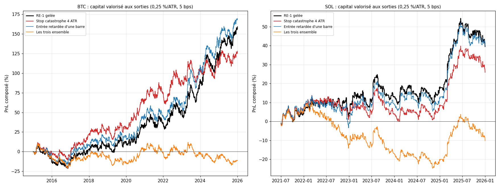

# EXP-D03.1 — Viabilité et sécurité de RE-1 : stop catastrophe, glissement des stops, latence (BTC, SOL)

*Demande du porteur du 2026-10-03, avant D04 : le moteur n'est pas rouvert, le but est la survie du capital
(`RESEARCH_LOG.md`, entrée EXP-D03.1). Calcul : `python experiments/D03_1/run_D03_1.py --calcul` (43 s). RE-1 gelée,
5 bps (10 bps en lecture), 0,25 % du capital par ATR14(t) ; BTC/USD Bitstamp 2015-2025, SOL/USD Coinbase 2021-2025.
Annexes générées en fin de document.*

## Verdict

- **Stop catastrophe à 4 ATR : une assurance réelle, au coût inégal selon la période.**
  - Il ne touche que des trades F2b (284 sur BTC, 98 sur SOL ; le SL-B de F3 est toujours plus proche).
  - La pire perte d'un trade passe de −6,2 % à −1,05 % du capital sur BTC, et de −3,3 % à −1,05 % sur SOL.
  - Sur BTC 2015-2025, son coût n'est pas significatif : −0,037 ATR [−0,118 ; +0,040], et le MDD passe de −28,4 % à
    −21,4 %.
  - Il coûte nettement sur la période récente et sur SOL : BTC 2020-2025, −0,121 ATR [−0,237 ; −0,006] et −5,2 points
    de rendement par an ; SOL, −9,9 bps [−20,4 ; −1,2] par trade et un Calmar de 0,34 contre 0,58.
  - Seule la période 2015-2019, la plus faible pour RE-1, en profite (+0,055 ATR, Calmar meilleur sur 91 % des
    chemins).
- **Glissement de 0,5 ATR sur les stops de F3 : le point faible de l'exécution.** 23 % des trades sortent sur stop :
  −0,115 ATR par trade sur BTC et −0,121 sur SOL, soit la moitié de l'espérance. Le Calmar tombe de 0,32 à 0,10 (BTC).
- **Entrée retardée d'une barre (30 min) : sans effet mesurable.** +0,014 ATR [−0,025 ; +0,056] sur BTC, +0,002 sur SOL.
  L'avantage ne tient pas à la vitesse d'exécution.
- **Les trois ensemble :** −0,221 ATR [−0,313 ; −0,137] sur BTC ; l'espérance tombe à −0,003.

## 1. Contrôles bloquants (passés)

- Ceux de D03 : RE-1 gelée BTC = D02 (2 075 trades), SOL = D01 (769), portefeuille d'une jambe = capital du dépôt.
- Un retard nul, un glissement nul et un stop catastrophe à distance infinie redonnent RE-1 gelée trade par trade.

## 2. Stop catastrophe à 4 ATR (5 bps)

| Série | PnL : 0,25 %/ATR ; 1x | Espérance ATR [IC] ; bps | MDD : 0,25 %/ATR ; 1x | Calmar | Pire trade (capital) |
|---|---|---|---|---|---|
| BTC 2015-2025, RE-1 gelée | +159 % ; +396 % | +0,218 [+0,032 ; +0,401] ; +10,2 | −28,4 % ; −53,0 % | 0,32 | −6,2 % |
| BTC 2015-2025, stop 4 ATR | +128 % ; +385 % | +0,180 [+0,012 ; +0,350] ; +9,8 | −21,4 % ; −42,5 % | 0,36 | −1,05 % |
| BTC 2020-2025, RE-1 gelée | +132 % ; +184 % | +0,357 [+0,086 ; +0,633] ; +11,7 | −13,5 % ; −43,9 % | 1,12 | |
| BTC 2020-2025, stop 4 ATR | +75 % ; +100 % | +0,235 [−0,000 ; +0,486] ; +8,3 | −14,8 % ; −39,9 % | 0,66 | |
| SOL 2021-2025, RE-1 gelée | +39 % ; +173 % | +0,190 [−0,079 ; +0,484] ; +19,2 | −13,1 % ; −42,3 % | 0,58 | −3,3 % |
| SOL 2021-2025, stop 4 ATR | +26 % ; +30 % | +0,135 [−0,117 ; +0,415] ; +9,3 | −15,2 % ; −64,6 % | 0,34 | −1,05 % |

- `[OBS]` **Trades coupés :** 13,7 % des trades sur BTC, 12,7 % sur SOL, tous F2b.
  - Ils font −4,13 ATR avec le stop, contre −3,86 sans lui ; 11 % auraient fini positifs (9 % sur SOL).
  - Sur BTC, le stop coupe 1 trade du top 1 % et 7 du top 5 % ; sur SOL, 0 et 1.
- `[OBS]` **Écart apparié par mois, BTC 2015-2025 :** rendement −1,3 point par an [−5,2 ; +2,3] ; MDD meilleur sur
  60 % des chemins réordonnés, Calmar sur 36 %.
- `[OBS]` **À 1x par position,** le stop réduit peu la pire perte, qui vient de trades à ATR élevé (−986 → −960 bps sur
  BTC), et il creuse le MDD de SOL (−42,3 % → −64,6 %).
- `[OBS]` **À 10 bps :** BTC +0,056 contre +0,093 ATR, Calmar 0,07 contre 0,09.

## 3. Glissement des stops et latence (5 bps)

| Série | PnL : 0,25 %/ATR ; 1x | Espérance ATR [IC] ; bps | MDD : 0,25 %/ATR ; 1x | Calmar |
|---|---|---|---|---|
| BTC, glissement de 0,5 ATR (stops de F3) | +45 % ; +39 % | +0,102 [−0,083 ; +0,290] ; +4,2 | −35,4 % ; −61,1 % | 0,10 |
| BTC, entrée retardée d'une barre | +170 % ; +259 % | +0,232 [+0,050 ; +0,412] ; +8,6 | −23,9 % ; −49,4 % | 0,39 |
| BTC, les trois ensemble | −11 % ; −56 % | −0,003 [−0,178 ; +0,169] ; −1,6 | −29,5 % ; −65,5 % | −0,04 |
| SOL, glissement de 0,5 ATR (stops de F3) | +10 % ; +13 % | +0,069 [−0,207 ; +0,369] ; +8,0 | −17,8 % ; −53,8 % | 0,12 |
| SOL, entrée retardée d'une barre | +40 % ; +179 % | +0,192 [−0,091 ; +0,499] ; +19,6 | −15,3 % ; −43,1 % | 0,49 |
| SOL, les trois ensemble | −10 % ; −67 % | −0,039 [−0,314 ; +0,262] ; −7,8 | −32,1 % ; −85,2 % | −0,07 |

- `[OBS]` **Glissement :** 478 trades de F3 stoppés sur 2 075 (23 %) sur BTC, 186 sur 769 sur SOL. Chaque 0,1 ATR de
  glissement sur ces stops coûte environ 0,023 ATR par trade ; l'espérance de BTC s'annulerait vers 0,95 ATR de
  glissement, celle de SOL vers 0,8 ATR.
- `[OBS]` **Latence :** 48 trades sur BTC et 8 sur SOL sortent aussitôt, leur stop étant déjà franchi à l'entrée
  retardée. L'effet est nul sur les deux périodes de BTC (+0,032 ATR en 2015-2019, −0,003 en 2020-2025).

## 4. Lecture

- `[HYP]` **La latence n'est pas un risque.** Une heure de retard (une barre) ne change rien : RE-1 n'exploite pas une
  micro-structure fugace.
- `[HYP]` **L'exécution des stops est le vrai risque.** Un quart des trades sortent sur stop ; la qualité de ces sorties
  (lieu, type d'ordre, liquidité dans les mouvements rapides) pèse plus que tout autre paramètre d'exécution mesuré. Le
  stop catastrophe ajoute 14 % de sorties sur stop, donc autant de sorties exposées au glissement.
- `[HYP]` **Le stop catastrophe est une assurance, pas une amélioration.** Il borne la perte d'un trade à environ 1 %
  du capital. L'historique ne contient pas le scénario qu'il couvre vraiment : un krach de 20 à 30 % pendant une
  position à 1x. Son prix est faible sur 2015-2025 entier, mais élevé sur 2020-2025 et sur SOL.

## 5. Arbitrages (au porteur)

1. **Stop catastrophe :** greffer ou non. Coût non significatif sur BTC 2015-2025, mais −0,121 ATR [−0,237 ; −0,006]
   sur 2020-2025 et −9,9 bps sur SOL. Autre assurance contre la ruine, sans sortie sur stop : un plafond de notionnel
   plus bas que 1x par position, à mesurer si tu le souhaites.
2. **Exécution des stops :** le lieu et le type d'ordre doivent être choisis pour limiter le glissement, mesuré en
   direct avant d'engager du capital.

---

# Annexes générées (`run_D03_1.py --calcul`, puis `--rapport`)

Calcul du 2026-10-03 01:00 UTC, commit `79be76f`, 43 s ; 32 comparaisons appariées publiées.

## A1. Contrôles bloquants (passés)

- RE-1 gelée BTC 2015-2025 : 2 075 trades identiques à D02.
- RE-1 gelée SOL : 769 trades identiques à run_re1 ; métriques de D01 à 1e-5 (5 et 10 bps).
- portefeuille une jambe : PnL et MDD identiques au capital valorisé de RE-1 gelée BTC (1e-10).
- controles_D03_1 : retard nul, glissement nul et stop catastrophe infini redonnent RE-1 gelée (BTC, SOL).

## A2. BTC

- Stop catastrophe : 284 trades touchés (13,7 % ; F2b 284, F3 0) ; leur espérance −4,13 ATR avec le stop, −3,86 sans ; 11 % auraient fini positifs sans lui ; top 1 % coupés : 1, top 5 % : 7 ; pire trade en capital (0,25 %/ATR) −6,19 % → −1,05 % ; pire trade à 1x −986 → −960 bps.
- Glissement : 478 trades de F3 stoppés (23,0 %) ; coût moyen 0,115 ATR par trade.
- Retard : 2 075 trades, dont 48 sorties immédiates (niveau déjà franchi) ; 0 signal perdu en fin de série.

**Effet trade par trade sur les mêmes signaux (variante − RE-1 gelée)**

| Variante | Trades | Effet ATR [IC] | Effet bps [IC] | F2b ; F3 (ATR) |
|---|---|---|---|---|
| Stop catastrophe 4 ATR | 2 075 | −0,037 [−0,118 ; +0,040] | −0,4 [−3,6 ; +2,7] | −0,068 ; +0,000 |
| Glissement 0,5 ATR (stops de F3) | 2 075 | −0,115 [−0,124 ; −0,106] | −6,0 [−6,7 ; −5,4] | +0,000 ; −0,256 |
| Entrée retardée d'une barre | 2 075 | +0,014 [−0,024 ; +0,055] | −1,6 [−4,7 ; +1,1] | +0,031 ; −0,007 |
| Les trois ensemble | 2 075 | −0,221 [−0,312 ; −0,137] | −11,8 [−16,2 ; −7,7] | −0,183 ; −0,267 |

**BTC 2015-2025 · 5 bps**

| Variante | PnL : 0,25 %/ATR ; 1x ; bps (1x) | PF (1x) | WR | Espérance ATR [IC] ; bps | MDD : 0,25 %/ATR ; 1x | Trades (/mois) | Durée médiane | Part des frais (1x) ; brut ; frais (ATR) | Calmar 0,25 %/ATR |
|---|---|---|---|---|---|---|---|---|---|
| RE-1 gelée | +159 % ; +396 % ; +21 149 | 1,15 | 43,9 % | +0,218 [+0,032 ; +0,401] ; +10,2 | −28,4 % ; −53,0 % | 2 075 (15,7) | 26 b ; 13 h | 33 % ; +0,34 ; 0,12 | 0,32 |
| Stop catastrophe 4 ATR | +128 % ; +385 % ; +20 384 | 1,15 | 42,5 % | +0,180 [+0,012 ; +0,350] ; +9,8 | −21,4 % ; −42,5 % | 2 075 (15,7) | 26 b ; 13 h | 34 % ; +0,30 ; 0,12 | 0,36 |
| Glissement 0,5 ATR (stops de F3) | +45 % ; +39 % ; +8 629 | 1,06 | 43,9 % | +0,102 [−0,083 ; +0,290] ; +4,2 | −35,4 % ; −61,1 % | 2 075 (15,7) | 26 b ; 13 h | 55 % ; +0,23 ; 0,12 | 0,10 |
| Entrée retardée d'une barre | +170 % ; +259 % ; +17 886 | 1,12 | 43,6 % | +0,232 [+0,050 ; +0,412] ; +8,6 | −23,9 % ; −49,4 % | 2 075 (15,7) | 26 b ; 13 h | 37 % ; +0,36 ; 0,12 | 0,39 |
| Les trois ensemble | −11 % ; −56 % ; −3 294 | 0,98 | 42,0 % | −0,003 [−0,178 ; +0,169] ; −1,6 | −29,5 % ; −65,5 % | 2 075 (15,7) | 26 b ; 13 h | 147 % ; +0,12 ; 0,12 | −0,04 |

| A contre B | Δ espérance ATR [IC] | Δ espérance bps [IC] | Δ rendement annuel [IC] | Δ MDD sorties (plage) ; part A mieux | Δ Calmar sorties (plage) ; part A mieux | Verdict |
|---|---|---|---|---|---|---|
| Stop catastrophe 4 ATR / RE-1 gelée | −0,037 [−0,118 ; +0,040] | −0,4 [−3,6 ; +2,7] | −1,3 % [−5,2 % ; +2,3 %] | +7,1 % [−7,6 % ; +10,3 %] ; 60 % | +0,05 [−0,33 ; +0,22] ; 36 % | non |
| Glissement 0,5 ATR (stops de F3) / RE-1 gelée | −0,115 [−0,124 ; −0,106] | −6,0 [−6,7 ; −5,4] | −5,6 % [−6,1 % ; −5,1 %] | −7,2 % [−19,9 % ; −2,6 %] ; 0 % | −0,23 [−0,52 ; −0,10] ; 0 % | non |
| Entrée retardée d'une barre / RE-1 gelée | +0,014 [−0,025 ; +0,056] | −1,6 [−4,7 ; +1,2] | +0,4 % [−1,6 % ; +2,4 %] | +4,1 % [−3,6 % ; +6,7 %] ; 67 % | +0,08 [−0,12 ; +0,22] ; 70 % | non |
| Les trois ensemble / RE-1 gelée | −0,221 [−0,313 ; −0,137] | −11,8 [−16,1 ; −7,7] | −10,1 % [−14,4 % ; −6,2 %] | −1,2 % [−36,3 % ; −2,0 %] ; 1 % | −0,37 [−0,89 ; −0,13] ; 0 % | non |

**BTC 2015-2025 · 10 bps**

| Variante | PnL : 0,25 %/ATR ; 1x ; bps (1x) | PF (1x) | WR | Espérance ATR [IC] ; bps | MDD : 0,25 %/ATR ; 1x | Trades (/mois) | Durée médiane | Part des frais (1x) ; brut ; frais (ATR) | Calmar 0,25 %/ATR |
|---|---|---|---|---|---|---|---|---|---|
| RE-1 gelée | +43 % ; +76 % ; +10 774 | 1,07 | 42,6 % | +0,093 [−0,094 ; +0,277] ; +5,2 | −36,3 % ; −60,8 % | 2 075 (15,7) | 26 b ; 13 h | 66 % ; +0,34 ; 0,25 | 0,09 |
| Stop catastrophe 4 ATR | +26 % ; +72 % ; +10 009 | 1,07 | 41,3 % | +0,056 [−0,115 ; +0,227] ; +4,8 | −30,1 % ; −52,0 % | 2 075 (15,7) | 26 b ; 13 h | 67 % ; +0,30 ; 0,25 | 0,07 |
| Glissement 0,5 ATR (stops de F3) | −20 % ; −51 % ; −1 746 | 0,99 | 42,6 % | −0,022 [−0,208 ; +0,168] ; −0,8 | −43,7 % ; −69,1 % | 2 075 (15,7) | 26 b ; 13 h | 109 % ; +0,23 ; 0,25 | −0,04 |
| Entrée retardée d'une barre | +49 % ; +27 % ; +7 511 | 1,05 | 41,8 % | +0,107 [−0,076 ; +0,290] ; +3,6 | −32,3 % ; −57,8 % | 2 075 (15,7) | 26 b ; 13 h | 73 % ; +0,36 ; 0,25 | 0,12 |
| Les trois ensemble | −51 % ; −85 % ; −13 669 | 0,92 | 40,3 % | −0,128 [−0,303 ; +0,049] ; −6,6 | −57,8 % ; −87,1 % | 2 075 (15,7) | 26 b ; 13 h | 293 % ; +0,12 ; 0,25 | −0,11 |

| A contre B | Δ espérance ATR [IC] | Δ espérance bps [IC] | Δ rendement annuel [IC] | Δ MDD sorties (plage) ; part A mieux | Δ Calmar sorties (plage) ; part A mieux | Verdict |
|---|---|---|---|---|---|---|
| Stop catastrophe 4 ATR / RE-1 gelée | −0,037 [−0,118 ; +0,040] | −0,4 [−3,6 ; +2,7] | −1,2 % [−4,9 % ; +2,2 %] | +6,5 % [−12,3 % ; +10,6 %] ; 50 % | −0,02 [−0,22 ; +0,10] ; 27 % | non |
| Glissement 0,5 ATR (stops de F3) / RE-1 gelée | −0,115 [−0,124 ; −0,106] | −6,0 [−6,7 ; −5,4] | −5,3 % [−5,8 % ; −4,8 %] | −7,6 % [−24,8 % ; −3,9 %] ; 0 % | −0,14 [−0,34 ; −0,05] ; 0 % | non |
| Entrée retardée d'une barre / RE-1 gelée | +0,014 [−0,025 ; +0,056] | −1,6 [−4,7 ; +1,2] | +0,4 % [−1,5 % ; +2,3 %] | +4,1 % [−4,3 % ; +8,5 %] ; 70 % | +0,02 [−0,07 ; +0,13] ; 69 % | non |
| Les trois ensemble / RE-1 gelée | −0,221 [−0,313 ; −0,137] | −11,8 [−16,1 ; −7,7] | −9,6 % [−13,6 % ; −5,9 %] | −21,9 % [−42,8 % ; −6,1 %] ; 0 % | −0,20 [−0,55 ; −0,07] ; 0 % | non |

**BTC 2015-2019 · 5 bps**

| Variante | PnL : 0,25 %/ATR ; 1x ; bps (1x) | PF (1x) | WR | Espérance ATR [IC] ; bps | MDD : 0,25 %/ATR ; 1x | Trades (/mois) | Durée médiane | Part des frais (1x) ; brut ; frais (ATR) | Calmar 0,25 %/ATR |
|---|---|---|---|---|---|---|---|---|---|
| RE-1 gelée | +12 % ; +74 % ; +8 455 | 1,11 | 43,6 % | +0,064 [−0,158 ; +0,308] ; +8,6 | −28,4 % ; −53,0 % | 988 (16,5) | 26 b ; 13 h | 37 % ; +0,18 ; 0,11 | 0,08 |
| Stop catastrophe 4 ATR | +30 % ; +142 % ; +11 415 | 1,16 | 42,5 % | +0,119 [−0,100 ; +0,357] ; +11,6 | −21,4 % ; −42,5 % | 988 (16,5) | 26 b ; 13 h | 30 % ; +0,23 ; 0,11 | 0,25 |
| Glissement 0,5 ATR (stops de F3) | −15 % ; −7 % ; +2 264 | 1,03 | 43,6 % | −0,046 [−0,274 ; +0,201] ; +2,3 | −35,4 % ; −61,1 % | 988 (16,5) | 26 b ; 13 h | 69 % ; +0,07 ; 0,11 | −0,09 |
| Entrée retardée d'une barre | +19 % ; +42 % ; +6 438 | 1,09 | 42,8 % | +0,097 [−0,122 ; +0,336] ; +6,5 | −23,9 % ; −49,4 % | 988 (16,5) | 26 b ; 13 h | 43 % ; +0,21 ; 0,11 | 0,15 |
| Les trois ensemble | −14 % ; −33 % ; −1 154 | 0,99 | 41,8 % | −0,045 [−0,270 ; +0,189] ; −1,2 | −29,5 % ; −53,8 % | 988 (16,5) | 26 b ; 13 h | 130 % ; +0,07 ; 0,11 | −0,10 |

| A contre B | Δ espérance ATR [IC] | Δ espérance bps [IC] | Δ rendement annuel [IC] | Δ MDD sorties (plage) ; part A mieux | Δ Calmar sorties (plage) ; part A mieux | Verdict |
|---|---|---|---|---|---|---|
| Stop catastrophe 4 ATR / RE-1 gelée | +0,055 [−0,028 ; +0,143] | +3,0 [−1,5 ; +7,3] | +3,2 % [−1,1 % ; +7,8 %] | +7,1 % [−3,1 % ; +15,0 %] ; 85 % | +0,19 [−0,07 ; +0,68] ; 91 % | non |
| Glissement 0,5 ATR (stops de F3) / RE-1 gelée | −0,111 [−0,125 ; −0,098] | −6,3 [−7,2 ; −5,4] | −5,4 % [−6,1 % ; −4,7 %] | −7,2 % [−15,5 % ; −2,1 %] ; 0 % | −0,17 [−0,54 ; −0,04] ; 0 % | non |
| Entrée retardée d'une barre / RE-1 gelée | +0,032 [−0,027 ; +0,093] | −2,0 [−8,0 ; +3,0] | +1,3 % [−1,6 % ; +4,1 %] | +4,1 % [−3,4 % ; +7,8 %] ; 72 % | +0,07 [−0,10 ; +0,30] ; 81 % | non |
| Les trois ensemble / RE-1 gelée | −0,110 [−0,206 ; −0,018] | −9,7 [−16,5 ; −3,6] | −5,2 % [−9,8 % ; −0,7 %] | −1,2 % [−19,2 % ; +3,1 %] ; 11 % | −0,19 [−0,66 ; −0,01] ; 1 % | non |

**BTC 2015-2019 · 10 bps**

| Variante | PnL : 0,25 %/ATR ; 1x ; bps (1x) | PF (1x) | WR | Espérance ATR [IC] ; bps | MDD : 0,25 %/ATR ; 1x | Trades (/mois) | Durée médiane | Part des frais (1x) ; brut ; frais (ATR) | Calmar 0,25 %/ATR |
|---|---|---|---|---|---|---|---|---|---|
| RE-1 gelée | −14 % ; +6 % ; +3 515 | 1,05 | 42,4 % | −0,047 [−0,273 ; +0,196] ; +3,6 | −36,3 % ; −60,8 % | 988 (16,5) | 26 b ; 13 h | 74 % ; +0,18 ; 0,22 | −0,08 |
| Stop catastrophe 4 ATR | −0 % ; +48 % ; +6 475 | 1,09 | 41,5 % | +0,008 [−0,215 ; +0,250] ; +6,6 | −30,1 % ; −52,0 % | 988 (16,5) | 26 b ; 13 h | 60 % ; +0,23 ; 0,22 | −0,00 |
| Glissement 0,5 ATR (stops de F3) | −35 % ; −43 % ; −2 676 | 0,97 | 42,4 % | −0,158 [−0,389 ; +0,092] ; −2,7 | −43,4 % ; −67,6 % | 988 (16,5) | 26 b ; 13 h | 137 % ; +0,07 ; 0,22 | −0,19 |
| Entrée retardée d'une barre | −9 % ; −13 % ; +1 498 | 1,02 | 41,4 % | −0,015 [−0,234 ; +0,225] ; +1,5 | −32,3 % ; −57,8 % | 988 (16,5) | 26 b ; 13 h | 87 % ; +0,21 ; 0,22 | −0,06 |
| Les trois ensemble | −34 % ; −59 % ; −6 094 | 0,93 | 40,4 % | −0,157 [−0,379 ; +0,077] ; −6,2 | −42,1 % ; −66,0 % | 988 (16,5) | 26 b ; 13 h | 261 % ; +0,07 ; 0,22 | −0,19 |

| A contre B | Δ espérance ATR [IC] | Δ espérance bps [IC] | Δ rendement annuel [IC] | Δ MDD sorties (plage) ; part A mieux | Δ Calmar sorties (plage) ; part A mieux | Verdict |
|---|---|---|---|---|---|---|
| Stop catastrophe 4 ATR / RE-1 gelée | +0,055 [−0,028 ; +0,143] | +3,0 [−1,5 ; +7,3] | +3,0 % [−1,0 % ; +7,4 %] | +6,5 % [−3,3 % ; +16,6 %] ; 86 % | +0,08 [−0,04 ; +0,42] ; 91 % | non |
| Glissement 0,5 ATR (stops de F3) / RE-1 gelée | −0,111 [−0,125 ; −0,098] | −6,3 [−7,2 ; −5,4] | −5,1 % [−5,8 % ; −4,5 %] | −6,9 % [−16,0 % ; −3,3 %] ; 0 % | −0,11 [−0,34 ; −0,03] ; 0 % | non |
| Entrée retardée d'une barre / RE-1 gelée | +0,032 [−0,027 ; +0,093] | −2,0 [−8,0 ; +3,0] | +1,3 % [−1,5 % ; +3,9 %] | +4,1 % [−3,6 % ; +9,0 %] ; 76 % | +0,03 [−0,06 ; +0,20] ; 81 % | non |
| Les trois ensemble / RE-1 gelée | −0,110 [−0,206 ; −0,018] | −9,7 [−16,5 ; −3,6] | −5,0 % [−9,3 % ; −0,7 %] | −5,8 % [−21,4 % ; +1,9 %] ; 6 % | −0,11 [−0,41 ; −0,01] ; 1 % | non |

**BTC 2020-2025 · 5 bps**

| Variante | PnL : 0,25 %/ATR ; 1x ; bps (1x) | PF (1x) | WR | Espérance ATR [IC] ; bps | MDD : 0,25 %/ATR ; 1x | Trades (/mois) | Durée médiane | Part des frais (1x) ; brut ; frais (ATR) | Calmar 0,25 %/ATR |
|---|---|---|---|---|---|---|---|---|---|
| RE-1 gelée | +132 % ; +184 % ; +12 694 | 1,18 | 44,2 % | +0,357 [+0,086 ; +0,633] ; +11,7 | −13,5 % ; −43,9 % | 1 087 (15,1) | 26 b ; 13 h | 30 % ; +0,49 ; 0,14 | 1,12 |
| Stop catastrophe 4 ATR | +75 % ; +100 % ; +8 969 | 1,13 | 42,4 % | +0,235 [−0,000 ; +0,486] ; +8,3 | −14,8 % ; −39,9 % | 1 087 (15,1) | 26 b ; 13 h | 38 % ; +0,37 ; 0,14 | 0,66 |
| Glissement 0,5 ATR (stops de F3) | +70 % ; +49 % ; +6 365 | 1,08 | 44,2 % | +0,238 [−0,039 ; +0,520] ; +5,9 | −17,7 % ; −51,3 % | 1 087 (15,1) | 26 b ; 13 h | 46 % ; +0,37 ; 0,14 | 0,52 |
| Entrée retardée d'une barre | +126 % ; +152 % ; +11 448 | 1,17 | 44,3 % | +0,354 [+0,082 ; +0,621] ; +10,5 | −13,6 % ; −44,1 % | 1 087 (15,1) | 26 b ; 13 h | 32 % ; +0,49 ; 0,14 | 1,07 |
| Les trois ensemble | +4 % ; −35 % ; −2 140 | 0,97 | 42,2 % | +0,034 [−0,212 ; +0,288] ; −2,0 | −26,5 % ; −63,6 % | 1 087 (15,1) | 26 b ; 13 h | 165 % ; +0,17 ; 0,14 | 0,02 |

| A contre B | Δ espérance ATR [IC] | Δ espérance bps [IC] | Δ rendement annuel [IC] | Δ MDD sorties (plage) ; part A mieux | Δ Calmar sorties (plage) ; part A mieux | Verdict |
|---|---|---|---|---|---|---|
| Stop catastrophe 4 ATR / RE-1 gelée | −0,121 [−0,237 ; −0,006] | −3,4 [−7,7 ; +0,8] | −5,2 % [−10,8 % ; −0,1 %] | −1,8 % [−9,5 % ; +5,1 %] ; 36 % | −0,50 [−1,09 ; +0,11] ; 7 % | non |
| Glissement 0,5 ATR (stops de F3) / RE-1 gelée | −0,119 [−0,132 ; −0,106] | −5,8 [−6,8 ; −4,9] | −5,8 % [−6,6 % ; −5,1 %] | −4,3 % [−11,0 % ; −1,4 %] ; 0 % | −0,63 [−0,93 ; −0,17] ; 0 % | non |
| Entrée retardée d'une barre / RE-1 gelée | −0,003 [−0,057 ; +0,049] | −1,1 [−3,9 ; +1,5] | −0,5 % [−3,3 % ; +2,2 %] | −0,3 % [−3,4 % ; +4,6 %] ; 62 % | −0,06 [−0,39 ; +0,37] ; 49 % | non |
| Les trois ensemble / RE-1 gelée | −0,322 [−0,459 ; −0,193] | −13,6 [−18,9 ; −8,2] | −14,4 % [−21,0 % ; −8,7 %] | −13,3 % [−29,0 % ; −1,3 %] ; 1 % | −1,15 [−2,02 ; −0,25] ; 0 % | non |

**BTC 2020-2025 · 10 bps**

| Variante | PnL : 0,25 %/ATR ; 1x ; bps (1x) | PF (1x) | WR | Espérance ATR [IC] ; bps | MDD : 0,25 %/ATR ; 1x | Trades (/mois) | Durée médiane | Part des frais (1x) ; brut ; frais (ATR) | Calmar 0,25 %/ATR |
|---|---|---|---|---|---|---|---|---|---|
| RE-1 gelée | +67 % ; +65 % ; +7 259 | 1,10 | 42,7 % | +0,221 [−0,054 ; +0,503] ; +6,7 | −15,9 % ; −48,0 % | 1 087 (15,1) | 26 b ; 13 h | 60 % ; +0,49 ; 0,27 | 0,56 |
| Stop catastrophe 4 ATR | +27 % ; +16 % ; +3 534 | 1,05 | 41,0 % | +0,100 [−0,132 ; +0,353] ; +3,3 | −19,2 % ; −44,3 % | 1 087 (15,1) | 26 b ; 13 h | 75 % ; +0,37 ; 0,27 | 0,21 |
| Glissement 0,5 ATR (stops de F3) | +23 % ; −13 % ; +930 | 1,01 | 42,7 % | +0,102 [−0,177 ; +0,390] ; +0,9 | −20,0 % ; −54,9 % | 1 087 (15,1) | 26 b ; 13 h | 92 % ; +0,37 ; 0,27 | 0,17 |
| Entrée retardée d'une barre | +63 % ; +46 % ; +6 013 | 1,08 | 42,1 % | +0,218 [−0,057 ; +0,490] ; +5,5 | −14,8 % ; −48,2 % | 1 087 (15,1) | 26 b ; 13 h | 64 % ; +0,49 ; 0,27 | 0,58 |
| Les trois ensemble | −25 % ; −62 % ; −7 575 | 0,91 | 40,3 % | −0,101 [−0,351 ; +0,155] ; −7,0 | −42,1 % ; −75,8 % | 1 087 (15,1) | 26 b ; 13 h | 330 % ; +0,17 ; 0,27 | −0,11 |

| A contre B | Δ espérance ATR [IC] | Δ espérance bps [IC] | Δ rendement annuel [IC] | Δ MDD sorties (plage) ; part A mieux | Δ Calmar sorties (plage) ; part A mieux | Verdict |
|---|---|---|---|---|---|---|
| Stop catastrophe 4 ATR / RE-1 gelée | −0,121 [−0,237 ; −0,006] | −3,4 [−7,7 ; +0,8] | −5,0 % [−10,2 % ; −0,1 %] | −3,0 % [−13,0 % ; +5,0 %] ; 28 % | −0,37 [−0,81 ; +0,03] ; 4 % | non |
| Glissement 0,5 ATR (stops de F3) / RE-1 gelée | −0,119 [−0,132 ; −0,106] | −5,8 [−6,8 ; −4,9] | −5,5 % [−6,2 % ; −4,8 %] | −4,2 % [−14,5 % ; −1,7 %] ; 0 % | −0,41 [−0,69 ; −0,09] ; 0 % | non |
| Entrée retardée d'une barre / RE-1 gelée | −0,003 [−0,057 ; +0,049] | −1,1 [−3,9 ; +1,5] | −0,4 % [−3,1 % ; +2,1 %] | +1,1 % [−4,2 % ; +5,7 %] ; 61 % | +0,01 [−0,26 ; +0,22] ; 44 % | non |
| Les trois ensemble / RE-1 gelée | −0,322 [−0,459 ; −0,193] | −13,6 [−18,9 ; −8,2] | −13,7 % [−19,9 % ; −8,3 %] | −26,8 % [−36,4 % ; −3,3 %] ; 0 % | −0,70 [−1,46 ; −0,13] ; 0 % | non |

## A3. SOL

- Stop catastrophe : 98 trades touchés (12,7 % ; F2b 98, F3 0) ; leur espérance −4,07 ATR avec le stop, −3,64 sans ; 9 % auraient fini positifs sans lui ; top 1 % coupés : 0, top 5 % : 1 ; pire trade en capital (0,25 %/ATR) −3,34 % → −1,05 % ; pire trade à 1x −1545 → −1051 bps.
- Glissement : 186 trades de F3 stoppés (24,2 %) ; coût moyen 0,121 ATR par trade.
- Retard : 769 trades, dont 8 sorties immédiates (niveau déjà franchi) ; 0 signal perdu en fin de série.

**Effet trade par trade sur les mêmes signaux (variante − RE-1 gelée)**

| Variante | Trades | Effet ATR [IC] | Effet bps [IC] | F2b ; F3 (ATR) |
|---|---|---|---|---|
| Stop catastrophe 4 ATR | 769 | −0,054 [−0,128 ; +0,021] | −9,9 [−20,5 ; −1,0] | −0,101 ; +0,000 |
| Glissement 0,5 ATR (stops de F3) | 769 | −0,121 [−0,139 ; −0,102] | −11,2 [−13,3 ; −9,1] | +0,000 ; −0,263 |
| Entrée retardée d'une barre | 769 | +0,002 [−0,061 ; +0,067] | +0,5 [−4,7 ; +5,9] | +0,021 ; −0,020 |
| Les trois ensemble | 769 | −0,228 [−0,321 ; −0,129] | −27,0 [−39,8 ; −15,5] | −0,181 ; −0,284 |

**SOL 2021-2025 · 5 bps**

| Variante | PnL : 0,25 %/ATR ; 1x ; bps (1x) | PF (1x) | WR | Espérance ATR [IC] ; bps | MDD : 0,25 %/ATR ; 1x | Trades (/mois) | Durée médiane | Part des frais (1x) ; brut ; frais (ATR) | Calmar 0,25 %/ATR |
|---|---|---|---|---|---|---|---|---|---|
| RE-1 gelée | +39 % ; +173 % ; +14 747 | 1,17 | 44,1 % | +0,190 [−0,079 ; +0,484] ; +19,2 | −13,1 % ; −42,3 % | 769 (14,0) | 26 b ; 13 h | 21 % ; +0,25 ; 0,06 | 0,58 |
| Stop catastrophe 4 ATR | +26 % ; +30 % ; +7 170 | 1,08 | 42,9 % | +0,135 [−0,117 ; +0,415] ; +9,3 | −15,2 % ; −64,6 % | 769 (14,0) | 26 b ; 13 h | 35 % ; +0,20 ; 0,06 | 0,34 |
| Glissement 0,5 ATR (stops de F3) | +10 % ; +13 % ; +6 145 | 1,06 | 44,1 % | +0,069 [−0,207 ; +0,369] ; +8,0 | −17,8 % ; −53,8 % | 769 (14,0) | 26 b ; 13 h | 38 % ; +0,13 ; 0,06 | 0,12 |
| Entrée retardée d'une barre | +40 % ; +179 % ; +15 101 | 1,17 | 43,4 % | +0,192 [−0,091 ; +0,499] ; +19,6 | −15,3 % ; −43,1 % | 769 (14,0) | 26 b ; 13 h | 20 % ; +0,25 ; 0,06 | 0,49 |
| Les trois ensemble | −10 % ; −67 % ; −6 005 | 0,94 | 41,9 % | −0,039 [−0,314 ; +0,262] ; −7,8 | −32,1 % ; −85,2 % | 769 (14,0) | 26 b ; 13 h | brut ≤ 0 ; +0,02 ; 0,06 | −0,07 |

| A contre B | Δ espérance ATR [IC] | Δ espérance bps [IC] | Δ rendement annuel [IC] | Δ MDD sorties (plage) ; part A mieux | Δ Calmar sorties (plage) ; part A mieux | Verdict |
|---|---|---|---|---|---|---|
| Stop catastrophe 4 ATR / RE-1 gelée | −0,054 [−0,125 ; +0,017] | −9,9 [−20,4 ; −1,2] | −2,4 % [−5,7 % ; +0,8 %] | −2,4 % [−7,0 % ; +4,5 %] ; 42 % | −0,26 [−0,64 ; +0,17] ; 15 % | non |
| Glissement 0,5 ATR (stops de F3) / RE-1 gelée | −0,121 [−0,138 ; −0,104] | −11,2 [−13,3 ; −9,2] | −5,3 % [−6,2 % ; −4,6 %] | −5,0 % [−13,9 % ; −1,6 %] ; 0 % | −0,47 [−0,84 ; −0,08] ; 0 % | non |
| Entrée retardée d'une barre / RE-1 gelée | +0,002 [−0,059 ; +0,065] | +0,5 [−4,8 ; +5,8] | +0,0 % [−2,8 % ; +3,0 %] | −2,4 % [−6,2 % ; +3,7 %] ; 30 % | −0,10 [−0,38 ; +0,33] ; 41 % | non |
| Les trois ensemble / RE-1 gelée | −0,228 [−0,321 ; −0,132] | −27,0 [−40,4 ; −15,9] | −9,9 % [−14,3 % ; −5,7 %] | −19,4 % [−26,2 % ; −1,3 %] ; 1 % | −0,67 [−1,41 ; −0,11] ; 0 % | non |

**SOL 2021-2025 · 10 bps**

| Variante | PnL : 0,25 %/ATR ; 1x ; bps (1x) | PF (1x) | WR | Espérance ATR [IC] ; bps | MDD : 0,25 %/ATR ; 1x | Trades (/mois) | Durée médiane | Part des frais (1x) ; brut ; frais (ATR) | Calmar 0,25 %/ATR |
|---|---|---|---|---|---|---|---|---|---|
| RE-1 gelée | +24 % ; +86 % ; +10 902 | 1,12 | 43,4 % | +0,129 [−0,140 ; +0,425] ; +14,2 | −15,2 % ; −44,4 % | 769 (14,0) | 26 b ; 13 h | 41 % ; +0,25 ; 0,12 | 0,32 |
| Stop catastrophe 4 ATR | +12 % ; −11 % ; +3 324 | 1,04 | 42,3 % | +0,075 [−0,179 ; +0,354] ; +4,3 | −17,8 % ; −70,7 % | 769 (14,0) | 26 b ; 13 h | 70 % ; +0,20 ; 0,12 | 0,14 |
| Glissement 0,5 ATR (stops de F3) | −2 % ; −23 % ; +2 300 | 1,02 | 43,4 % | +0,008 [−0,268 ; +0,310] ; +3,0 | −21,5 % ; −64,9 % | 769 (14,0) | 26 b ; 13 h | 77 % ; +0,13 ; 0,12 | −0,02 |
| Entrée retardée d'une barre | +24 % ; +90 % ; +11 256 | 1,12 | 42,9 % | +0,131 [−0,154 ; +0,439] ; +14,6 | −17,1 % ; −45,2 % | 769 (14,0) | 26 b ; 13 h | 41 % ; +0,25 ; 0,12 | 0,28 |
| Les trois ensemble | −20 % ; −78 % ; −9 850 | 0,91 | 41,5 % | −0,099 [−0,375 ; +0,202] ; −12,8 | −36,8 % ; −88,7 % | 769 (14,0) | 26 b ; 13 h | brut ≤ 0 ; +0,02 ; 0,12 | −0,13 |

| A contre B | Δ espérance ATR [IC] | Δ espérance bps [IC] | Δ rendement annuel [IC] | Δ MDD sorties (plage) ; part A mieux | Δ Calmar sorties (plage) ; part A mieux | Verdict |
|---|---|---|---|---|---|---|
| Stop catastrophe 4 ATR / RE-1 gelée | −0,054 [−0,125 ; +0,017] | −9,9 [−20,4 ; −1,2] | −2,3 % [−5,6 % ; +0,8 %] | −2,6 % [−7,9 % ; +4,6 %] ; 37 % | −0,18 [−0,55 ; +0,10] ; 12 % | non |
| Glissement 0,5 ATR (stops de F3) / RE-1 gelée | −0,121 [−0,138 ; −0,104] | −11,2 [−13,3 ; −9,2] | −5,2 % [−6,1 % ; −4,5 %] | −6,2 % [−14,5 % ; −2,0 %] ; 0 % | −0,34 [−0,70 ; −0,05] ; 0 % | non |
| Entrée retardée d'une barre / RE-1 gelée | +0,002 [−0,059 ; +0,065] | +0,5 [−4,8 ; +5,8] | +0,0 % [−2,7 % ; +2,9 %] | −1,9 % [−6,3 % ; +4,1 %] ; 33 % | −0,03 [−0,29 ; +0,27] ; 44 % | non |
| Les trois ensemble / RE-1 gelée | −0,228 [−0,321 ; −0,132] | −27,0 [−40,4 ; −15,9] | −9,6 % [−14,0 % ; −5,5 %] | −21,7 % [−26,6 % ; −2,0 %] ; 1 % | −0,45 [−1,18 ; −0,08] ; 0 % | non |

## A4. Figure

