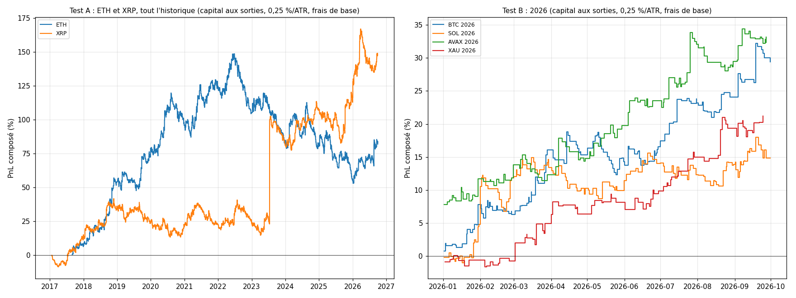

# EXP-D04 — Épreuve de la réserve : RE-1 version finale sur ETH, XRP et 2026

*Directive du porteur du 2026-10-03 (`RESEARCH_LOG.md`, EXP-D04). Protocole et code pré-enregistrés dans le commit local
4c549ba, avant tout téléchargement. Trois corrections ont été consignées et commitées avant la lecture des résultats :
9aa265f, téléchargeur Bitstamp ; edbd25e, minutes de l'or en conflit ; c4207f8, contrôle de fin d'échantillon.
Calcul : `python experiments/D04/run_D04.py --calcul` (121 s). Moteur : RE-1 version finale (`strategy.final`), c'est-à-dire
RE-1 gelée et un stop catastrophe à 4 ATR. Capital à 0,25 % par ATR14(t), levier ≤ 1x. Annexes générées en fin de
document.*

## Verdict selon la règle du porteur

- **Condition 1 — espérance nette > 0 sur ETH et sur XRP (5 bps, estimation ponctuelle) : remplie.**
  - ETH : +0,183 ATR [−0,010 ; +0,385], soit +10,4 bps.
  - XRP : +0,263 ATR [−0,014 ; +0,640], soit +16,0 bps [+0,1 ; +32,9].
  - En ATR, les deux IC frôlent zéro sans l'exclure.
- **Condition 2 — survie à 2026 (BTC, SOL, AVAX, or), jugée par le porteur sur les mesures.**
  - Les quatre actifs finissent la période en gain, de +15 % à +32 % à 0,25 %/ATR.
  - MDD de −3,1 % à −6,9 % ; pire journée UTC de −1,1 % à −1,8 % (−2,0 % au pire avec les extrêmes des barres).
  - Aucun trade ne perd plus de 1,04 % du capital.
- **Lecture littérale de la règle : validée pour la production.** La décision revient au porteur ; les nuances sont
  au §5.

## 1. Test A — ETH et XRP, tout l'historique (5 bps)

| Série | PnL : 0,25 %/ATR ; 1x ; bps | PF | WR | Espérance ATR [IC] ; bps | MDD : 0,25 %/ATR ; 1x | Trades (/mois) | Durée | Frais/brut | Calmar |
|---|---|---|---|---|---|---|---|---|---|
| ETH 2017-08 → 2026-09 | +82 % ; +155 % ; +15 802 | 1,11 | 42,0 % | +0,183 [−0,010 ; +0,385] ; +10,4 | −39,1 % ; −72,1 % | 1 525 (14,0) | 26 b (13 h) | 33 % | 0,17 |
| XRP 2016-12 → 2026-09 | +148 % ; +354 % ; +26 975 | 1,15 | 43,3 % | +0,263 [−0,014 ; +0,640] ; +16,0 | −20,9 % ; −61,7 % | 1 689 (14,5) | 26 b (13 h) | 24 % | 0,47 |

- `[OBS]` **Même profil que sur BTC.**
  - Le trade médian perd : −0,97 ATR (ETH), −0,65 (XRP).
  - Les deux sous-familles gagnent : F3 +0,326 et +0,388 ATR ; F2b +0,054 et +0,147.
  - 37 à 40 % des trades sortent sur stop ; 12 à 16 % des trades, sur le stop catastrophe.
- `[OBS]` **À 10 bps :** ETH +0,088 ATR [−0,107 ; +0,292], XRP +0,181 [−0,100 ; +0,555].
- `[OBS]` **Par année d'entrée (annexe A3) :**
  - ETH est positif 7 années sur 10, dont 2024 à peine (+0,031). Son avantage tient à 2017-2021 (2018 : +0,951
    [+0,396 ; +1,589]).
  - ETH est négatif en 2022, 2023 et 2025 (−0,35 en 2025) et positif en 2026 (+0,479 [+0,058 ; +0,847]).
  - XRP est positif 8 années sur 10 ; seules 2019 et 2020 sont légèrement négatives.

## 2. Test B — 2026, janvier à septembre (5 bps ; or 4 bps)

| Série | PnL : 0,25 %/ATR ; 1x ; bps | PF | WR | Espérance ATR [IC] ; bps | MDD : 0,25 %/ATR ; 1x | Trades (/mois) | Frais/brut | Calmar |
|---|---|---|---|---|---|---|---|---|
| BTC | +29 % ; +52 % ; +4 358 | 1,83 | 48,1 % | +0,705 [+0,045 ; +1,469] ; +32,3 | −6,9 % ; −8,6 % | 135 (15,0) | 13 % | 5,92 |
| SOL | +15 % ; +36 % ; +3 473 | 1,37 | 44,2 % | +0,410 [−0,081 ; +0,997] ; +25,2 | −6,0 % ; −19,6 % | 138 (15,3) | 17 % | 3,37 |
| AVAX | +32 % ; +61 % ; +5 097 | 1,75 | 53,2 % | +1,059 [+0,328 ; +1,784] ; +46,8 | −4,7 % ; −9,9 % | 109 (12,1) | 10 % | 9,63 |
| Or (→ 24 sept.) | +21 % ; +26 % ; +2 371 | 1,89 | 55,6 % | +0,987 [+0,449 ; +1,479] ; +29,3 | −3,1 % ; −5,6 % | 81 (9,0) | 12 % | 9,40 |

- `[OBS]` **Hors norme pour RE-1 :** 2026 est la période la plus favorable mesurée, sur les quatre actifs à la fois.
  - Espérances : +0,41 à +1,06 ATR, contre +0,180 pour BTC 2015-2025 avec le stop.
  - L'or, au net nul en échantillon (brut absorbé par les frais, K11-K12), fait +0,99 ATR (brut +1,13).
  - Trois IC excluent zéro.
  - À frais doublés : +0,31 à +0,97 ATR.
- `[OBS]` **Durée médiane :** 26 barres partout.

## 3. Survie (annexe A5)

- `[OBS]` **Pire trade, à 0,25 %/ATR :** −1,04 % du capital sur les quatre actifs de 2026 (tous des F2b au stop
  catastrophe) ; −1,05 % sur ETH ; −1,21 % sur XRP (F3 traversé par un gap en janvier 2017, marché naissant).
- `[OBS]` **Pire journée UTC, capital valorisé à minuit :**
  - 2026 : −1,18 % (BTC), −1,83 % (SOL), −1,11 % (AVAX), −1,48 % (or) ;
  - ETH −3,03 % le 2020-08-02 ; XRP −2,57 % le 2022-05-16.
- `[OBS]` **La journée d'ETH vient d'un gain latent rendu, pas d'une perte réalisée.**
  - Un achat affichait +4,5 % du capital en latent à 04:30 UTC.
  - Le krach éclair de la barre de 04:30 (408 → 325 $ en 30 min) l'a sorti sur son stop à −0,48 % réalisé.
  - Rapportée au solde réalisé de minuit, la journée fait −0,50 % (XRP : −1,61 %).
- `[OBS]` **À 1x par position :** pires trades −12,8 % (ETH) et −17,4 % (XRP) ; en 2026, de −3,4 % (or) à −6,5 % (SOL).

## 4. Queue droite (lectures complémentaires, hors protocole : `lectures_D04.py`)

- `[OBS]` **Les 1 % meilleurs trades** (16 sur ETH, 17 sur XRP) font 132 % et 122 % de la somme nette en ATR. Sans eux,
  l'espérance devient −0,060 et −0,058 ATR. Sur BTC 2015-2025 avant le stop, la même lecture donnait +0,035 (K14).
- `[OBS]` **Un seul trade de XRP pèse 56 % de la somme en ATR.**
  - C'est un achat ouvert le 2023-07-13 à 10:30 UTC, le jour de la décision de justice dans l'affaire SEC contre
    Ripple.
  - Tenu 13 heures, il fait +71,5 % brut (+247 ATR), soit +61,9 % du capital.
  - Sans lui, XRP vaut +0,117 ATR et +53 % au lieu de +148 %.
  - Le meilleur trade d'ETH pèse 14 % ; sans lui, ETH vaut +0,158.

## 5. Lecture

- `[HYP]` **La réserve confirme la nature de RE-1 :** une récolte de queue droite à espérance faible et positive, au
  trade médian perdant. Sur deux actifs jamais utilisés pour la construire, le signe tient. La marge est mince : IC qui
  touchent zéro, espérance négative sans le 1 % meilleur, Calmar 0,17 sur ETH.
- `[HYP]` **2026 n'est pas représentatif.** Neuf mois favorables sur quatre actifs ensemble ressemblent à un régime
  porteur pour cette mécanique, pas à une espérance à extrapoler (IC de ±0,5 à ±0,7 ATR). BTC 2026 avait aussi déjà
  été vu par d'anciens projets.
- `[HYP]` **Risques de production révélés par la réserve :**
  - perte journalière gonflée par les gains latents rendus (ETH, août 2020) ;
  - stops exécutés dans des krachs éclairs : la simulation sort au niveau du stop, le marché réel peut remplir bien
    plus bas (K16) ;
  - dépendance à quelques événements, dont un événement de nouvelle non reproductible (XRP, juillet 2023).
  - Un portefeuille de plusieurs actifs additionne les pertes journalières des jambes : non mesuré ici.

## 6. Incidents consignés (avant toute lecture)

- **Bitstamp :** l'API sert une fenêtre de 1 000 pas à partir de la date de départ ; un départ antérieur à la cotation
  renvoie une page vide. Le téléchargeur passe désormais à la fenêtre suivante, sans perte. Premières cotations : ETH
  le 2017-08-16, XRP le 2016-12-16.
- **Or :**
  - l'archive HistData de juin 2026 sert 26 minutes deux fois avec des valeurs différentes ; elles sont fusionnées
    (ouverture de la première ligne, plus haut et plus bas des deux, clôture de la dernière) ;
  - l'archive de septembre s'arrête le 24, prise telle que servie.
- **Contrôle (4) :** l'atlas écarte en fin d'échantillon les signaux dont la sortie native n'est pas observée. Cette
  convention vaut aussi depuis D01. Le contrôle a été reformulé pour vérifier cette règle signal par signal. Un signal
  de l'or du 2025-12-31 était concerné ; tous les autres contrôles sont passés à l'identique.
- **Recoupement :** BTC 2026 téléchargé est identique, barre pour barre, à l'ancien fichier Bitstamp du dépôt (12 368
  barres jusqu'au 2026-09-15). La pause quotidienne de l'or 2026 tombe à 17:00 heure de New York, comme dans l'audit.

---

# Annexes générées (`run_D04.py --calcul`, puis `--rapport`)

Calcul du 2026-10-03 19:48 UTC, commit `c4207f8`, 121 s.

## A1. Contrôles bloquants (passés)

- version_finale_egale_D03_1 : {"BTC": {"trades": 2 075, "esperance_atr": 0.180207}, "SOL": {"trades": 769, "esperance_atr": 0.135282}}.
- prolongement_BTC : {"barres_avant_2026": 227689, "candidats_avant_2026": 3 297, "trades_identiques": 2 444, "trades_non_compares_en_fin_de_serie_scellee": 1, "candidats_censures_en_fin_de_serie_scellee": []}.
- prolongement_SOL : {"barres_avant_2026": 79577, "candidats_avant_2026": 1 030, "trades_identiques": 769, "trades_non_compares_en_fin_de_serie_scellee": 0, "candidats_censures_en_fin_de_serie_scellee": []}.
- prolongement_AVAX : {"barres_avant_2026": 74530, "candidats_avant_2026": 915, "trades_identiques": 683, "trades_non_compares_en_fin_de_serie_scellee": 0, "candidats_censures_en_fin_de_serie_scellee": []}.
- prolongement_XAU : {"barres_avant_2026": 198695, "candidats_avant_2026": 2 442, "trades_identiques": 1 908, "trades_non_compares_en_fin_de_serie_scellee": 0, "candidats_censures_en_fin_de_serie_scellee": ["2025-12-31 17:00:00+00:00"]}.

## A2. Test A — ETH et XRP, tout l'historique

**Frais de base (5 bps ; or 4 bps)**

| Série | PnL : 0,25 %/ATR ; 1x ; bps (1x) | PF (1x) | WR | Espérance ATR [IC] ; bps | MDD : 0,25 %/ATR ; 1x | Trades (/mois) | Durée médiane | Part des frais (1x) ; brut ; frais (ATR) | Calmar 0,25 %/ATR |
|---|---|---|---|---|---|---|---|---|---|
| ETH · test A · 5 bps | +82 % ; +155 % ; +15 802 | 1,11 | 42,0 % | +0,183 [−0,010 ; +0,385] ; +10,4 | −39,1 % ; −72,1 % | 1 525 (14,0) | 26 b ; 13 h | 33 % ; +0,28 ; 0,10 | 0,17 |
| XRP · test A · 5 bps | +148 % ; +354 % ; +26 975 | 1,15 | 43,3 % | +0,263 [−0,014 ; +0,640] ; +16,0 | −20,9 % ; −61,7 % | 1 689 (14,5) | 26 b ; 13 h | 24 % ; +0,34 ; 0,08 | 0,47 |

**Lecture : frais doublés (10 bps ; or 6 bps)**

| Série | PnL : 0,25 %/ATR ; 1x ; bps (1x) | PF (1x) | WR | Espérance ATR [IC] ; bps | MDD : 0,25 %/ATR ; 1x | Trades (/mois) | Durée médiane | Part des frais (1x) ; brut ; frais (ATR) | Calmar 0,25 %/ATR |
|---|---|---|---|---|---|---|---|---|---|
| ETH · test A · 10 bps | +28 % ; +19 % ; +8 177 | 1,05 | 41,0 % | +0,088 [−0,107 ; +0,292] ; +5,4 | −48,5 % ; −79,4 % | 1 525 (14,0) | 26 b ; 13 h | 65 % ; +0,28 ; 0,19 | 0,06 |
| XRP · test A · 10 bps | +76 % ; +95 % ; +18 530 | 1,10 | 41,8 % | +0,181 [−0,100 ; +0,555] ; +11,0 | −30,8 % ; −69,8 % | 1 689 (14,5) | 26 b ; 13 h | 48 % ; +0,34 ; 0,16 | 0,19 |

## A3. Espérance par année d'entrée (5 bps)

| Année | ETH : trades ; E ATR [IC] ; bps ; PnL 0,25 %/ATR | XRP : trades ; E ATR [IC] ; bps ; PnL 0,25 %/ATR |
|---|---|---|
| 2017 | 62 ; +0,447 [−0,087 ; +0,939] ; +27,1 ; +7 % | 166 ; +0,327 [−0,255 ; +0,823] ; +52,9 ; +15 % |
| 2018 | 160 ; +0,951 [+0,396 ; +1,589] ; +60,7 ; +44 % | 178 ; +0,397 [−0,109 ; +1,135] ; +0,1 ; +18 % |
| 2019 | 156 ; +0,378 [−0,275 ; +1,285] ; +10,4 ; +15 % | 195 ; −0,153 [−0,652 ; +0,222] ; −7,0 ; −8 % |
| 2020 | 175 ; +0,250 [−0,313 ; +0,826] ; −0,5 ; +11 % | 175 ; −0,050 [−0,408 ; +0,313] ; +14,1 ; −3 % |
| 2021 | 176 ; +0,315 [−0,198 ; +0,861] ; +39,9 ; +14 % | 179 ; +0,036 [−0,397 ; +0,480] ; +22,6 ; +1 % |
| 2022 | 162 ; −0,193 [−0,691 ; +0,312] ; −9,4 ; −8 % | 173 ; +0,032 [−0,423 ; +0,472] ; +14,1 ; +1 % |
| 2023 | 175 ; −0,190 [−0,620 ; +0,312] ; −7,8 ; −11 % | 162 ; +1,297 [−0,552 ; +4,310] ; +34,7 ; +47 % |
| 2024 | 166 ; +0,031 [−0,640 ; +0,825] ; −8,7 ; −1 % | 149 ; +0,397 [−0,110 ; +0,996] ; +18,9 ; +14 % |
| 2025 | 168 ; −0,348 [−0,973 ; +0,287] ; −19,6 ; −14 % | 186 ; +0,109 [−0,558 ; +0,800] ; −5,4 ; +4 % |
| 2026 | 125 ; +0,479 [+0,058 ; +0,847] ; +27,6 ; +17 % | 126 ; +0,447 [−0,474 ; +1,507] ; +25,2 ; +15 % |

## A4. Test B — 2026 (janvier-septembre)

**Frais de base (5 bps ; or 4 bps)**

| Série | PnL : 0,25 %/ATR ; 1x ; bps (1x) | PF (1x) | WR | Espérance ATR [IC] ; bps | MDD : 0,25 %/ATR ; 1x | Trades (/mois) | Durée médiane | Part des frais (1x) ; brut ; frais (ATR) | Calmar 0,25 %/ATR |
|---|---|---|---|---|---|---|---|---|---|
| BTC · 2026 · 5 bps | +29 % ; +52 % ; +4 358 | 1,83 | 48,1 % | +0,705 [+0,045 ; +1,469] ; +32,3 | −6,9 % ; −8,6 % | 135 (15,0) | 26 b ; 13 h | 13 % ; +0,87 ; 0,17 | 5,92 |
| SOL · 2026 · 5 bps | +15 % ; +36 % ; +3 473 | 1,37 | 44,2 % | +0,410 [−0,081 ; +0,997] ; +25,2 | −6,0 % ; −19,6 % | 138 (15,3) | 26 b ; 13 h | 17 % ; +0,51 ; 0,10 | 3,37 |
| AVAX · 2026 · 5 bps | +32 % ; +61 % ; +5 097 | 1,75 | 53,2 % | +1,059 [+0,328 ; +1,784] ; +46,8 | −4,7 % ; −9,9 % | 109 (12,1) | 26 b ; 13 h | 10 % ; +1,15 ; 0,09 | 9,63 |
| XAU · 2026 · 4 bps | +21 % ; +26 % ; +2 371 | 1,89 | 55,6 % | +0,987 [+0,449 ; +1,479] ; +29,3 | −3,1 % ; −5,6 % | 81 (9,0) | 26 b ; 13 h | 12 % ; +1,13 ; 0,14 | 9,40 |

**Lecture : frais doublés (10 bps ; or 6 bps)**

| Série | PnL : 0,25 %/ATR ; 1x ; bps (1x) | PF (1x) | WR | Espérance ATR [IC] ; bps | MDD : 0,25 %/ATR ; 1x | Trades (/mois) | Durée médiane | Part des frais (1x) ; brut ; frais (ATR) | Calmar 0,25 %/ATR |
|---|---|---|---|---|---|---|---|---|---|
| BTC · 2026 · 10 bps | +23 % ; +42 % ; +3 683 | 1,66 | 44,4 % | +0,535 [−0,131 ; +1,293] ; +27,3 | −7,8 % ; −9,4 % | 135 (15,0) | 26 b ; 13 h | 27 % ; +0,87 ; 0,34 | 4,14 |
| SOL · 2026 · 10 bps | +11 % ; +27 % ; +2 783 | 1,28 | 42,0 % | +0,309 [−0,182 ; +0,896] ; +20,2 | −6,8 % ; −19,9 % | 138 (15,3) | 26 b ; 13 h | 33 % ; +0,51 ; 0,20 | 2,19 |
| AVAX · 2026 · 10 bps | +29 % ; +53 % ; +4 552 | 1,64 | 53,2 % | +0,965 [+0,236 ; +1,687] ; +41,8 | −4,9 % ; −10,3 % | 109 (12,1) | 26 b ; 13 h | 19 % ; +1,15 ; 0,19 | 8,21 |
| XAU · 2026 · 6 bps | +20 % ; +24 % ; +2 209 | 1,81 | 55,6 % | +0,917 [+0,376 ; +1,412] ; +27,3 | −3,3 % ; −5,6 % | 81 (9,0) | 26 b ; 13 h | 18 % ; +1,13 ; 0,21 | 8,24 |

## A5. Survie (frais de base)

| Série | Pire trade : 0,25 %/ATR ; 1x | Pire journée UTC, clôtures : 0,25 %/ATR ; 1x | Pire journée, extrêmes : 0,25 %/ATR ; 1x | Jours en position ; dont < −1 % (0,25 %/ATR) | Pire trade : date ; famille |
|---|---|---|---|---|---|
| ETH (A) | −1,05 % ; −12,79 % | −3,03 % ; −11,41 % | −3,07 % ; −12,27 % | 1 801 ; 212 | 2023-06-08 ; F2b |
| XRP (A) | −1,21 % ; −17,37 % | −2,57 % ; −17,37 % | −2,57 % ; −17,37 % | 2 009 ; 184 | 2017-01-28 ; F3 |
| BTC (2026) | −1,04 % ; −4,04 % | −1,18 % ; −4,91 % | −1,18 % ; −4,91 % | 151 ; 5 | 2026-08-05 ; F2b |
| SOL (2026) | −1,04 % ; −6,52 % | −1,83 % ; −6,52 % | −2,01 % ; −6,52 % | 157 ; 14 | 2026-07-11 ; F2b |
| AVAX (2026) | −1,04 % ; −4,47 % | −1,11 % ; −4,47 % | −1,29 % ; −4,47 % | 140 ; 9 | 2026-03-14 ; F2b |
| XAU (2026) | −1,04 % ; −3,42 % | −1,48 % ; −3,42 % | −1,56 % ; −3,42 % | 105 ; 7 | 2026-09-10 ; F2b |

## A6. Données

| Série | Source ; fichier | Première ; dernière barre | Barres ; trous (plus long) | Barres à volume nul ; plates (total) | Premier signal |
|---|---|---|---|---|---|
| BTC | Bitstamp ; `bitstamp_btcusd_30m_2013_2026.csv` | 2013-01-01 00:00 ; 2026-09-30 23:30 | 240 793 ; 1 (215 b après 2015-01-05) | 659 ; 1 488 | 2013-01-13 |
| SOL | Coinbase ; `coinbase_solusd_30m_2021_2026.csv` | 2021-06-17 16:00 ; 2026-09-30 23:30 | 92 669 ; 5 (12 b après 2026-05-08) | 0 ; 0 | 2021-06-30 |
| AVAX | Coinbase ; `coinbase_avaxusd_30m_2021_2026.csv` | 2021-09-30 19:00 ; 2026-09-30 23:30 | 87 622 ; 6 (12 b après 2026-05-08) | 0 ; 14 | 2021-10-13 |
| XAU | HistData ; `histdata_xauusd_30m_2009_2026.csv` | 2009-03-15 22:00 ; 2026-09-24 23:30 | 207 353 ; 4878 (153 b après 2009-12-24) | 207 353 ; 472 | 2009-04-01 |
| ETH | Bitstamp ; `bitstamp_ethusd_30m_2017_2026.csv` | 2017-08-16 16:30 ; 2026-09-30 23:30 | 159 951 ; 0 | 118 ; 197 | 2017-08-29 |
| XRP | Bitstamp ; `bitstamp_xrpusd_30m_2016_2026.csv` | 2016-12-16 13:30 ; 2026-09-30 23:30 | 171 621 ; 0 | 2 967 ; 3 811 | 2017-01-09 |

## A7. Lectures complémentaires, hors protocole (`lectures_D04.py`, 5 bps)

| Série | Médiane ATR | Part du 1 % ; du 5 % meilleurs | Espérance sans le 1 % meilleur | Meilleur trade : date ; ATR ; capital ; part de la somme | Espérance ; PnL sans lui | Sorties sur stop ; stop catastrophe | Pire journée : capital valorisé ; solde réalisé |
|---|---|---|---|---|---|---|---|
| ETH | −0,97 | 132 % (16) ; 349 % | −0,060 | 2024-08-04 ; +39,3 ; +9,8 % ; 14 % | +0,158 ; +66 % | 40 % ; 15,9 % | 2020-08-02 : −3,03 % ; −0,50 % |
| XRP | −0,65 | 122 % (17) ; 256 % | −0,058 | 2023-07-13 ; +247,4 ; +61,9 % ; 56 % | +0,117 ; +53 % | 37 % ; 12,3 % | 2022-05-16 : −2,57 % ; −1,61 % |

## A8. Figure

