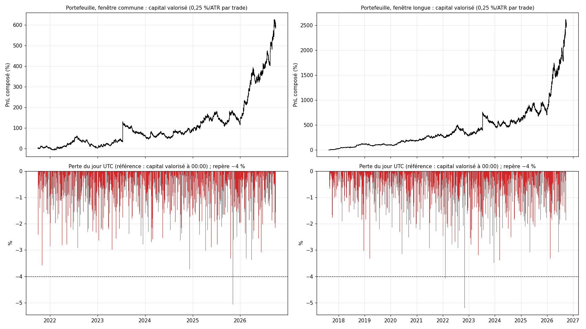

# EXP-D04.1 — Pire journée du portefeuille complet (six actifs, RE-1 version finale)

*Demande du porteur du 2026-10-04, après EXP-D04. Cadrage fixé avant le calcul en tête de `run_D04_1.py`. Calcul :
`python experiments/D04_1/run_D04_1.py --calcul` (72 s). BTC, SOL, AVAX, or, ETH et XRP tournent ensemble sur un capital
commun. Chaque trade engage 0,25 % du capital valorisé par ATR14(t), au plus 1x par position. Frais : 5 bps, or 4 bps.
Journée UTC. Annexes générées en fin de document.*

## Verdict

- **Pire journée sur 2021-10 → 2026-09 (six actifs) : −5,20 %** (2022-11-04), en prenant comme référence le capital
  valorisé à minuit.
  - 5 journées passent sous −4 % en cinq ans, 25 sous −3 %, 153 sous −2 %, sur 1 775 journées en position.
  - Rapportée au solde réalisé à minuit : −4,16 % au pire (2022-02-06), 3 journées sous −4 %.
  - Borne pessimiste (toutes les positions à leur pire prix de la même barre) : −5,90 %.
- **2026 :** pire journée −5,14 % le 26 janvier, mais c'est un gain latent rendu. Rapportée au solde réalisé, la pire
  journée de 2026 fait −3,21 %, et aucune ne passe sous −4 %.
- **Un actif seul, sur la même période, ne dépasse jamais −2,57 %.** La pire journée du portefeuille vaut environ deux
  fois celle du pire actif seul.

## 1. Mécanisme (annexe A4, vérifié trade par trade)

- `[OBS]` **Les pires journées viennent de stops catastrophe touchés ensemble sur des cryptos corrélées.**
  - 2022-11-04 : quatre ventes F2b (BTC, SOL, ETH, XRP), ouvertes vers 21:00 la veille, touchent leur stop vers 06:00,
    à −1,02 à −1,04 % du capital chacune. AVAX perd −0,44 % ; l'or compense en partie (+2,07 % à 16:00).
  - 2025-11-06 : quatre achats F2b (BTC, SOL, AVAX, ETH), ouverts vers 04:00, sont stoppés vers 15:00, à environ
    −1,02 % chacun.
  - Un même mouvement de marché déclenche le même signal sur plusieurs cryptos à la fois. Le stop de 4 ATR borne
    chaque trade vers −1 %, si bien que la journée peut perdre environ 1 % par crypto en position.
- `[OBS]` **2026-01-26 : un gain latent rendu, pas une perte réalisée.** Trois ventes F3 (SOL, ETH, XRP) affichaient un
  gros gain latent à minuit. Elles en rendent 5,1 % avant 02:00, puis sortent en gain à 03:30 (+2,27 %, +2,11 %,
  +0,47 %). Rapportée au solde réalisé, la journée reste à +3,3 % au plus bas.
- `[OBS]` **Exposition brute :** jusqu'à 5,2 fois le capital (P99 3,1). Elle dépasse 1x dans 40 % des états en
  position, car l'or est presque toujours à 1x. Quatre positions ou plus sont ouvertes dans 6,7 % des états, cinq ou plus dans 1,2 %.

## 2. 8 métriques du portefeuille, 2021-10 → 2026-09 (annexe A2)

| PnL : 0,25 %/ATR ; 1x par position ; bps | PF | WR | Espérance ATR ; bps | MDD : 0,25 %/ATR ; 1x | Trades (/mois) | Durée | Frais/brut | Calmar |
|---|---|---|---|---|---|---|---|---|
| +584 % ; +1 439 % ; +46 985 | 1,13 | 42,3 % | +0,198 ; +9,9 | −37,4 % ; −81,5 % | 4 744 (79,1) | 26 b (13 h) | 33 % | 1,25 |

- `[OBS]` **Le résultat est concentré.**
  - Le capital vaut 1,02 fin 2021, 1,03 fin 2022, 1,64 fin 2023, 1,92 fin 2024, 2,18 fin 2025, puis 6,84 fin
    septembre 2026 : neuf mois de 2026 font ×3,1.
  - Le MDD de −37,4 % part du 13 juillet 2023, le jour du trade de XRP sur la décision SEC contre Ripple ; creux le
    2024-01-27, retour au pic le 2025-03-02.
  - Par actif seul sur la même fenêtre : ETH −18 %, les cinq autres de +15 % (or) à +90 % (XRP). La somme des six,
    composée, donne +641 %.
- `[OBS]` **La fenêtre longue (2017-08 → 2026-09) n'a pas de journée pire.** Elle va de BTC, ETH, XRP et l'or seuls,
  krach de mars 2020 compris, jusqu'aux six actifs. Sa pire journée reste −5,20 % (2022-11-04), avec 5 journées sous
  −4 %.

## 3. Lecture

- `[HYP]` **À 0,25 %/ATR par trade sur six actifs, le portefeuille ne tient pas une limite journalière de 4 % mesurée
  sur le capital valorisé.** Cela arrive environ une fois par an. Rapportée au solde réalisé, la limite est franchie
  3 fois en cinq ans.
- `[HYP]` **La diversification ne protège pas des mauvaises journées.** Elle porte sur des signaux crypto qui se
  déclenchent ensemble ; seul l'or apporte une couverture.
- `[HYP]` **La perte du jour est presque proportionnelle à la taille par trade** : les positions sont petites devant le
  capital et le stop catastrophe borne chacune. Approximation à vérifier par la mesure.
- `[HYP]` **Le résultat de la règle dépend de la limite précise du compte :** heure de remise à zéro (UTC ici ;
  souvent minuit d'Europe centrale chez les prop firms) et référence (capital valorisé ou solde). Le 26 janvier 2026
  passe ou casse selon la référence.
- **Note :** la perte maximale totale (MDD −37,4 %) est un autre critère des comptes financés ; elle n'était pas
  demandée ici.

---

# Annexes générées (`run_D04_1.py --calcul`, puis `--rapport`)

Calcul du 2026-10-04 15:09 UTC, commit `c46a7ca`, 72 s.

## A1. Contrôles bloquants (passés)

- ETH_identique_a_D04 : {"trades": 1525, "esperance_atr": 0.183415}.
- XRP_identique_a_D04 : {"trades": 1689, "esperance_atr": 0.262972}.
- jambe_seule_ETH_pertes_journalieres_identiques : 983.

## A2. 8 métriques du portefeuille (5 bps, or 4 bps)

| Fenêtre (actifs) | PnL : 0,25 %/ATR ; 1x par position ; bps (1x) | PF (1x) | WR | Espérance ATR ; bps | MDD : 0,25 %/ATR ; 1x | Trades (/mois) | Durée médiane | Part des frais (1x) | Calmar ; exposition brute max ; P99 |
|---|---|---|---|---|---|---|---|---|---|
| commune 2021-10-01 → 2026-10-01 (BTC SOL AVAX XAU ETH XRP) | +584 % ; +1439 % ; +46 985 | 1,13 | 42,3 % | +0,198 ; +9,9 | −37,4 % ; −81,5 % | 4 744 (79,1) | 26 b ; 13 h | 33 % | 1,25 ; 5,22 ; 3,09 |
| longue 2017-08-16 → 2026-10-01 (BTC SOL AVAX XAU ETH XRP) | +2460 % ; +22012 % ; +89 007 | 1,14 | 42,4 % | +0,186 ; +11,9 | −37,4 % ; −81,5 % | 7 495 (68,4) | 26 b ; 13 h | 29 % | 1,14 ; 5,22 ; 2,88 |

## A3. Pertes journalières du portefeuille

Références : `valorise` = capital valorisé à 00:00 UTC ; `solde` = solde réalisé à 00:00 ; `pessimiste` = toutes les positions à l'extrême défavorable de la même barre ; `valorise_1x` = 1x par position.

| Lecture | Jours en position | Pire journée (date) | P1 ; P5 ; médiane | Jours sous −1 % ; −2 % ; −3 % ; −4 % |
|---|---|---|---|---|
| commune·valorise | 1 775 | −5,20 % (2022-11-04) | −3,20 % ; −2,30 % ; −0,65 % | 602 ; 153 ; 25 ; 5 |
| commune·valorise·2026 | 266 | −5,14 % (2026-01-26) | −3,24 % ; −2,13 % ; −0,53 % | 84 ; 19 ; 5 ; 1 |
| commune·solde | 1 775 | −4,16 % (2022-02-06) | −3,09 % ; −2,29 % ; −0,52 % | 519 ; 144 ; 22 ; 3 |
| commune·solde·2026 | 266 | −3,21 % (2026-04-23) | −2,70 % ; −2,05 % ; −0,40 % | 68 ; 15 ; 1 ; 0 |
| commune·pessimiste | 1 775 | −5,90 % (2026-01-26) | −3,38 % ; −2,46 % ; −0,82 % | 741 ; 199 ; 35 ; 5 |
| commune·pessimiste·2026 | 266 | −5,90 % (2026-01-26) | −3,39 % ; −2,41 % ; −0,73 % | 104 ; 30 ; 7 ; 1 |
| commune·valorise_1x | 1 775 | −16,77 % (2022-05-16) | −10,61 % ; −6,58 % ; −1,44 % | 1043 ; 699 ; 454 ; 296 |
| commune·valorise_1x·2026 | 266 | −9,88 % (2026-02-16) | −7,63 % ; −4,92 % ; −0,87 % | 121 ; 77 ; 39 ; 26 |
| longue·valorise | 3 186 | −5,20 % (2022-11-04) | −3,03 % ; −2,13 % ; −0,55 % | 924 ; 206 ; 33 ; 5 |
| longue·valorise·2026 | 266 | −5,14 % (2026-01-26) | −3,24 % ; −2,13 % ; −0,53 % | 84 ; 19 ; 5 ; 1 |
| longue·solde | 3 186 | −4,16 % (2022-02-06) | −2,95 % ; −2,08 % ; −0,45 % | 833 ; 192 ; 29 ; 3 |
| longue·solde·2026 | 266 | −3,21 % (2026-04-23) | −2,70 % ; −2,05 % ; −0,40 % | 68 ; 15 ; 1 ; 0 |
| longue·pessimiste | 3 186 | −5,90 % (2026-01-26) | −3,17 % ; −2,23 % ; −0,70 % | 1120 ; 266 ; 43 ; 6 |
| longue·pessimiste·2026 | 266 | −5,90 % (2026-01-26) | −3,39 % ; −2,41 % ; −0,73 % | 104 ; 30 ; 7 ; 1 |
| longue·valorise_1x | 3 186 | −21,11 % (2019-07-17) | −11,69 % ; −6,69 % ; −1,39 % | 1839 ; 1211 ; 766 ; 494 |
| longue·valorise_1x·2026 | 266 | −9,88 % (2026-02-16) | −7,63 % ; −4,92 % ; −0,87 % | 121 ; 77 ; 39 ; 26 |

## A4. Les cinq pires journées, fenêtre commune (0,25 %/ATR)

| Jour | Perte : valorisée ; pessimiste ; sur solde | Plus bas (UTC) ; positions ; expo. max | Contributions au plus bas (% du capital de 00:00) |
|---|---|---|---|
| 2022-11-04 | −5,20 % ; −5,29 % ; −4,03 % | 08:00 ; 1 ; 3,48 | SOL −1,41 % ; ETH −1,26 % ; XRP −1,18 % ; BTC −1,14 % ; AVAX −0,73 % ; XAU +0,51 % |
| 2026-01-26 | −5,14 % ; −5,90 % ; +3,32 % | 02:00 ; 3 ; 2,19 | SOL −1,73 % ; ETH −1,71 % ; XRP −1,70 % |
| 2025-11-06 | −5,06 % ; −5,06 % ; −3,24 % | 16:00 ; 0 ; 1,39 | BTC −1,44 % ; SOL −1,30 % ; AVAX −1,27 % ; ETH −1,00 % ; XRP −0,04 % |
| 2022-02-06 | −4,07 % ; −4,07 % ; −4,16 % | 00:00 ; 0 ; 1,68 | ETH −1,22 % ; BTC −1,03 % ; AVAX −1,01 % ; SOL −0,52 % ; XRP −0,29 % |
| 2022-05-16 | −4,07 % ; −4,18 % ; −2,60 % | 20:00 ; 2 ; 0,58 | XRP −2,55 % ; ETH −1,52 % ; AVAX −0,00 % |

## A4. Les cinq pires journées, fenêtre longue (0,25 %/ATR)

| Jour | Perte : valorisée ; pessimiste ; sur solde | Plus bas (UTC) ; positions ; expo. max | Contributions au plus bas (% du capital de 00:00) |
|---|---|---|---|
| 2022-11-04 | −5,20 % ; −5,29 % ; −4,03 % | 08:00 ; 1 ; 3,48 | SOL −1,41 % ; ETH −1,26 % ; XRP −1,18 % ; BTC −1,14 % ; AVAX −0,73 % ; XAU +0,51 % |
| 2026-01-26 | −5,14 % ; −5,90 % ; +3,32 % | 02:00 ; 3 ; 2,19 | SOL −1,73 % ; ETH −1,71 % ; XRP −1,70 % |
| 2025-11-06 | −5,06 % ; −5,06 % ; −3,24 % | 16:00 ; 0 ; 1,39 | BTC −1,44 % ; SOL −1,30 % ; AVAX −1,27 % ; ETH −1,00 % ; XRP −0,04 % |
| 2022-02-06 | −4,07 % ; −4,07 % ; −4,16 % | 00:00 ; 0 ; 1,68 | ETH −1,22 % ; BTC −1,03 % ; AVAX −1,01 % ; SOL −0,52 % ; XRP −0,29 % |
| 2022-05-16 | −4,07 % ; −4,18 % ; −2,60 % | 20:00 ; 2 ; 0,58 | XRP −2,55 % ; ETH −1,52 % ; AVAX −0,00 % |

## A5. Pire journée de chaque actif seul (même fenêtre, mêmes trades, 0,25 %/ATR)

| Fenêtre | BTC | SOL | AVAX | XAU | ETH | XRP |
|---|---|---|---|---|---|---|
| commune | −2,46 % (2024-12-09) | −1,83 % (2026-01-26) | −1,45 % (2024-02-19) | −1,48 % (2026-03-02) | −1,80 % (2026-01-26) | −2,57 % (2022-05-16) |
| longue | −2,46 % (2024-12-09) | −1,83 % (2026-01-26) | −1,45 % (2024-02-19) | −1,48 % (2026-03-02) | −3,03 % (2020-08-02) | −2,57 % (2022-05-16) |

## A6. Figure

