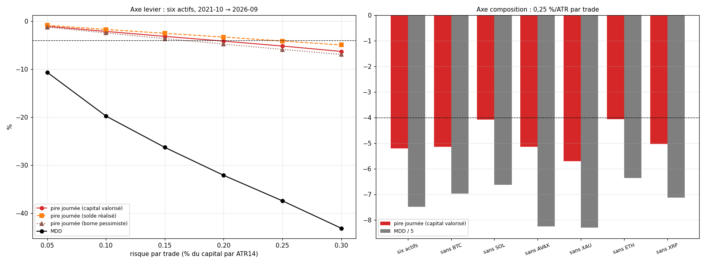

# EXP-D04.2 — Portefeuille complet, un facteur à la fois : composition et levier

*Demande du porteur du 2026-10-04 ; plan validé par le porteur : l'axe levier fait varier le risque par trade, l'axe
composition retire un actif à la fois. Calcul : `python experiments/D04_2/run_D04_2.py --calcul` (83 s). La référence
est le portefeuille de D04.1 : six actifs, 0,25 % du capital par ATR et par trade, au plus 1x par position, fenêtre
2021-10 → 2026-09, frais 5 bps (or 4 bps). Contrôle passé : la référence redonne D04.1. Annexes générées en fin de
document.*

## Verdict

- **Sans XRP (0,25 %/ATR) :**
  - pire journée −5,03 % (2025-11-06) contre −5,20 %, et −4,08 % rapportée au solde réalisé ;
  - 2 journées sous −4 % au lieu de 5 (1 au lieu de 3 sur le solde) ;
  - MDD −35,6 % contre −37,4 % ; PnL +274 % au lieu de +584 % ; Calmar 0,85 contre 1,25.
- **Retirer un actif ne suffit pas à rester au-dessus de −4 % :** au mieux −4,06 % (sans ETH) et −4,07 % (sans SOL).
  L'or est le seul actif qui diversifie : sans lui, la pire journée passe à −5,71 % et le MDD à −41,5 %.
- **Le levier commande la pire journée, presque proportionnellement (environ 21 fois le risque par trade) :**
  - −1,10 %, −2,16 %, −3,19 %, −4,18 %, −5,20 % et −6,32 % pour 0,05, 0,10, 0,15, 0,20, 0,25 et 0,30 % par ATR ;
  - aucune journée sous −4 % jusqu'à 0,15 % par ATR (pire −3,19 % ; borne pessimiste −3,66 %) ;
  - MDD : −10,7 %, −19,8 %, −26,3 %, −32,1 %, −37,4 % et −43,1 %.

## 1. Axe composition (0,25 % par ATR et par trade)

| Portefeuille | Pire journée : valorisé ; solde ; pessimiste | Jours < −4 % : valorisé ; solde | MDD | PnL | Calmar |
|---|---|---|---|---|---|
| Six actifs (référence) | −5,20 % ; −4,16 % ; −5,90 % | 5 ; 3 | −37,4 % | +584 % | 1,25 |
| Sans BTC | −5,14 % ; −4,20 % ; −5,90 % | 3 ; 1 | −34,8 % | +327 % | 0,97 |
| Sans SOL | −4,07 % ; −3,70 % ; −4,18 % | 1 ; 0 | −33,1 % | +408 % | 1,16 |
| Sans AVAX | −5,14 % ; −4,13 % ; −5,90 % | 3 ; 1 | −41,2 % | +290 % | 0,76 |
| Sans or | −5,71 % ; −4,55 % ; −5,90 % | 5 ; 2 | −41,5 % | +498 % | 1,04 |
| Sans ETH | −4,06 % ; −4,12 % ; −4,06 % | 1 ; 1 | −31,8 % | +756 % | 1,69 |
| Sans XRP | −5,03 % ; −4,08 % ; −5,03 % | 2 ; 1 | −35,6 % | +274 % | 0,85 |

- `[OBS]` **Le mécanisme de D04.1 reste le même.** Les pires journées viennent de stops catastrophe touchés ensemble
  sur plusieurs cryptos (2022-11-04, 2025-11-06) ou d'un gain latent rendu (2026-01-26). Tout portefeuille à cinq
  actifs garde au moins quatre cryptos.
- `[OBS]` **Par trade, l'espérance varie peu d'une composition à l'autre :** +0,157 ATR (sans XRP) à +0,255 (sans
  ETH), pour +0,198 avec les six. Le PnL change beaucoup, parce que le capital commun compose les gains de tous les
  actifs.

## 2. Axe levier (six actifs, plafond de 1x par position)

| Risque par trade | Pire journée : valorisé ; solde ; pessimiste | Jours < −3 % ; < −4 % | MDD | PnL | Calmar | Exposition brute max ; P99 |
|---|---|---|---|---|---|---|
| 0,05 %/ATR | −1,10 % ; −0,88 % ; −1,26 % | 0 ; 0 | −10,7 % | +57 % | 0,89 | 1,55 ; 0,85 |
| 0,10 %/ATR | −2,16 % ; −1,75 % ; −2,48 % | 0 ; 0 | −19,8 % | +139 % | 0,96 | 3,10 ; 1,66 |
| 0,15 %/ATR | −3,19 % ; −2,55 % ; −3,66 % | 2 ; 0 | −26,3 % | +248 % | 1,08 | 4,17 ; 2,28 |
| 0,20 %/ATR | −4,18 % ; −3,33 % ; −4,80 % | 7 ; 3 | −32,1 % | +387 % | 1,16 | 4,60 ; 2,74 |
| 0,25 %/ATR (référence) | −5,20 % ; −4,16 % ; −5,90 % | 25 ; 5 | −37,4 % | +584 % | 1,25 | 5,22 ; 3,09 |
| 0,30 %/ATR | −6,32 % ; −4,98 % ; −6,96 % | 60 ; 12 | −43,1 % | +803 % | 1,28 | 5,55 ; 3,41 |

- `[OBS]` **La pire journée suit le risque par trade presque proportionnellement**, à environ 21 fois le risque par
  ATR. Ce sont les mêmes journées qui la font (2022-11-04, 2025-11-06, 2026-01-26).
- `[OBS]` **Le MDD croît moins vite que le risque ; le Calmar monte de 0,89 à 1,28,** effet de la composition des
  gains.
- `[OBS]` **L'exposition brute dépasse régulièrement 1x dès 0,10 %/ATR** (P99 1,66x, maximum 3,1x), car l'or et les
  cryptos calmes prennent de gros notionnels.

## 3. Lecture

- `[HYP]` **Pour une limite journalière de 4 % sur le capital valorisé, c'est la taille qui compte, pas la
  composition.** À 0,15 %/ATR, la pire journée de cinq ans fait −3,19 % (−3,66 % en borne pessimiste). La marge est
  mince et se mesure sur des données déjà vues.
- `[HYP]` **Retenir « sans ETH » serait une sélection après lecture.** Son meilleur Calmar (1,69) et son meilleur PnL
  (+756 %) viennent de ce qu'ETH a perdu sur cette fenêtre (−18 % seul), ce que l'on sait seulement depuis D04.
  Inversement, une bonne part du rendement de XRP tient au trade de juillet 2023.
- `[HYP]` **Si le compte impose aussi une perte totale maximale, c'est elle qui contraint :** le MDD vaut −26,3 % à
  0,15 %/ATR et encore −10,7 % à 0,05 %/ATR.

---

# Annexes générées (`run_D04_2.py --calcul`, puis `--rapport`)

Calcul du 2026-10-04 15:38 UTC, commit `deb86f1`, 83 s.

## A1. Contrôle bloquant (passé)

- reference_egale_D04_1 : {"pire_journee": -0.051991, "pnl": 5.841937, "mdd": -0.373972}.

## A2. Axe composition (0,25 %/ATR par trade, plafond 1x)

| Configuration | Pire journée : valorisé ; solde ; pessimiste | Jours < −3 % ; < −4 % (valorisé ; solde) | P1 (valorisé) | 2026 : pire journée valorisé ; solde | PnL : config. ; 1x | MDD : config. ; 1x | Calmar | Expo. brute max ; P99 |
|---|---|---|---|---|---|---|---|---|
| six actifs | −5,20 % (2022-11-04) ; −4,16 % ; −5,90 % | 25 ; 5 (22 ; 3) | −3,20 % | −5,14 % ; −3,21 % | +584 % ; +1439 % | −37,4 % ; −81,5 % | 1,25 | 5,22 ; 3,09 |
| sans BTC | −5,14 % (2026-01-26) ; −4,20 % ; −5,90 % | 13 ; 3 (11 ; 1) | −2,82 % | −5,14 % ; −2,86 % | +327 % ; +779 % | −34,8 % ; −81,1 % | 0,97 | 4,22 ; 2,65 |
| sans SOL | −4,07 % (2022-05-16) ; −3,70 % ; −4,18 % | 8 ; 1 (11 ; 0) | −2,76 % | −3,53 % ; −3,21 % | +408 % ; +916 % | −33,1 % ; −66,6 % | 1,16 | 4,51 ; 2,96 |
| sans AVAX | −5,14 % (2026-01-26) ; −4,13 % ; −5,90 % | 11 ; 3 (6 ; 1) | −2,80 % | −5,14 % ; −2,70 % | +290 % ; +301 % | −41,2 % ; −76,8 % | 0,76 | 4,67 ; 2,93 |
| sans XAU | −5,71 % (2022-11-04) ; −4,55 % ; −5,90 % | 19 ; 5 (17 ; 2) | −3,02 % | −5,14 % ; −3,02 % | +498 % ; +1181 % | −41,5 % ; −82,5 % | 1,04 | 4,97 ; 2,77 |
| sans ETH | −4,06 % (2025-11-06) ; −4,12 % ; −4,06 % | 8 ; 1 (6 ; 1) | −2,69 % | −3,57 % ; −2,88 % | +756 % ; +3110 % | −31,8 % ; −69,7 % | 1,69 | 4,29 ; 2,68 |
| sans XRP | −5,03 % (2025-11-06) ; −4,08 % ; −5,03 % | 12 ; 2 (15 ; 1) | −2,84 % | −3,50 % ; −3,21 % | +274 % ; +777 % | −35,6 % ; −82,6 % | 0,85 | 4,18 ; 2,85 |

## A3. Axe levier (six actifs, plafond 1x)

| Configuration | Pire journée : valorisé ; solde ; pessimiste | Jours < −3 % ; < −4 % (valorisé ; solde) | P1 (valorisé) | 2026 : pire journée valorisé ; solde | PnL : config. ; 1x | MDD : config. ; 1x | Calmar | Expo. brute max ; P99 |
|---|---|---|---|---|---|---|---|---|
| risque 0.05 %/ATR | −1,10 % (2026-01-26) ; −0,88 % ; −1,26 % | 0 ; 0 (0 ; 0) | −0,67 % | −1,10 % ; −0,66 % | +57 % ; — | −10,7 % ; — | 0,89 | 1,55 ; 0,85 |
| risque 0.10 %/ATR | −2,16 % (2026-01-26) ; −1,75 % ; −2,48 % | 0 ; 0 (0 ; 0) | −1,33 % | −2,16 % ; −1,31 % | +139 % ; — | −19,8 % ; — | 0,96 | 3,10 ; 1,66 |
| risque 0.15 %/ATR | −3,19 % (2026-01-26) ; −2,55 % ; −3,66 % | 2 ; 0 (0 ; 0) | −1,98 % | −3,19 % ; −1,97 % | +248 % ; — | −26,3 % ; — | 1,08 | 4,17 ; 2,28 |
| risque 0.20 %/ATR | −4,18 % (2026-01-26) ; −3,33 % ; −4,80 % | 7 ; 3 (6 ; 0) | −2,64 % | −4,18 % ; −2,62 % | +387 % ; — | −32,1 % ; — | 1,16 | 4,60 ; 2,74 |
| six actifs | −5,20 % (2022-11-04) ; −4,16 % ; −5,90 % | 25 ; 5 (22 ; 3) | −3,20 % | −5,14 % ; −3,21 % | +584 % ; +1439 % | −37,4 % ; −81,5 % | 1,25 | 5,22 ; 3,09 |
| risque 0.30 %/ATR | −6,32 % (2022-11-04) ; −4,98 % ; −6,96 % | 60 ; 12 (61 ; 10) | −3,78 % | −6,06 % ; −3,65 % | +803 % ; — | −43,1 % ; — | 1,28 | 5,55 ; 3,41 |

## A4. 8 métriques (frais de base)

| Configuration | PnL : config. ; bps (1x) | PF (1x) | WR | Espérance ATR ; bps | MDD config. | Trades (/mois) | Durée médiane | Part des frais (1x) |
|---|---|---|---|---|---|---|---|---|
| six actifs | +584 % ; +46 985 | 1,13 | 42,3 % | +0,198 ; +9,9 | −37,4 % | 4 744 (79,1) | 26 b ; 13 h | 33 % |
| sans BTC | +327 % ; +39 185 | 1,12 | 42,4 % | +0,189 ; +10,2 | −34,8 % | 3 859 (64,3) | 26 b ; 13 h | 32 % |
| sans SOL | +408 % ; +35 661 | 1,13 | 42,1 % | +0,203 ; +9,2 | −33,1 % | 3 882 (64,7) | 26 b ; 13 h | 35 % |
| sans AVAX | +290 % ; +29 252 | 1,10 | 42,0 % | +0,177 ; +7,4 | −41,2 % | 3 952 (65,9) | 26 b ; 13 h | 40 % |
| sans XAU | +498 % ; +45 008 | 1,13 | 42,2 % | +0,209 ; +10,7 | −41,5 % | 4 212 (70,2) | 26 b ; 13 h | 32 % |
| sans ETH | +756 % ; +50 425 | 1,17 | 43,1 % | +0,255 ; +12,9 | −31,8 % | 3 905 (65,1) | 26 b ; 13 h | 27 % |
| sans XRP | +274 % ; +35 392 | 1,12 | 42,0 % | +0,157 ; +9,1 | −35,6 % | 3 910 (65,2) | 26 b ; 13 h | 35 % |
| risque 0.05 %/ATR | +57 % ; +46 985 | 1,13 | 42,3 % | +0,198 ; +9,9 | −10,7 % | 4 744 (79,1) | 26 b ; 13 h | 33 % |
| risque 0.10 %/ATR | +139 % ; +46 985 | 1,13 | 42,3 % | +0,198 ; +9,9 | −19,8 % | 4 744 (79,1) | 26 b ; 13 h | 33 % |
| risque 0.15 %/ATR | +248 % ; +46 985 | 1,13 | 42,3 % | +0,198 ; +9,9 | −26,3 % | 4 744 (79,1) | 26 b ; 13 h | 33 % |
| risque 0.20 %/ATR | +387 % ; +46 985 | 1,13 | 42,3 % | +0,198 ; +9,9 | −32,1 % | 4 744 (79,1) | 26 b ; 13 h | 33 % |
| risque 0.30 %/ATR | +803 % ; +46 985 | 1,13 | 42,3 % | +0,198 ; +9,9 | −43,1 % | 4 744 (79,1) | 26 b ; 13 h | 33 % |

## A5. Trois pires journées par configuration (capital valorisé de 00:00)

| Configuration | 1re | 2e | 3e |
|---|---|---|---|
| référence | 2022-11-04 −5,20 % (solde −4,03 %) | 2026-01-26 −5,14 % (solde +3,32 %) | 2025-11-06 −5,06 % (solde −3,24 %) |
| sans BTC | 2026-01-26 −5,14 % (solde +3,32 %) | 2022-05-16 −4,09 % (solde −2,61 %) | 2022-11-04 −4,06 % (solde −2,99 %) |
| sans SOL | 2022-05-16 −4,07 % (solde −2,60 %) | 2022-11-04 −3,80 % (solde −3,02 %) | 2025-11-06 −3,77 % (solde −2,37 %) |
| sans AVAX | 2026-01-26 −5,14 % (solde +3,32 %) | 2022-11-04 −4,49 % (solde −3,59 %) | 2022-05-16 −4,07 % (solde −2,60 %) |
| sans XAU | 2022-11-04 −5,71 % (solde −4,55 %) | 2026-01-26 −5,14 % (solde +3,32 %) | 2025-11-06 −5,06 % (solde −3,24 %) |
| sans ETH | 2025-11-06 −4,06 % (solde −2,22 %) | 2022-11-04 −3,95 % (solde −3,01 %) | 2022-10-14 −3,79 % (solde −3,79 %) |
| sans XRP | 2025-11-06 −5,03 % (solde −4,08 %) | 2022-11-04 −4,03 % (solde −3,01 %) | 2022-02-06 −3,78 % (solde −3,87 %) |
| risque 0.05 | 2026-01-26 −1,10 % (solde +0,66 %) | 2025-11-06 −1,02 % (solde −0,64 %) | 2022-11-04 −0,99 % (solde −0,75 %) |
| risque 0.10 | 2026-01-26 −2,16 % (solde +1,33 %) | 2025-11-06 −2,04 % (solde −1,29 %) | 2022-11-04 −1,98 % (solde −1,50 %) |
| risque 0.15 | 2026-01-26 −3,19 % (solde +1,99 %) | 2025-11-06 −3,05 % (solde −1,93 %) | 2022-11-04 −2,97 % (solde −2,25 %) |
| risque 0.20 | 2026-01-26 −4,18 % (solde +2,65 %) | 2022-11-04 −4,07 % (solde −3,13 %) | 2025-11-06 −4,06 % (solde −2,59 %) |
| risque 0.30 | 2022-11-04 −6,32 % (solde −4,94 %) | 2026-01-26 −6,06 % (solde +3,98 %) | 2025-11-06 −6,06 % (solde −3,90 %) |

## A6. Figure

