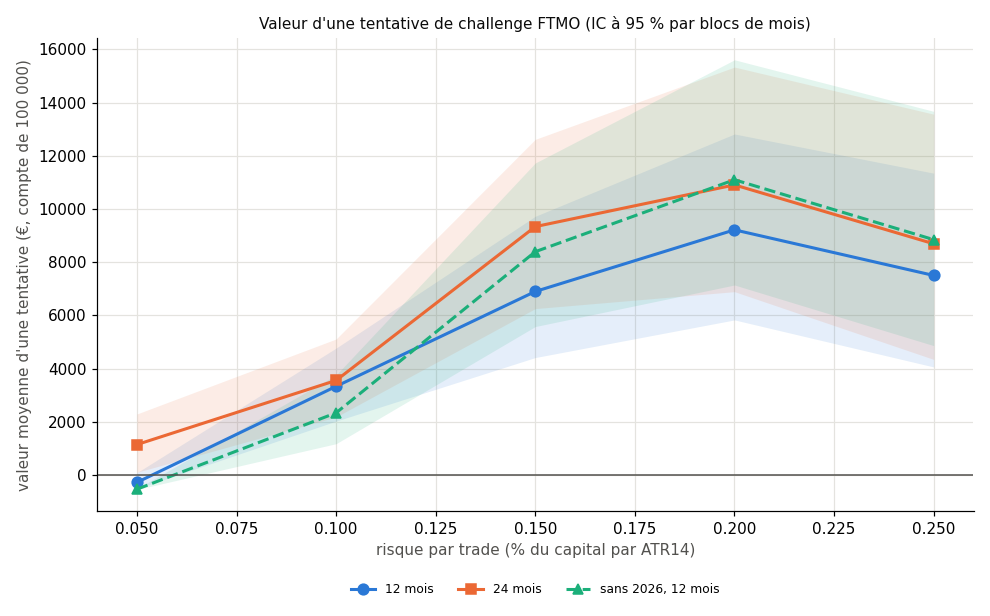

# EXP-D05.5 — Phase financée : valeur d'une tentative de challenge FTMO

*GO du porteur du 2026-10-05. Règles FTMO standard confirmées par le porteur : 80 % des gains, retrait tous les 14 jours,
540 € remboursés au premier retrait, perte totale de 10 %, statique. Calcul : `python experiments/D05_5/run_D05_5.py
--calcul` (113 s).*

*Méthode, avec le moteur `propfirm` :*
- *Challenge : celui de D05.4 (marge 1:2 plafonnée, borne pessimiste, perte du jour depuis le solde de minuit).*
- *Compte financé : il démarre au minuit qui suit la réussite de P2, sur un compte neuf, avec les mêmes règles de perte
  et de marge.*
  - *Tous les 14 jours, à minuit, il retire min(solde, équité) − 1 si c'est positif ; les positions restent ouvertes.*
  - *Il s'arrête à sa première rupture de règle.*
- *Même r en challenge et en compte financé.*
- *Valeur d'une tentative = −540 € + (540 € + 80 % des retraits) s'il y a au moins un retrait.*
- *Les départs sont suivis 12 ou 24 mois. Contrôle passé : le challenge redonne D05.4 pour chaque r.*

## Verdict

- **La valeur d'une tentative est la plus haute à 0,20 %/ATR**, quelle que soit la lecture :
  - +9 218 € [+5 833 ; +12 821] à 12 mois ;
  - +10 906 € à 24 mois ;
  - +11 100 € sans 2026.

  Elle est positive dès 0,10, et négative à 0,05 sur 12 mois, parce que le challenge y dure trop longtemps.
- **Le compte financé vit peu, mais rapporte avant de tomber.** De 0,10 à 0,25 %/ATR, 71 à 99 % des comptes financés
  sont perdus en 12 mois. Ils ont pourtant retiré entre 16 et 22 % du compte avant de tomber. À 0,05, aucun compte
  financé n'est jamais perdu, et il retire 10,6 % par an.
- **Ce résultat contredit ta règle 70/30.** Le r qui maximise la valeur (0,20) donne une réussite de 58,8 % en
  68 jours médians : il est juste hors de ta cible (au moins 60 %, entre 90 et 180 jours).

## 1. Valeur d'une tentative

| r (%/ATR) | 12 mois [IC 95 %] (1 462 départs) | 24 mois (1 097) | Sans 2026, 12 mois (1 189) | Financées en 12 mois | ≥ 1 retrait en 12 mois | Reçu moyen par compte financé en 12 mois |
|---|---|---|---|---|---|---|
| 0,05 | −273 € [−512 ; +92] | +1 148 € | −530 € | 13,7 % | 7,7 % | +1 938 € |
| 0,10 | +3 336 € [+2 031 ; +4 774] | +3 558 € | +2 340 € | 67,6 % | 50,5 % | +5 735 € |
| 0,15 | +6 902 € [+4 418 ; +9 728] | +9 339 € | +8 397 € | 56,0 % | 52,0 % | +13 300 € |
| 0,20 | +9 218 € [+5 833 ; +12 821] | +10 906 € | +11 100 € | 55,1 % | 49,7 % | +17 721 € |
| 0,25 | +7 504 € [+4 065 ; +11 348] | +8 694 € | +8 849 € | 46,4 % | 35,4 % | +17 346 € |

- `[OBS]` **Environ une tentative sur deux touche au moins un retrait, de 0,10 à 0,20.** L'autre moitié perd ses
  540 €.
- `[OBS]` **La valeur moyenne vient de la queue droite des comptes financés.** À 0,20, un compte financé dans l'année
  rapporte en moyenne +17 721 € en 3,6 retraits.
- `[OBS]` **Le classement des r tient sans 2026,** avec des IC larges qui se recouvrent entre 0,15, 0,20 et 0,25.

## 2. Le compte financé, démarré à chaque minuit et suivi 12 mois

| r (%/ATR) | Perdus en 12 mois | Durée de vie médiane des comptes perdus | Retiré en 12 mois (avant partage) | Reçu (80 %) |
|---|---|---|---|---|
| 0,05 | 0,0 % | jamais perdu | 10,6 % | 8 437 € |
| 0,10 | 70,6 % | 257 j | 16,2 % | 12 968 € |
| 0,15 | 89,1 % | 161 j | 20,4 % | 16 295 € |
| 0,20 | 96,0 % | 104 j | 22,5 % | 17 964 € |
| 0,25 | 99,1 % | 74 j | 20,1 % | 16 071 € |

- `[OBS]` **À 0,05, le compte financé ne casse jamais sa règle sur toute la fenêtre.** La pire baisse depuis un minuit
  vaut −9,55 % (D05.4), et chaque retrait remet le coussin à 10 %.
- `[OBS]` **De 0,10 à 0,25, le compte est presque toujours perdu dans l'année,** après 74 à 257 jours de vie médiane.

## 3. Lecture

- `[HYP]` **Le gain du porteur est convexe.**
  - Sa perte est plafonnée aux 540 €.
  - Ses gains sont retirés tous les 14 jours et ne reviennent jamais au compte. Les pertes qui suivent un retrait sont
    supportées par la firme.
  - Un r plus haut extrait davantage avant la rupture, qui devient presque certaine. D'où l'optimum vers 0,20, au-delà
    de ce que donne la règle « probabilité d'abord ».
- `[HYP]` **Deux usages opposés de r.**
  - En challenge, un r bas protège la réussite.
  - En compte financé, un r haut extrait vite, et un r bas fait durer le compte (0,05 : jamais perdu, 10,6 % par an).
  - Un r différent pour chaque phase est un facteur à mesurer à part.

## 4. Limites

- **Règles de la firme non modélisées :** plan d'augmentation du capital, éventuelles règles de comportement, délai de
  traitement des retraits, clôture éventuelle des positions avant un retrait.
- **Une seule tentative et un seul compte à la fois.** Les nouvelles tentatives après un échec ne sont pas modélisées ;
  chacune coûte 540 €.
- **Coûts :** frais de 5 bps (or 4 bps) ; écarts, frais de nuit et glissement des stops non modélisés.
- **Données déjà lues** (D04) ; départs chevauchants : IC larges, valeurs descriptives.
- **Devise :** 540 € pour un compte de 100 000 est supposé dans la même devise (0,54 % du compte).

---

# Annexes générées (`run_D05_5.py --calcul`, puis `--rapport`)

Calcul du 2026-10-05 15:06 UTC, commit `8ea8a93`, 113 s.

## A1. Contrôle bloquant (passé)

- challenge_egal_D05_4_r5 : {"p_reussite": 0.882256, "jours_total_med": 570.708}.
- challenge_egal_D05_4_r10 : {"p_reussite": 0.785323, "jours_total_med": 173.062}.
- challenge_egal_D05_4_r15 : {"p_reussite": 0.603505, "jours_total_med": 99.854}.
- challenge_egal_D05_4_r20 : {"p_reussite": 0.588171, "jours_total_med": 67.729}.
- challenge_egal_D05_4_r25 : {"p_reussite": 0.510405, "jours_total_med": 41.448}.

## A2. Valeur d'une tentative, 12 mois (1462 départs suivis assez longtemps)

| r (%/ATR) | Valeur moyenne [IC 95 %] | Financées dans l'horizon | Tentatives avec ≥ 1 retrait (valeur > 0) | Reçu moyen par compte financé ; retraits | Réussite P1 + P2, sans limite de temps ; délai médian (mêmes départs) |
|---|---|---|---|---|---|
| 0,05 | −273 € [−512 € ; +92 €] | 13,7 % | 7,7 % | +1 938 € ; 2,1 | 100,0 % ; 615 j |
| 0,10 | +3 336 € [+2 031 € ; +4 774 €] | 67,6 % | 50,5 % | +5 735 € ; 2,3 | 78,2 % ; 215 j |
| 0,15 | +6 902 € [+4 418 € ; +9 728 €] | 56,0 % | 52,0 % | +13 300 € ; 3,3 | 56,9 % ; 118 j |
| 0,20 | +9 218 € [+5 833 € ; +12 821 €] | 55,1 % | 49,7 % | +17 721 € ; 3,6 | 55,1 % ; 79 j |
| 0,25 | +7 504 € [+4 065 € ; +11 348 €] | 46,4 % | 35,4 % | +17 346 € ; 2,6 | 46,4 % ; 48 j |

## A2. Valeur d'une tentative, 24 mois (1097 départs suivis assez longtemps)

| r (%/ATR) | Valeur moyenne [IC 95 %] | Financées dans l'horizon | Tentatives avec ≥ 1 retrait (valeur > 0) | Reçu moyen par compte financé ; retraits | Réussite P1 + P2, sans limite de temps ; délai médian (mêmes départs) |
|---|---|---|---|---|---|
| 0,05 | +1 148 € [+107 € ; +2 297 €] | 47,9 % | 20,7 % | +3 527 € ; 2,2 | 100,0 % ; 757 j |
| 0,10 | +3 558 € [+2 186 € ; +5 115 €] | 75,7 % | 55,4 % | +5 416 € ; 2,8 | 75,7 % ; 223 j |
| 0,15 | +9 339 € [+6 258 € ; +12 619 €] | 61,4 % | 57,5 % | +16 079 € ; 4,0 | 61,4 % ; 138 j |
| 0,20 | +10 906 € [+6 894 € ; +15 335 €] | 50,8 % | 48,6 % | +22 543 € ; 4,1 | 50,8 % ; 90 j |
| 0,25 | +8 694 € [+4 348 € ; +13 565 €] | 41,8 % | 31,3 % | +22 118 € ; 2,8 | 41,8 % ; 49 j |

## A2. Valeur d'une tentative, sans 2026, 12 mois (1189 départs suivis assez longtemps)

| r (%/ATR) | Valeur moyenne [IC 95 %] | Financées dans l'horizon | Tentatives avec ≥ 1 retrait (valeur > 0) | Reçu moyen par compte financé ; retraits | Réussite P1 + P2, sans limite de temps ; délai médian (mêmes départs) |
|---|---|---|---|---|---|
| 0,05 | −530 € [−540 € ; −511 €] | 4,3 % | 0,9 % | +239 € ; 0,3 | 56,5 % ; 886 j |
| 0,10 | +2 340 € [+1 181 € ; +3 762 €] | 64,5 % | 45,4 % | +4 464 € ; 1,9 | 77,5 % ; 209 j |
| 0,15 | +8 397 € [+5 584 € ; +11 731 €] | 63,2 % | 58,5 % | +14 130 € ; 3,4 | 64,4 % ; 123 j |
| 0,20 | +11 100 € [+7 145 € ; +15 608 €] | 54,6 % | 52,4 % | +21 325 € ; 4,2 | 54,6 % ; 89 j |
| 0,25 | +8 849 € [+4 867 € ; +13 672 €] | 44,6 % | 33,8 % | +21 064 € ; 3,0 | 44,6 % ; 51 j |

## A3. Comptes financés démarrés à chaque minuit, suivis 12 mois

| r (%/ATR) | Comptes | Perdus en 12 mois | Durée médiane des comptes perdus | Retiré moyen en 12 mois (avant le partage) ; reçu (80 %) |
|---|---|---|---|---|
| 0,05 | 1 462 | 0,0 % | — j | 10,55 % ; 8437 € |
| 0,10 | 1 462 | 70,6 % | 257 j | 16,21 % ; 12968 € |
| 0,15 | 1 462 | 89,1 % | 161 j | 20,37 % ; 16295 € |
| 0,20 | 1 462 | 96,0 % | 104 j | 22,45 % ; 17964 € |
| 0,25 | 1 462 | 99,1 % | 74 j | 20,09 % ; 16071 € |

## A4. Figure

