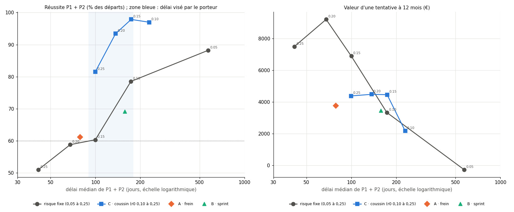

# EXP-D05.6 — Taille selon l'état du compte : variantes A, B et C contre un risque fixe

*GO du porteur du 2026-10-05 (« une à la fois, comparées à un r fixe »). Calcul : `python
experiments/D05_6/run_D05_6.py --calcul` (175 s).*

*Variantes (seuils sur le capital valorisé de chaque compte, même règle en challenge et en compte financé) :*
- *A, frein : 0,20 %/ATR ; 0,10 à −5 % ; de nouveau 0,20 au-dessus de −2 %.*
- *B, sprint : 0,10 ; 0,20 à +3 % ; de nouveau 0,10 sous +1 %.*
- *C, coussin : risque proportionnel à la distance au plancher de −10 %, égal à r0 quand le capital vaut 1.*

*Lecture principale de D05.4 ; valeur d'une tentative de D05.5. Contrôle passé : chaque risque fixe redonne D05.4 et
D05.5.*

*Comparaison au risque fixe : réussite et valeur d'un risque fixe au même délai médian, par interpolation linéaire
entre deux r fixes.*

## Verdict

- **A (frein) ne fait pas mieux qu'un risque fixe.**
  - Réussite : 61,2 % en 79 jours, soit +1,9 point au même délai (sans 2026 : +0,9), dans le bruit.
  - Valeur à 12 mois : +3 768 €, soit −4 653 € au même délai.
- **B (sprint) fait moins bien qu'un risque fixe** : 69,1 % en 158 jours, soit −5,7 points au même délai (sans 2026 :
  −4,9).
- **C (coussin) supprime les échecs par la perte totale**, par construction : le risque tend vers zéro près du
  plancher.
  - Sur tous les départs, la réussite monte à 93 à 98 %, soit +17 à +24 points au même délai.
  - Mais les échecs se changent en comptes bloqués : P90 du délai de 682 à 1 081 jours.
  - Sans 2026, 38 à 43 % des comptes C restent en cours, et la réussite retombe à 57 à 61 %.
- **Ta cible** (délai médian de 90 à 180 jours, réussite d'au moins 60 à 65 %) :
  - sur tous les départs, elle est atteinte par le risque fixe à 0,10 et 0,15, par B et par C (r0 de 0,15 à 0,25) ;
  - sans 2026, seul C à r0 = 0,20 l'atteint (60,9 % en 111 jours), avec 38,6 % de comptes encore en cours.
- **Valeur d'une tentative :** aucune variante n'approche le risque fixe à 0,20 (+9 218 € à 12 mois). A, B et C
  restent entre +2 171 et +4 484 €.

## 1. Tous les départs (1 826 ; valeur à 12 mois sur 1 462 départs)

| Configuration | Réussite P1 + P2 [IC 95 %] | Échecs, perte totale | En cours | Délai médian ; P90 | Écart au fixe, même délai | Valeur à 12 mois [IC 95 %] | Écart de valeur, même délai |
|---|---|---|---|---|---|---|---|
| r fixe 0,10 | 78,5 % [69,7 ; 86,7] | 18,1 % | 3,4 % | 173 ; 371 j | — | +3 336 € [+2 031 ; +4 774] | — |
| r fixe 0,15 | 60,4 % [49,5 ; 71,4] | 37,5 % | 2,1 % | 100 ; 230 j | — | +6 902 € [+4 418 ; +9 728] | — |
| r fixe 0,20 | 58,8 % [47,9 ; 69,3] | 39,5 % | 1,6 % | 68 ; 158 j | — | +9 218 € [+5 833 ; +12 821] | — |
| A · frein | 61,2 % [50,6 ; 71,5] | 37,1 % | 1,6 % | 79 ; 241 j | +1,9 pt | +3 768 € [+2 448 ; +5 288] | −4 653 € |
| B · sprint | 69,1 % [59,7 ; 78,5] | 28,2 % | 2,7 % | 158 ; 413 j | −5,7 pt | +3 459 € [+2 104 ; +5 025] | −605 € |
| C · r0 0,10 | 97,0 % [92,7 ; 100,0] | 0,0 % | 3,0 % | 230 ; 978 j | +17,1 pt | +2 171 € [+1 037 ; +3 600] | −650 € |
| C · r0 0,15 | 97,9 % [94,3 ; 100,0] | 0,0 % | 2,1 % | 174 ; 1 049 j | +19,3 pt | +4 463 € [+2 726 ; +6 638] | +1 134 € |
| C · r0 0,20 | 93,4 % [88,0 ; 97,8] | 0,0 % (jour : 0,4 %) | 6,1 % | 137 ; 1 081 j | +24,0 pt | +4 484 € [+2 642 ; +7 008] | −630 € |
| C · r0 0,25 | 81,5 % [72,8 ; 89,9] | 0,0 % (jour : 1,5 %) | 16,9 % | 100 ; 682 j | +21,2 pt | +4 383 € [+2 293 ; +7 306] | −2 521 € |

- `[OBS]` **A et B se situent sur la frontière du risque fixe, ou en dessous.**
  - Le frein réduit la taille dans les creux, ce qui ralentit aussi la remontée.
  - Le sprint accélère après +3 %, puis revient à 0,10 sous +1 % : il paie les reculs au risque haut.
- `[OBS]` **Avec C, les pertes du jour remplacent les pertes totales.** Au-dessus du capital initial, le risque passe
  au-dessus de r0 (jusqu'à 1,9 fois r0 près de +9 %). D'où 0,4 % et 1,5 % d'échecs par la perte du jour à r0 = 0,20
  et 0,25.
- `[OBS]` **C allonge la queue des délais :** le P90 passe de 158-371 jours à 682-1 081 jours. Un compte proche du
  plancher n'y risque presque plus rien et attend.

## 2. Sans 2026 (1 553 départs ; valeur à 12 mois sur 1 189 départs)

| Configuration | Réussite P1 + P2 [IC 95 %] | En cours | Délai médian | Écart au fixe, même délai | Valeur à 12 mois |
|---|---|---|---|---|---|
| r fixe 0,10 | 61,7 % [49,6 ; 73,3] | 17,1 % | 203 j | — | +2 340 € |
| r fixe 0,15 | 53,6 % [41,2 ; 66,3] | 2,3 % | 118 j | — | +8 397 € |
| r fixe 0,20 | 52,3 % [40,5 ; 64,7] | 2,0 % | 78 j | — | +11 100 € |
| A · frein | 54,0 % [41,8 ; 65,5] | 2,3 % | 104 j | +0,9 pt | +4 479 € |
| B · sprint | 56,7 % [44,5 ; 68,4] | 10,2 % | 208 j | −4,9 pt | +3 221 € |
| C · r0 0,15 | 57,8 % [45,7 ; 70,3] | 42,2 % | 143 j | +1,8 pt | +2 964 € |
| C · r0 0,20 | 60,9 % [48,4 ; 73,4] | 38,6 % | 111 j | +7,5 pt | +2 850 € |
| C · r0 0,25 | 56,3 % [45,2 ; 68,1] | 41,9 % | 83 j | +3,9 pt | +2 762 € |

- `[OBS]` **La réussite de C tenait en partie à 2026.** Sans 2026, l'avantage de C tombe de +17-24 à +2-8 points :
  les comptes bloqués le restent faute de l'embellie de 2026.

## 3. Lecture

- `[HYP]` **Le coussin protège la réussite, le risque fixe haut maximise la valeur.**
  - En challenge, un risque qui baisse près du plancher transforme les échecs en attentes.
  - En compte financé, il freine l'extraction des gains. Or la perte du porteur y est plafonnée à 540 € (D05.5), donc
    protéger le compte financé coûte de la valeur.
- `[HYP]` **Combinaison à mesurer : C en challenge, risque fixe haut en compte financé.** Elle pourrait réunir la
  réussite de C et la valeur du risque fixe à 0,20. C'est un facteur nouveau, la taille propre à chaque phase, à
  mesurer seul.

## 4. Limites

- **Seuils des variantes fixés par le porteur après lecture de D05.4,** sur des données déjà lues. Départs
  chevauchants : IC larges.
- **La comparaison au même délai** interpole linéairement entre deux r fixes ; entre 173 et 571 jours, l'écart entre
  ces deux points est large.
- **C suppose une surveillance continue de l'équité** et une taille recalculée à chaque entrée. Un gap qui ferait
  perdre plus que le coussin en une fois n'est pas apparu ici, mais reste possible.
- **Mêmes limites de coûts et de règles de la firme que D05.5.**
- **Les 8 métriques par trade sont celles de D05.4 :** les trades ne changent pas, seules les tailles changent.

---

# Annexes générées (`run_D05_6.py --calcul`, puis `--rapport`)

Calcul du 2026-10-05 15:09 UTC, commit `8ea8a93`, 175 s.

## A1. Contrôle bloquant (passé)

- r fixe 0.05_toute_egal_D05_4_D05_5 : {"p_reussite": 0.882256, "valeur_12m": -0.002735}.
- r fixe 0.05_sans_2026_egal_D05_4_D05_5 : {"p_reussite": 0.432711, "valeur_12m": -0.005298}.
- r fixe 0.10_toute_egal_D05_4_D05_5 : {"p_reussite": 0.785323, "valeur_12m": 0.033355}.
- r fixe 0.10_sans_2026_egal_D05_4_D05_5 : {"p_reussite": 0.616871, "valeur_12m": 0.023398}.
- r fixe 0.15_toute_egal_D05_4_D05_5 : {"p_reussite": 0.603505, "valeur_12m": 0.069016}.
- r fixe 0.15_sans_2026_egal_D05_4_D05_5 : {"p_reussite": 0.535737, "valeur_12m": 0.083966}.
- r fixe 0.20_toute_egal_D05_4_D05_5 : {"p_reussite": 0.588171, "valeur_12m": 0.092176}.
- r fixe 0.20_sans_2026_egal_D05_4_D05_5 : {"p_reussite": 0.522859, "valeur_12m": 0.111}.
- r fixe 0.25_toute_egal_D05_4_D05_5 : {"p_reussite": 0.510405, "valeur_12m": 0.07504}.
- r fixe 0.25_sans_2026_egal_D05_4_D05_5 : {"p_reussite": 0.44237, "valeur_12m": 0.088494}.

## A2. Challenge et valeur, tous les départs (1826 départs ; valeur à 12 mois sur 1462 départs)

| Configuration | Réussite P1 + P2 [IC 95 %] | Échec : jour ; total | En cours | Délai médian ; P90 | Cible du porteur | Écart au risque fixe au même délai | Valeur à 12 mois [IC 95 %] | Écart de valeur au même délai | ≥ 1 retrait en 12 mois |
|---|---|---|---|---|---|---|---|---|---|
| r fixe 0.05 | 88,2 % [79,7 % ; 95,0 %] | 0,0 % ; 0,0 % | 11,8 % | 571 ; 1097 j | non | — | −273 € [−512 € ; +92 €] | — | 7,7 % |
| r fixe 0.10 | 78,5 % [69,7 % ; 86,7 %] | 0,0 % ; 18,1 % | 3,4 % | 173 ; 371 j | oui (≥ 65 %) | — | +3 336 € [+2 031 € ; +4 774 €] | — | 50,5 % |
| r fixe 0.15 | 60,4 % [49,5 % ; 71,4 %] | 0,0 % ; 37,5 % | 2,1 % | 100 ; 230 j | oui (≥ 60 %) | — | +6 902 € [+4 418 € ; +9 728 €] | — | 52,0 % |
| r fixe 0.20 | 58,8 % [47,9 % ; 69,3 %] | 0,0 % ; 39,5 % | 1,6 % | 68 ; 158 j | non | — | +9 218 € [+5 833 € ; +12 821 €] | — | 49,7 % |
| r fixe 0.25 | 51,0 % [40,2 % ; 61,2 %] | 0,7 % ; 46,8 % | 1,5 % | 41 ; 94 j | non | — | +7 504 € [+4 065 € ; +11 348 €] | — | 35,4 % |
| A · frein 0,20 → 0,10 | 61,2 % [50,6 % ; 71,5 %] | 0,0 % ; 37,1 % | 1,6 % | 79 ; 241 j | non | +1,9 pt | +3 768 € [+2 448 € ; +5 288 €] | −4 653 € | 43,7 % |
| B · sprint 0,10 → 0,20 | 69,1 % [59,7 % ; 78,5 %] | 0,0 % ; 28,2 % | 2,7 % | 158 ; 413 j | oui (≥ 65 %) | −5,7 pt | +3 459 € [+2 104 € ; +5 025 €] | −605 € | 49,0 % |
| C · coussin r0 0.10 | 97,0 % [92,7 % ; 100,0 %] | 0,0 % ; 0,0 % | 3,0 % | 230 ; 978 j | non | +17,1 pt | +2 171 € [+1 037 € ; +3 600 €] | −650 € | 44,8 % |
| C · coussin r0 0.15 | 97,9 % [94,3 % ; 100,0 %] | 0,0 % ; 0,0 % | 2,1 % | 174 ; 1049 j | oui (≥ 65 %) | +19,3 pt | +4 463 € [+2 726 € ; +6 638 €] | +1 134 € | 55,1 % |
| C · coussin r0 0.20 | 93,4 % [88,0 % ; 97,8 %] | 0,4 % ; 0,0 % | 6,1 % | 137 ; 1081 j | oui (≥ 65 %) | +24,0 pt | +4 484 € [+2 642 € ; +7 008 €] | −630 € | 53,2 % |
| C · coussin r0 0.25 | 81,5 % [72,8 % ; 89,9 %] | 1,5 % ; 0,0 % | 16,9 % | 100 ; 682 j | oui (≥ 65 %) | +21,2 pt | +4 383 € [+2 293 € ; +7 306 €] | −2 521 € | 46,4 % |

## A2. Challenge et valeur, sans 2026 (1553 départs ; valeur à 12 mois sur 1189 départs)

| Configuration | Réussite P1 + P2 [IC 95 %] | Échec : jour ; total | En cours | Délai médian ; P90 | Cible du porteur | Écart au risque fixe au même délai | Valeur à 12 mois [IC 95 %] | Écart de valeur au même délai | ≥ 1 retrait en 12 mois |
|---|---|---|---|---|---|---|---|---|---|
| r fixe 0.05 | 43,3 % [30,4 % ; 56,3 %] | 0,0 % ; 0,0 % | 56,7 % | 886 ; 1191 j | non | — | −530 € [−540 € ; −511 €] | — | 0,9 % |
| r fixe 0.10 | 61,7 % [49,6 % ; 73,3 %] | 0,0 % ; 21,2 % | 17,1 % | 203 ; 405 j | non | — | +2 340 € [+1 181 € ; +3 762 €] | — | 45,4 % |
| r fixe 0.15 | 53,6 % [41,2 % ; 66,3 %] | 0,0 % ; 44,1 % | 2,3 % | 118 ; 249 j | non | — | +8 397 € [+5 584 € ; +11 731 €] | — | 58,5 % |
| r fixe 0.20 | 52,3 % [40,5 % ; 64,7 %] | 0,0 % ; 45,7 % | 2,0 % | 78 ; 168 j | non | — | +11 100 € [+7 145 € ; +15 608 €] | — | 52,4 % |
| r fixe 0.25 | 44,2 % [32,8 % ; 55,6 %] | 0,8 % ; 53,4 % | 1,5 % | 47 ; 99 j | non | — | +8 849 € [+4 867 € ; +13 672 €] | — | 33,8 % |
| A · frein 0,20 → 0,10 | 54,0 % [41,8 % ; 65,5 %] | 0,0 % ; 43,7 % | 2,3 % | 104 ; 255 j | non | +0,9 pt | +4 479 € [+2 839 € ; +6 203 €] | −4 874 € | 47,4 % |
| B · sprint 0,10 → 0,20 | 56,7 % [44,5 % ; 68,4 %] | 0,0 % ; 33,2 % | 10,2 % | 208 ; 484 j | non | −4,9 pt | +3 221 € [+1 888 € ; +4 838 €] | +900 € | 51,5 % |
| C · coussin r0 0.10 | 56,7 % [45,0 % ; 69,4 %] | 0,0 % ; 0,0 % | 43,3 % | 202 ; 413 j | non | −4,9 pt | +920 € [+298 € ; +1 627 €] | −1 521 € | 36,2 % |
| C · coussin r0 0.15 | 57,8 % [45,7 % ; 70,3 %] | 0,0 % ; 0,0 % | 42,2 % | 143 ; 369 j | non | +1,8 pt | +2 964 € [+1 754 € ; +4 407 €] | −3 633 € | 47,1 % |
| C · coussin r0 0.20 | 60,9 % [48,4 % ; 73,4 %] | 0,5 % ; 0,0 % | 38,6 % | 111 ; 315 j | oui (≥ 60 %) | +7,5 pt | +2 850 € [+1 679 € ; +4 187 €] | −5 994 € | 44,8 % |
| C · coussin r0 0.25 | 56,3 % [45,2 % ; 68,1 %] | 1,8 % ; 0,0 % | 41,9 % | 83 ; 243 j | non | +3,9 pt | +2 762 € [+1 509 € ; +4 115 €] | −7 974 € | 41,0 % |

## A3. Figure

