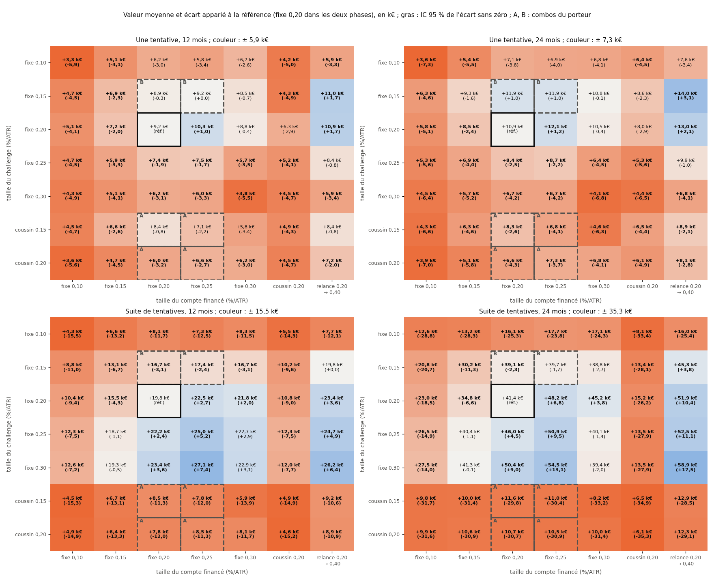

# EXP-D05.6bis — Une taille propre à chaque phase : challenge et compte financé (« hybride »)

*GO du porteur du 2026-10-05 : combos A et B, et mesures propres (« si oui, ajoute-les à ce run »). Calcul : `python
experiments/D05_6bis/run_D05_6bis.py --calcul` (136 s).*

*Méthode, avec le moteur `propfirm` :*
- *Une simulation de challenge par taille de challenge, une simulation de compte financé par taille de compte financé ;
  chaque combinaison relie les deux (7 × 7 = 49).*
  - *Challenge : risque fixe 0,10 à 0,30 %/ATR ; coussin r0 0,15 et 0,20.*
  - *Compte financé : risque fixe 0,10 à 0,30 ; coussin r0 0,20 ; relance (0,20 ; 0,40 quand le capital valorisé tombe à
    −5 % ; 0,20 de nouveau au-dessus de −2 % : le miroir du frein A).*
  - *Combos du porteur : A = coussin r0 0,15 ou 0,20 en challenge, fixe 0,20 ou 0,25 en compte financé ; B = fixe 0,15
    en challenge, fixe 0,20 ou 0,25 en compte financé. Le reste est l'exploration autorisée par le porteur.*
  - *0,30 a été ajouté après un premier calcul : en suite de tentatives, le meilleur r était au bord de la grille.*
- *Deux mesures, en euros pour un compte de 100 000 :*
  - *valeur d'une tentative (D05.5) : −540 € + (540 € + 80 % des retraits) s'il y a au moins un retrait ;*
  - *suite de tentatives (nouvelle, `propfirm.suite`) : un seul compte à la fois ; au minuit qui suit chaque échec du
    challenge ou chaque perte du compte financé, une nouvelle tentative à 540 €. C'est la lecture « Burn & Churn ».*
- *Horizons : 12 et 24 mois depuis le départ, et 12 mois sans 2026. Référence : fixe 0,20 dans les deux phases.*
- *Écarts appariés (mêmes départs) avec IC à 95 % par blocs de mois de départ.*
- *Contrôle passé : fixe r dans les deux phases redonne D05.5 ; coussin 0,20 dans les deux phases redonne D05.6 ; chaque
  taille de challenge redonne D05.6.*

## Verdict

- **Ni le combo A ni le combo B ne battent la référence** (+9 218 € par tentative à 12 mois).
  - **A (coussin en challenge)** : −0,8 à −3,2 k€ par tentative à 12 mois, jusqu'à −4,8 k€ sans 2026.
    - En suite de tentatives, il perd 10 à 12 k€ en 12 mois et environ 30 k€ en 24 mois : un challenge bloqué occupe
      la place.
    - Son délai médian (137 et 174 jours) dépasse ta limite de 120 jours.
  - **B (fixe 0,15 en challenge)** : égal à la référence par tentative (−274 € et +7 € à 12 mois ; IC de part et
    d'autre de zéro), moins bon en suite (−1,7 à −3,2 k€).
- **Ce qui bat la référence partout : garder 0,20 en challenge et monter le seul compte financé.**
  - Fixe 0,25 en compte financé : +1,0 à +1,2 k€ par tentative ; +2,4 à +6,8 k€ en suite.
  - Relance en compte financé : +1,7 à +2,1 k€ par tentative ; +3,6 à +10,4 k€ en suite.
  - « Partout » : tentative et suite, 12 et 24 mois, sans 2026, IC sans zéro ; écart positif ou nul pour chaque année
    de départ.
- **Dans le compte financé, l'optimum du risque fixe est vers 0,25.** 0,30 fait moins bien (−0,4 k€ contre la
  référence, au lieu de +1,0 k€). Le coussin détruit de la valeur (−2,9 à −5,3 k€).
- **En suite de tentatives, la vitesse du challenge prime.**
  - À taille de compte financé égale (0,20, 0,25 ou relance), un challenge à 0,25 ou 0,30 bat 0,20.
  - L'écart à la référence monte jusqu'à +17,5 k€ en 24 mois (0,30 × relance), et l'optimum n'est pas atteint à 0,30.
  - Par tentative, au contraire, un challenge à 0,25 ou 0,30 fait moins bien que la référence (−0,8 à −6,9 k€).
- **Le compte financé agressif ne gagne qu'après une réussite.** Démarrés à un minuit quelconque, 0,25 et la relance
  retirent moins que 0,20 (16,1 et 15,7 k€ contre 18,0 k€ en 12 mois).

## 1. Le challenge selon sa taille

| Taille du challenge | Réussite P1 + P2 [IC 95 %] | Délai médian ; P90 | En cours | Sans 2026 : réussite ; en cours ; délai médian | Délai médian < 120 j |
|---|---|---|---|---|---|
| fixe 0,10 | 78,5 % [69,7 ; 86,7] | 173 ; 371 j | 3,4 % | 61,7 % ; 17,1 % ; 203 j | non |
| fixe 0,15 (B) | 60,4 % [49,5 ; 71,4] | 100 ; 230 j | 2,1 % | 53,6 % ; 2,3 % ; 118 j | oui |
| fixe 0,20 (réf.) | 58,8 % [47,9 ; 69,3] | 68 ; 158 j | 1,6 % | 52,3 % ; 2,0 % ; 78 j | oui |
| fixe 0,25 | 51,0 % [40,2 ; 61,2] | 41 ; 94 j | 1,5 % | 44,2 % ; 1,5 % ; 47 j | oui |
| fixe 0,30 | 45,2 % [35,3 ; 54,9] | 32 ; 69 j | 1,5 % | 39,2 % ; 1,2 % ; 35 j | oui |
| coussin 0,15 (A) | 97,9 % [94,3 ; 100,0] | 174 ; 1 049 j | 2,1 % | 57,8 % ; 42,2 % ; 143 j | non |
| coussin 0,20 (A) | 93,4 % [88,0 ; 97,8] | 137 ; 1 081 j | 6,1 % | 60,9 % ; 38,6 % ; 111 j | non (oui sans 2026) |

- `[OBS]` **Entre 0,15 et 0,20, la réussite ne change pas** (+1,6 point, IC presque confondus) ; 0,20 va 32 jours plus
  vite.
- `[OBS]` **À 0,30, la perte du jour commence à compter :** 4,9 % des départs échouent par elle (0,7 % à 0,25).

## 2. Valeur d'une tentative

| Challenge × compte financé | 12 mois [IC 95 %] | Écart à la réf., 12 mois [IC 95 %] | 24 mois (écart) | Sans 2026 (écart) |
|---|---|---|---|---|
| **réf.** fixe 0,20 × fixe 0,20 | +9 218 € [+5 833 ; +12 821] | — | +10 906 € | +11 100 € |
| B · fixe 0,15 × fixe 0,20 | +8 943 € | −274 € [−1 401 ; +1 040] | +11 930 € (+1 024) | +10 854 € (−246) |
| B · fixe 0,15 × fixe 0,25 | +9 225 € | +7 € [−1 446 ; +1 437] | +11 895 € (+989) | +11 155 € (+55) |
| A · coussin 0,15 × fixe 0,20 | +8 395 € | −822 € [−3 071 ; +1 676] | +8 258 € (−2 649) | +7 473 € (−3 627) |
| A · coussin 0,15 × fixe 0,25 | +7 067 € | −2 150 € [−4 714 ; +392] | +6 819 € (−4 088) | +6 276 € (−4 824) |
| A · coussin 0,20 × fixe 0,20 | +6 043 € | −3 175 € [−4 901 ; −1 570] | +6 567 € (−4 339) | +6 417 € (−4 683) |
| A · coussin 0,20 × fixe 0,25 | +6 551 € | −2 667 € [−4 298 ; −1 130] | +7 253 € (−3 654) | +6 937 € (−4 163) |
| fixe 0,20 × **fixe 0,25** | +10 259 € | **+1 042 €** [+481 ; +1 617] | +12 150 € (+1 243) | +12 319 € (+1 219) |
| fixe 0,20 × fixe 0,30 | +8 827 € | −391 € [−2 629 ; +1 426] | +10 521 € (−386) | +10 555 € (−545) |
| fixe 0,20 × **relance** | +10 895 € | **+1 677 €** [+586 ; +2 945] | +13 018 € (+2 112) | +13 135 € (+2 035) |
| fixe 0,20 × coussin 0,20 | +6 309 € | −2 909 € [−5 837 ; +124] | +8 014 € (−2 892) | +5 792 € (−5 307) |
| fixe 0,25 × fixe 0,25 | +7 504 € | −1 714 € [−3 521 ; −69] | +8 694 € (−2 212) | +8 849 € (−2 251) |
| fixe 0,30 × fixe 0,25 | +5 959 € | −3 258 € [−5 548 ; −1 136] | +6 693 € (−4 213) | +6 796 € (−4 304) |

- `[OBS]` **Le gain vient du compte financé, et ses queues le montrent.**
  - Avec 0,25, la tentative fait mieux que la référence dans 46 % des départs, moins bien dans 3,6 % ; le reste est
    égal (même challenge, échoué).
  - P90 : +38,3 k€ (0,25) et +46,4 k€ (relance), contre +35,0 k€ pour la référence. La médiane reste à −540 € : la
    moitié des tentatives ne touche aucun retrait en 12 mois.
- `[OBS]` **Par année de départ** (2021 à 2025), l'écart est positif chaque année pour 0,25 (+0,3 à +2,0 k€), et
  positif ou nul pour la relance (0 à +4,3 k€, surtout 2022 et 2023).
- `[OBS]` **Le coussin en challenge n'a l'avantage que pour les départs de 2025** (+3,4 et +11,3 k€), qui
  profitent de 2026 ; de 2021 à 2024, il perd chaque année.

## 3. Suite de tentatives (« Burn & Churn », un seul compte à la fois)

| Challenge × compte financé | 12 mois [IC 95 %] | Écart à la réf., 12 mois [IC 95 %] | 24 mois (écart) | Sans 2026 (écart) | Tentatives ; comptes financés en 24 mois |
|---|---|---|---|---|---|
| **réf.** fixe 0,20 × fixe 0,20 | +19 791 € [+15 501 ; +24 062] | — | +41 435 € | +17 274 € | 5,5 ; 2,2 |
| B · fixe 0,15 × fixe 0,20 | +16 703 € | −3 088 € [−3 734 ; −2 393] | +39 141 € (−2 294) | +14 046 € (−3 228) | 4,1 ; 1,6 |
| B · fixe 0,15 × fixe 0,25 | +17 408 € | −2 383 € [−3 549 ; −1 324] | +39 744 € (−1 691) | +14 816 € (−2 458) | 4,5 ; 1,9 |
| A · coussin 0,15 × fixe 0,20 | +8 452 € | −11 339 € [−14 384 ; −8 201] | +11 596 € (−29 839) | +7 195 € (−10 079) | 1,7 ; 0,9 |
| A · coussin 0,20 × fixe 0,20 | +7 769 € | −12 022 € [−15 399 ; −8 717] | +10 694 € (−30 741) | +6 254 € (−11 020) | 1,7 ; 0,9 |
| fixe 0,20 × **fixe 0,25** | +22 461 € | **+2 670 €** [+2 025 ; +3 342] | +48 246 € (+6 810) | +19 658 € (+2 384) | 6,0 ; 2,3 |
| fixe 0,20 × **relance** | +23 368 € | **+3 577 €** [+2 147 ; +4 988] | +51 869 € (+10 433) | +21 373 € (+4 099) | 6,0 ; 2,3 |
| fixe 0,25 × fixe 0,25 | +25 037 € | +5 246 € [+3 840 ; +6 680] | +50 929 € (+9 493) | +21 022 € (+3 748) | 7,9 ; 3,8 |
| fixe 0,30 × fixe 0,25 | +27 146 € | +7 355 € [+5 536 ; +9 340] | +54 508 € (+13 073) | +21 958 € (+4 685) | 9,1 ; 4,0 |
| fixe 0,30 × relance | +26 180 € | +6 389 € [+5 209 ; +7 567] | +58 920 € (+17 485) | +23 950 € (+6 677) | 8,3 ; 3,7 |

(Les combos A à 0,25 en compte financé sont du même ordre : −11,3 à −12,0 k€ en 12 mois, −30,4 et −30,9 k€ en 24 mois.)

- `[OBS]` **La suite inverse le classement du challenge.** Un échec y coûte 540 € et quelques semaines, puis une
  nouvelle tentative démarre ; un challenge plus court donne plus de tentatives et plus de comptes financés.
- `[OBS]` **Le coussin en challenge bloque la suite :** 1,7 tentative en 24 mois, contre 5,5 pour la référence.
- `[OBS]` **La référence est déjà très positive en suite :** médiane +18,1 k€ en 12 mois, P10 −2,2 k€ (quatre échecs),
  P90 +43,8 k€.
- `[OBS]` **À 0,30, l'optimum n'est pas atteint** (+17,5 k€ en 24 mois avec la relance). La grille s'arrête là.

## 4. Le compte financé, seul ou après une réussite

| Compte financé | Démarré à un minuit quelconque, 12 mois : reçu (80 %) ; perdus ; durée de vie médiane des perdus | Après une réussite du challenge à 0,20 : écart par tentative à 12 mois |
|---|---|---|
| fixe 0,15 | 16 295 € ; 89,1 % ; 161 j | −2 014 € |
| fixe 0,20 | 17 964 € ; 96,0 % ; 104 j | réf. |
| fixe 0,25 | 16 071 € ; 99,1 % ; 74 j | +1 042 € |
| fixe 0,30 | 12 541 € ; 100 % ; 54 j | −391 € |
| relance 0,20 → 0,40 | 15 683 € ; 99,8 % ; 78 j | +1 677 € |
| coussin 0,20 | 14 647 € ; 2,7 % ; 17 j | −2 909 € |

- `[OBS]` **Le classement s'inverse selon le moment du départ.**
  - Démarré à un minuit quelconque, 0,20 retire le plus.
  - Démarré juste après une réussite du challenge, 0,25 et la relance retirent plus que 0,20, à 12 comme à 24 mois.

## 5. Lecture

- `[HYP]` **Le challenge sert de filtre de période.**
  - Il réussit quand la stratégie traverse une bonne période. Le compte financé démarre alors dans cette période, et un
    risque plus haut l'exploite avant qu'elle ne finisse.
  - Un challenge rapide est un filtre réactif et bon marché : il échoue vite et pour 540 € dans les mauvaises périodes.
  - Cette lecture repose sur la persistance des bonnes périodes de RE-1. D05.7 peut la tester : un tirage par blocs
    courts coupe cette persistance, et l'avantage devrait alors fondre.
- `[HYP]` **Dans le compte financé, la perte du porteur est plafonnée.** Doubler le risque en creux (relance) y paie,
  alors que réduire le risque (coussin) y coûte. C'est la convexité de D05.5, vue sous un autre angle.
- `[HYP]` **Ton objectif de challenge et la politique « Burn & Churn » se contredisent.**
  - Par tentative, la meilleure taille de challenge est 0,15 à 0,20.
  - En suite, c'est la plus rapide mesurée (0,30), au prix d'une réussite plus faible (45 %).
  - Le choix dépend de la façon dont tu opères : une tentative à la fois, rachetée aussitôt après chaque échec (lecture
    « suite »), ou des tentatives dont le nombre est fixé à l'avance (lecture « tentative »).

## 6. Limites

- **Données déjà lues ; départs chevauchants.** 49 combinaisons : la meilleure est optimiste. Les IC par blocs de mois
  ne couvrent pas la dépendance entre périodes de plusieurs mois ; ils sont trop étroits pour un effet qui tiendrait à
  ces périodes.
- **0,30 ajouté après lecture,** pour situer l'optimum de la suite. Au-delà de 0,25, l'exécution réelle s'éloigne du
  modèle : écarts, glissement et gaps à fort levier ne sont pas modélisés, et la perte du jour commence à compter.
- **Relance :** seuils repris du frein du porteur, mesurés une seule fois. Doubler le risque après une perte peut
  tomber sous les règles de comportement d'une firme ; à vérifier dans les conditions FTMO.
- **Suite :** un seul compte à la fois, rachat immédiat, nombre de tentatives illimité, 540 € chacune ; pas de comptes
  en parallèle, pas de remise sur un nouvel essai.
- **Mêmes limites de coûts et de règles de la firme que D05.5.** Les 8 métriques par trade sont celles de D05.4 : les
  trades ne changent pas, seules les tailles changent.

---

# Annexes générées (`run_D05_6bis.py --calcul`, puis `--rapport`)

Calcul du 2026-10-05 15:51 UTC, commit `b5cecb5`, 136 s.

## A1. Contrôle bloquant (passé)

- challenges_egaux_D05_6 : 12.
- fixe 0,10_deux_phases_12 mois_egal_D05_5 : 0.033355.
- fixe 0,10_deux_phases_24 mois_egal_D05_5 : 0.035581.
- fixe 0,10_deux_phases_sans 2026, 12 mois_egal_D05_5 : 0.023398.
- fixe 0,15_deux_phases_12 mois_egal_D05_5 : 0.069016.
- fixe 0,15_deux_phases_24 mois_egal_D05_5 : 0.093391.
- fixe 0,15_deux_phases_sans 2026, 12 mois_egal_D05_5 : 0.083966.
- fixe 0,20_deux_phases_12 mois_egal_D05_5 : 0.092176.
- fixe 0,20_deux_phases_24 mois_egal_D05_5 : 0.109062.
- fixe 0,20_deux_phases_sans 2026, 12 mois_egal_D05_5 : 0.111.
- fixe 0,25_deux_phases_12 mois_egal_D05_5 : 0.07504.
- fixe 0,25_deux_phases_24 mois_egal_D05_5 : 0.086944.
- fixe 0,25_deux_phases_sans 2026, 12 mois_egal_D05_5 : 0.088494.
- coussin 0,20_deux_phases_12 mois_egal_D05_6 : 0.044841.
- coussin 0,20_deux_phases_sans 2026, 12 mois_egal_D05_6 : 0.028502.

## A2. Challenge selon sa taille, tous les départs (1826 départs)

| Taille du challenge | Réussite P1 + P2 [IC 95 %] | En cours | Délai médian ; P90 | Délai médian < 120 j (porteur) |
|---|---|---|---|---|
| fixe 0,10 | 78,5 % [69,7 % ; 86,7 %] | 3,4 % | 173 ; 371 j | non |
| fixe 0,15 | 60,4 % [49,5 % ; 71,4 %] | 2,1 % | 100 ; 230 j | oui |
| fixe 0,20 | 58,8 % [47,9 % ; 69,3 %] | 1,6 % | 68 ; 158 j | oui |
| fixe 0,25 | 51,0 % [40,2 % ; 61,2 %] | 1,5 % | 41 ; 94 j | oui |
| fixe 0,30 | 45,2 % [35,3 % ; 54,9 %] | 1,5 % | 32 ; 69 j | oui |
| coussin 0,15 | 97,9 % [94,3 % ; 100,0 %] | 2,1 % | 174 ; 1049 j | non |
| coussin 0,20 | 93,4 % [88,0 % ; 97,8 %] | 6,1 % | 137 ; 1081 j | non |

## A2. Challenge selon sa taille, sans 2026 (1553 départs)

| Taille du challenge | Réussite P1 + P2 [IC 95 %] | En cours | Délai médian ; P90 | Délai médian < 120 j (porteur) |
|---|---|---|---|---|
| fixe 0,10 | 61,7 % [49,6 % ; 73,3 %] | 17,1 % | 203 ; 405 j | non |
| fixe 0,15 | 53,6 % [41,2 % ; 66,3 %] | 2,3 % | 118 ; 249 j | oui |
| fixe 0,20 | 52,3 % [40,5 % ; 64,7 %] | 2,0 % | 78 ; 168 j | oui |
| fixe 0,25 | 44,2 % [32,8 % ; 55,6 %] | 1,5 % | 47 ; 99 j | oui |
| fixe 0,30 | 39,1 % [28,9 % ; 50,3 %] | 1,2 % | 35 ; 76 j | oui |
| coussin 0,15 | 57,8 % [45,7 % ; 70,3 %] | 42,2 % | 143 ; 369 j | non |
| coussin 0,20 | 60,9 % [48,4 % ; 73,4 %] | 38,6 % | 111 ; 315 j | oui |

## A3. Comptes financés démarrés à chaque minuit, selon leur taille

| Taille du compte financé | Horizon | Comptes | Perdus dans l'horizon | Durée médiane des comptes perdus | Retiré moyen (avant partage) ; reçu (80 %) |
|---|---|---|---|---|---|
| fixe 0,10 | 1 an(s) | 1 462 | 70,6 % | 257 j | 16,21 % ; 12968 € |
| fixe 0,10 | 2 an(s) | 1 097 | 100,0 % | 299 j | 19,69 % ; 15755 € |
| fixe 0,15 | 1 an(s) | 1 462 | 89,1 % | 161 j | 20,37 % ; 16295 € |
| fixe 0,15 | 2 an(s) | 1 097 | 100,0 % | 175 j | 23,24 % ; 18594 € |
| fixe 0,20 | 1 an(s) | 1 462 | 96,0 % | 104 j | 22,45 % ; 17964 € |
| fixe 0,20 | 2 an(s) | 1 097 | 100,0 % | 97 j | 24,10 % ; 19283 € |
| fixe 0,25 | 1 an(s) | 1 462 | 99,1 % | 74 j | 20,09 % ; 16071 € |
| fixe 0,25 | 2 an(s) | 1 097 | 100,0 % | 71 j | 20,95 % ; 16759 € |
| fixe 0,30 | 1 an(s) | 1 462 | 100,0 % | 54 j | 15,68 % ; 12540 € |
| fixe 0,30 | 2 an(s) | 1 097 | 100,0 % | 51 j | 15,16 % ; 12131 € |
| coussin 0,20 | 1 an(s) | 1 462 | 2,7 % | 17 j | 18,31 % ; 14647 € |
| coussin 0,20 | 2 an(s) | 1 097 | 3,5 % | 14 j | 19,56 % ; 15645 € |
| relance 0,20 → 0,40 | 1 an(s) | 1 462 | 99,8 % | 78 j | 19,60 % ; 15683 € |
| relance 0,20 → 0,40 | 2 an(s) | 1 097 | 100,0 % | 78 j | 20,83 % ; 16661 € |

## A4. Valeur d'une tentative, 12 mois (1462 départs) : valeur (écart à la référence)

| Challenge ↓ / compte financé → | fixe 0,10 | fixe 0,15 | fixe 0,20 | fixe 0,25 | fixe 0,30 | coussin 0,20 | relance 0,20 → 0,40 |
|---|---|---|---|---|---|---|---|
| fixe 0,10 | +3 336 € (−5 882 €) | +5 128 € (−4 090 €) | +6 207 € (−3 011 €) | +5 787 € (−3 430 €) | +6 661 € (−2 557 €) | +4 195 € (−5 022 €) | +5 872 € (−3 345 €) |
| fixe 0,15 | +4 681 € (−4 537 €) | +6 902 € (−2 316 €) | +8 943 € (−274 €) | +9 225 € (+7 €) | +8 474 € (−744 €) | +4 282 € (−4 936 €) | +10 959 € (+1 742 €) |
| fixe 0,20 | +5 107 € (−4 111 €) | +7 204 € (−2 014 €) | +9 218 € (réf.) | +10 259 € (+1 042 €) | +8 827 € (−391 €) | +6 309 € (−2 909 €) | +10 895 € (+1 677 €) |
| fixe 0,25 | +4 716 € (−4 502 €) | +5 940 € (−3 278 €) | +7 357 € (−1 861 €) | +7 504 € (−1 714 €) | +5 745 € (−3 473 €) | +5 165 € (−4 052 €) | +8 409 € (−808 €) |
| fixe 0,30 | +4 303 € (−4 915 €) | +5 141 € (−4 077 €) | +6 162 € (−3 055 €) | +5 959 € (−3 258 €) | +3 753 € (−5 465 €) | +4 479 € (−4 739 €) | +5 864 € (−3 354 €) |
| coussin 0,15 | +4 523 € (−4 695 €) | +6 589 € (−2 629 €) | +8 395 € (−822 €) | +7 067 € (−2 150 €) | +5 822 € (−3 396 €) | +4 888 € (−4 330 €) | +8 426 € (−791 €) |
| coussin 0,20 | +3 608 € (−5 610 €) | +4 743 € (−4 475 €) | +6 043 € (−3 175 €) | +6 551 € (−2 667 €) | +6 199 € (−3 018 €) | +4 484 € (−4 733 €) | +7 212 € (−2 005 €) |

## A4. Valeur d'une tentative, 24 mois (1097 départs) : valeur (écart à la référence)

| Challenge ↓ / compte financé → | fixe 0,10 | fixe 0,15 | fixe 0,20 | fixe 0,25 | fixe 0,30 | coussin 0,20 | relance 0,20 → 0,40 |
|---|---|---|---|---|---|---|---|
| fixe 0,10 | +3 558 € (−7 348 €) | +5 399 € (−5 507 €) | +7 148 € (−3 758 €) | +6 901 € (−4 005 €) | +6 849 € (−4 057 €) | +6 427 € (−4 479 €) | +7 554 € (−3 352 €) |
| fixe 0,15 | +6 284 € (−4 622 €) | +9 339 € (−1 567 €) | +11 930 € (+1 024 €) | +11 895 € (+989 €) | +10 818 € (−88 €) | +8 567 € (−2 339 €) | +14 038 € (+3 132 €) |
| fixe 0,20 | +5 766 € (−5 140 €) | +8 530 € (−2 376 €) | +10 906 € (réf.) | +12 150 € (+1 243 €) | +10 521 € (−386 €) | +8 014 € (−2 892 €) | +13 018 € (+2 112 €) |
| fixe 0,25 | +5 318 € (−5 588 €) | +6 883 € (−4 023 €) | +8 433 € (−2 473 €) | +8 694 € (−2 212 €) | +6 392 € (−4 514 €) | +5 327 € (−5 580 €) | +9 921 € (−985 €) |
| fixe 0,30 | +4 542 € (−6 365 €) | +5 699 € (−5 207 €) | +6 662 € (−4 244 €) | +6 693 € (−4 213 €) | +4 056 € (−6 850 €) | +4 401 € (−6 505 €) | +6 757 € (−4 149 €) |
| coussin 0,15 | +4 272 € (−6 635 €) | +6 330 € (−4 576 €) | +8 258 € (−2 649 €) | +6 819 € (−4 088 €) | +4 613 € (−6 293 €) | +6 544 € (−4 362 €) | +8 854 € (−2 053 €) |
| coussin 0,20 | +3 924 € (−6 982 €) | +5 102 € (−5 804 €) | +6 567 € (−4 339 €) | +7 253 € (−3 654 €) | +6 802 € (−4 104 €) | +6 053 € (−4 853 €) | +8 139 € (−2 767 €) |

## A4. Valeur d'une tentative, sans 2026, 12 mois (1189 départs) : valeur (écart à la référence)

| Challenge ↓ / compte financé → | fixe 0,10 | fixe 0,15 | fixe 0,20 | fixe 0,25 | fixe 0,30 | coussin 0,20 | relance 0,20 → 0,40 |
|---|---|---|---|---|---|---|---|
| fixe 0,10 | +2 340 € (−8 760 €) | +3 607 € (−7 493 €) | +4 813 € (−6 287 €) | +4 098 € (−7 002 €) | +4 578 € (−6 522 €) | +2 180 € (−8 920 €) | +4 617 € (−6 483 €) |
| fixe 0,15 | +5 629 € (−5 471 €) | +8 397 € (−2 703 €) | +10 854 € (−246 €) | +11 155 € (+55 €) | +10 429 € (−671 €) | +5 150 € (−5 950 €) | +13 166 € (+2 066 €) |
| fixe 0,20 | +5 781 € (−5 319 €) | +8 600 € (−2 500 €) | +11 100 € (réf.) | +12 319 € (+1 219 €) | +10 555 € (−545 €) | +5 792 € (−5 307 €) | +13 135 € (+2 035 €) |
| fixe 0,25 | +4 882 € (−6 218 €) | +6 971 € (−4 129 €) | +8 713 € (−2 387 €) | +8 849 € (−2 251 €) | +6 690 € (−4 410 €) | +4 447 € (−6 653 €) | +10 009 € (−1 091 €) |
| fixe 0,30 | +4 183 € (−6 917 €) | +5 913 € (−5 187 €) | +7 143 € (−3 957 €) | +6 796 € (−4 304 €) | +4 175 € (−6 925 €) | +3 354 € (−7 746 €) | +6 682 € (−4 418 €) |
| coussin 0,15 | +3 804 € (−7 296 €) | +5 682 € (−5 418 €) | +7 473 € (−3 627 €) | +6 276 € (−4 824 €) | +4 298 € (−6 801 €) | +3 166 € (−7 934 €) | +8 126 € (−2 974 €) |
| coussin 0,20 | +3 407 € (−7 693 €) | +4 954 € (−6 146 €) | +6 417 € (−4 683 €) | +6 937 € (−4 163 €) | +6 555 € (−4 545 €) | +2 850 € (−8 250 €) | +7 708 € (−3 392 €) |

## A4. Valeur d'une suite de tentatives, 12 mois (1462 départs) : valeur (écart à la référence)

| Challenge ↓ / compte financé → | fixe 0,10 | fixe 0,15 | fixe 0,20 | fixe 0,25 | fixe 0,30 | coussin 0,20 | relance 0,20 → 0,40 |
|---|---|---|---|---|---|---|---|
| fixe 0,10 | +4 306 € (−15 485 €) | +6 638 € (−13 153 €) | +8 135 € (−11 656 €) | +7 292 € (−12 499 €) | +8 278 € (−11 513 €) | +5 500 € (−14 291 €) | +7 740 € (−12 051 €) |
| fixe 0,15 | +8 773 € (−11 018 €) | +13 082 € (−6 709 €) | +16 703 € (−3 088 €) | +17 408 € (−2 383 €) | +16 653 € (−3 138 €) | +10 205 € (−9 586 €) | +19 792 € (+0 €) |
| fixe 0,20 | +10 405 € (−9 386 €) | +15 497 € (−4 295 €) | +19 791 € (réf.) | +22 461 € (+2 670 €) | +21 762 € (+1 971 €) | +10 772 € (−9 019 €) | +23 368 € (+3 577 €) |
| fixe 0,25 | +12 257 € (−7 534 €) | +18 711 € (−1 080 €) | +22 213 € (+2 422 €) | +25 037 € (+5 246 €) | +22 716 € (+2 925 €) | +12 296 € (−7 495 €) | +24 736 € (+4 944 €) |
| fixe 0,30 | +12 619 € (−7 172 €) | +19 283 € (−508 €) | +23 402 € (+3 611 €) | +27 146 € (+7 355 €) | +22 928 € (+3 136 €) | +12 044 € (−7 748 €) | +26 180 € (+6 389 €) |
| coussin 0,15 | +4 492 € (−15 300 €) | +6 652 € (−13 139 €) | +8 452 € (−11 339 €) | +7 807 € (−11 984 €) | +5 931 € (−13 860 €) | +4 888 € (−14 904 €) | +9 229 € (−10 562 €) |
| coussin 0,20 | +4 852 € (−14 940 €) | +6 446 € (−13 345 €) | +7 769 € (−12 022 €) | +8 464 € (−11 327 €) | +8 061 € (−11 730 €) | +4 553 € (−15 238 €) | +8 917 € (−10 874 €) |

## A4. Valeur d'une suite de tentatives, 24 mois (1097 départs) : valeur (écart à la référence)

| Challenge ↓ / compte financé → | fixe 0,10 | fixe 0,15 | fixe 0,20 | fixe 0,25 | fixe 0,30 | coussin 0,20 | relance 0,20 → 0,40 |
|---|---|---|---|---|---|---|---|
| fixe 0,10 | +12 613 € (−28 822 €) | +13 172 € (−28 263 €) | +16 127 € (−25 308 €) | +17 685 € (−23 750 €) | +17 105 € (−24 330 €) | +8 077 € (−33 358 €) | +16 032 € (−25 404 €) |
| fixe 0,15 | +20 768 € (−20 668 €) | +30 175 € (−11 260 €) | +39 141 € (−2 294 €) | +39 744 € (−1 691 €) | +38 751 € (−2 684 €) | +13 356 € (−28 079 €) | +45 255 € (+3 820 €) |
| fixe 0,20 | +22 953 € (−18 482 €) | +34 846 € (−6 589 €) | +41 435 € (réf.) | +48 246 € (+6 810 €) | +45 210 € (+3 774 €) | +15 248 € (−26 188 €) | +51 869 € (+10 433 €) |
| fixe 0,25 | +26 520 € (−14 915 €) | +40 374 € (−1 061 €) | +45 963 € (+4 528 €) | +50 929 € (+9 493 €) | +40 073 € (−1 362 €) | +13 538 € (−27 897 €) | +52 511 € (+11 075 €) |
| fixe 0,30 | +27 482 € (−13 953 €) | +41 339 € (−96 €) | +50 430 € (+8 995 €) | +54 508 € (+13 073 €) | +39 404 € (−2 031 €) | +13 546 € (−27 890 €) | +58 920 € (+17 485 €) |
| coussin 0,15 | +9 768 € (−31 668 €) | +10 013 € (−31 422 €) | +11 596 € (−29 839 €) | +11 009 € (−30 427 €) | +8 195 € (−33 241 €) | +6 544 € (−34 891 €) | +12 929 € (−28 506 €) |
| coussin 0,20 | +9 861 € (−31 574 €) | +10 581 € (−30 855 €) | +10 694 € (−30 741 €) | +10 502 € (−30 934 €) | +9 995 € (−31 440 €) | +6 145 € (−35 290 €) | +12 320 € (−29 116 €) |

## A4. Valeur d'une suite de tentatives, sans 2026, 12 mois (1189 départs) : valeur (écart à la référence)

| Challenge ↓ / compte financé → | fixe 0,10 | fixe 0,15 | fixe 0,20 | fixe 0,25 | fixe 0,30 | coussin 0,20 | relance 0,20 → 0,40 |
|---|---|---|---|---|---|---|---|
| fixe 0,10 | +2 862 € (−14 412 €) | +4 455 € (−12 818 €) | +5 987 € (−11 287 €) | +4 565 € (−12 709 €) | +5 123 € (−12 150 €) | +2 565 € (−14 709 €) | +5 723 € (−11 551 €) |
| fixe 0,15 | +7 218 € (−10 056 €) | +10 860 € (−6 414 €) | +14 046 € (−3 228 €) | +14 816 € (−2 458 €) | +13 585 € (−3 689 €) | +6 272 € (−11 002 €) | +17 657 € (+384 €) |
| fixe 0,20 | +8 788 € (−8 486 €) | +13 192 € (−4 082 €) | +17 274 € (réf.) | +19 658 € (+2 384 €) | +17 677 € (+403 €) | +8 558 € (−8 716 €) | +21 373 € (+4 099 €) |
| fixe 0,25 | +10 532 € (−6 741 €) | +15 920 € (−1 354 €) | +18 959 € (+1 685 €) | +21 022 € (+3 748 €) | +16 251 € (−1 023 €) | +9 265 € (−8 008 €) | +22 515 € (+5 242 €) |
| fixe 0,30 | +10 856 € (−6 418 €) | +16 458 € (−815 €) | +20 254 € (+2 980 €) | +21 958 € (+4 685 €) | +15 402 € (−1 871 €) | +9 178 € (−8 096 €) | +23 950 € (+6 677 €) |
| coussin 0,15 | +3 604 € (−13 669 €) | +5 413 € (−11 860 €) | +7 195 € (−10 079 €) | +6 546 € (−10 728 €) | +4 283 € (−12 991 €) | +3 166 € (−14 108 €) | +8 481 € (−8 793 €) |
| coussin 0,20 | +3 549 € (−13 724 €) | +4 733 € (−12 541 €) | +6 254 € (−11 020 €) | +7 046 € (−10 228 €) | +6 550 € (−10 724 €) | +2 935 € (−14 338 €) | +7 854 € (−9 420 €) |

## A5. Combinaisons choisies pour l'affichage, une tentative : IC et queues

| Challenge | Compte financé | Combo | Lecture | Valeur moyenne [IC 95 %] | Médiane ; P10 ; P90 | Écart apparié à la référence [IC 95 %] | Départs : mieux ; moins bien que la référence | ≥ 1 retrait |
|---|---|---|---|---|---|---|---|---|
| fixe 0,20 | fixe 0,20 | réf. | 12 mois | +9 218 € [+5 833 € ; +12 821 €] | −540 € ; −540 € ; +35 004 € | réf. | — | 49,7 % |
| fixe 0,15 | fixe 0,20 | B | 12 mois | +8 943 € [+5 794 € ; +12 545 €] | +4 001 € ; −540 € ; +35 004 € | −274 € [−1 401 € ; +1 040 €] | 13,5 % ; 35,8 % | 52,1 % |
| fixe 0,15 | fixe 0,25 | B | 12 mois | +9 225 € [+6 044 € ; +12 725 €] | −540 € ; −540 € ; +32 983 € | +7 € [−1 446 € ; +1 437 €] | 26,7 % ; 30,0 % | 48,8 % |
| coussin 0,15 | fixe 0,20 | A | 12 mois | +8 395 € [+5 438 € ; +11 567 €] | +2 422 € ; −540 € ; +30 902 € | −822 € [−3 071 € ; +1 676 €] | 18,0 % ; 44,5 % | 55,1 % |
| coussin 0,20 | fixe 0,20 | A | 12 mois | +6 043 € [+3 722 € ; +8 630 €] | −540 € ; −540 € ; +15 449 € | −3 175 € [−4 901 € ; −1 570 €] | 16,5 % ; 37,0 % | 49,9 % |
| fixe 0,20 | fixe 0,25 | nan | 12 mois | +10 259 € [+6 501 € ; +14 232 €] | −540 € ; −540 € ; +38 308 € | +1 042 € [+481 € ; +1 617 €] | 46,1 % ; 3,6 % | 47,9 % |
| fixe 0,20 | fixe 0,30 | nan | 12 mois | +8 827 € [+5 861 € ; +12 144 €] | −540 € ; −540 € ; +27 520 € | −391 € [−2 629 € ; +1 426 €] | 37,2 % ; 12,5 % | 45,1 % |
| fixe 0,20 | relance 0,20 → 0,40 | nan | 12 mois | +10 895 € [+6 639 € ; +15 578 €] | −540 € ; −540 € ; +46 378 € | +1 677 € [+586 € ; +2 945 €] | 29,8 % ; 2,0 % | 48,1 % |
| fixe 0,25 | fixe 0,25 | nan | 12 mois | +7 504 € [+4 065 € ; +11 348 €] | −540 € ; −540 € ; +35 581 € | −1 714 € [−3 521 € ; −69 €] | 33,2 % ; 18,7 % | 35,4 % |
| fixe 0,25 | relance 0,20 → 0,40 | nan | 12 mois | +8 409 € [+4 469 € ; +12 920 €] | −540 € ; −540 € ; +44 550 € | −808 € [−2 598 € ; +949 €] | 29,9 % ; 17,3 % | 37,1 % |
| fixe 0,30 | fixe 0,30 | nan | 12 mois | +3 753 € [+1 555 € ; +6 557 €] | −540 € ; −540 € ; +14 497 € | −5 465 € [−8 582 € ; −2 741 €] | 19,2 % ; 34,2 % | 26,3 % |
| fixe 0,30 | relance 0,20 → 0,40 | nan | 12 mois | +5 864 € [+3 165 € ; +9 155 €] | −540 € ; −540 € ; +23 091 € | −3 354 € [−5 953 € ; −990 €] | 24,8 % ; 26,7 % | 31,3 % |
| fixe 0,20 | fixe 0,20 | réf. | 24 mois | +10 906 € [+6 894 € ; +15 335 €] | −540 € ; −540 € ; +37 551 € | réf. | — | 48,6 % |
| fixe 0,15 | fixe 0,20 | B | 24 mois | +11 930 € [+7 936 € ; +16 166 €] | +7 481 € ; −540 € ; +35 629 € | +1 024 € [−864 € ; +3 127 €] | 16,4 % ; 36,0 % | 57,5 % |
| fixe 0,15 | fixe 0,25 | B | 24 mois | +11 895 € [+7 979 € ; +16 220 €] | +8 976 € ; −540 € ; +38 308 € | +989 € [−1 166 € ; +3 166 €] | 30,6 % ; 29,6 % | 53,1 % |
| coussin 0,15 | fixe 0,20 | A | 24 mois | +8 258 € [+5 044 € ; +11 996 €] | +2 422 € ; −540 € ; +30 902 € | −2 649 € [−4 460 € ; −937 €] | 17,6 % ; 43,4 % | 54,1 % |
| coussin 0,20 | fixe 0,20 | A | 24 mois | +6 567 € [+3 880 € ; +9 696 €] | −540 € ; −540 € ; +27 392 € | −4 339 € [−6 268 € ; −2 575 €] | 11,1 % ; 40,7 % | 47,5 % |
| fixe 0,20 | fixe 0,25 | nan | 24 mois | +12 150 € [+7 524 € ; +17 172 €] | −540 € ; −540 € ; +40 313 € | +1 243 € [+570 € ; +1 917 €] | 47,1 % ; 1,5 % | 47,1 % |
| fixe 0,20 | fixe 0,30 | nan | 24 mois | +10 521 € [+6 674 € ; +14 596 €] | −540 € ; −540 € ; +29 255 € | −386 € [−3 416 € ; +1 788 €] | 40,0 % ; 8,6 % | 44,2 % |
| fixe 0,20 | relance 0,20 → 0,40 | nan | 24 mois | +13 018 € [+7 694 € ; +18 868 €] | −540 € ; −540 € ; +52 414 € | +2 112 € [+719 € ; +3 683 €] | 32,2 % ; 1,5 % | 47,3 % |
| fixe 0,25 | fixe 0,25 | nan | 24 mois | +8 694 € [+4 348 € ; +13 565 €] | −540 € ; −540 € ; +40 313 € | −2 212 € [−4 452 € ; −177 €] | 30,7 % ; 18,4 % | 31,3 % |
| fixe 0,25 | relance 0,20 → 0,40 | nan | 24 mois | +9 921 € [+4 955 € ; +15 597 €] | −540 € ; −540 € ; +50 295 € | −985 € [−3 148 € ; +1 203 €] | 30,8 % ; 17,4 % | 33,8 % |
| fixe 0,30 | fixe 0,30 | nan | 24 mois | +4 056 € [+1 184 € ; +7 507 €] | −540 € ; −540 € ; +18 009 € | −6 850 € [−10 734 € ; −3 275 €] | 15,6 % ; 35,1 % | 20,8 % |
| fixe 0,30 | relance 0,20 → 0,40 | nan | 24 mois | +6 757 € [+3 003 € ; +11 076 €] | −540 € ; −540 € ; +36 130 € | −4 149 € [−7 401 € ; −996 €] | 23,5 % ; 28,8 % | 25,9 % |
| fixe 0,20 | fixe 0,20 | réf. | sans 2026, 12 mois | +11 100 € [+7 145 € ; +15 608 €] | +4 001 € ; −540 € ; +37 551 € | réf. | — | 52,4 % |
| fixe 0,15 | fixe 0,20 | B | sans 2026, 12 mois | +10 854 € [+7 297 € ; +15 148 €] | +7 481 € ; −540 € ; +35 004 € | −246 € [−1 751 € ; +1 433 €] | 13,0 % ; 39,4 % | 58,5 % |
| fixe 0,15 | fixe 0,25 | B | sans 2026, 12 mois | +11 155 € [+7 541 € ; +15 466 €] | +6 350 € ; −540 € ; +38 308 € | +55 € [−1 803 € ; +1 850 €] | 28,8 % ; 32,3 % | 54,5 % |
| coussin 0,15 | fixe 0,20 | A | sans 2026, 12 mois | +7 473 € [+4 452 € ; +11 230 €] | −540 € ; −540 € ; +30 902 € | −3 627 € [−5 145 € ; −2 259 €] | 6,1 % ; 48,9 % | 47,1 % |
| coussin 0,20 | fixe 0,20 | A | sans 2026, 12 mois | +6 417 € [+3 631 € ; +9 757 €] | −540 € ; −540 € ; +22 345 € | −4 683 € [−6 487 € ; −3 086 €] | 6,1 % ; 43,1 % | 44,7 % |
| fixe 0,20 | fixe 0,25 | nan | sans 2026, 12 mois | +12 319 € [+7 939 € ; +17 232 €] | +2 286 € ; −540 € ; +40 313 € | +1 219 € [+525 € ; +1 920 €] | 50,0 % ; 2,4 % | 50,2 % |
| fixe 0,20 | fixe 0,30 | nan | sans 2026, 12 mois | +10 555 € [+7 023 € ; +14 558 €] | −540 € ; −540 € ; +29 255 € | −545 € [−3 407 € ; +1 613 €] | 40,7 % ; 11,7 % | 46,8 % |
| fixe 0,20 | relance 0,20 → 0,40 | nan | sans 2026, 12 mois | +13 135 € [+8 075 € ; +19 101 €] | +1 660 € ; −540 € ; +49 074 € | +2 035 € [+666 € ; +3 641 €] | 35,8 % ; 2,4 % | 50,5 % |
| fixe 0,25 | fixe 0,25 | nan | sans 2026, 12 mois | +8 849 € [+4 867 € ; +13 672 €] | −540 € ; −540 € ; +38 308 € | −2 251 € [−4 407 € ; −291 €] | 32,8 % ; 20,1 % | 33,8 % |
| fixe 0,25 | relance 0,20 → 0,40 | nan | sans 2026, 12 mois | +10 009 € [+5 396 € ; +15 511 €] | −540 € ; −540 € ; +46 378 € | −1 091 € [−3 262 € ; +981 €] | 32,8 % ; 19,2 % | 36,2 % |
| fixe 0,30 | fixe 0,30 | nan | sans 2026, 12 mois | +4 175 € [+1 524 € ; +7 402 €] | −540 € ; −540 € ; +18 009 € | −6 925 € [−10 683 € ; −3 537 €] | 15,6 % ; 38,8 % | 23,0 % |
| fixe 0,30 | relance 0,20 → 0,40 | nan | sans 2026, 12 mois | +6 682 € [+3 222 € ; +10 894 €] | −540 € ; −540 € ; +27 854 € | −4 418 € [−7 378 € ; −1 486 €] | 23,8 % ; 32,0 % | 27,8 % |

## A5. Combinaisons choisies pour l'affichage, une suite de tentatives : IC et queues

| Challenge | Compte financé | Combo | Lecture | Valeur moyenne [IC 95 %] | Médiane ; P10 ; P90 | Écart apparié à la référence [IC 95 %] | Départs : mieux ; moins bien que la référence | Tentatives ; comptes financés par suite |
|---|---|---|---|---|---|---|---|---|
| fixe 0,20 | fixe 0,20 | réf. | 12 mois | +19 791 € [+15 501 € ; +24 062 €] | +18 091 € ; −2 160 € ; +43 754 € | réf. | — | 3,2 ; 1,3 |
| fixe 0,15 | fixe 0,20 | B | 12 mois | +16 703 € [+12 538 € ; +20 887 €] | +13 450 € ; −1 620 € ; +37 543 € | −3 088 € [−3 734 € ; −2 393 €] | 21,1 % ; 61,4 % | 2,7 ; 1,1 |
| fixe 0,15 | fixe 0,25 | B | 12 mois | +17 408 € [+13 327 € ; +21 560 €] | +13 415 € ; −1 620 € ; +39 773 € | −2 383 € [−3 549 € ; −1 324 €] | 41,2 % ; 54,0 % | 2,8 ; 1,1 |
| coussin 0,15 | fixe 0,20 | A | 12 mois | +8 452 € [+5 361 € ; +11 928 €] | +1 882 € ; −540 € ; +30 362 € | −11 339 € [−14 384 € ; −8 201 €] | 18,1 % ; 81,7 % | 1,5 ; 0,7 |
| coussin 0,20 | fixe 0,20 | A | 12 mois | +7 769 € [+4 782 € ; +11 351 €] | +1 882 € ; −1 080 € ; +35 478 € | −12 022 € [−15 399 € ; −8 717 €] | 22,5 % ; 75,5 % | 1,6 ; 0,8 |
| fixe 0,20 | fixe 0,25 | nan | 12 mois | +22 461 € [+17 867 € ; +26 980 €] | +21 750 € ; −2 160 € ; +47 396 € | +2 670 € [+2 025 € ; +3 342 €] | 72,2 % ; 12,9 % | 3,5 ; 1,4 |
| fixe 0,20 | fixe 0,30 | nan | 12 mois | +21 762 € [+17 008 € ; +26 519 €] | +20 143 € ; −2 160 € ; +43 588 € | +1 971 € [+243 € ; +3 615 €] | 54,7 % ; 30,4 % | 3,9 ; 1,7 |
| fixe 0,20 | relance 0,20 → 0,40 | nan | 12 mois | +23 368 € [+18 010 € ; +28 685 €] | +20 107 € ; −2 160 € ; +55 559 € | +3 577 € [+2 147 € ; +4 988 €] | 66,2 % ; 10,3 % | 3,4 ; 1,4 |
| fixe 0,25 | fixe 0,25 | nan | 12 mois | +25 037 € [+20 028 € ; +30 097 €] | +24 496 € ; −2 700 € ; +46 856 € | +5 246 € [+3 840 € ; +6 680 €] | 74,6 % ; 25,4 % | 4,4 ; 1,9 |
| fixe 0,25 | relance 0,20 → 0,40 | nan | 12 mois | +24 736 € [+19 400 € ; +30 046 €] | +21 463 € ; −2 700 € ; +55 801 € | +4 944 € [+3 546 € ; +6 281 €] | 75,9 % ; 24,1 % | 4,2 ; 1,9 |
| fixe 0,30 | fixe 0,30 | nan | 12 mois | +22 928 € [+17 334 € ; +28 952 €] | +20 495 € ; −3 240 € ; +65 107 € | +3 136 € [−1 512 € ; +7 550 €] | 64,6 % ; 35,4 % | 5,9 ; 2,3 |
| fixe 0,30 | relance 0,20 → 0,40 | nan | 12 mois | +26 180 € [+21 188 € ; +31 167 €] | +22 771 € ; +1 332 € ; +55 261 € | +6 389 € [+5 209 € ; +7 567 €] | 85,0 % ; 15,0 % | 4,9 ; 2,1 |
| fixe 0,20 | fixe 0,20 | réf. | 24 mois | +41 435 € [+36 870 € ; +45 986 €] | +42 134 € ; +19 578 € ; +57 655 € | réf. | — | 5,6 ; 2,2 |
| fixe 0,15 | fixe 0,20 | B | 24 mois | +39 141 € [+34 392 € ; +43 697 €] | +39 201 € ; +19 038 € ; +58 805 € | −2 294 € [−3 433 € ; −1 276 €] | 30,0 % ; 69,5 % | 4,1 ; 1,6 |
| fixe 0,15 | fixe 0,25 | B | 24 mois | +39 744 € [+34 984 € ; +44 306 €] | +40 903 € ; +20 400 € ; +58 708 € | −1 691 € [−4 148 € ; +349 €] | 50,8 % ; 49,2 % | 4,4 ; 1,9 |
| coussin 0,15 | fixe 0,20 | A | 24 mois | +11 596 € [+7 386 € ; +16 264 €] | +3 461 € ; −1 080 € ; +36 740 € | −29 839 € [−33 819 € ; −25 657 €] | 0,0 % ; 100,0 % | 1,7 ; 0,9 |
| coussin 0,20 | fixe 0,20 | A | 24 mois | +10 694 € [+6 614 € ; +15 086 €] | +1 120 € ; −1 080 € ; +37 011 € | −30 741 € [−34 434 € ; −26 901 €] | 0,1 % ; 99,9 % | 1,7 ; 0,9 |
| fixe 0,20 | fixe 0,25 | nan | 24 mois | +48 246 € [+42 941 € ; +53 499 €] | +48 258 € ; +23 038 € ; +71 910 € | +6 810 € [+5 300 € ; +8 418 €] | 92,0 % ; 8,0 % | 6,0 ; 2,3 |
| fixe 0,20 | fixe 0,30 | nan | 24 mois | +45 210 € [+39 104 € ; +51 071 €] | +43 258 € ; +19 503 € ; +69 101 € | +3 774 € [+1 435 € ; +6 084 €] | 70,8 % ; 29,2 % | 6,8 ; 3,0 |
| fixe 0,20 | relance 0,20 → 0,40 | nan | 24 mois | +51 869 € [+45 816 € ; +57 749 €] | +55 188 € ; +22 251 € ; +76 207 € | +10 433 € [+8 394 € ; +12 547 €] | 98,8 % ; 1,2 % | 6,0 ; 2,3 |
| fixe 0,25 | fixe 0,25 | nan | 24 mois | +50 929 € [+44 410 € ; +57 341 €] | +45 902 € ; +21 256 € ; +75 177 € | +9 493 € [+7 205 € ; +11 764 €] | 94,1 % ; 5,9 % | 7,9 ; 3,8 |
| fixe 0,25 | relance 0,20 → 0,40 | nan | 24 mois | +52 511 € [+45 842 € ; +58 964 €] | +54 642 € ; +20 682 € ; +77 998 € | +11 075 € [+8 462 € ; +13 707 €] | 90,7 % ; 9,3 % | 7,6 ; 3,7 |
| fixe 0,30 | fixe 0,30 | nan | 24 mois | +39 404 € [+30 690 € ; +48 858 €] | +33 931 € ; +9 097 € ; +90 902 € | −2 031 € [−9 170 € ; +5 427 €] | 48,3 % ; 51,7 % | 10,7 ; 4,5 |
| fixe 0,30 | relance 0,20 → 0,40 | nan | 24 mois | +58 920 € [+53 341 € ; +64 280 €] | +61 891 € ; +33 659 € ; +79 652 € | +17 485 € [+15 983 € ; +18 994 €] | 100,0 % ; 0,0 % | 8,3 ; 3,7 |
| fixe 0,20 | fixe 0,20 | réf. | sans 2026, 12 mois | +17 274 € [+12 643 € ; +21 946 €] | +17 030 € ; −2 160 € ; +41 727 € | réf. | — | 3,1 ; 1,0 |
| fixe 0,15 | fixe 0,20 | B | sans 2026, 12 mois | +14 046 € [+9 816 € ; +18 439 €] | +10 732 € ; −1 620 € ; +37 011 € | −3 228 € [−4 002 € ; −2 451 €] | 21,9 % ; 61,8 % | 2,6 ; 1,0 |
| fixe 0,15 | fixe 0,25 | B | sans 2026, 12 mois | +14 816 € [+10 284 € ; +19 387 €] | +12 556 € ; −1 620 € ; +39 773 € | −2 458 € [−3 913 € ; −1 251 €] | 42,1 % ; 51,9 % | 2,7 ; 0,9 |
| coussin 0,15 | fixe 0,20 | A | sans 2026, 12 mois | +7 195 € [+4 218 € ; +10 881 €] | −540 € ; −1 080 € ; +30 362 € | −10 079 € [−13 753 € ; −6 599 €] | 22,1 % ; 77,7 % | 1,5 ; 0,6 |
| coussin 0,20 | fixe 0,20 | A | sans 2026, 12 mois | +6 254 € [+3 530 € ; +9 562 €] | −540 € ; −1 080 € ; +21 805 € | −11 020 € [−14 987 € ; −7 258 €] | 24,9 % ; 73,5 % | 1,6 ; 0,7 |
| fixe 0,20 | fixe 0,25 | nan | sans 2026, 12 mois | +19 658 € [+14 603 € ; +24 666 €] | +19 590 € ; −2 160 € ; +46 856 € | +2 384 € [+1 787 € ; +2 990 €] | 70,8 % ; 10,8 % | 3,4 ; 1,1 |
| fixe 0,20 | fixe 0,30 | nan | sans 2026, 12 mois | +17 677 € [+13 046 € ; +22 116 €] | +18 304 € ; −2 160 € ; +42 508 € | +403 € [−1 174 € ; +1 889 €] | 46,9 % ; 34,7 % | 3,8 ; 1,4 |
| fixe 0,20 | relance 0,20 → 0,40 | nan | sans 2026, 12 mois | +21 373 € [+15 413 € ; +27 477 €] | +19 909 € ; −2 160 € ; +55 559 € | +4 099 € [+2 486 € ; +5 721 €] | 67,5 % ; 10,3 % | 3,4 ; 1,1 |
| fixe 0,25 | fixe 0,25 | nan | sans 2026, 12 mois | +21 022 € [+15 574 € ; +26 149 €] | +22 807 € ; −2 700 € ; +46 316 € | +3 748 € [+2 447 € ; +5 147 €] | 69,0 % ; 31,0 % | 4,4 ; 1,7 |
| fixe 0,25 | relance 0,20 → 0,40 | nan | sans 2026, 12 mois | +22 515 € [+16 304 € ; +28 636 €] | +20 303 € ; −2 700 € ; +55 801 € | +5 242 € [+3 589 € ; +6 824 €] | 74,3 % ; 25,7 % | 4,2 ; 1,7 |
| fixe 0,30 | fixe 0,30 | nan | sans 2026, 12 mois | +15 402 € [+11 602 € ; +19 112 €] | +15 309 € ; −3 240 € ; +26 575 € | −1 871 € [−6 323 € ; +2 119 €] | 56,5 % ; 43,5 % | 5,9 ; 2,1 |
| fixe 0,30 | relance 0,20 → 0,40 | nan | sans 2026, 12 mois | +23 950 € [+18 336 € ; +29 522 €] | +20 449 € ; −70 € ; +52 232 € | +6 677 € [+5 238 € ; +8 083 €] | 85,6 % ; 14,4 % | 4,9 ; 1,9 |

## A6. Par année de départ, une tentative, 12 mois : valeur de la référence, puis écart à la référence

| Challenge | Compte financé | 2021 (92 départs) | 2022 (365 départs) | 2023 (365 départs) | 2024 (366 départs) | 2025 (274 départs) |
|---|---|---|---|---|---|---|
| fixe 0,20 | fixe 0,20 | +6 939 € | +10 893 € | +12 167 € | +11 288 € | +1 055 € |
| fixe 0,15 | fixe 0,20 | +1 738 € | +379 € | −1 406 € | −193 € | −423 € |
| fixe 0,15 | fixe 0,25 | +3 720 € | +1 622 € | −3 001 € | +634 € | −222 € |
| coussin 0,15 | fixe 0,20 | −4 703 € | −2 137 € | −3 343 € | −5 112 € | +11 320 € |
| coussin 0,20 | fixe 0,20 | −5 158 € | −3 946 € | −4 463 € | −5 512 € | +3 357 € |
| fixe 0,20 | fixe 0,25 | +1 948 € | +2 032 € | +970 € | +470 € | +278 € |
| fixe 0,20 | fixe 0,30 | +4 047 € | +294 € | −2 375 € | −709 € | +275 € |
| fixe 0,20 | relance 0,20 → 0,40 | +13 € | +2 089 € | +4 251 € | +276 € | +131 € |
| fixe 0,25 | fixe 0,25 | −5 401 € | +842 € | +1 019 € | −7 793 € | +601 € |
| fixe 0,25 | relance 0,20 → 0,40 | −5 726 € | −81 € | +4 253 € | −6 247 € | +397 € |
| fixe 0,30 | fixe 0,30 | −7 479 € | −6 360 € | −4 315 € | −9 955 € | +869 € |
| fixe 0,30 | relance 0,20 → 0,40 | −7 479 € | −4 410 € | +521 € | −8 576 € | +1 254 € |

## A6. Par année de départ, une tentative, 24 mois : valeur de la référence, puis écart à la référence

| Challenge | Compte financé | 2021 (92 départs) | 2022 (365 départs) | 2023 (365 départs) | 2024 (275 départs) |
|---|---|---|---|---|---|
| fixe 0,20 | fixe 0,20 | +6 939 € | +10 893 € | +12 228 € | +10 496 € |
| fixe 0,15 | fixe 0,20 | +1 738 € | +379 € | −371 € | +3 492 € |
| fixe 0,15 | fixe 0,25 | +3 720 € | +1 622 € | −2 286 € | +3 580 € |
| coussin 0,15 | fixe 0,20 | −4 703 € | −2 137 € | −3 368 € | −1 687 € |
| coussin 0,20 | fixe 0,20 | −5 158 € | −3 946 € | −4 524 € | −4 341 € |
| fixe 0,20 | fixe 0,25 | +1 948 € | +2 032 € | +977 € | +314 € |
| fixe 0,20 | fixe 0,30 | +4 047 € | +294 € | −2 363 € | −146 € |
| fixe 0,20 | relance 0,20 → 0,40 | +13 € | +2 089 € | +4 254 € | +1 € |
| fixe 0,25 | fixe 0,25 | −5 401 € | +842 € | +958 € | −9 405 € |
| fixe 0,25 | relance 0,20 → 0,40 | −5 726 € | −81 € | +4 192 € | −7 471 € |
| fixe 0,30 | fixe 0,30 | −7 479 € | −6 360 € | −4 376 € | −10 573 € |
| fixe 0,30 | relance 0,20 → 0,40 | −7 479 € | −4 410 € | +460 € | −8 807 € |

## A6. Par année de départ, une suite de tentatives, 12 mois : valeur de la référence, puis écart à la référence

| Challenge | Compte financé | 2021 (92 départs) | 2022 (365 départs) | 2023 (365 départs) | 2024 (366 départs) | 2025 (274 départs) |
|---|---|---|---|---|---|---|
| fixe 0,20 | fixe 0,20 | +15 556 € | +25 297 € | +10 967 € | +15 996 € | +30 702 € |
| fixe 0,15 | fixe 0,20 | −5 872 € | −3 640 € | −1 294 € | −4 055 € | −2 519 € |
| fixe 0,15 | fixe 0,25 | −3 433 € | −1 564 € | −2 945 € | −2 593 € | −2 093 € |
| coussin 0,15 | fixe 0,20 | −13 836 € | −16 892 € | −2 334 € | −10 051 € | −16 819 € |
| coussin 0,20 | fixe 0,20 | −14 309 € | −18 271 € | −3 463 € | −10 495 € | −16 372 € |
| fixe 0,20 | fixe 0,25 | +4 335 € | +3 967 € | +913 € | +1 795 € | +3 892 € |
| fixe 0,20 | fixe 0,30 | +8 939 € | +986 € | −1 234 € | −671 € | +8 743 € |
| fixe 0,20 | relance 0,20 → 0,40 | +1 083 € | +6 892 € | +4 255 € | +1 920 € | +1 306 € |
| fixe 0,25 | fixe 0,25 | +11 693 € | +5 782 € | +502 € | +2 975 € | +11 719 € |
| fixe 0,25 | relance 0,20 → 0,40 | +5 489 € | +8 320 € | +3 848 € | +3 546 € | +3 594 € |
| fixe 0,30 | fixe 0,30 | +10 171 € | −8 241 € | −3 798 € | +3 370 € | +24 856 € |
| fixe 0,30 | relance 0,20 → 0,40 | +6 071 € | +8 919 € | +7 113 € | +4 212 € | +5 070 € |

## A6. Par année de départ, une suite de tentatives, 24 mois : valeur de la référence, puis écart à la référence

| Challenge | Compte financé | 2021 (92 départs) | 2022 (365 départs) | 2023 (365 départs) | 2024 (275 départs) |
|---|---|---|---|---|---|
| fixe 0,20 | fixe 0,20 | +54 704 € | +43 997 € | +28 970 € | +50 141 € |
| fixe 0,15 | fixe 0,20 | −1 235 € | −195 € | −3 645 € | −3 643 € |
| fixe 0,15 | fixe 0,25 | −436 € | +1 752 € | −4 883 € | −2 446 € |
| coussin 0,15 | fixe 0,20 | −52 985 € | −35 591 € | −20 316 € | −27 100 € |
| coussin 0,20 | fixe 0,20 | −53 458 € | −36 971 € | −21 465 € | −27 186 € |
| fixe 0,20 | fixe 0,25 | +12 503 € | +9 011 € | +3 761 € | +6 032 € |
| fixe 0,20 | fixe 0,30 | +12 662 € | +3 854 € | −329 € | +6 141 € |
| fixe 0,20 | relance 0,20 → 0,40 | +17 283 € | +15 791 € | +6 630 € | +6 080 € |
| fixe 0,25 | fixe 0,25 | +19 570 € | +8 853 € | +3 382 € | +15 084 € |
| fixe 0,25 | relance 0,20 → 0,40 | +23 415 € | +16 650 € | +4 908 € | +7 734 € |
| fixe 0,30 | fixe 0,30 | −16 335 € | −23 856 € | −485 € | +29 671 € |
| fixe 0,30 | relance 0,20 → 0,40 | +23 534 € | +18 915 € | +16 311 € | +15 123 € |

## A7. Figure

