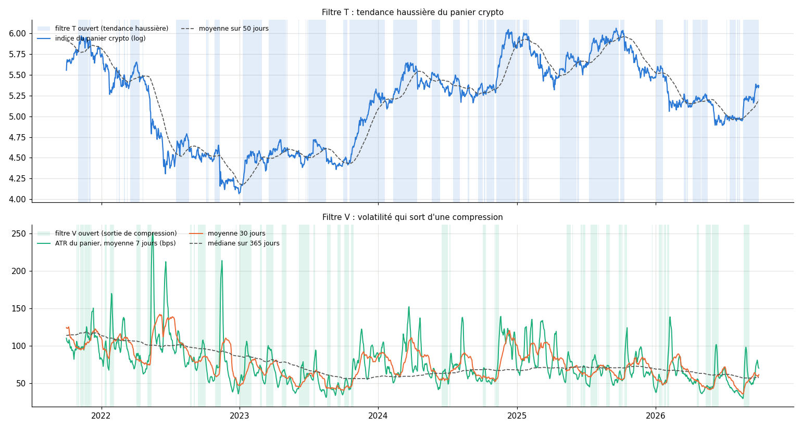

# EXP-D05.8 — Moment d'achat du challenge : sortie de compression de la volatilité, tendance haussière

*GO du porteur du 2026-10-05 (dernière mesure de la séquence taille) ; référence ajoutée à sa demande. Calcul :
`python experiments/D05_8/run_D05_8.py --calcul` (88 s).*

*Méthode :*
- *Indicateurs du panier crypto (BTC, ETH, SOL, AVAX, XRP) à chaque minuit, avec les seules barres closes avant lui :*
  - *V, sortie de compression : ATR moyen sur 7 jours au-dessus de sa moyenne sur 30 jours, alors que cette moyenne est
    sous la médiane de l'année ; ouvert 24 % des jours ;*
  - *T, tendance haussière : indice du panier au-dessus de sa moyenne sur 50 jours ; ouvert 50 % des jours.*
  - *Fenêtres conventionnelles, fixées avant le calcul, non optimisées.*
- *Par tentative : tentatives démarrées les jours ouverts, contre toutes.*
- *En suite (« rachat non aveugle ») : un compte à la fois ; la première tentative et chaque rachat attendent un jour
  ouvert. Comparée, départ par départ, à la suite sans filtre.*
- *Pistes : référence (0,20 × 0,20), piste 1 (0,20 × 0,25), piste 2 (0,25 × 0,25).*
- *Contrôles passés : les indicateurs ne changent pas quand on coupe les barres postérieures ; sans filtre, les pistes
  redonnent le roster de D05.6bis.*

## Verdict

- **T (tendance haussière) n'aide pas, et coûte en suite.**
  - Par tentative : +0,0 à +0,7 k€, avec des IC d'environ ±3 k€ ; réussite inchangée (53,6 % contre 55,1 % à 12 mois).
  - En suite : −1,7 à −6,1 k€ selon la piste et la lecture, IC sous zéro. Moins bien dans 30 à 67 % des départs,
    mieux dans 3 à 20 %.
- **V (sortie de compression) : gain par tentative possible, non démontré.**
  - Par tentative : +3,2 à +4,7 k€ (+34 à +54 %), mais tous les IC contiennent zéro.
  - Le gain vient surtout des départs de 2023 et 2024 ; ceux de 2025 perdent (−1,4 à −1,7 k€).
  - La réussite bouge peu : −0,5 point à 12 mois ; +4 à +5 points à 24 mois et sans 2026 (référence et piste 1).
- **En suite, attendre un jour ouvert coûte plus que le filtre ne rapporte.**
  - V : −0,7 à −1,9 k€ pour la référence et la piste 1 (sauf la référence à 24 mois : +0,8 k€, IC avec zéro) ;
    −2,9 à −9,3 k€ pour la piste 2.
  - En revanche, V économise des challenges : piste 1, 2,8 au lieu de 3,5 en 12 mois, 4,9 au lieu de 6,0 en 24 mois.
    La valeur par challenge acheté monte de 14 à 19 %.
- **Une règle d'attente efface l'avantage de la piste 2,** qui vit du nombre de tentatives.
  - Avec V, la piste 1 dépasse la piste 2 en suite à 24 mois (+46,6 k€ contre +41,6 k€) et sans 2026 (+18,7 k€ contre
    +17,2 k€).
  - Sans filtre, la piste 2 restait devant dans les trois lectures.

## 1. Par tentative (12 mois ; 1 462 départs)

| Piste | Filtre | Jours ouverts | Réussite : ouverts ; tous | Valeur : ouverts ; tous | Écart ouverts − tous [IC 95 %] |
|---|---|---|---|---|---|
| Référence | V | 23,8 % | 54,6 % ; 55,1 % | +12 368 € ; +9 218 € | +3 150 € [−1 165 ; +8 397] |
| Référence | T | 49,7 % | 53,6 % ; 55,1 % | +9 489 € ; +9 218 € | +271 € [−2 427 ; +3 072] |
| Piste 1 | V | 23,8 % | 54,6 % ; 55,1 % | +13 747 € ; +10 259 € | +3 488 € [−1 362 ; +9 190] |
| Piste 1 | T | 49,7 % | 53,6 % ; 55,1 % | +10 266 € ; +10 259 € | +6 € [−2 888 ; +3 095] |
| Piste 2 | V | 23,8 % | 41,1 % ; 46,4 % | +10 850 € ; +7 504 € | +3 346 € [−1 237 ; +9 048] |
| Piste 2 | T | 49,7 % | 45,3 % ; 46,4 % | +7 675 € ; +7 504 € | +171 € [−2 598 ; +3 129] |

## 2. En suite, rachat seulement les jours ouverts (12 mois ; 24 mois)

| Piste | Filtre | Suite filtrée, 12 mois (écart [IC 95 %]) | Suite filtrée, 24 mois (écart [IC 95 %]) | Challenges achetés en 24 mois : filtré ; sans filtre |
|---|---|---|---|---|
| Référence | V | +18 587 € (−1 204 [−2 426 ; −272]) | +42 232 € (+797 [−195 ; +1 776]) | 4,3 ; 5,6 |
| Référence | T | +16 606 € (−3 186 [−4 617 ; −1 974]) | +36 751 € (−4 684 [−6 656 ; −3 116]) | 5,9 ; 5,6 |
| Piste 1 | V | +20 534 € (−1 927 [−3 174 ; −883]) | +46 638 € (−1 607 [−2 853 ; −417]) | 4,9 ; 6,0 |
| Piste 1 | T | +19 079 € (−3 382 [−4 615 ; −2 219]) | +42 101 € (−6 144 [−7 554 ; −4 805]) | 6,1 ; 6,0 |
| Piste 2 | V | +22 088 € (−2 949 [−5 292 ; −946]) | +41 612 € (−9 317 [−13 296 ; −5 572]) | 5,6 ; 7,9 |
| Piste 2 | T | +22 952 € (−2 085 [−3 431 ; −876]) | +47 798 € (−3 130 [−4 291 ; −2 040]) | 7,8 ; 7,9 |

## 3. Lecture

- `[HYP]` **RE-1 joue à la hausse comme à la baisse.** Un filtre de tendance haussière ne choisit pas ses bonnes
  périodes ; il ne fait que retarder l'achat.
- `[HYP]` **V vise le moment où la volatilité repart d'un niveau bas,** le terrain d'un suiveur de tendance.
  - Mais son gain tient à quelques épisodes de 2023 et 2024.
  - C'est la fragilité des effets de période vue en D05.7.
- `[HYP]` **En suite, toute règle d'attente échange du temps contre de la sélectivité.** Pour un budget de challenges
  limité, V rapporte un peu plus par challenge acheté, sans que le gain soit démontré.

## 4. Limites

- **Un seul jeu de fenêtres (7, 30, 365 et 50 jours),** non optimisé. D'autres réglages feraient mieux ou moins bien ;
  les chercher sur ces données serait de l'ajustement.
- **Jours ouverts groupés en épisodes :** l'échantillon réel est petit, d'où des IC larges.
- **Pas de test sur histoires recomposées.** Le filtre lit des prix continus ; D05.7 recompose des trades, pas des
  prix.
- **Mêmes limites de coûts et de règles de la firme que D05.5.** Les 8 métriques par trade sont celles de D04.1.

---

# Annexes générées (`run_D05_8.py --calcul`, puis `--rapport`)

Calcul du 2026-10-05 18:58 UTC, commit `74464dc`, 88 s.

## A1. Contrôles bloquants (passés)

- Causalité : indicateurs inchangés après coupure des barres postérieures (3 dates).
- Sans filtre, les pistes redonnent le roster de D05.6bis :
  - Référence_12 mois_tentative_egal_roster : 0.092176.
  - Référence_12 mois_suite_egal_roster : 0.197911.
  - Référence_24 mois_tentative_egal_roster : 0.109062.
  - Référence_24 mois_suite_egal_roster : 0.414353.
  - Référence_sans 2026, 12 mois_tentative_egal_roster : 0.111.
  - Référence_sans 2026, 12 mois_suite_egal_roster : 0.172738.
  - Piste 1_12 mois_tentative_egal_roster : 0.102594.
  - Piste 1_12 mois_suite_egal_roster : 0.22461.
  - Piste 1_24 mois_tentative_egal_roster : 0.121497.
  - Piste 1_24 mois_suite_egal_roster : 0.482455.
  - Piste 1_sans 2026, 12 mois_tentative_egal_roster : 0.123192.
  - Piste 1_sans 2026, 12 mois_suite_egal_roster : 0.196575.
  - Piste 2_12 mois_tentative_egal_roster : 0.07504.
  - Piste 2_12 mois_suite_egal_roster : 0.250369.
  - Piste 2_24 mois_tentative_egal_roster : 0.086944.
  - Piste 2_24 mois_suite_egal_roster : 0.509286.
  - Piste 2_sans 2026, 12 mois_tentative_egal_roster : 0.088494.
  - Piste 2_sans 2026, 12 mois_suite_egal_roster : 0.210221.

## A2. Par tentative, 12 mois (1462 départs)

| Piste | Filtre | Jours ouverts | Réussite : ouverts ; tous | Délai médian : ouverts ; tous | Valeur : ouverts ; fermés ; tous | Écart ouverts − tous [IC 95 %] |
|---|---|---|---|---|---|---|
| Référence | aucun | 100,0 % | 55,1 % ; 55,1 % | 79 ; 79 j | +9 218 € ; — ; +9 218 € | — |
| Référence | V · sortie de compression | 23,8 % | 54,6 % ; 55,1 % | 84 ; 79 j | +12 368 € ; +8 234 € ; +9 218 € | +3 150 € [−1 165 € ; +8 397 €] |
| Référence | T · tendance haussière | 49,7 % | 53,6 % ; 55,1 % | 74 ; 79 j | +9 489 € ; +8 950 € ; +9 218 € | +271 € [−2 427 € ; +3 072 €] |
| Piste 1 | aucun | 100,0 % | 55,1 % ; 55,1 % | 79 ; 79 j | +10 259 € ; — ; +10 259 € | — |
| Piste 1 | V · sortie de compression | 23,8 % | 54,6 % ; 55,1 % | 84 ; 79 j | +13 747 € ; +9 170 € ; +10 259 € | +3 488 € [−1 362 € ; +9 190 €] |
| Piste 1 | T · tendance haussière | 49,7 % | 53,6 % ; 55,1 % | 74 ; 79 j | +10 266 € ; +10 253 € ; +10 259 € | +6 € [−2 888 € ; +3 095 €] |
| Piste 2 | aucun | 100,0 % | 46,4 % ; 46,4 % | 48 ; 48 j | +7 504 € ; — ; +7 504 € | — |
| Piste 2 | V · sortie de compression | 23,8 % | 41,1 % ; 46,4 % | 52 ; 48 j | +10 850 € ; +6 459 € ; +7 504 € | +3 346 € [−1 237 € ; +9 048 €] |
| Piste 2 | T · tendance haussière | 49,7 % | 45,3 % ; 46,4 % | 46 ; 48 j | +7 675 € ; +7 335 € ; +7 504 € | +171 € [−2 598 € ; +3 129 €] |

## A3. En suite (rachat seulement aux jours ouverts), 12 mois

| Piste | Filtre | Suite filtrée | Écart à la suite sans filtre [IC 95 %] | Départs : mieux ; moins bien | Tentatives : filtrée ; sans filtre | Comptes financés |
|---|---|---|---|---|---|---|
| Référence | aucun | +19 791 € | — | — | 3,2 ; 3,2 | 1,3 |
| Référence | V · sortie de compression | +18 587 € | −1 204 € [−2 426 € ; −272 €] | 45,6 % ; 33,3 % | 2,6 ; 3,2 | 1,1 |
| Référence | T · tendance haussière | +16 606 € | −3 186 € [−4 617 € ; −1 974 €] | 9,6 % ; 48,8 % | 3,2 ; 3,2 | 1,2 |
| Piste 1 | aucun | +22 461 € | — | — | 3,5 ; 3,5 | 1,4 |
| Piste 1 | V · sortie de compression | +20 534 € | −1 927 € [−3 174 € ; −883 €] | 41,0 % ; 39,7 % | 2,8 ; 3,5 | 1,1 |
| Piste 1 | T · tendance haussière | +19 079 € | −3 382 € [−4 615 € ; −2 219 €] | 11,1 % ; 44,7 % | 3,3 ; 3,5 | 1,2 |
| Piste 2 | aucun | +25 037 € | — | — | 4,4 ; 4,4 | 1,9 |
| Piste 2 | V · sortie de compression | +22 088 € | −2 949 € [−5 292 € ; −946 €] | 44,9 % ; 42,8 % | 3,3 ; 4,4 | 1,0 |
| Piste 2 | T · tendance haussière | +22 952 € | −2 085 € [−3 431 € ; −876 €] | 20,0 % ; 33,7 % | 4,2 ; 4,4 | 1,7 |

## A2. Par tentative, 24 mois (1097 départs)

| Piste | Filtre | Jours ouverts | Réussite : ouverts ; tous | Délai médian : ouverts ; tous | Valeur : ouverts ; fermés ; tous | Écart ouverts − tous [IC 95 %] |
|---|---|---|---|---|---|---|
| Référence | aucun | 100,0 % | 50,8 % ; 50,8 % | 90 ; 90 j | +10 906 € ; — ; +10 906 € | — |
| Référence | V · sortie de compression | 24,8 % | 55,9 % ; 50,8 % | 85 ; 90 j | +14 643 € ; +9 674 € ; +10 906 € | +3 737 € [−1 865 € ; +9 629 €] |
| Référence | T · tendance haussière | 45,3 % | 45,7 % ; 50,8 % | 89 ; 90 j | +11 532 € ; +10 388 € ; +10 906 € | +626 € [−3 235 € ; +4 455 €] |
| Piste 1 | aucun | 100,0 % | 50,8 % ; 50,8 % | 90 ; 90 j | +12 150 € ; — ; +12 150 € | — |
| Piste 1 | V · sortie de compression | 24,8 % | 55,9 % ; 50,8 % | 85 ; 90 j | +16 348 € ; +10 765 € ; +12 150 € | +4 199 € [−1 972 € ; +10 837 €] |
| Piste 1 | T · tendance haussière | 45,3 % | 45,7 % ; 50,8 % | 89 ; 90 j | +12 526 € ; +11 838 € ; +12 150 € | +376 € [−3 815 € ; +4 515 €] |
| Piste 2 | aucun | 100,0 % | 41,8 % ; 41,8 % | 49 ; 49 j | +8 694 € ; — ; +8 694 € | — |
| Piste 2 | V · sortie de compression | 24,8 % | 42,6 % ; 41,8 % | 55 ; 49 j | +13 424 € ; +7 135 € ; +8 694 € | +4 729 € [−1 308 € ; +11 326 €] |
| Piste 2 | T · tendance haussière | 45,3 % | 38,2 % ; 41,8 % | 48 ; 49 j | +8 916 € ; +8 511 € ; +8 694 € | +222 € [−3 827 € ; +4 212 €] |

## A3. En suite (rachat seulement aux jours ouverts), 24 mois

| Piste | Filtre | Suite filtrée | Écart à la suite sans filtre [IC 95 %] | Départs : mieux ; moins bien | Tentatives : filtrée ; sans filtre | Comptes financés |
|---|---|---|---|---|---|---|
| Référence | aucun | +41 435 € | — | — | 5,6 ; 5,6 | 2,2 |
| Référence | V · sortie de compression | +42 232 € | +797 € [−195 € ; +1 776 €] | 66,2 % ; 29,6 % | 4,3 ; 5,6 | 1,9 |
| Référence | T · tendance haussière | +36 751 € | −4 684 € [−6 656 € ; −3 116 €] | 3,8 % ; 63,1 % | 5,9 ; 5,6 | 2,3 |
| Piste 1 | aucun | +48 246 € | — | — | 6,0 ; 6,0 | 2,3 |
| Piste 1 | V · sortie de compression | +46 638 € | −1 607 € [−2 853 € ; −417 €] | 45,3 % ; 52,0 % | 4,9 ; 6,0 | 1,9 |
| Piste 1 | T · tendance haussière | +42 101 € | −6 144 € [−7 554 € ; −4 805 €] | 3,1 % ; 67,3 % | 6,1 ; 6,0 | 2,3 |
| Piste 2 | aucun | +50 929 € | — | — | 7,9 ; 7,9 | 3,8 |
| Piste 2 | V · sortie de compression | +41 612 € | −9 317 € [−13 296 € ; −5 572 €] | 34,9 % ; 63,4 % | 5,6 ; 7,9 | 1,5 |
| Piste 2 | T · tendance haussière | +47 798 € | −3 130 € [−4 291 € ; −2 040 €] | 10,1 % ; 54,1 % | 7,8 ; 7,9 | 3,7 |

## A2. Par tentative, sans 2026, 12 mois (1189 départs)

| Piste | Filtre | Jours ouverts | Réussite : ouverts ; tous | Délai médian : ouverts ; tous | Valeur : ouverts ; fermés ; tous | Écart ouverts − tous [IC 95 %] |
|---|---|---|---|---|---|---|
| Référence | aucun | 100,0 % | 54,6 % ; 54,6 % | 89 ; 89 j | +11 100 € ; — ; +11 100 € | — |
| Référence | V · sortie de compression | 24,5 % | 58,8 % ; 54,6 % | 88 ; 89 j | +14 863 € ; +9 880 € ; +11 100 € | +3 763 € [−1 339 € ; +9 763 €] |
| Référence | T · tendance haussière | 48,4 % | 53,0 % ; 54,6 % | 87 ; 89 j | +11 766 € ; +10 476 € ; +11 100 € | +666 € [−2 614 € ; +3 949 €] |
| Piste 1 | aucun | 100,0 % | 54,6 % ; 54,6 % | 89 ; 89 j | +12 319 € ; — ; +12 319 € | — |
| Piste 1 | V · sortie de compression | 24,5 % | 58,8 % ; 54,6 % | 88 ; 89 j | +16 504 € ; +10 963 € ; +12 319 € | +4 185 € [−1 490 € ; +10 689 €] |
| Piste 1 | T · tendance haussière | 48,4 % | 53,0 % ; 54,6 % | 87 ; 89 j | +12 669 € ; +11 991 € ; +12 319 € | +350 € [−3 201 € ; +3 931 €] |
| Piste 2 | aucun | 100,0 % | 44,6 % ; 44,6 % | 51 ; 51 j | +8 849 € ; — ; +8 849 € | — |
| Piste 2 | V · sortie de compression | 24,5 % | 43,3 % ; 44,6 % | 55 ; 51 j | +12 944 € ; +7 522 € ; +8 849 € | +4 095 € [−1 581 € ; +10 453 €] |
| Piste 2 | T · tendance haussière | 48,4 % | 43,8 % ; 44,6 % | 50 ; 51 j | +9 233 € ; +8 491 € ; +8 849 € | +383 € [−3 209 € ; +3 686 €] |

## A3. En suite (rachat seulement aux jours ouverts), sans 2026, 12 mois

| Piste | Filtre | Suite filtrée | Écart à la suite sans filtre [IC 95 %] | Départs : mieux ; moins bien | Tentatives : filtrée ; sans filtre | Comptes financés |
|---|---|---|---|---|---|---|
| Référence | aucun | +17 274 € | — | — | 3,1 ; 3,1 | 1,0 |
| Référence | V · sortie de compression | +16 603 € | −671 € [−1 879 € ; +339 €] | 55,9 % ; 24,5 % | 2,4 ; 3,1 | 0,9 |
| Référence | T · tendance haussière | +15 618 € | −1 656 € [−2 331 € ; −985 €] | 11,8 % ; 39,7 % | 3,1 ; 3,1 | 0,9 |
| Piste 1 | aucun | +19 658 € | — | — | 3,4 ; 3,4 | 1,1 |
| Piste 1 | V · sortie de compression | +18 701 € | −956 € [−2 250 € ; +128 €] | 50,3 % ; 28,1 % | 2,6 ; 3,4 | 0,9 |
| Piste 1 | T · tendance haussière | +17 494 € | −2 163 € [−3 228 € ; −1 208 €] | 13,6 % ; 34,5 % | 3,2 ; 3,4 | 1,0 |
| Piste 2 | aucun | +21 022 € | — | — | 4,4 ; 4,4 | 1,7 |
| Piste 2 | V · sortie de compression | +17 235 € | −3 787 € [−6 367 € ; −1 475 €] | 43,4 % ; 41,5 % | 3,1 ; 4,4 | 0,7 |
| Piste 2 | T · tendance haussière | +19 194 € | −1 828 € [−3 179 € ; −624 €] | 17,7 % ; 30,1 % | 4,3 ; 4,4 | 1,6 |

## A4. Par année de départ, 12 mois : part des jours ouverts ; écart par tentative ; écart en suite

| Piste | Filtre | 2021 | 2022 | 2023 | 2024 | 2025 |
|---|---|---|---|---|---|---|
| Référence | V · sortie de compression | 37 % ; +369 € ; +996 € | 23 % ; +14 € ; −340 € | 37 % ; +5 547 € ; +266 € | 10 % ; +8 951 € ; −2 306 € | 21 % ; −1 429 € ; −3 580 € |
| Référence | T · tendance haussière | 37 % ; +2 102 € ; +147 € | 24 % ; −3 332 € ; −3 833 € | 64 % ; +2 829 € ; −476 € | 59 % ; −870 € ; −1 121 € | 55 % ; −237 € ; −9 810 € |
| Piste 1 | V · sortie de compression | 37 % ; +471 € ; +1 135 € | 23 % ; +80 € ; −582 € | 37 % ; +5 809 € ; +184 € | 10 % ; +10 197 € ; −2 952 € | 21 % ; −1 661 € ; −6 188 € |
| Piste 1 | T · tendance haussière | 37 % ; +2 656 € ; +249 € | 24 % ; −3 723 € ; −5 302 € | 64 % ; +2 958 € ; −470 € | 59 % ; −1 201 € ; −1 336 € | 55 % ; −221 € ; −8 655 € |
| Piste 2 | V · sortie de compression | 37 % ; −2 077 € ; −659 € | 23 % ; −86 € ; −969 € | 37 % ; +6 049 € ; +855 € | 10 % ; +2 026 € ; −12 006 € | 21 % ; −1 495 € ; +677 € |
| Piste 2 | T · tendance haussière | 37 % ; −2 077 € ; +926 € | 24 % ; −3 576 € ; −5 807 € | 64 % ; +2 895 € ; −250 € | 59 % ; +291 € ; −133 € | 55 % ; +89 € ; −3 191 € |

## A5. Figure

